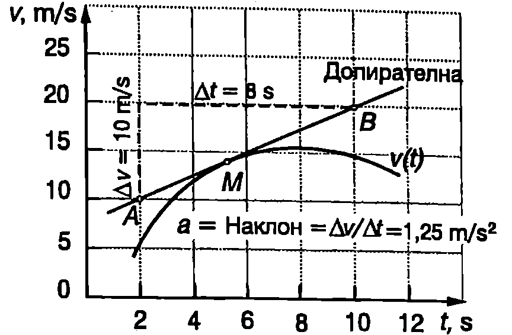
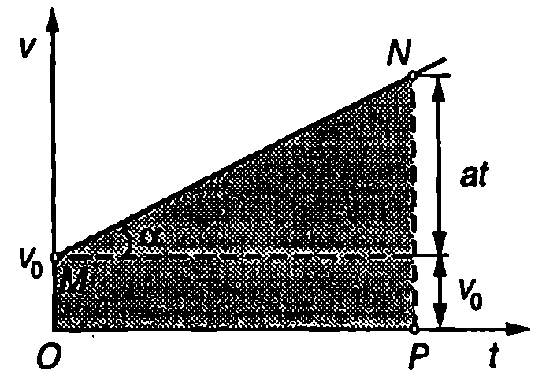

**Материална точка**

В много случаи при изучаване движението на телата можем да се абстрахираме от техните размери, форма и вътрешна структура и да ги разглеждаме като точки. Например, ако се интересуваме от времето, за което експресът е изминал разстоянието София -- Пловдив, можем да разглеждаме влака като точка, пренебрегвайки неговата дължина. Ако обаче искаме да определим времето, за което той минава покрай семафор или времето, за което пътник отива до вагон-ресторанта, тогава очевидно трябва да отчетем размерите на влака.

**Материална точка се нарича тяло, чиито размери, форма и вътрешна структура са несъществени за дадена задача.**

Понякога вместо материална точка ще използваме термина частица за означаване на тяло, чиито размери и структура не се отчитат. Ще подчертаем, че разглеждането на едно тяло като материална точка няма нищо общо с неговите действителни размери. Дори тела с огромни размери в определени задачи могат да се смятат за материални точки. Например Земята, при изучаване движението й около Слънцето, както и цялата Слънчева система, при разглеждане на движението и около центъра на Галактиката, се приемат за материални точки.

**Път и преместване**

Да разгледаме материална точка (частица), която се движи праволинейно спрямо земната повърхност. Правата, по която се извършва движението, ще изберем за ос $x$. Положителната посока на оста $x$ и нейното начало О се избират произволно. Често за начало О се взема точката, в която частицата се е намирала в момент $t = 0$, от който започва да се отчита времето (начален момент). Ако частицата не променя посоката си на движение, удобно е за положителна посока на оста $x$ да се избере посоката на движение. Положението на частицата в даден момент от времето се определя от нейната координата $x$. Ще обърнем внимание, че координатата $x$ е алгебрична величина: $x > 0$, когато точката лежи върху положителната част на оста, и $x < 0$, ако точката лежи върху отрицателната част на оста (Фиг. \ref{fig:1.1}). Нека в момент 1 частицата се намира в точка с координата $x_1$, а в един следващ момент 2 в точка с координата $x_2$.


```

```
	`Фиг. 1.1`


Величината
$$\Delta x = x_2 - x_1
$$
се нарича *преместване* на частицата за интервала от време $\Delta t = t_2 - t_1$. Преместването $\Delta x$ може да има както положителни, така и отрицателни стойности. Ако през цялото време $\Delta t$ частицата се движи в една посока, големината на преместването е равна на изминатия път, а знакът на преместването определя посоката, в която се извършва движението. Когато движението е в положителната посока на оста $x$, тогава $\Delta x > 0$. При движение в обратната посока $\Delta x < 0$.

В Международната система (SI) пътят и преместването се измерват в метри. Ще подчертаем, че това са различни величини. Пътят $\Delta s$ е равен на разстоянието, изминато от частицата за време $\Delta t$, и може да има само положителни стойности. Преместването $\Delta x$ се дефинира чрез равенство \eqref{eq:1.1}. Само при праволинейно движение в една посока големината на преместването за произволен интервал от време е равна на изминатия за същото време път. В общия случай големината на преместването е по-малка от изминатия път.

> [!question] Пример 1.1
> Частица извършва праволинейно движение по оста $x$. В момент $t_1 = 2\ \mathrm{s}$ тя се намира в точка с координата $x_1 = 2\ \mathrm{m}$, в момент $t_2 = 10\ \mathrm{s}$ в достига до точка $x_2 = 14\ \mathrm{m}$, където променя посоката си на движение и в момент $t_3 = 14\ \mathrm{s}$ преминава през точка $x_2 = 8\ \mathrm{m}$. Определете изминатия път, знака и големината на преместването за интервала от време $\Delta t = t_3 - t_1$.

> [!note]- Решение
>  Изминатият път е $\Delta s=|x_2-x_1|+|x_3-x_2| = 12\ \mathrm{m} + 6\ \mathrm{m} = 18\ \mathrm{m}$. Преместването е $\Delta x = x_3 - x_1 = 6\ \mathrm{m}$.

Големината на преместването в различна от пътя, защото е станала промяна в посоката на движение.

**Средна скорост**

Средната скорост е величина, която широко се използва във всекидневието. В началото на полета стюардесата информира пътниците на каква височина и с каква средна скорост ще прелетят разстоянието. Средната скорост на автомобили, влакове, кораби и т.н. е важна характеристика на тяхното движение, особено когато се интересуваме колко време ще продължи пътуването. По определение средната скорост $v_\text{cp}$ е равна на пътя $\Delta s$, разделен на интервала от време $\Delta t$, за което той е изминат

$$v_{cp} = \frac{\Delta s}{\Delta t}
$$

Средната скорост е скаларна величина, която може да има само положителни стойности. В SI се измерва в m/s (метър в секунда), но в практиката по-често скоростта се изразява в km/h (километра в час). Условно можем да отделим два случая, в които се пресмята средна скорост:

**1.** Интересуваме се с каква средна скорост е изминато дадено разстояние $\Delta s$. За целта определяме времето $\Delta t$, за което е изминато разстоянието $\Delta s$, и от формула \eqref{eq:1.2} пресмятаме $v_{cp}$.

**2.** Интересува ни с каква средна скорост се е движило тялото през интервала от време $\Delta t$. Тогава определяме пътя $\Delta s$, изминат за това време, и отново по формула \eqref{eq:1.2} пресмятаме $v_{cp}$.

> [!question] Пример 1.2
> Автомобил изминава половината от разстоянието между два града със скорост $v_1 = 30\ \mathrm{km/h}$, а втората половина - със скорост $v_2 = 70\ \mathrm{km/h}$. Колко километра в час е средната скорост на автомобила?

> [!note]- Решение
 > Задачата е от първия вид -- трябва да се определи времето $\Delta t$, за което в изминато разстоянието $\Delta s$ между двата града. Първата половина от това разстояние е измината за време $\Delta t_1 = \Delta s/2v_1$, а втората половина за време $\Delta t_2 = \Delta s/2v_2$. Следователно
> 
> $$v_{cp} =\frac{\Delta s}{\Delta t_1 + \Delta t_2} = \frac{2v_1 v_2}{v_1 + v_2} = 42\ \mathrm{\frac{km}{h}}.$$

> [!question] Пример 1.3
> Пресметнете средната скорост на автомобила от Пример\ \ref{ex:1.2}, ако през половината от времето той се е движил със скорост $v_1 = 30\ \mathrm{km/h}$, а през втората половина - със скорост $v_2 = 70\ \mathrm{km/h}$.


> [!note]- Решение
>  Задачата е от втория вид -- трябва да се определи разстоянието $\Delta s$, което е изминал автомобилът за време $\Delta t$. Отначало той се е движил със скорост $v_1$ и за време $\Delta t/2$ е изминал разстояние $\Delta s_1 = vt/2$. След това за същото време в изминал разстояние $\Delta s_2 = v_2 \Delta t/2$. Целият път е
> $$\Delta s = \Delta s_1 + \Delta s_2 = \frac{v_1 + v_2}{2} \Delta t$$
> Следователно
> $$v_{cp} = \Delta s = \frac{v_1+v_2}{2} = 50\ \mathrm{\frac{km}{h}}$$

**Моментна скорост**

На Фиг. \ref{fig:1.2} е показана зависимостта на координатата $x$ от времето за частица, която се движи праволинейно. В момент $t_1$ частицата има координата $x$, (точка $M$ от графиката), а в момент $t_2$ координатата й е $x_2$ (точка $N$). За време $\Delta t = t_2 - t_1$ тя извършва преместване $\Delta x = x_2 - x_1$. Наклонът на отсечката $MN$ спрямо абсцисната ос се определя от отношението $\Delta x/\Delta t$:

Наклон = $\Delta x/\Delta t$.

Величината $\Delta x/\Delta t$ се измерва в m/s, т.е. тя има размерност на скорост. Нейната стойност обаче зависи от избора на интервала от време $\Delta t$, за който се пресмята, поради което дава малко информация за характера на движението. В това се убеждаваме, ако започнем да намаляваме интервала 4, т.е. да доближаваме точка $N$ към точка $M$ (Фиг. \ref{fig:1.2}). Наклонът на отсечката $MN$ се променя и в граничния случай, когато интервалът $\Delta t$ клони към


```
Моментна скорост. Когато $\Delta t \to 0$, точките $M$ и $N$ са много близо една до друга и отсечката, която ги свързва, лежи върху допирателната към кривата $x(t)$, прекарана през точка $M$ (в уголемен вид отсечката $MN$ при $\Delta t \to 0$ e показана вътре в окръжността в горната част на фигурата). Графично моментната скорост се определя по наклона на допирателната.
```
	`Фиг. 1.2`


нула, отсечката $MN$ лежи върху допирателната към кривата $x(t)$, прекарана през точка $M$. Величината
$$v = \lim_{\Delta t \to 0} \frac{\Delta x}{\Delta t}
$$
се нарича моментна скорост на частицата (на материалната точка). Както е известно от математиката, границата на отношението $\Delta x/\Delta t$, когато $\Delta t$ клони към нула, е първа производна на функцията $x(t)$. Във физиката първата производна е прието да се означава $dx/dt$ (произнася се ``де хикс де те'').

И така, моментната скорост $v$ е първа производна на координатата $x$ по времето $t$
$$v = \frac{d x}{d t}
$$
Графично моментната скорост се определя по наклона на допирателната към кривата $x(t)$.

Моментната скорост, за разлика от средната скорост, може да има както положителни, така и отрицателни стойности. Например в точка $A$ от Фиг. \ref{fig:1.3} допирателната сключва остър ъгъл с абсцисната ос ($\alpha< 90^\circ$) и функцията $x(t)$ е растяща частицата се движи в положителната посока на оста $x$ и моментната и скорост е положителна ($v > 0$). В точка $B$ функцията $x(t)$ е намаляща ($\alpha> 90^\circ$), което показва, че частицата се движи в отрицателната посока на оста $x$. В този случай моментната скорост е отрицателна ($v < 0$). В точка $C$ моментната скорост е нула: частицата променя посоката си на движение.

Движения, които се извършват с постоянна моментна скорост, се наричат равномерни движения. Ако моментната скорост се изменя с течение на времето, движението е *неравномерно*.


```

```
	`Фиг. 1.3`

Ще подчертаем, че моментната скорост характеризира движението в много малък интервал от време $dt$. Интервалът $dt$ e толкова малък, че през него не настъпват практически никакви изменения на скоростта, т.е. за време от движението е равномерно. Моментната скорост може да се разглежда като средна скорост, пресметната за много малък интервал от време $dt$. По-нататък за краткост моментната скорост ще наричаме просто скорост на тялото.

**Ускорение**

На Фиг. \ref{fig:1.4a} е представена графично зависимостта на скоростта $v$ от времето $t$ за частица, която извършва неравномерно праволинейно движение. В момент $t_1$ частицата се движи със скорост $v_1$ (точка $M$ от графиката), а в момент $t_2$ скоростта й е $v_2$ (точка $M$). За интервала от време $\Delta t = t_2-t_1$ изменението на скоростта на частицата е $\Delta v = v_2 - v_1$. Отношението $\Delta v/\Delta t$ носи информация за бързината, с която се променя скоростта. Ако се намали интервалът от време $\Delta t$ (точка $N$ се приближава към точка $M$), наклонът на отсечката $MN$ се променя (изменя се ъгълът $\alpha$). В граничния случай, когато $\delta t$ клони към нула, ъгълът $\alpha$, който отсечката $MN$ сключва с абсцисната ос $x$, става равен на ъгъла между оста $x$ и допирателната към кривата $v(t)$, прекарана през точка $M$ (Фиг. \ref{fig:1.4a}). Величината


```
Ускорение. Когато $\Delta t \to 0$, точките $M$ и $N$ са много близо една до друга и отсечката, която ги свързва, лежи върху допирателната към кривата $v(t)$, прекарана през точка $M$ (в уголемен вид отсечката $MN$ при $\Delta t \to 0$ е показана вътре в окръжността в горната част на фигурата). Графично ускорението се определя по наклона на допирателната.
```
	`Фиг. 1.4a`


$$a = \lim_{\Delta t\to 0} \frac{\Delta v}{\Delta t} = \frac{dv}{d t}
$$
се нарича ускорение на частицата (на материалната точка). Ускорението е равно на първата производна на скоростта по времето. Тъй като самата скорост е първа производна на координатата $x$ по времето $t$, ускорението може да се представи като втора производна на координатата $x$ по времето $t$
$$a = \frac{d}{dt}\left(\frac{dx}{dt}\right) \frac{d^2 x}{d t^2}.
$$
(Чете се "де две хикс де те квадрат"). Ускорението е мярка за бързината, с която се променя скоростта. В SI то се измерва в $\mathrm{m/s^2}$ (метър в секунда на квадрат). Графичното определяне на ускорението се илюстрира от Фиг. \ref{fig:1.4b}. Ускорението в точка $M$ е равно на наклона на допирателната към кривата , прекарана през тази точка. Наклонът на допирателната може да се определи, ако се знаят координатите на две произволни точки $A$ и $B$, лежащи върху нея. Удобно е тези точки да се изберат така, че от графиката лесно да се определят координатите им. В случая



```

```
	`Фиг. 1.4b`

$$a = \text{Наклон}= \frac{\Delta v}{\Delta t} = \frac{10\ \mathrm{m/s}}{8\ \mathrm{s}} = 1.25\ \mathrm{\frac{m}{s^2}}$$

Подобно на скоростта, ускорението може да има както положителни, така и отрицателни стойности. От формула \eqref{eq:1.5} се вижда, че ускорението е положително при $dv > 0$, т.е. когато скоростта нараства.

***Забележка.*** Ще припомним, че дефинирахме моментната скорост при праволинейно движение като алгебрична величина, която може да има както положителни, така и отрицателни стойности. Положителната моментна скорост нараства при $dv > 0$. Ако обаче моментната скорост в отрицателна, при $dv > 0$ тя също нараства, независимо че големината (модулът) и намалява. За да не възникват недоразумения, знакът на ускорението е по-добре да се интерпретира по следния начин: ако знаците на скоростта и на ускорението на частицата са еднакви, големината на скоростта нараства. Когато знаците са противоположни, големината на скоростта намалява. На тези въпроси ще се спрем по-подробно в следващия параграф, където ще разгледаме скоростта и ускорението като векторни величини.

**Равнопроменливо движение**

Движения, които се извършват с постоянно по големина ускорение, се наричат равнопроменливи движения. При равнопроменливо движение наклонът на допирателната във всички точки от графиката на функцията $v(t)$ е еднакъв. Следователно функцията $v(t)$ е права линия (Фиг. \ref{fig:1.5}), чието уравнение е
$$v = v_0 + at,
$$
където $v_0$ е началната скорост, т.е. скоростта на частицата в момент $t = 0$. Горното уравнение изразява *закона за скоростта* при равнопроменливо движение.



```

```
	`Фиг. 1.5`


Равнопроменливо движение, при което големината на скоростта нараства, се нарича равноускорително движение. Ако големината на скоростта намалява, движението в равнозакъснително.

В уравнение \eqref{eq:1.7} величините $v$,, $v_0$ и $a$ могат да имат както положителни, така и отрицателни стойности. Когато не става промяна на посоката на движение, е по-удобно законът за скоростта да се запише в следния вид
$$v = v_0 \pm at,
$$
където $v$, $v_0$ и $a$ са съответно големините на скоростта, на началната скорост и на ускорението. Знакът ``+'' е за равноускорително движение, а знакът ``-'' е за равнозакъснително движение.

Законът, по който се изменя преместването $\Delta x$, може да се определи графично. Например при праволинейно равномерно движение
$$\Delta x = x - x_0 = vt,
$$
където $x$ и $x_0$ са координатите на частицата в началния момент $t = 0$ и в момента $t$. Графиката на скоростта при равномерно движение е показана на Фиг. \ref{fig:1.6}а. Лицето на правоъгълника под графиката (защрихованата площ на Фиг. \ref{fig:1.6}а), е
$$\Delta A = vt.
$$


```

```
	`Фиг. 1.6`

От уравнения \eqref{eq:1.9} и \eqref{eq:1.10} следва, че $\Delta x = \Delta A$, т.е. преместването $\Delta x$ е равно на площта $\Delta A$ на фигурата, образувана от графиката на скоростта и абсцисната ос $t$. Този резултат се обобщава за произволно неравномерно движение. Площта $\Delta A$ се смята за положителна, ако графиката лежи над абсцисната ос, и за отрицателна в обратния случай (Фиг. \ref{fig:1.6}б).

Да се върнем към равнопроменливото движение (Фиг. \ref{fig:1.5}). От казаното дотук става ясно, че преместването $\Delta x$, което частицата извършва за време, е равно на площта на трапеца $OMNP$
$$\Delta x = \Delta A = \frac{v_0 + (v_0 + at)}{2} t.
$$
След прости преобразувания се получава
$$\Delta x = x - x_0 = v_0 t + \frac{at^2}{2}.
$$
Уравнение \eqref{eq:1.12} изразява закона за преместването при равнопроменливо праволинейно движение. Ще напомним, че в него величините $\Delta x$, $v_0$ и $a$ могат да имат както положителни, така и отрицателни стойности. Ако не се извършва промяна на посоката на движение, законът за изминатия път е
$$\Delta s = v_0 t \pm \frac{at^2}{2}.
$$
където $v_0$ е големината на началната скорост, $a$ -- големината на ускорението. Знакът ``+'' е за равноускорително движение, а знакът ``-'' е за равнозакъснително движение.

> [!question] Пример 1.4
> Мотоциклетист, който се движи със скорост $v_0= 72\ \mathrm{km/h}$, забелязва дете да пресича пътя и натиска спирачките. Пресметнете пътя $\Delta s$, изминат от мотоциклета:
> 
> а) докато скоростта му намалее два пъти; б) до пълното спиране.
> 
> Ускорението да се приеме за постоянно, с големина $a = 5\ \mathrm{m/s^2}$.

> [!note]- Решение
>  От законите за големината на скоростта $v = v_0 \pm at$ и за изминатия път $\Delta s = v_0 t \pm at^2/2$ изключваме времето $t$ и след прости преобразования получаваме
> $$\Delta s = \frac{v^2 - v_0^2}{2a}$$
> при равноускорително движение и
> $$\Delta s = \frac{v_0^2 - v^2}{2a}$$
при равнозакъснително движение.

Уравнения \eqref{eq:1.14} и \eqref{eq:1.15} е удобно да се използват при решаване на задачи, в които се търсят пътят или ускорението, а са известни началната и крайната скорост.

Преди да извършим пресмятанията, трябва да превърнем числените стойности на физичните величини в единици, които съответстват на SI;

$$v=72\ \mathrm{\frac{km}{h}} = \frac{72 000\ \mathrm{m}}{3600\ \mathrm{s}} =20\ \mathrm{\frac{m}{s}}.$$

а)
$$\Delta s = \frac{(20\ \mathrm{m/s})^2 - (10\ \mathrm{m/s})^2}{(5\ \mathrm{m/s^2})} = 30\ \mathrm{m}.$$

б)
$$\Delta s = \frac{v_0^2}{2a} = 40\ \mathrm{m}$$

Ще отбележим, че ускорението $a$, което може да се получи при спиране на превозно средство, зависи от триенето между гумите и пътната настилка и не може да надминава някаква определена стойност. Спирачният път $\displaystyle \Delta s = \frac{v_0^2}{2a}$ е правопропорционален на квадрата на началната скорост $v_0$. Ако началната скорост $v_0$ се увеличи два пъти, спирачният път нараства четири пъти. Затова безопасността на движението изисква в участъци с намалена видимост или на места, където има опасност от внезапна поява на деца или животни на платното, да се кара с намалена скорост и с повишено внимание.

**Земно ускорение**

От всекидневния опит е известно, че телата се привличат към Земята. Оставени без опора, те падат към нейната повърхност, като скоростта им нараства. Такова движение се нарича свободно падане. Ускорението, с което се движат телата при свободно падане, се нарича земно ускорение. Ще приемем, че гравитационното привличане към Земята е единственият фактор, който определя свободното падане на телата и ще пренебрегнем съпротивлението на въздуха. Пръв Галилео Галилей е установил, че при такива условия:

**1.** Земното ускорение в еднакво за всички падащи тела, независимо от тяхната маса, размери и форма.

**2.** Земното ускорение е постоянно. То не се изменя по време на падането.

Лесно е да забележим несъответствие между тези изводи и наблюденията ни от всекидневния опит. Например ябълката пада по-бързо от перото, което е в противоречие с твърдение 1. При падане от голяма височина, ускорението постепенно намалява и накрая движението става равномерно ($a = 0$), което не се съгласува с твърдение 2. Причина за посочените привидни несъответствия е съпротивлението на въздуха. Във вакуум ябълката и перото падат едновременно, т.е. те се движат с еднакво ускорение (Фиг. \ref{fig:1.7}). Ускорението при свободно падане в близост до земната повърхност се означава с $g$. То е приблизително равно на

$$g = 9,\!8\ \mathrm{m/s^2}.$$

Ако в началния момент тялото е било в покой, свободното падане се извършва по права линия, вертикално надолу. Направлението на вертикалната линия може да се определи с отвес тежко тяло, окачено на нишка. Продължението на вертикалната (отвесна) линия преминава през центъра на Земята.


```
Свободното падане на ябълката и на перото във вакуум се извършва с еднакво ускорение $g$. Снимката показва положението на двете тела през равни интервали от време. Разстоянието между образите се увеличава, защото при свободното падане скоростта непрекъснато нараства.
```
	`Фиг. 1.7`


Ще отбележим, че денонощното въртене на Земята води до слаба зависимост на земното ускорение от географската ширина, а също до отклонение на отвеса от посоката към центъра на Земята. На тези въпроси ще се спрем по-подробно в \ref{sec:7}.

Земното ускорение зависи също от надморската височина, на която се намира тялото. Например при издигане на височина 30 km, земното ускорение намалява с около $1\%$. Неправилната форма на Земята и нееднородностите в нейната структура също предизвикват малки изменения в земното ускорение за различните точки от земната повърхност.

Влиянието на изброените фактори върху земното ускорение в повечето случаи може да се пренебрегне. Освен това, в примерите и задачите от тази глава ние ще пренебрегваме съпротивлението на въздуха и ще използваме формулите, получени за движение с постоянно ускорение, за описване на свободното падане на телата.

> [!question] Пример 1.5
> Тяло е пуснато без начална скорост от височина $h = 20\ \mathrm{m}$. Определете:
> 
> а) времето, за което тялото достига земната повърхност:
> 
> б) скоростта, с която тялото достига земната повърхност.

> [!note]- Решение
 > а) Времето за падане определяме от закона за пътя $\Delta s = h = gt^2/2$ при равноускорително движение без начална скорост ($v_0 = 0$), което се извършва с ускорение $a = g$:
> 
> $$t = \sqrt{\frac{2h}{g}} \approx 2\ \mathrm{s}$$
> 
> б) От закона за скоростта $v = gt$ за равноускорително движение без начална скорост изразяваме времето $t = v/g$ и го заместваме в закона за пътя:
> 
> $$v = \sqrt{2gh} = 20\ \mathrm{\frac{m}{s}}$$

> [!question] Пример 1.6
> Тяло е хвърлено вертикално нагоре с начална скорост $v_0 = 20\ \mathrm{m/s}$. Определете времето на издигане и максималната височина, до която достига тялото.

> [!note]- Решение
>  Движението на тялото е равнозакъснително -- скоростта намалява по линейния закон $v = v_0 - gt$. В най-горната точка, където става промяна на посоката на движение, скоростта е нула. От уравнението $v_0 - gt = 0$ определяме времето за издигане
> 
> $$t = \frac{v_0}{g}\approx 2\ \mathrm{s}$$
> 
> Заместваме времето в закона за пътя при равнозакъснително движение и определяме максималната височина:
> 
> $$h = v_0 t - \frac{gt^2}{2} = \frac{v_0^2}{2g}\approx 20\ \mathrm{m}$$

Сравняването на резултатите от Пример\ \ref{ex:1.5} и Пример\ \ref{ex:1.6} показва, че когато едно тяло е хвърлено вертикално нагоре:

1. *времето за издигане е равно на времето за падане;*

2. *скоростта, с която тялото пада на земната повърхност, е равна на началната скорост, с която е било хвърлено вертикално нагоре.*

Ще подчертаем, че тези резултати са в сила, когато съпротивлението на въздуха в пренебрежимо малко. В действителност, поради съпротивлението на въздуха, времето за издигане е по-малко от времето за падане, а скоростта, с която тялото достига точката на хвърляне, винаги е по-малка от началната скорост.

**Задачи**

1. Частица се движи по оста $x$. Координатата на частицата се изменя с течение на времето по закона $x = c_1 t + c_2 t^3$, където $c_1$ = 2 m/s. $c_2\ \mathrm{m/s^3}$. Определете:

а) Скоростта и ускорението на частицата в момент $t = 2\ \mathrm{s}$;

б) Средната скорост, с която се движи частицата през първите 3 s.

2. Частица започва да се движи в положителната посока на оста $x$. Координатата на частицата се изменя с течение на времето по закона $x = c_1 + c_2 t - c_3 t^3$, където $c_1 = 2$ m, $c_2 = 5$ m/s, $c_3 = 3\ \mathrm{m/s^2}$. Определете:

а) координатата на частицата в началния момент $t = 0$;

6) скоростта и ускорението на частицата в момент $t = 1$ s;

в) на какво максимално разстояние от координатното начало ще се отдалечи частицата и как ще се движи след това.

3. Докажете, че средната скорост $v_\text{ср}$ при равнопроменливо движение е равна на средното аритметично на началната скорост $v_0$ и крайната скорост $v$: $v_\text{ср} = (v_0 + v)/2$.


```

```
	`Фиг. 1.8`


4. На Фиг. \ref{fig:1.8} е показана графиката на скоростта на автомобил, който извършва праволинейно движение. Опишете движението на автомобила и определете стойностите на величините, които го характеризират. Определете графично пътя, който изминава автомобилът.


```

```
	`Фиг. 1.9`


5. На Фиг. \ref{fig:1.9} е представена графиката на скоростта на частица, извършваща праволинейно движение. Определете графично преместването на частицата.

***Указание.*** Използвайте мрежата, за да определите заградената от графиката площ.


```

```
	`Фиг. 1.10`


6. На Фиг. \ref{fig:1.10} е показана графиката на скоростта на частица, извършваща праволинейно движение. Определете графично преместването на частицата и изминатия от нея път.

7. Асансьор започва да се издига равноускорително. През първата секунда той изминава 1 m. Какъв път ще измине асансьорът през втората секунда?

8. Автомобил от Формула 1 излиза на праволинеен участък от пистата и увеличава скоростта си от 108 km/h на 324 km/h за 5 s. Колко е ускорението на автомобила? Какво разстояние изминава автомобилът за това време? Движението е равноускорително.

9. Мотоциклет, който се движи с постоянна скорост 72 km/h, пресича кръстовище при червен светофар. В същия момент от кръстовището тръгва с постоянно ускорение полицейски автомобил и настига нарушителя на 600 m след кръстовището. Колко е ускорението на автомобила?

10. В цевта на автомат ``Калашников'' куршумът се движи равноускорително и излита от нея със скорост $v = 700$ m/s. Колко е ускорението на куршума? Дължината на цевта е $s = 40$ cm.

11. Преди да отвори парашута, парашутист пада със скорост 60 m/s. Непосредствено след отварянето на парашута движението е равнозакъснително с ускорение $30\ \mathrm{m/s^2}$. За да се приземи безопасно, парашутистът трябва да достигне земната повърхност със скорост 5 m/s. На каква минимална височина трябва да се отвори парашутът?

12. От товарен влак, който се движи с постоянна скорост 36 km/h, се откача последният вагон. Вагонът се движи равнозакъснително и спира след 30 s. Колко метра е разстоянието между влака и вагона в момента на спирането на вагона?

13. По-прецизното пресмятане на спирачния път изисква в него да се включи и разстоянието, което автомобилът изминава, преди водачът да успее да задейства спирачките.

Автомобил се движи със скорост 90 km/h. Водачът вижда пред себе си пресичащ магистралата човек и 0,8 s след това задейства спирачките. Колко метра в спирачният път на автомобила? Ускорението да се смята за постоянно, равно по големина на $5\ \mathrm{m/s^2}$.

14. Ускорението на свободно падане на повърхността на Луната е 6 пъти по-малко от земното ускорение $g$. Камък, хвърлен вертикално нагоре, се издига на височина 20 m над земната повърхност. На каква височина ще се издигне камъкът, ако се хвърли със същата начална скорост от повърхността на Луната?
