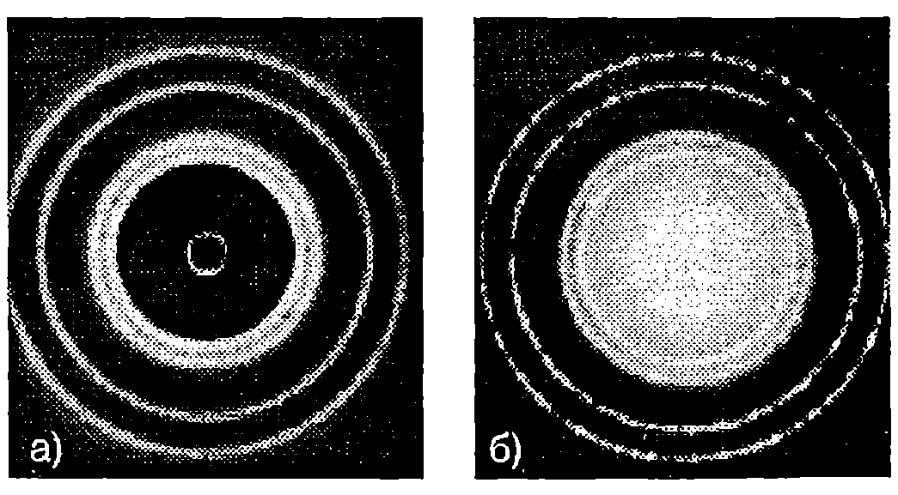
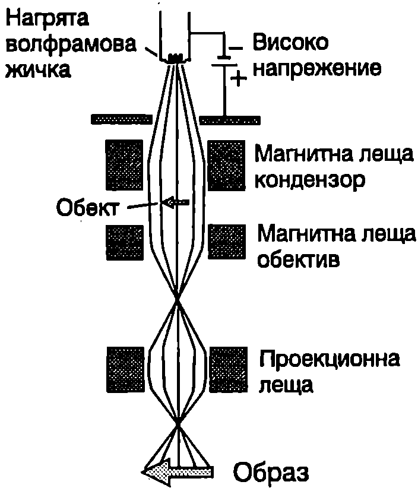

**Вълни на Дьо Бройл**

В природата и в нейните закони съществува симетрия. След като светлината съчетава свойствата на вълна и на частица, не следва ли да се очаква, че подобна двойственост е присъща на електроните и на другите микрочастици? През 1923 година френският физик Луи Дьо Бройл (1892-1987) изказва смелата хипотеза, че всички форми на материята имат свойства както на частици, така и на вълни. Според хипотезата на Дьо Бройл, всяка частица, която се движи и има импулс с големина $p$, проявява свойствата на вълна с дължина на вълната
$$\lambda = \frac{h}{p},
$$
където $h$ е константата на Планк. Тези вълни се наричат вълни на материята или вълни на Дьо Бройл. Например дължината на вълната на Дьо Бройл на прашинка с маса $m = 1.10^{-10}$ kg, която се движи със скорост $v = 1\ \mathrm{mm/s}$, e
$$\lambda = \frac{h}{p} = \frac{h}{mv} = \frac{6,\!63.10^{-34}\ \mathrm{J\cdot s}}{(1.10^{-10}\ \mathrm{kg})(0,\!001\ \mathrm{m/s})} = 6,\!63.10^{-21}\ \mathrm{m}$$

Получената стойност е около един милион пъти по-малка от радиуса на атомните ядра. Затова не съществува дифракционна решетка, от която да се наблюдава дифракция на подобни прашинки и да се потвърди експериментално хипотезата на Дьо Бройл. Микрочастиците електрони, неутрони, атоми и др., обаче имат много по-малка маса $m$ от макроскопичните тела. Затова тяхната дължина на вълната на Дьо Бройл $\lambda$ е много по-голяма ($\lambda\propto 1/m$) и вълновите им свойства могат да се установят експериментално.

**Опит на Дейвисън и Джермер**

Както знаем, дължината на вълната на рентгеновите лъчи е сравнима с разстоянията между атомите в кристалите. Затова кристалите са идеални дифракционни решетки за рентгеновите лъчи. От какво напрежение трябва да се ускори сноп от електрони, за да имат електроните същата дължина на вълната на Дьо Бройл, както рентгеновите лъчи, например 0,15 nm? Не е трудно да се пресметне (вж. пример 104.1), че електрони, ускорени от напрежение $U = 67$ V, имат дължина на вълната на Дьо Бройл $\lambda = 0,\!15$ nm.

През 1927 година американските физици Клинтън Дейвисън и Лестър Джермер изследват разсейването на ``бавни'' електрони (ускорени от напрежение около 60 V) от никелова мишена, поставена във вакуум. Интересно е да се отбележи, че целта на експеримента не е била да се потвърди хипотезата на Дьо Бройл. Двамата изследователи регистрират отразените от мишената електрони върху фотоплака и с изненада откриват, че върху фотоплаката се наблюдава дифракционна картина, подобна на дифракционната картина, получена с рентгенови лъчи (Фиг. \ref{fig:104.1}). По разположението на дифракционните максимуми те определят дължината на вълната и установяват, че тя съответства на дължината на вълната на Дьо Бройл $\lambda = h/p$ на електроните. Опитите на Дейвисън и Джермер показват, че електроните имат вълнови свойства и потвърждават хипотезата на Дьо Бройл. Скоро след това е наблюдавана дифракция на снопове от хелиеви ядра, водородни атоми и неутрони. Тези експерименти убедително доказват, че материята притежава вълнови свойства.



```
Дифракционна картина от един и същ кристал, получена: а) с рентгенови лъчи; 6) с електрони. Дължината на вълната на Дьо Бройл на електроните е равна на дължината на вълната на рентгеновите лъчи.
```
	`Фиг. 104.1`


\begin{psexample}[label=ex:104.1]{}{}
Колко волта ускоряващо напрежение и е необходимо, за да се получи електронен сноп с дължина на вълната на Дьо Бройл на електроните $\lambda = 0,\!15$ nm? Зарядът на електрона е $e = 1,\!6.1^{- 19}\ \mathrm{C}$ а масата му е $m= 9,\!1.10^{-31}\ \mathrm{kg}$.
\end{psexample}
> [!note]- Решение
 Кинетичната енергия на електроните е равна на работата на електричните сили: $\displaystyle \frac{m v^2}2 = eU$ електроните откъдето изразяваме скоростта на $\displaystyle v = \sqrt{\frac{2e U}m}$ и я заместваме във формулата за дължината на вълната на Дьо Бройл $\displaystyle \lambda=\frac{h}{p} = \frac{h}{mv}$. Получаваме $\displaystyle\lambda = \frac{h}{\sqrt{2emU}} $.

Повдигаме двете страни на това равенство на квадрат и изразяваме ускоряващото напрежение:
$$U = \frac{h^2}{2em \lambda^2} = 67\ \mathrm{V}.$$

\begin{psexample}[label=ex:104.2]{}{}
Определете дължината на вълната на Дьо Бройл на електрон, чиято кинетична енергия е равна на енергията на по-кой на електрона.
\end{psexample}
> [!note]- Решение
 Електронът е релативистки, затова във формулата за дължината на вълната на Дьо Бройл трябва да се постави релативисткият импулс $\displaystyle p = \frac{1}{c} \sqrt{E_k(E_k + 2E_0)}$. В случая:
$$E_k = E_0 = m_e c^2,$$
където $m_e$ е масата на покой на електрона. Импулсът на електрона е $P = \sqrt3 m_ec$ а дължината на вълната на Дьо Бройл е
$$\lambda = \frac{h}{\sqrt3 m_e c} = 1,\!4.10^{- 12}\ \mathrm{m}.$$

**Електронен микроскоп**

Оптичните микроскопи не са подходящи за изследвания на атомно равнище, тъй като поради явлението дифракция с тях не могат да се наблюдават детайли от изследвания обект с размери, по-малки от дължината на вълната на използваното лъчение (около 500 nm за видимата светлина). Сред лъченията с електромагнитна природа за тази цел са подходящи рентгеновите лъчи, но при конструирането на рентгенов микроскоп, подобен на оптичния, възникват непреодолими засега трудности. Проблемът е в това, че показателят на пречупване на всички вещества за рентгеновите лъчи е много близък до единица. Ето защо рентгеновите лъчи практически не се пречупват и отразяват от границата на две среди, което прави невъзможно изработването на необходимите за микроскопа рентгенови лещи. Затова вместо рентгенови лъчи се използват снопове от електрони, т.е. корпускулярни лъчения, с подходяща дължина на вълната на Дьо Бройл (по-малка от 0,1 nm). Електронните снопове се насочват и фокусират с помощта на електрични и магнитни полета. Съществуват електронни микроскопи с различна конструкция и предназначение: трансмисионни, сканиращи, отражателни, емисионни и др. Ще се спрем накратко само на първите два вида, тъй като с тях са снабдени много изследователски и производствени лаборатории у нас.

Образът в *трансмисионния* електронен микроскоп се създава по подобен начин както при оптичните микроскопи. В случая осветителната система се състои от нагрят до температура 2700 °C волфрамов катод, излъчващ електрони, които се ускоряват от високо напрежение (Фиг. \ref{fig:104.2}). Чрез магнитни лещи (кондензори) се формира електронен сноп с нужния интензитет и се фокусира върху обекта. Магнитна леща (обектив) създава първото увеличение, наречено междинно. Второто, крайно увеличение, се създава от проекционната леща. Магнитните лещи представляват намотки с ток, чието магнитно поле насочва и фокусира електроните. Образът в електронния микроскоп се получава поради нееднаквото разсейване на електроните от отделните участъци на обекта, тъй като има разлики в тяхната дебелина, маса и структура. Поради силното поглъщане електроните могат да преминават само през много тънки образци, което прави метода подходящ за изследване на тънки слоеве или специално подготвени отпечатъци (реплики) от повърхността на обемни материали. Увеличението на трансмисионните електронни микроскопи достига $10^6$ пъти (около 1000 пъти по-голямо от оптичните микроскопи) и с тях се наблюдават детайли от обекта с размери до 0,2-0,5 nm. Теоретичните граници на увеличението, определени от дължината на вълната на Дьо Бройл на електроните, не могат да се достигнат поради някои ограничения във фокусирането на снопа, свързани с наличието на електрони с различни скорости.



```
Принципна схема на електронен микроскоп.
```
	`Фиг. 104.2`


*Сканиращите* електронни микроскопи се използват главно за изследване на повърхността на материалите. При тях много тесен електронен сноп обхожда (сканира) точка по точка изследваната повърхност. Разсеяните от отделните точки електрони са залавят от колектор. Полученият от колектора ток се усилва и се подава на електроннолъчева тръба, където модулира интензитета на носещия електронен лъч и формира образа върху екрана.

**Закон на Брег**

Дифракцията на рентгенови лъчи, електрони или неутрони от кристали се характеризира с някои общи закономерности, които не зависят от вида на лъчението, а само от дължината на вълната $\lambda$. Просто и нагледно обяснение на дифракцията от кристал дава британският физик Уйлям Брег (1890-1971). Той разглежда кристала като съставен от успоредни слоеве от атоми, наречени атомни равнини, които подобно на полупропускливи огледала само частично отразяват лъчението. Всяка атомна равнина огледално отразява много малка част от интензитета на падащата вълна, а общо отражението се извършва от голям брой равнини. Отразените вълни могат да се разглеждат като вторични вълни на Хюйгенс, които интерферират помежду си и формират дифрактиралата от кристала вълна. Интензитетът на дифрактиралата вълна е голям само при интерференчен максимум, т.е. когато отразени те вълни взаимно се усилват. Да означим с $d$ разстоянието между атомните равнини (Фиг. \ref{fig:104.3}). Разликата в пътищата на два лъча, които се отразяват от съседни атомни равнини, е $\Delta r = 2d\sin\theta$. Тук $\theta$ е ъгълът, който лъчите сключват с равнината (а не с нормалата, както е прието в оптиката). При интерференцията двете отразени вълни се усилват, ако разликата в пътищата им $\Delta r$ равна на цяло число $m$ дължини на вълната $\lambda$:


```

```
	`Фиг. 104.3`


$$2 d \sin \theta = m\lambda;\ ( m = 1, 2 ,3...).
$$
Това уравнение изразява закона на Брег за положението на дифракционните максимуми.

**Задачи**

1. Електронен сноп се ускорява от напрежение: а) 200 V; б) $2.10^6$ V. Колко е дължината на вълната на Дьо Бройл на електроните?

2. При какви ъгли $\theta$ ще се наблюдава брегово отражение от семейство атомни равнини с разстояние между тях $d = 0,\!30$ nm? Кристальт се облъчва с електрони с дължина на вълната на Дьо Бройл $\lambda = 0,\!154$ nm.

3. Определете разстоянието $d$ между успоредни атомни равнини, ако брегово отражение от първи порядък ($m = 1$) на електронен сноп с дължина на вълната Дьо Бройл $\lambda = 0,\!126$ nm се наблюдава под ъгъл $\theta = 16^\circ$.
