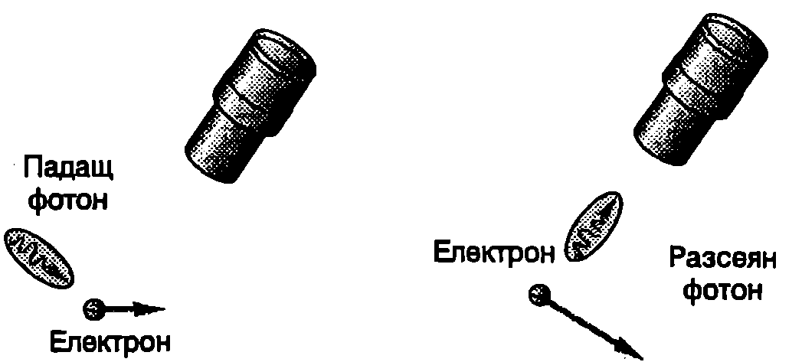

При всички физични измервания се допуска грешка. Експериментаторът никога не може абсолютно точно да измери стойността на физичните величини например координатата и импулса на една частица. Според класическата механика грешката при измерванията се дължи единствено на несъвършенството на измервателните уреди. Класическата механика по принцип допуска измервания с произволно голяма точност (стига да разполагаме с необходимите за целта уреди). Според квантовата теория обаче не е възможно положението и импулсът (скоростта) на една частица да се определят едновременно с произволно голяма точност. Това ограничение в точността не е свързано с несъвършенството на измервателните уреди, а има принципен характер. То отразява същността на квантовите обекти, които неразривно съчетават в себе си вълнови и корпускулярни свойства.

През 1927 година германският физик Вернер Хайзенберг (1901-1976) формулира следното твърдение, което днес е известно като *принцип за неопределеност* на Хайзенберг: Ако $x$-координатата на една частица е измерена с точност $\Delta x$ и едновременно с това $x$-компонентата на импулса на частицата е измерена с точност $\Delta p_x$, то произведението от $\Delta x$ и $\Delta p_x$ никога не може да е по-малко от константата на Планк $h$, разделена на $2\pi$:
$$\Delta x \Delta p_x \geq \frac{h}{2\pi} = \hbar
$$
Според принципа за неопределеност природата на квантовите обекти в такава, че е невъзможно едновременно да се определи точното положение и точният импулс на една частица. Когато неопределеността $\Delta x$ на координатата е много малка, тогава неопределеността $\Delta p$, на импулса е голяма и обратно. Аналогични неравенства $\displaystyle \Delta y \Delta p_y \geq \frac{h}{2\pi}$ и $\displaystyle \Delta z \Delta p_z \geq \frac{h}{2\pi}$ са в сила за $y$- и $z$-компонентите.

**Мислен опит на Хайзенберг**

За да обясни нагледно смисъла на принципа за неопределеност, Хайзенберг разглежда следния мислен опит. Електрон се наблюдава с помощта на ``идеален'' микроскоп. Микроскопът е толкова съвършен, че за определяне положението на електрона е достатъчно само един фотон да се отрази (удари) от електрона и през микроскопа да попадне в окото на наблюдателя (Фиг. \ref{fig:105.1}). Преди удара фотонът има импулс $p = E_\phi/c = h\nu/c = h/\lambda$. При удара той предава неизвестна част от импулса си на електрона и x-компонентата на импулса на електрона се променя. Така след удара възниква неопределеност в импулса на електрона, която е от порядъка на импулса на падащия фотон: $\Delta p_x = h/\lambda$. От друга страна, тъй като светлината притежава вълнови свойства, точността, с която може да се определи положението на електрона, е приблизително равна на дължината на вълната на използваното лъчение, т.е. $\Delta x = \lambda$. За да се намали неопределеността в координатата $\Delta x$, трябва да се използва лъчение с много малка дължина на вълната $\lambda$ -- например $\gamma$-лъчи. Гама квантите обаче имат много голям импулс, поради което неопределеността в импулса на електрона след удара $\Delta p_x = h/\lambda$ нараства. Обратно, ако се използва лъчение с голяма дължина на вълната (например видима светлина), тогава неопределеността в импулса на електрона ще е малка, но за сметка на това неговото положение ще е определено твърде неточно. Като се умножат двете неопределености, се получава
$$\Delta x\Delta p_x = \lambda \left(\frac{h}{\lambda}\right) = h.$$



```
Мислен опит на Хайзенберг.
```
	`Фиг. 105.1`


По-прецизният анализ, основан на законите на квантовата механика, показва, че произведението на неопределеностите $\Delta x\Delta p_x$, удовлетворява неравенството \eqref{eq:105.1}.

\begin{psexample}[label=ex:105.1]{}{}
С помощта на принципа за неопределеност оценете енергията на основното състояние и размера на водородния атом.
\end{psexample}
> [!note]- Решение
 Принципът за неопределеност се използва за приблизителна оценка на стойностите на някои величини, характеризиращи микрочастиците. Това става по следния начин:

1. Когато движението на частицата е ограничено в определена област от пространството (казва се, че частицата е локализирана в тази област), неопределеността в положението на частицата се приема за равна на размера на областта на локализация (например на радиуса $r$ на областта, когато тя е сферична).

2. Неопределеността в импулса се приема за минимална възможна стойност на самия импулс на частицата.

3. В неравенство \eqref{eq:105.1}, изразяващо принципа за неопределеност, се замества $\Delta x = r$. Дори знакът за неравенство се заменя със знак за равенство: $rp = h/2 \pi$.

4. В основното състояние енергията на частицата (или на системата от частици) има минимум. Определя се пълната енергия $E$ (кинетична енергия + потенциална енергия), отчита се връзката между $r$ и $p$, произтичаща от принципа за неопределеност, намира се минимумът на получената функция $E(r)$ и се пресмятат търсените величини.

В конкретния случай $r$ е радиусът на водородния атом. Енергията на атома е
$$E = \frac{p^2}{2m} - \frac{e^2}{4\pi\varepsilon_0 r},$$
където първият член в дясната страна на равенството е кинетичната енергия на електрона, а вторият потенциалната енергия на кулоновото взаимодействие между електрона и ядрото (протона). С помощта на принципа за неопределеност изразяваме импулса $p$ на електрона, $p = h/2 \pi r$ и го заместваме в уравнението за енергията. Получаваме


```

```
	`Фиг. 105.2`

$$E(r)= \frac{h^2}{8\pi^2 mr^2} -\frac{e^2}{4\pi\varepsilon_0 r}.$$

Графиката на функцията $E(r)$ е показана на Фиг. \ref{fig:105.2}. За да определим минимума на функцията $E(r)$, намираме нейната първа производна и я приравняваме на нула, т.е.
$$\frac{dE}{dr} = -\frac{h^2}{4\pi^2 m r^3} + \frac{e^2}{4\pi\varepsilon_0 r^2} = 0$$
откъдето определяме радиуса $r_B$ (радиус на Бор) на орбитата на електрона, когато водородният атом се намира в основното си състояние, т.е. в състоянието с минимална енергия:
$$r_B = \frac{\varepsilon_0 h^2}{\pi m e^2} = 0,\!053\ \mathrm{nm}.$$

Заместваме във формулата за пълната енергия $E(r)$ на атома и определяме енергията на основното състояние
$$E = -\frac{m e^4}{8\varepsilon_0^2 h^2} = -13, 6\ \mathrm{eV}$$
В този случай направената оценка с помощта на принципа за неопределеност дава точния резултат за енергията на основното състояние на водородния атом, който се получава по методите на квантовата механика

Задачи

1. В мисления опит на Хайзенберг се използват рентгенови лъчи, за да се определи положението на електрон с точност $\Delta x = 1.10^{- 11}\ \mathrm{m}$. С каква точност може да се определи скоростта на електрона при подобен опит?

2. Мишокът Мики живее във вълшебен свят, за който константата на Планк има стойност $h_M = 2\pi\ \mathrm{Js}$. Може ли Мики да спи спокойно в дупката си? Колко е минималната му скорост, ако дупката е с радиус $r = 10$ cm? Масата на Мики е $m= 0,\!02$ kg.

3. Оценете минималните стойности на импулса $p$, скоростта $v$ и кинетичната енергия $E_k$, на неутрон, намиращ се в ядро с радиус $r = 2.10^{- 15}$ m.

4. С помощта на принципа за неопределеността оценете минималната енергия на квантовомеханичен осцилатор. Разгледайте частица с маса $m$, която извършва хармонично трептене по оста $x$ с кръгова честота $\displaystyle \omega = \sqrt{\frac{k}{m}}$. Потенциалната енергия на частицата се изменя по закона $U(x) = k x^2/2$.
