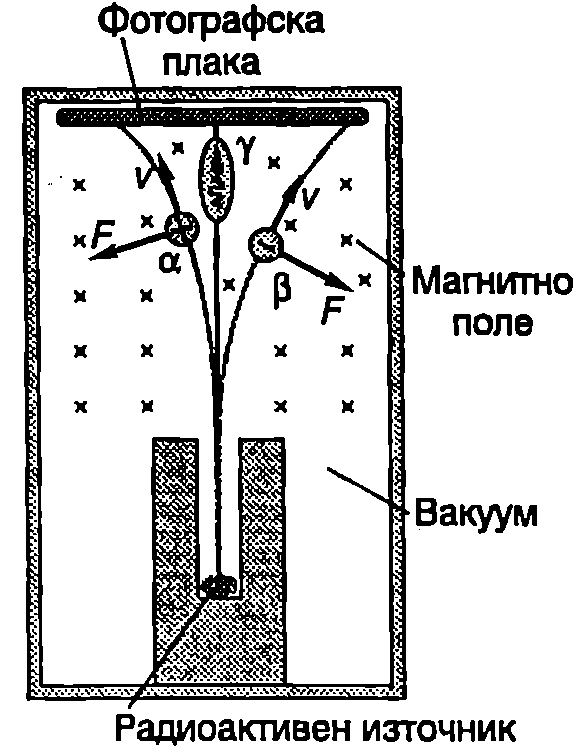

През 1896 г. френският физик Анри Бекерел (1852-1908) случайно поставя в затъмнено помещение късчета уранова руда върху увита в плътна черна хартия фотографска плака. След промиване на плаката се оказва, че тя е почерняла на местата, където е лежала рудата. Това означава, че рудата изпуска спонтанно, т.е. без външно въздействие, някакви невидими лъчи. По-нататъшните опити показват, че тези лъчи имат голяма енергия и проникваща способност. Те могат да предизвикат йонизация на молекулите на въздуха и да разредят зареден електроскоп. Откритото от Бекерел спонтанно излъчване на урана е било наречено радиоактивност. Скоро след това съпрузите Мария и Пиер Кюри откриват в урановата руда два неизвестни дотогава химични елемента, които много по-интензивно от урана изпускат лъчи. Единият от тях е наречен полоний (Po) -- в чест на родината на Мария Кюри -- Полша, а другият -- радий (Ra), което означава лъчист.

Радиоактивно излъчване се получава при спонтанното разпадане на нестабилните атомни ядра, които е прието да се наричат *радионуклиди*. Лъчите, които могат да се излъчат от радиоактивните ядра, са три вида: алфа ($\alpha$) лъчи поток от хелиеви ядра Не, бета ($\beta$) лъчи поток от електрони ($\beta^-$) или от позитрони ($\beta^+$); гама ($\gamma$) лъчи фотони с голяма енергия. Радиоактивните лъчения са невидими за човешкото око, но могат да се разделят и регистрират например с опита, показан на Фиг. \ref{fig:107.1}. Радиоактивно вещество (например радий Ra), излъчващо и трите вида лъчи, се поставя на дъното на оловен контейнер, който поглъща радиоактивното лъчение. През тесния канал на контейнера излиза сноп от лъчи и се насочва перпендикулярно на индукционните линии на еднородно магнитно поле. В магнитното поле снопът се разделя на три части: две от тях се отклоняват в противоположни посоки, а третата не променя посоката си на разпространение. От опита следва изводът, че снопът, който не се отклонява в магнитно поле, е съставен от електронеутрални частици ($\gamma$-лъчи). Наляво се отклоняват частиците с положителен заряд ($\alpha$-частиците), а надясно частиците с отрицателен заряд ($\beta^-$-частиците, т.е. електроните).



```

```
	`Фиг. 107.1`


Трите вида радиоактивни лъчения имат твърде различна проникваща способност; $\alpha$-лъчите трудно преминават през лист хартия, $\beta$-лъчите могат да изминат няколко милиметра в алуминий, а за да се осигури надеждна защита от $\gamma$-лъчите е необходима оловна преграда с дебелина няколко сантиметра.

**Закон за радиоактивното разпадане**

В препарат, съдържащ радиоактивно вещество, има голям брой нестабилни ядра. Независимо че всички ядра са еднакви, някои от тях се разпадат почти веднага, а други ``живеят'' дълго. Разпадането на едно или друго ядро е случаен процес, който се характеризира с определена вероятност. По определение вероятността за разпадане $\lambda$ е равна на броя на ядрата $-dN$ (знакът минус отчита, че в резултат на разпадането броят на радиоактивните ядра намалява, т.е. $dN < 0$), които се разпадат за малък интервал от време $dt$, разделен на началния брой на ядрата $N$ и на интервала $dt$:
$$\lambda = \frac{-dN}{Ndt}.
$$
Опитът показва, че вероятността $\lambda$ не зависи от външните условия (температура, налягане и др.) и е характерна за дадения радиоактивен изотоп константа, която се нарича *константа на разпадане* $\lambda$.

Записваме уравнение \eqref{eq:107.1} във вида
$$\frac{dN}N = -\lambda dt ,$$
интегрираме това диференциално уравнение и получаваме
$$\int_{N_0}^N \frac{dN} N =- \int_0^t \lambda dt,\ \ln\left(\frac{N}{N_0}\right)=- \lambda t;$$
$$N = N_0 e^{-\lambda t},
$$
където $N_0$ е броят на радиоактивните ядра в началния момент $t = 0$ Уравнение \eqref{eq:107.2} изразява *закона за радиоактивното разпадане*: броят на радиоактивните ядра намалява по експоненциален закон с течение на времето (Фиг. \ref{fig:107.2}).

**Активност**

Отношението $(- d N)/d t$ на броя на ядрата $- d N$ които се разпадат за малък интервал от време $dt$, към големината на интервала $dt$, се нарича *активност* $A$ на радио активния препарат. Съгласно с уравнение \eqref{eq:107.1} активността $A$ на препарат, съдържащ $N$ на брой радиоактивни ядра с константа на разпадане $\lambda$, е
$$A = \frac{-dN}{N} = \lambda N.
$$
Единицата за активност в Sl се нарича *бекерел* (Bq). Активността на даден радиоактивен препарат е един бекерел, ако в него за една секунда се разпада едно ядро:
$$1~\mathrm{Bq} = 1\frac{\text{разпадане}}{\text{секунда}}\text{, т.е. } 1~\mathrm{Bq} = 1~\mathrm{s^{- 1}}$$

Освен бекерелът, в практиката често се използва извънсистемната единица за активност *кюри* (Ci). Активността на един радиоактивен препарат е 1 Ci, ако за една секунда в него се разпадат толкова ядра, колкото се разпадат за същото време в 1 g радий:
$$1~\mathrm{Ci} = 3,\!7.10^{10}~\mathrm{Bq}.$$


```
Закон за радиоактивното разпадане.
```
	`Фиг. 107.2`


**Период на полуразпадане**

Устойчивостта на ядрата на разпадане се характеризира с величината *период на полуразпадане* $T_{1/2}$ По определение период на полуразпадане $T_{1/2}$ на даден вид радиоактивни ядра е времето, за което се разпадат половината ядра от този вид, намиращи се в даден препарат. Заместваме $t = T_{1/2}$ и $N = N_0/2$ в закона за радиоактивното разпадане \eqref{eq:107.2} и получаваме
$$\frac{N_0}2 = N_0 e^{- \lambda T_{1/2}}.$$

Записваме това равенство във вида $e^{\lambda T_{1/2}}= 2$, логаритмуваме двете му страни и получаваме връзката между периода на полуразпадане $T_{1/2}$ и константата на разпадане $\lambda$:
$$T_{1/2} = \frac{\ln(2)}{\lambda} = \frac{0, 693}{\lambda}.
$$
Периодите на полуразпадане на различните радиоактивни ядра се намират в много широки граници. Например докато за изотопа на полония $^{212}_{84}\mathrm{Po}$ периодът на полуразпадане е само $3.10^{- 7}$ , за разпадането на половината от ядрата на изотопа на неодима $^{144}_{60}\mathrm{Nd}$ са необходими цели $5.10^{15}$ години 300 000 пъти повече от възрастта на Вселената!

\begin{psexample}[label=ex:107.1]{}{}
Радиоактивен източник, изготвен от изотопа $^{60}\mathrm{Co}$, има активност $A = 2.10^{10}~\mathrm{Bq}$. Колко милиграма $^{60}\mathrm{Co}$ се съдържат в този източник? Периодът на полуразпадане на кобалта е $T_{1/2} = 5,\!26$ години.
\end{psexample}
> [!note]- Решение
 От уравнения \eqref{eq:107.3} и \eqref{eq:107.4} представяме активността на източника чрез периода на полуразпадане: $\displaystyle A = \frac{0.693}{T_{1/2}} N$, откъдето изразяваме броя $N$ на радиоактивните атоми
$$N = \frac{AT_{1/2}}{0,\!693}$$

Масата на радиоактивното вещество е
$$m = \frac{N}{N_{A}} M = \frac{AT_{1/2}}{0.693N_{A}} M,$$
където $M = 0,\!060$ kg/mol е моларната маса на кобалта. След заместване на числените стойности получаваме
$$m= \frac{(2.10~\mathrm{Bq}) (1,\!66.10^8 ~\mathrm{s})}{0,\!693(6,\!02.10^{23} ~\mathrm{mol^{-1}})} (0,\!060 ~\mathrm{\frac{kg}{mol}}) = 0,\!48~\mathrm{mg}.$$

**Датиране с въглерод-14.**

Радиоактивният изотоп $^{14}_6\mathrm{C}$ (въглерод-14), чийто период на полуразпадане е 5730 години, се създава в горните слоеве на атмосферата под действие на космичните лъчи. Установено е, че концентрацията му във въглеродния диоксид от земната атмосфера не се е изменила в продължение на хилядолетия. (На всеки $8.10^{11}$ молекули $\mathrm{CO_2}$ със стабилния изотоп $^{12}_6\mathrm{C}$ се пада средно по една молекула $\mathrm{CO_2}$ с $^{14}_6\mathrm{C}$.) Във всички живи организми съотношението между двата изотопа е същото, както в атмосферата, защото при жизнените процеси непрекъснато се обменя въглерод с околната среда. Когато обаче организмът умре, този обмен се прекратява и броят на ядрата $^{14}_6\mathrm{C}$, които са се съдържали в него, започва да намалява в съответствие със закона за радиоактивното разпадане. По броя на останалите неразпаднали се ядра може приблизително да се определи датата на смъртта на съответния организъм. С помощта на въглеродния метод в археологията се определя възрастта на останки от дърво, кости и черупки, принадлежащи на растителни и животински видове, живели преди хиляди години.

\begin{psexample}[label=ex:107.2]{}{}
В руините на древен град са намерени дървени предмети, в които концентрацията на $^{14}_6\mathrm{C}$ е 2,5 пъти по-малка, отколкото в наскоро отрязано дърво. Определете възрастта на предметите. Периодът на полуразпадане на $^{14}_6\mathrm{C}$ е 5730 години.
\end{psexample}
> [!note]- Решение
 От закона за радиоактивното разпадане следва, че $N_0/N = e^(\lambda t) = 2,\!5$ Логаритмуваме двете страни равенство и като отчетем, че $\lambda = \ln 2/T_{1/2}$ за възрастта на предметите получаваме
$$t= \frac{\ln 2,\!5}{\lambda} = \frac{\ln 2,\!5}{\ln 2} T_{1/2} = 7570\text{ години.}$$

**Биологично действие на йонизиращите лъчения**

Радиоактивните лъчения, рентгеновите лъчи, протонните и неутронните лъчения с голяма енергия предизвикват йонизация на атомите и молекулите и увреждат клетките на живите организми. Лъчевите увреждания се разделят на две групи: 1. засягащи самия облъчен индивид; 2. генетични (или наследствени), отнасящи се за поколението. Пораженията зависят от продължителността на облъчването и от количеството погълната радиация, наречено *погълната доза*. Погълнатата доза $D$ е равна на отношението на погълнатата енергия $dE$ от елемент от облъчваното вещество към масата $dm$ на този елемент:
$$D = \frac{dE}{dm}.
$$
В SI единицата за погълната доза се нарича *грей* (Gy). Погълната доза е един грей, ако в един килограм от облъченото вещество се поглъща йонизиращо лъчение с енергия един джаул:
$$1~\mathrm{Gy} = 1~\mathrm{J/kg}.$$

Когато йонизиращото действие на лъчението (главно на рентгеновите лъчи, $\gamma$-лъчите и неутроните) се проявява индиректно йонизация предизвикват освободените от лъчението във веществото заредени частици, тогава погълнатата радиация се характеризира с величината *керма*. (Името керма произтича от началните букви на английския израз ``Kinetic Energy Released in Matter''). Керма $K$ е отношението на сумата от кинетичните енергии $dE_k$ на всички частици с електричен заряд, произведени от лъчението в елемент от веществото, към масата $dm$ на този елемент:
$$K = \frac{dE_k}{dm}
$$
Погълнатата доза и кермата се измерват в едни и същи единици грей.

При една и съща погълната доза биологичният ефект от облъчването зависи от вида на лъчението и от неговата енергия. Количествена мярка за очакваната радиационна опасност при облъчване на живи организми е величината *еквивалентна доза* $H$. По определение еквивалентната доза $H$ и погълнатата доза $D$ са свързани със съотношението
$$H = kD,
$$
където $k$ е безразмерен коефициент, наречен *качествен фактор*. Качественият фактор $k$ е произведение от няколко множителя, които изразяват влиянието на различни фактори върху ефекта от облъчването на даден организъм или орган.

Еквивалентната доза се измерва с единицата *сиверт* (Sv):
$$1~\mathrm{Sv} = 1~\mathrm{J/kg}$$

Еквивалентна доза един сиверт (1 Sv) от което и да е йонизиращо лъчение предизвиква същия биологичен ефект, както погълната доза един грей (1 Gy) от лъчение с качествен фактор $k = 1$ Например за $\beta$-частиците $k = 1$ докато за $\alpha$-частиците $k = 15$ Това означава, че на погълната доза 1 Gy B-лъчение съответства 1 Sv еквивалентна доза, докато еквивалентната доза, съответстваща на 1 Gy x-лъчение, е 15 Sv, т.е. радиационната опасност от $\alpha$ лъчението е много по-голяма.

Поради естествения радиоактивен фон, създаден от космичното лъчение и радиоактивността на околната среда, средната еквивалентна доза, която човешкият организъм поглъща за една година, е около $1,\!5.10^{-3}$ Sv. Съгласно с международните стандарти за радиационна безопасност максималната допустима годишна еквивалентна доза за лица, работещи с радиоактивни източници, е $50.10^{-3}$ Sv. За бозайниците и птиците еквивалентна доза 10 Sv e смъртоносна, докато за унищожаване на някои вируси са необходими над 10 000 Sv.

\begin{psexample}[label=ex:107.3]{}{}
При погълната доза 100 Gy клетките на живата тъкан напълно се увреждат. С колко градуса се повишава температурата на тъканта, ако цялата погълната енергия се превръща в топлина? Приемете, че тъканите имат същия специфичен топлинен капацитет, както водата: $c = 4200~\mathrm{J/(kg\cdot K)}$.
\end{psexample}
> [!note]- Решение
 При погълната доза 100 Gy = 100 J/kg количеството топлина, което се отделя в единица маса от поглъщащото вещество, е $Q/m = 100$ J/kg. Количеството топлина $Q$, необходимо за повишаване с $\Delta T$ температурата на вещество с маса $m$, е $Q = cm\Delta T$. Следователно
$$\Delta T = \frac{1}{c} \frac{Q}{m} = \frac{1}{4200~\mathrm{J/(kg \cdot K)}} (100~\mathrm{J/kg}) = 0,\!024~\mathrm{K}=0,\!024 ~\mathrm{^\circ C}.$$

Толкова малко изменение на температурата не би предизвикало никакъв ефект, ако беше постигнато чрез топлообмен. Радиацията е опасна за живите клетки, защото погълнатата енергия не се разпределя равномерно между всички атоми и молекули. Само отделни водни или биологични молекули в клетката поглъщат относително големи порции енергия и се йонизират. Йоните са химически активни и предизвикват реакции, водещи до увреждане на цялата клетка.

**Задачи**

1. Периодът на полуразпадане на радиоактивния изотоп на стронция $^{90}_{38}\mathrm{Sr}$ е 28 години. След колко години броят на радиоактивните ядра в обект, замърсен със стронций, ще намалее 8 пъти?

2. Препарат съдържа 4 $\mu$g от радиоактивния изотоп йод-131 ($^{131}_{51}\mathrm{I}$). След 24 дни в препарата остават 0,5 $\mu$g йод-131. Колко е периодът на полуразпадане на този изотоп?

3. Изотопна лаборатория получава препарат, съдържащ радиоактивния изотоп $^{131}\mathrm{I}$, чието време на живот е 8,04 дни. При получаването активността на препарата е 6,5 mCi. След известно време измерената активност на препарата е 5,4 mCi. Колко дни са изминали между двете измервания?

4. При диагностичен рентгенов преглед орган на пациента с маса 2,5 kg е погълнал лъчение с енергия $7,\!5.10^{-4}$ J. Колко е погълнатата доза? Колко е еквивалентната доза, ако качественият фактор за това лъчение е $k = 0,\!8$?

5. При погълната доза 2000 Gy се унищожават повечето от бактериите, съдържащи се в рибни или месни продукти, което позволява те да се съхраняват в замразено състояние 5 пъти по-дълго време от обикновеното. Колко джаула енергия се поглъща от 100 kg облъчени продукти?
