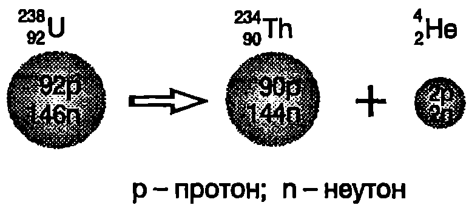
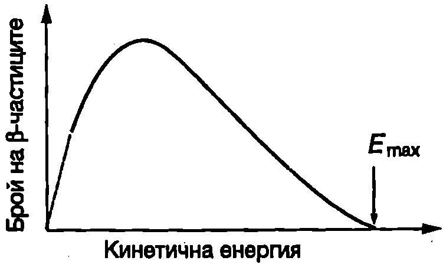
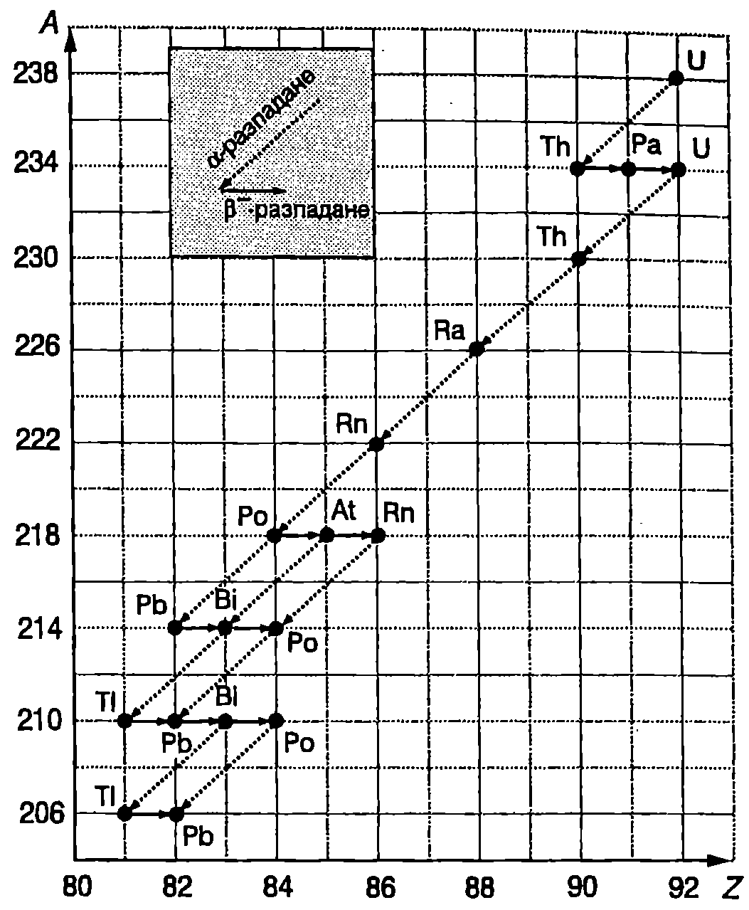

Ще разгледаме по-подробно трите процеса на спонтанно разпадане на радиоактивните ядра: алфа-, бета- и гама-разпадане.

**Алфа-разпадане**

Алфа-разпадането е характерно главно за тежки ядра с атомен номер $Z > 82$ Когато ядро на химичния елемент $X$ с атомен номер $Z$ и масово число $A$ излъчи $\alpha$-частица ($^{4}_2\mathrm{He}$), то загубва два протона и два неутрона (общо 4 нуклона) и се превръща в ядро на химичния елемент $Y$ с атомен номер $Z-2$, чието масово число е $A-4$. Процесът на $\alpha$-разпадане се записва така:
$$^A_Z X \to ^{A-4}_{Z-2} Y + ^4_2 \mathrm{He}.
$$
Например при $\alpha$-разпадане на един от изотопите на урана (Фиг. \ref{fig:108.1}) се получава ядро на химичния елемент торий (Th), който има с две единици по-малък атомен номер и в таблицата на Менделеев е разположен две клетки преди урана:
$$^{238}_{92} \mathrm{U} \to ^{234}_{90} \mathrm{Th} + ^4_2 \mathrm{He}.$$
При $\alpha$-разпадането общият брой на нуклоните не се изменя. Например при разпадането на урана в ядрото на изотопа $^{238}_{92} \mathrm{U}$ се съдържат 238 нуклона. Общият брой на нуклоните в ядрата $^{234}_{90} \mathrm{Th}$ и $^4_2 \mathrm{He}$, получени след разпадането, остава непроменен: 234 + 4 = 238 нуклона. В сила е също така законът за запазване на електричния заряд: зарядът на изходното ядро на урана $92e$ ($e$ -- елементарен заряд) е равен на сумата от зарядите на ядрото на тория и на $\alpha$-частицата: $90e+ 2e = 92e$



```

```
	`Фиг. 108.1`


Алфа-разпадането е следствие от нестабилността на тежките ядра, дължаща се на електричните сили на отблъскване между протоните. Ядрените сили на привличане обаче правят невъзможно откъсването на отделни протони от ядрото. При излъчването на $\alpha$-частица се постига своеобразен ``компромис'' между конкуриращите се електрични и ядрени сили: от ядрото се премахват два протона, което води до намаляване на електричното отблъскване между останалите протони. Едновременно с това четирите нуклона в $\alpha$-частицата (два протона и два неутрона) остават изключително здраво свързани под действие на ядрените сили.

Енергията $Q$, която се отделя при $\alpha$-разпадането, е равна на разликата от енергията на покой на изходното ядро $M_X c^2$ и енергиите на покой на дъщерното ядро $M_\gamma c^2$ и $\alpha$-частицата $M_\alpha c^2$:
$$Q = (M_X - M_Y - M_\alpha)c^2,
$$
където $M_X$. $M_\gamma$ и $M_\alpha$ са масите на съответните ядра. Отделената енергия $Q$ се разпределя между $\alpha$-частицата и дъщерното ядро като кинетична енергия. Тъй като стойността на $Q$ е много по-малка от енергията на покой на $\alpha$-частицата ($Q \leq 10$ MeV) , продуктите на $\alpha$-разпадането ($\alpha$-частицата и дъщерното ядро) се движат с нерелативистки скорости.

\begin{psexample}[label=ex:108.1]{}{}
Отделената при $\alpha$-разпадането енергия $Q$ се разпределя като кинетична енергия на $\alpha$-частицата $E_\alpha$ и кинетична енергия на дъщерното ядро $E_\gamma$.

а) Докажете, че $\displaystyle E_\alpha = \frac{Q}{1+M_\alpha/M_\gamma}$, където $M_\alpha$ и $M_\gamma$ са съответно масите на $\alpha$-частицата и на дъщерното ядро.

6) Колко процента от отделената енергия при $\alpha$-разпадането на ядрото $^{238}_{92} \mathrm{U}$ е кинетичната енергия на $\alpha$-частицата?
\end{psexample}
> [!note]- Решение
 Изразяване кинетичните енергии на двете нерелативистки частици чрез техните импулси $p_\alpha$ и $p_\gamma$:
$$E_{\alpha} = \frac{P_{\alpha}^2}{2M_{\alpha}};\ E_{\gamma} = \frac{P_{Y}^2}{2M_{Y}}.$$

От закона за запазване на импулса следва, че в случая, когато изходното ядро е в покой, след разпадането дъщерното ядро и $\alpha$-частицата се движат в противоположни посоки с равни по големина импулси, т.е.
$$p_\gamma = p_\alpha$$

От закона за запазване на енергията следва равенството
$$Q = E_\alpha+ E_\gamma.$$

От записаните равенства, след съответните алгебрични преобразувания, се получава

$$E_\alpha = \frac{Q}{1+M_\alpha/M_\gamma};\ E_\gamma = \frac{Q}{1+M_\gamma/M_\alpha}.$$

За тежките ядра (с голямо масово число) $M_\alpha/M_\gamma \ll 1$, поради което основната част от енергията $Q$ преминава в кинетична енергия на $\alpha$-частицата.

б)
$$\frac{E_\alpha}{Q} = \frac{1}{1+M_\alpha/M_\gamma} = \frac{1}{1+4/234}100\% = 98,\!3\%.$$

**Бета-разпадане**

При $\beta$-разпадане радиоактивното ядро излъчва един електрон и се превръща в ядро, което има същия брой нуклони (същото масово число $A$), но атомният му номер е с една единица по-голям:
$$^A_Z X \to ^{A}_{Z+1} Y + ^0_{-1} e.
$$

Тук със символа $^0_{-1} e$ е означен електронът: горният индекс ``0'' показва, че масовото число на електрона в нула (той не е изграден от протони и неутрони); долният индекс ``-1'' показва, че електронът е носител на един елементарен отрицателен заряд. Обърнете внимание, че както при $\alpha$-разпадането броят на нуклоните и пълният електричен заряд не се изменят. При $\beta^-$-разпадането един неутрон се превръща в протон и броят на положителните елементарни заряди нараства с единица. Едновременно с това обаче се появява и един елементарен отрицателен заряд (на електрона), поради което пълният заряд остава непроменен: $(Z+1)e + (-e) = Ze$. Важно е също да се отбележи, че изходното радиоактивно ядро не съдържа електрони. Електронът се създава в момента на разпадането, за което се изразходва част от енергията на покой на разпадащото се ядро.

$\beta^-$-разпадане претърпяват например ядрата на изотопа въглерод-14:
$$^{14}_{6}\mathrm{C} \to ^{14}_{7}\mathrm{N} + ^0_{-1} e$$
и се превръщат в ядра на азота, който в периодичната система на елементите е разположен непосредствено след въглерода.

При $\beta$-разпадането част от енергията на покой на радиоактивното ядро се превръща в кинетична енергия на частиците, получени след разпадането. Тъй като електронът е много по-лек от ядрото, от законите за запазване на енергията и на импулса следва, че почти цялата отделена при разпадането енергия би трябвало да се превърне в кинетична енергия на излъчената $\beta$-частица. Например при разпадането на едно ядро на изотопа въглерод-14 винаги се отделя една и съща енергия (0,156 MeV), тъй като всички ядра са еднакви. Затова всички електрони, получени след разпадането на този изотоп, би трябвало да имат еднаква кинетична енергия, приблизително равна на 0,156 MeV. Опитът обаче не потвърждава този извод. Измерванията показват, че се излъчват електрони с различна енергия, чиято стойност се намира в интервала от нула до 0,156 MeV. На Фиг. \ref{fig:108.2} е показан типичен спектър на $\beta$-частиците: в снопа от електрони, получен след разпадането на даден вид радиоактивни ядра, се съдържат електрони с кинетична енергия в интервала от нула до определена максимална стойност $E_{\max}$) приблизително равна на цялата енергия, отделена при разпадането на едно ядро. Този неочакван резултат предизвиква сериозни дискусии сред физиците. Нарушават ли се законите за запазване на енергията и на импулса при $\beta$-разпадането?



```

```
	`Фиг. 108.2`


През 1930 година Паули изказва предположението, че при $\beta$-разпадането се отделя още една, неизвестна по онова време частица, която отнася ``липсващите'' енергия и импулс. По-късно Енрико Ферми нарича тази частица с умалителното име *неутрино* $\nu$, тъй като тя е електронеутрална и се предполага, че има равна на нула (или изключително малка) маса на покой. Поради извънредно слабото му взаимодействие с веществото неутрино то е открито експериментално едва през 1956 година. Неутриното има ``античастица'', наречена *антинеутрино* $\tilde \nu$. При $\beta$-разпадане се отделя антинеутрино и този процес по-пълно се записва така:
$$^A_Z X \to ^{A}_{Z+1} Y + ^0_{-1} e + \tilde\nu.
$$
Например точната формула, изразяваща процеса на B-разпадане на изотопа въглерод-14, е
$$^{14}_{6} \mathrm{C} \to ^{14}_{7} \mathrm{N} + ^0_{-1} e + \tilde\nu.$$
При $\beta^+$-разпадане вместо електрон и антинеутрино се излъчват позитрон $^0_1e$ и неутрино $\nu$. Позитронът, както вече беше отбелязано в~\ref{sec:103}, е античастицата на електрона: има същата маса, както електрона, но подобно на протона в носител на елементарен положителен заряд. Позитронното $\beta^+$-разпадане се изразява с формулата
$$^A_Z X \to ^{A}_{Z-1} Y + ^0_1 e + \nu.
$$
Пример за $\beta^+$-разпадане е процесът
$$^{14}_{7} \mathrm{N} \to ^{14}_{6} \mathrm{C} + ^0_1 e + \nu.$$
Обърнете внимание, че при $\beta^+$-разпадането също се запазва броят на нуклоните и електричният заряд.
Съществува още един процес, наречен *електронно захващане*, който е подобен на $\beta^+$-разпадането. При него атомното ядро захваща един от собствените си електрони в повечето случаи от най-вътрешния K слой на атома, и излъчва неутрино. В резултат на процеса на електронно захващане атомният номер на ядрото се променя от $Z$ на $Z-1$:
$$^A_Z X + ^0_{-1} e \to ^{A}_{Z-1} Y + \nu.
$$
Когато ядрото захваща електрон от К слоя, процесът се нарича K-захващане. Пример за такъв процес е захващането на електрон от ядрото $^{7}_{4}\mathrm{Be}$ и превръщането му в ядро $^{7}_{3}\mathrm{Li}$:
$$^{7}_{4} \mathrm{Be} + ^0_{-1} e \to ^{7}_{3} \mathrm{Li} + \nu.$$

**Гама-разпадане**

Подобно на атомите, ядрата също могат да се намират в състояния с различна енергия: основно състояние, в което енергията на ядрото е минимална, и възбудени състояния с по-голяма енергия. При преминаване от състояние с по-голяма енергия в състояние с по-малка енергия ядрото излъчва фотон. Тъй като разликата в енергиите на ядрените състояния е много голяма (обикновено няколко MeV), излъчените от ядрото фотони имат многократно по-голяма енергия от фотоните, излъчени от атомите. Тези фотони с голяма енергия се наричат $\gamma$-кванти, а процесът на излъчването им от възбудените атомни ядрата $\gamma$-разпадане.

Ядрата преминават във възбудено състояние в резултат на друг процес, предшестващ $\gamma$-разпадането. Този процес може да е удар с друго ядро или частица, $\alpha$-разпадане или $\beta$-разпадане. При $\gamma$-разпадането не се променя нито атомният номер, нито масовото число на ядрото. Ядрото остава същото, само преминава в състояние с по-малка енергия. Процесът се изразява с формулата
$$^A_Z X^* \to ^A_Z X + \gamma,
$$
където знакът ``*'' показва, че изходното ядро се намира във възбудено състояние. Типичен пример за последователност от процеси, включваща $\gamma$-разпадане, е показан схематично на Фиг. \ref{fig:108.3}. Радиоактивното ядро $^{12}_{5}\mathrm{B}$ претърпява $\beta^-$-разпадане.


```

```
	`Фиг. 108.3`


Възможни са два процеса на $\beta^-$ разпадане: при първия от тях дъщерното ядро $_6^{12}$ C се намира в основно състояние, а при втория дъщерното ядро е във възбудено състояние $_6^{12}\mathrm{C}^*$ Във втория случай средно само след около $10^{- 10}$ s в възбуденото ядро преминава в основното си състояние, излъчвайки $\gamma$-квант с енергия, равна на разликата в енергиите на възбуденото състояние и на основното състояние (4,4 MeV).

**Естествена радиоактивност**

Прието е радиоактивните ядра да се разделят на две големи групи: 1. нестабилни ядра, които се срещат в природата и са източници на т.нар. *естествена радиоактивност*; 2. ядра, които не се срещат в природата, а се създават в лабораторни условия като продукти на ядрени реакциите са източници на *изкуствена радиоактивност*.

В природата съществуват три *радиоактивни реда* (семейства): на урана-радия, на актиноурана и на тория. Всяко семейство представлява група от генетично свързани нестабилни ядра (радионуклиди), в която всеки следващ член възниква в резултат на $\alpha$- или $\beta^-$-разпадане на предшестващия го. Всеки радиоактивен ред започва с родоначалник радионуклид с най-голям за дадения ред период на полуразпадане $T_{1/2}$ и завършва със стабилен изотоп на оловото (табл. 108.1). Редовете съдържат както дългоживеещи, така и краткоживеещи радионуклиди. Например за радионуклида $^{230}_{90}\mathrm{Th}$ реда на урана-радия (Фиг. \ref{fig:108.4}) $T_{1/2} = 7,\!5.10^4$ години докато периодът на на $^{214}_{84}\mathrm{Po}$ от същия ред е само $1,\!6.10^{- 4}$. Ще отбележим, че независимо колко малък е периодът на полуразпадане на даден радионуклид, член на естествен радиоактивен ред, той задължително се среща в природата. Причината за това е, че с течение на времето


\begin{table}

	\begin{tabular}{cccc}
	Ред& Родоначалник& Период на полуразпадане (години) & Стабилен краен продукт\\
	Уран-радий& $^{238}_{92}$ U& $4,\!47.10^9 $& $^{206}_{82}$ Pb\\
	Актиноуран& $^{235}_{92}$ U& $7,\!04.10^8 $& $^{207}_{82}$ Pb\\
	Торий& $^{232}_{90}$ Th& $1,\!41.10^{10}$& $^{208}_{82}$ Pb\\
	\end{tabular}
```
Радиоактивни редове
```
	\label{table:108.1}
\end{table}



```
Естествения радиоактивен ред на урана-радия.
```
	`Фиг. 108.4`


се установява т.нар. *веково равновесие* в разпределението на радионуклидите. При веково равновесие броят на атомите $N_{X}$ и $N_{Y}$ на кои да са два члена от даден активен ред и техните периоди на полуразпадане $T_{X}$ и $T_{Y}$ са свързани със съотношението
$$\frac{N_{X}}{T_{X}} = \frac{N_{\gamma}}{T_{\gamma}}.
$$
Затова, колкото по-малък е периодът на полуразпадане на даден член на радиоактивен ред, толкова по-малка е и неговата концентрация в земната кора.

Всички живи организми на Земята се намират под непрекъснатото въздействие на лъчението на природните радионуклиди от радиоактивните семейства, на космогенните радионуклиди ($^{14}$C, $^3$H и др.), които се образуват в атмосферата под действие на космичните лъчи, и на техногенните радионуклиди продукти на атомната промишленост и на опитите с ядрено оръжие. Въздействието на йонизиращите лъчения върху околната среда се изучава от *радиоекологията*. В много страни се извършва непрекъснат контрол (мониторинг) на радиоактивното замърсяване на въздуха, почвата и водата. 
