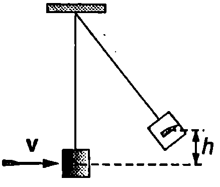
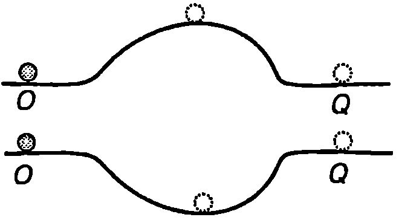
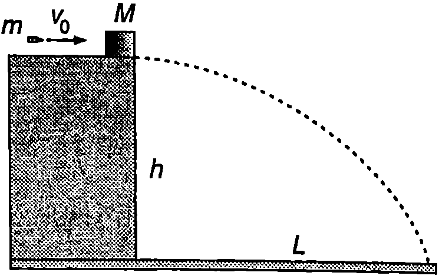

**Енергия на механична система**

Сумата от кинетичната и потенциалната енергия на всички материални точки от една механична система се нарича механична енергия на системата
$$E = E_k +W,
$$
където $\displaystyle E_k = \sum_{i=1}^N E_{ki}$ е кинетичната енергия, a $\displaystyle W = \sum_{i=1}^N W_i$ потенциалната енергия на системата ($E_{ki}$ е кинетичната енергия на $i$-тата частица, а $W_i$ е потенциалната и енергия на взаимодействие с всички останали ($N-1$ частици от системата). Законът за изменение на механичната енергия на една материална точка (уравнение \eqref{eq:9.10} на стр. 62) се обобщава за механична система:

**Изменението на механичната енергия $\Delta E$ на система от материални точки е равно на работата $A_\text{неконс.}$ на неконсервативните сили, действащи на системата.**
$$A_\text{неконс.} = \Delta E.
$$
Закон за запазване на механичната енергия

Да разгледаме затворена механична система, в която частиците си взаимодействат само с консервативни сили. Тогава $A_\text{неконс.} = 0$ и от уравнение \eqref{eq:11.2} следва, че $\Delta E = 0$ или
$$E = E_k + W = const.
$$
Уравнение \eqref{eq:11.3} изразява закона за запазване на механичната енергия, който гласи:

**Механичната енергия на затворена система, в която действат само консервативни вътрешни сили, не се изменя с течение на времето.**

В резултат на работата на вътрешни те консервативни сили става само непрекъснато превръщане на кинетична енергия в потенциална и обратно, докато пълната енергия се запазва.

**Превръщане на енергията**

Във всички реални макроскопични механични системи освен консервативни сили действат и неконсервативни сили например дисипативни сили на триене и съпротивление. Дисипативните сили извършват отрицателна работа ($A_\text{неконс.} < 0$) и съгласно с уравнение \eqref{eq:11.2} механичната енергия на системата намалява ($\Delta E < 0$). В резултат на работата на силите на триене става превръщане на механичната енергия в топлинна енергия триещите се тела се загряват.

Ще напомним, че класическата механика изучава движението на макроскопичните тела, т.е. на телата, които са изградени от огромен брой микрочастици (молекули и атоми). Атомите и молекулите са в състояние на непрекъснато вътрешно движение и взаимодействие, което обаче не се отчита от класическата механика. Затова енергията на една система от макроскопични тела може условно да се раздели на механична и немеханична енергия. Последната не зависи от скоростите и взаимното положение на телата от системата, а се определя от вътрешното движение и взаимодействие между градивните им частици. Съществуват различни видове немеханична енергия топлинна енергия, химична енергия, ядрена енергия, енергия на топлинното излъчване и др. От гледна точка на съвременната наука всички форми на немеханична енергия се свеждат до кинетична и потенциална енергия на микрочастици от различните структурни равнища на материята. Например топлинната енергия на идеален газ е сума от кинетичната енергия на хаотичното топлинно движение на молекулите на газа. Химичната енергия се определя от кинетичната енергия на градивните частици на атомите и молекулите (ядра и електронни обвивки) и потенциалната енергия на тяхното електрично взаимодействие. Ядрената енергия е сума от кинетичната и потенциалната енергия на градивните частици на атомните ядра (протони и неутрони), които взаимодействат с ядрени и електрични сили. Енергията на електромагнитното излъчване е сума от кинетичната енергия на светлинните кванти (фотоните), които могат да се разглеждат като микрочастици, движещи се със скоростта на светлината.

Процесите в неживата и в живата природа са свързани с непрекъснато преобразуване на енергията от един вид в друг. Преобразуване на енергията става както в космически мащаби, така и в отделните клетки на живите организми. В таблица 11.1 са дадени енергиите, свързани с някои процеси и явления.


\begin{table}

	\begin{tabular}{cc}
	Явление или процес& Енергия, J\\
	Големият взрив (раждане на Вселената)& $10^{68}$\\
	Енергия, която се отделя при избухване на свръхнова звезда& $10^{44}$\\
	Слънчева енергия, попадаща върху Земята за една година.& $5.10^{24}$\\
	Механична енергия на въртене на Земята, която се превръща в топлина за една година поради приливното триене& $10^{20}$\\
	Ураган& $10^{15}$\\
	Кинетична енергия на голям самолет& $10^9$\\
	Дневна дажба храна за възрастен човек& $10^7$\\
	Работа на човешко сърце за един тласък& $0,\!5$\\
	Електричен разряд на отделен неврон& $10{-10}$\\
	Енергия на една от връзките в молекула ДНК&$10^{-20}$\\
	\end{tabular}
```
Приблизителни стойности на енергията (в джаули), свързана с някои явления и процеси в макро- и микросвета.
```
	\label{table:11.1}
\end{table}

**Запазване на енергията**

Всички експериментални изследвания в различни области на физиката, химията и биологията показват, че енергия не се създава и не изчезва, а в резултат на различни взаимодействия тя само се преобразува от един вид в друг вид. В сила е общ закон за запазване на енергията:

**Пълната енергия (сумата от всички видове енергия) на една изолирана система не се изменя.**

Под изолирана система се разбира всяка съвкупност от макротела или микрочастици, която, подобно на затворена механична система, не е подложена на външни силови въздействия. Освен това изолираната система не обменя топлинна енергия или излъчване с околните тела. Вътре в системата могат да протичат различни процеси механични, химични, биологични и др., при които се извършват сложни превръщания на енергията от един вид в друг вид, но пълната енергия на системата не се променя. Този факт е надеждно проверен експериментално. Винаги, когато е било констатирано ``изчезване'' или ``раждане'' на енергия, впоследствие се е установявало, че експериментът не е проведен достатъчно прецизно или не е отчетена някаква неизвестна за онова време форма на енергията.

И така, законът за запазване на енергията е фундаментален закон, който е в сила не само в механиката, но и при всички други процеси в природата.

> [!question] Пример 11.1
Втора космическа скорост. Определете минималната начална скорост 2, наречена втора космическа скорост, с която ракета трябва да се изстреля от земната повърхност, за да преодолее гравитационното привличане на Земята и да се отдалечи в космическото пространство. Съпротивлението на въздуха не се отчита. Радиусът на Земята е $R_\text{З} = 6,\!38.10^6~\mathrm{m}$, а земното ускорение е $g = 9,\!8~\mathrm{m/s^2}$.
\end{psexample}
> [!note]- Решение
 Ще смятаме системата ракета Земя за затворена механична система, съставена от две тела (еднородно кълбо и материална точка), които взаимодействат с консервативни гравитационни сили. В този опростен модел пренебрегваме дисипативните сили на триене при движението на ракетата в земната атмосфера, както и влиянието на Слънцето и другите небесни тела. Тъй като масата на Земята $M_3$ е много по-голяма от масата на ракетата $m$ ($M_3\gg m$), ще смятаме, че центърът на масите на системата съвпада с центъра на Земята. Съгласно със закона за запазване на импулса центърът на масите на затворена система се движи праволинейно и равномерно или се намира в покой. Ще разглеждаме задачата в инерциална отправна система, в която центърът на масите, т.е. центърът на Земята, е в покой. Тогава кинетичната енергия на Земята е нула, а механичната енергия на системата е равна на сумата от кинетичната енергия на ракетата и потенциалната енергия на гравитационното взаимодействие на ракетата със Земята
$$E = \frac{mv^2}{2} - \frac{\gamma m M_3}{r}.$$


***Коментар.** Тъй като при взаимодействието на дадено тяло (ракета и др.) със Земята кинетичната енергия на Земята не се променя, често за краткост е по-удобно да говорим за механична енергия на отделното тяло, както това беше направено в \ref{sec:9*. Не трябва да забравяме обаче, че се има предвид механичната енергия на системата тяло-Земя.}

Съгласно с разглеждания модел в системата ракета-Земя не действат неконсервативни сили. Затова нейната механична енергия се запазва енергията в произволен момент е равна на началната енергия:

$$E = \frac{mv^2}{2} - \frac{\gamma m M_3}{r}= \frac{mv_0^2}{2} - \frac{\gamma m M_3}{R_3}.$$

В зависимост от големината на началната скорост $v_0$ енергията $E$ може да бъде както положителна, така и отрицателна или равна на нула. Ракетата ще се отдалечи на безкрайно голямо разстояние само ако $E\geq0$. Действително, при $r\to\infty$ потенциалната енергия е нула. Тъй като кинетичната енергия е винаги положителна, то $\displaystyle E = \frac{mv_\infty^2}{2}\geq 0$, където $v_\infty$ е скоростта на ракетата, когато е безкрайно отдалечена. Минималната скорост $v_0=v_2$, необходима за преодоляване на земното притегляне, съответства на случая $E=0$. Тогава ракетата се отдалечава на безкрайност, където скоростта й е нула ($v_\infty = 0$). От уравнението

$$E= \frac{mv_2^2}{2} - \frac{\gamma m M_3}{R_3} = 0$$

определяме втората космическа скорости

$$v_2 = \sqrt{\frac{2\gamma M_3}{R_3}} = \sqrt{2gR_3} = 11,\!2.10^3~\mathrm{\frac{m}{s}},$$

където сме отчели (вж. уравнение \eqref{eq:5.3} на стр.36), че земното ускорение е $\displaystyle g = \frac{\gamma M_3}{R_3^2}$.

> [!question] Пример 11.2
Дървено трупче с маса $M = 1990$ g
е закачено на неразтеглива нишка. Куршум с маса $m = 10$ g, който лети хоризонтално със скорост $v = 400$ m/s, се забива в трупчето и остава в него. На каква максимална височина ще се издигне трупчето след удара (Фиг. \ref{fig:11.1})?
\end{psexample}
> [!note]- Решение
 При удара трупчето и куршумът взаимодействат с неконсервативни сили, при което част от механичната енергия се превръща в топлинна енергия. Затова не можем да приложим непосредствено закона за запазване на механичната енергия: на максималната височина и потенциалната енергия на трупчето със заседналия в него куршум е по-малка от началната кинетична енергия на куршума. При удара обаче се запазва импулсът на механичната система трупче-куршум. От закона за запазване на импулса следва уравнението
$$mv = (M+m)u,$$
откъдето определяме скоростта $u$ на трупчето непосредствено след удара
$$u= \frac{M}{M+m}v =2~\mathrm{\frac{m}{s}}.$$

След удара механичната енергия на системата (трупче с куршум Земя) се запазва: кинетичната енергия, която трупчето със заседналия в него куршум има непосредствено след удара, се превръща в потенциална енергия, когато то достигне максималната си височина. От закона за запазване на енергията следва уравнението
$$(M+m)\frac{u^2}2 = (M+m)gh,$$
откъдето определяме височината $h$
$$h = \frac{u^2}{2g} = 0,\!2~\mathrm{m}.$$

> [!question] Пример 11.3
Топка от слонова кост е пусната от височина 6, отскача от пода и се издига на същата височина (Фиг. \ref{fig:11.2}). Проследете преобразуването на енергията по време на движението на топката.
\end{psexample}



```

```
	`Фиг. 11.1`


```

```
	`Фиг. 11.2`

> [!note]- Решение
 Топката и Земята образуват механична система от две тела, които взаимодействат с консервативни сили. При падането в резултат на работата на гравитационните сили гравитационната потенциална енергия се превръща в кинетична енергия и скоростта на топката нараства. По време на удара топката и пода взаимодействат с еластични сили. В първата част от удара топката и подът се деформират и кинетичната енергия се превръща в еластична потенциална енергия. През втората част от удара протича обратният процес еластичната потенциална енергия се превръща отново в кинетична енергия и топката отскача нагоре. При издигането кинетичната енергия се превръща в потенциална енергия. Механичната енергия на системата през цялото време остава постоянна.

**Задачи**

1. Три топки са хвърлени от покрива на сграда с еднаква по големина начална скорост. Едната топка е хвърлена вертикално нагоре, втората - вертикално надолу, а третата хоризонтално. Сравнете големините на скоростите, с които топките достигат земната повърхност. Съпротивлението на въздуха се пренебрегва.

2. Две топчета се хлъзгат без триене по гладки хоризонтални повърхности. В едната повърхност има вдлъбнатина, а в другата издатина със същата форма и размери (Фиг. \ref{fig:11.3}). В точките $O$ двете топчета имат еднакви скорости.

а) Сравнете скоростите на топчетата в точките О.

б) Пътят на двете топчета от $O$ до $Q$ в еднакъв. Еднакво ли е времето, за което те го изминават? Обяснете.

3. Топка е хвърлена вертикално нагоре с начална скорост $v_0$. На каква височина кинетичната енергия на топката намалява два пъти? Съпротивлението на въздуха се пренебрегва.

4. Вертолет, летящ със скорост $v$, пуска контейнер, който достига земната повърхност със скорост $2v$. На каква височина лети вертолетът? Съпротивлението на въздуха се пренебрегва.



```

```
	`Фиг. 11.3`



```

```
	`Фиг. 11.4`


5. Трупче с маса $M = 990$ g е в покой върху гладка хоризонтална опора, разположена на височина $h = 5$ m (Фиг. \ref{fig:11.4}). В трупчето попада куршум с маса $m = 10$ g, който лети хоризонтално със скорост $v_0 = 500$ m/s и остава вътре в трупчето. На какво разстояние от основата на опората ще падне трупчето?

6. Две еднакви частици, които взаимодействат с консервативни сили, образуват затворена механична система. В даден момент, когато частиците се намират на определено разстояние една от друга, едната частица е в покой, а другата се движи в положителната посока на оста $x$ със скорост $v_0$. След известно време двете частици се намират на същото разстояние една от друга, но големината на скоростта на едната частица е $v_0/2$. Определете големината на скоростта на другата частица и посоките на векторите на скоростта на двете частици.

7. Ракета е изстреляна от земната повърхност с начална скорост $v_0 = 15.10^3$ m/s. Колко ще бъде скоростта на ракетата, когато се отдалечи на много голямо разстояние от Земята? Съпротивлението на въздуха не се отчита.

В. Метеорит, който се движи в космическото пространство със скорост $v_0 = 2$ km/s, се захваща от гравитационното привличане на Луната. С каква скорост метеоритът ще падне върху лунната повърхност? Радиусът на Луната е $R_\text{л} = 1,\!74.10^6$ m, а ускорението на свободно падане на лунната повърхност е $g_\text{л} = 1,\!6~\mathrm{m/s^2}$.

9. Когато една звезда изчерпи ядреното си гориво, тя започва да се свива под действие на собствените си гравитационни сили и ако радиусът и стане по-малък от т.нар. гравитационен радиус $R_\text{гр}$, звездата се превръща в ``черна дупка''. Гравитационното привличане на ``черните дупки'' е толкова силно, че никаква частица, дори и светлинен лъч, не може да напусне тяхната повърхност. За ``черна дупка'' с радиус $R_\text{гр}$ втората космическа скорост е равна на скоростта на светлината $c = 3.10^8$ m/s. Представете си, че звезда, подобна на Слънцето (с маса $M = 2.10^{30}$ kg), се превръща в ``черна дупка''. Пресметнете нейния гравитационен радиус $R_\text{гр}$.
