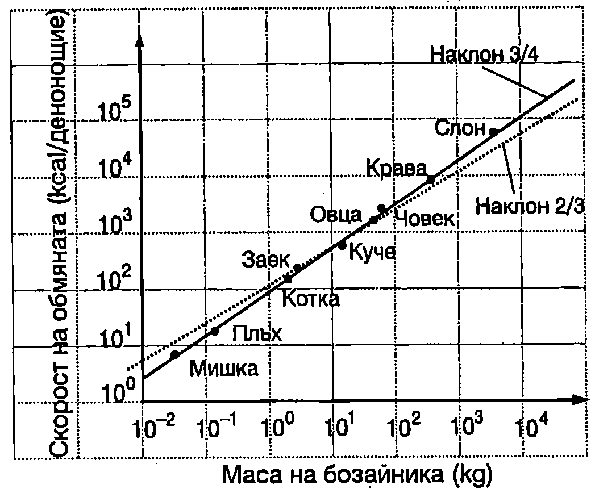

**Обмяна на веществата**

Живите организми получават енергия при окислителните процеси на разграждане на въглехидрати, белтъчини и мазнини. Различните въглеводороди, които се съдържат в тях, се свързват с кислорода и в резултат на реакцията се получава вода и въглероден диоксид, при което част от химичната енергия, запасена в молекулите на изходните вещества, се преобразува в кинетична енергия на молекулите продукти на реакцията. Например крайният резултат от окисляването на една молекула глюкоза може да се изрази с уравнението

$$\mathrm{C_6 H_{12} O_6 + 6 O_2 = 6 CO_2 + 6 H_2 O}.$$

При изгаряне на 1 g въглеводород се освобождава около 20 kJ химична енергия, по-голямата част от която се превръща в топлинна енергия, т.е. в кинетична енергия на хаотичното топлинно движение на молекулите. За да се осигурят нормални жизнени функции на организма, трябва да се поддържа определена скорост на окислителните процеси и на процесите на превръщане (изразходване) на енергията. Енергийните разходи на човека и топлокръвните животни в състояние на покой и топлинен комфорт (температура на околната среда 20°C) определят т. нар. *основна обмяна*. Мускулната работа значително увеличава разхода на енергия. Във физиологията се използват единиците за енергия калория (cal) и килокалория (1 kcal = 1000 cal). Връзката между единицата от SI за енергия джаул и килокалорията е:

$$1\ \mathrm{kcal} = 4187\ \mathrm{J}.$$

В таблица 12.1 е дадена скоростта, с която се изразходва енергията при някои човешки дейности. Използвана е възприетата в таблиците за хранене единица (kcal/min), както и съответстващата и мощност $P$ (1 J/s = 1 W). Увеличението $\Delta P$ на енергийните разходи над основната обмяна се нарича *работна добавка*. Само част от работната добавка, която ще означим с $\Delta P_1$, се преобразува в механична мощност. Отношението
\begin{table}

	\begin{tabular}{ccl}
	Вид дейност& kcal/min&P, W\\
	Спане& 1,2&84\\
	Седене и четене& 1,3&91\\
	Личен тоалет& 2,0&139\\
	Каране на кола& 2,8&195\\
	Обличане& 3,4&237\\
	Миене на пода& 4,9&341\\
	Плевене& 5,6&390\\
	Цепене на дърва& 7,5&522\\
	Футбол& 9,0&627\\
	Бягане (8 km/h)& 10&697\\
	\end{tabular}
```
Скорост на изразходване на енергията при различни човешки дейности (данните са за човек с маса 70 kg).
```
	\label{table:12.1}
\end{table}

$$\eta = \frac{\Delta P_1}{\Delta P}\cdot 100\%
$$
се нарича *коефициент на полезно действие* (КПД). Той показва каква част от отделената допълнителна химична енергия се превръща в механична работа (останалата част се превръща в топлина). При човека КПД е в границите от 16 до 25\%. За нетренираните хора той е нисък, а за някои професионални спортисти надминава 25\%. За кратко време физически трениран човек може да поддържа механична мощност (например при спринтово бягане) около 200 W. При конете тази мощност е около 700 800 W, откъдето е произлязла и единицата за мощност конска сила (horsepower (hp)):

$$1\ \mathrm{hp} = 750\ \mathrm{W}.$$

**Закон на Клайбер**

През 1932 г. Клайбер, съпоставяйки голям брой експериментални данни за скоростта $P$ на обмяната на веществата при бозайниците, установява, че тя зависи от масата $m$ на бозайника по закона
$$P = Km^\frac{3}{4}
$$
където $K$ е константа. В двойнологаритмичен мащаб законът на Клайбер \eqref{eq:12.2} се представя графично с права линия (Фиг. \ref{fig:12.1}).



```
Зависимост на скоростта на обмяната на веществата от масата за някои бозайници (закон на Клайбер).
```
	`Фиг. 12.1`


**Метод на подобието във физиологията**

Обмяната на веществата и превръщането на част от отделената химична енергия в механична работа се определя от сложни биохимични процеси в клетките на живите организми и е свързана с функционирането на голям брой различни мускули. Това прави количествената характеристика на тези процеси твърде сложна. Оказва се обаче, че с помощта на много прости модели и методи могат да се получат резултати, които добре обясняват някои от експериментално установените закономерности. Един от тези методи е методът на подобието, който се прилага във физиологията. Ще се спрем на неговия най-елементарен вариант и ще го използваме за установяване на зависимостта между отделената механична мощност $P_\text{м}$ и масата $m$ на бозайниците.

Същността на метода е в това, че всички бозайници се приемат за геометрично подобни. В най-простия вариант на метода се смята, че линейните размери на всички органи (дължина на крайниците, дължина на мускулите и т.н.) са правопропорционални на някаква характерна за даденото животно дължина $L$. Всички сечения и повърхности (повърхност на кожата, напречно сечение на различните мускули и т.н.) са правопропорционални на квадрата на характерната дължина ($\propto L^2$). Обемът $V$ на органите е правопропорционален на $L^3$. Приема се още, че масата $m$ на животното и на всеки негов орган са правопропорционални на обема на животното или на обема на съответния орган, т.е. $m\propto V\propto L^3$. Ако знаем масите на две животни, можем да пресметнем отношението на техните характерни дължини. Например за мишка с маса 0,030 kg и кон с маса 300 kg:
$$L_\text{кон}/L_\text{мишка} = (300\ \mathrm{kg}/0,\!030\ \mathrm{kg})^{1/3} = 21,\!5.$$

Такова е например приблизително отношението на дължините на крайниците на коня и мишката.

Как скоростта на обмяна зависи от характерната дължина $L$? За да отговорим на този въпрос, ще използваме един интересен факт. Наблюденията показват, че независимо от голямата разлика в размерите на различните бозайници, те са в състояние да скочат приблизително на еднаква височина $h$. При скок от място отначало животното (същото се отнася и за човека) прикляка, при което центърът на масите $C$ се понижава на разстояние в от нормалното му положение. След това в резултат на мускулното усилие тялото се движи ускорително, центърът на масите се издига и достига скорост $v$, когато тялото е изправено. После тялото се откъсва от земната повърхност и центърът на масите достига максимална височина $h$ (над нормалното си положение), където скоростта му е нула. Съгласно със закона за изменение на енергията
$$E = mg(d + h);
$$
$$\frac{mv^2}{2} = mgh,
$$
където $E$ е частта от отделената при обмяната химична енергия, която в резултат на механичната работа на мускулите е преобразувана в потенциална енергия $mg(h + d)$. Ще смятаме, че $h\gg d$ и ще пренебрегнем $d$ в уравнение \eqref{eq:12.3}. Тогава
$$E \approx mgh.
$$
Ще отбележим, че направеното приближение е добро за дребните животни и твърде грубо за едрите. Например при човека $d \approx h/2$. Тъй като за всички животни височината $h$ на скока е приблизително еднаква, от уравнение \eqref{eq:12.4} следва, че те се отделят от земята приблизително с еднаква скорост $v$. Да означим с $\tau$ времето, през което мускулите извършват работа. Ще смятаме, че за време $\tau$ центърът на масите C се движи равноускорително (без начална скорост) и достига скорост $v$, след като измине път $d$. Средната скорост на C е $v/2$, а времето е $\tau = d/(v/2)$. Тъй като $v= const$, а съгласно с възприетия модел разстоянието $d$ е правопропорционално на характерната дължина $L$, тогава $\tau = c_1 L$, където $c_1$ е константа. Отделената при скока механична мощност е
$$P_M = \frac{E}{\tau} = \frac{mgh}{c_1 L} = \frac{c_2 m}{L},
$$
където $c_2 = gh/c_1$ е константа. Съгласно с модела $L = c_3 m^{1/3}$ ($c_3$ е друга константа) и уравнение \eqref{eq:12.6} добива вида
$$P_M = \frac{c_2 m}{c_3 m^{1/3}} = c m^{\frac{2}{3}}\ (c =\frac{c_2}{c_3} = const)
$$

Както беше отбелязано, в механична мощност се преобразува част от отделената за единица време при обмяната на веществата химична енергия $P$ ($P\propto P_\text{м}$). Затова може да се запише анологично на \eqref{eq:12.7} уравнение за скоростта на обмяната $P$
$$P = K m^{\frac{2}{3}}.
$$
На Фиг. \ref{fig:12.1} зависимостта \eqref{eq:12.8} е представена с пунктирана линия. Сравняването на получения резултат със закона на Клайбер показва, че използваният елементарен модел задоволително обяснява зависимостта $P(m)$. Както ще видим в \ref{sec:23}, моделът може да се усъвършенства, като се използват две характерни дължини, свързани по определен начин, и да се получи същият степенен показател (3/4), както в закона на Клайбер.

**Бягане**

При скок на височина в резултат на работата на мускулите част от отделената при обмяната на веществата химична енергия се преобразува в механична енергия (отначало кинетична, а след това потенциална). Когато обаче спортист бяга с постоянна скорост по хоризонтална писта, механичната му енергия е постоянна. Защо тогава мускулите трябва непрекъснато да извършват механична работа, за да се поддържа постоянна скоростта на бягане? Бягането може да се разглежда като последователност от подскоци. При оттласкването от пистата мускулите извършват работа за ускоряване на краката и трупа и повдигане на центъра на тежестта на тялото. Тази механична енергия след това се преобразува в топлинна енергия при приземяването. Силите, които ускоряват и забавят различните части от тялото, се изменят по сложен начин и непосредственото прилагане на законите на механиката за количествен анализ на процеса на бягане е невъзможно. Затова се прилагат различни опростени модели. Според един такъв модел, бегачът действа на настилката с резултантна сила $F$, насочена по посока на движението, чиято големина се изменя с течение на времето, но не може да надминава определена максимална стойност $F_{\max}$. Мощността на тази сила е $P_\text{м} = Fv$, където $v$ е моментната скорост. Преобразуването на механичната енергия в топлинна енергия се извършва в резултат на действието на дисипативна сила, насочена в противоположна на скоростта посока, чиято големина се приема за правопропорционална на големината на скоростта: $f = cv$ ($c = const$). Бегачът може отначало да изразходва определен енергиен резерв $E_0$. След като обаче този резерв се изчерпи, скоростта на бягане се ограничава от скоростта $\sigma$, с която постъпва допълнителна енергия, отделена при обмяната на веществата (приема се, че $\sigma = const$). В рамките на този модел математикът Келър определя оптималната сила $F$, с която спортистът трябва да действа на настилката, за да пробяга дадено разстояние за най-кратко време. След това съпоставя пресметнатите времена със световните рекорди за мъже на бягане на различни разстояния и определя стойностите на четирите константи на модела: $F_{\max}$, $c$, $E_0$ и $\sigma$. Накрая Келър използва получените стойности на четирите константи, за да пресметне най-добрите времена за пробягване на други разстояния. Оказва се, че получените от него стойности са много близки до регистрираните световни рекорди.
