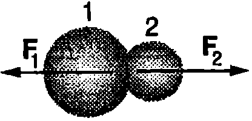
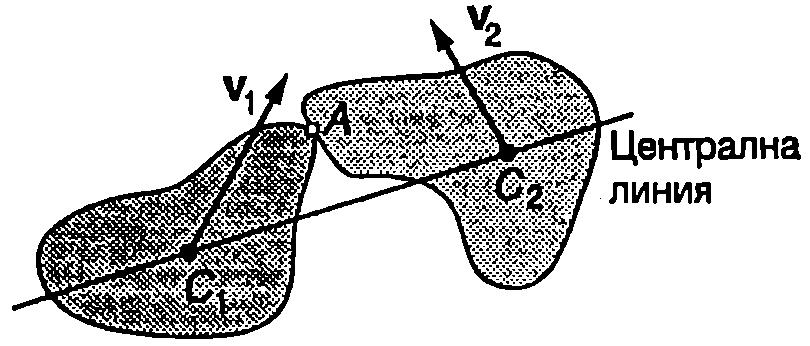
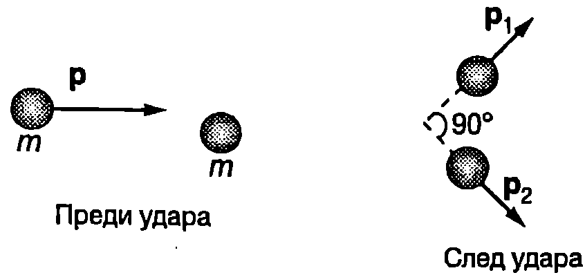
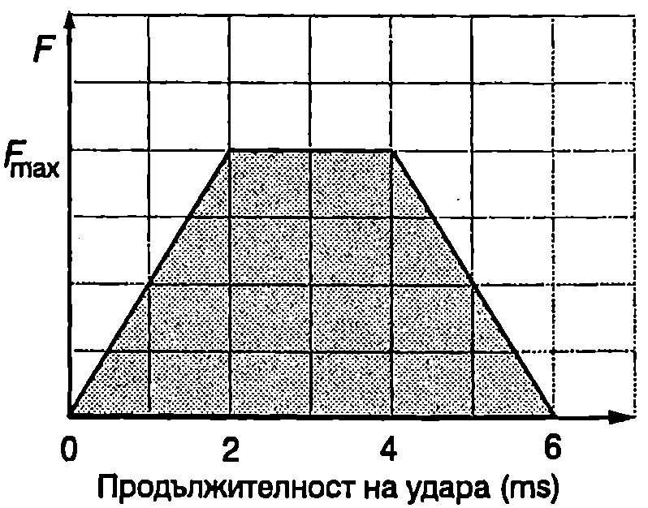

Ударът между макроскопични тела, както и процесите на разсейване, разпадане или сливане на атомни ядра или елементарни частици, се извършват за много кратко време. Силите на взаимодействие между телата (частиците) по време на удара обикновено са много по-големи от външните сили, които им действат. Затова действието на външните сили по време на удара може да се пренебрегне и двете тела да се разглеждат като затворена система, за която са в сила законите за запазване на енергията и импулса. Когато след удара общата кинетична енергия на двете тела не се изменя, ударът се нарича абсолютно еластичен. Ударът е нееластичен (или само частично еластичен), ако част от кинетичната енергия, която са имали телата преди удара, се преобразува във вътрешна енергия. Ако след удара телата се движат с еднаква скорост (като едно съставно тяло), ударът е абсолютно нееластичен.

**Ударен импулс**

Съгласно с третия принцип на механиката две тела при удар си взаимодействат с равни по големина и обратни по посока сили: $\vec F_1 = -\vec F_2$, където $\vec F_1$ е силата, която действа на тялото 1, а $\vec F_2$ -- на тялото 2 (Фиг. \ref{fig:13.1}). По време на удара силите на взаимодействие се изменят по сложен начин (Фиг. \ref{fig:13.2}): отначало нарастват и достигат максимална стойност, когато двете тела са максимално деформирани, след това намаляват и стават равни на нула в края на удара. Да означим с $\tau$ времето на удара, $\tau = t_\text{к} - t_\text{н}$, където $t_\text{н}$ и $t_\text{к}$ са съответно началният и крайният момент на удара. Импулсът на променливата сила $\vec F_1$ за безкрайно малкия интервал от време от е $d\vec J = \vec F_1 dt$. Импулсът на силата $\vec F_1$ за цялото време на удара е



```

```
	`Фиг. 13.1`


```

```
	`Фиг. 13.2`


$$\vec J = \int_{t_\text{н}}^{t_\text{к}} \vec F_1 dt.
$$
Величината $\vec J$ се нарича импулс на ударната сила или накратко ударен импулс. Големината на ударния импулс графично се задава от площта, заградена от графиката на функцията $F_1(t)$ и абсцисната (ос сивата площ на Фиг. \ref{fig:13.2}).

В реалния случай, ако в началото на удара контактът между двете тела е само в една точка, поради деформациите контактната площ нараства и се изменя по сложен начин по времето на удара. В телата също така се разпространяват механични вълни. Освен това контактуващите повърхности се приплъзват една спрямо друга и едновременно с това телата изминават известно разстояние по време на удара. Анализът съществено се опростява, ако използваме следния модел, наречен импулсно приближение: Ще смятаме, че времето на удара $\tau$ е безкрайно малко, а силите на взаимодействие - безкрайно големи. Ще поставим освен това условието да се изпълнява равенство \eqref{eq:13.1}, т.е. безкрайно голямата ударна сила за безкрайно малкия интервал от време $\tau$ да има краен импулс, равен на действителния ударен импулс $\vec J$. Контактът по време на удара се осъществява само в една точка, а еластичните деформации при този опростен модел на удара са локализирани в безкрайно малки области от двете тела, разположени непосредствено около мястото на контакта. Според импулсното приближение изменението на скоростите на телата става мигновено и те не се преместват по време на удара. Освен това се пренебрегва действието на външните сили, тъй като за безкрайно малкия интервал от време $\tau$ техният импулс също е безкрайно малък. В много от важните за практиката случаи времето на удара $\tau$ между твърди тела (например стоманени топчета) действително е много малко -- от порядъка на 0,2 - 1 ms и импулсното приближение достатъчно точно описва такива удари.



```
Кос нецентрален удар между две твърди тела.
```
	`Фиг. 13.3`


Да означим с $A$ точката, в която се извършва контактът (Фиг. \ref{fig:13.3}). Линията, съединяваща центровете на масите $C_1$ и $C_2$ на двете тела, се нарича *централна линия*. Когато точка $A$ лежи върху централната линия, ударът се нарича *централен*, в противен случай той е *нецентрален*. Когато скоростите на постъпателно движение на двете тела (скоростите на центровете на масите) са насочени в направление на централната линия, ударът е челен (пряк), а ако са под ъгъл спрямо централната линия - кос (непряк). На Фиг. \ref{fig:13.3} е показан кос нецентрален удар между две твърди тела.

Тъй като в импулсно приближение действието на външните сили по време на удара се пренебрегва, съгласно с втория принцип на механиката изменението на импулса на всяко едно от двете тела по време на удара е равно на импулса на ударната сила, която му действа:
$$m_1 \vec u_1 - m_1 \vec v_1 = \vec J;
$$
$$m_2 \vec u_2 - m_2 \vec v_2 = -\vec J,
$$
където $m_1$ и $m_2$ са масите на двете тела, $\vec v_1$ и $\vec v_2$, $\vec u_1$ и $\vec u_2$ са скоростите на центровете на масите на телата съответно непосредствено преди удара и непосредствено след удара. $\vec J$ и $-\vec J$ са импулсите на ударните сили на взаимодействие, които съгласно с третия принцип на механиката са равни по големина и противоположни по посока. Уравнения \eqref{eq:13.2} и \eqref{eq:13.3} могат да се обединят в едно уравнение, което изразява закона за запазване на импулса на системата от две тела
$$m_1 \vec v_1 + m_2 \vec v_2 = m_1 \vec u_1 + m_2 \vec u_2.
$$
**Абсолютно еластичен удар**

Ще се ограничим с разглеждането на абсолютно еластичен удар между гладки тела с форма на сфера (например билярдни топки), които се движат постъпателно (без да се въртят). Ударът между сфери винаги е централен допирната точка $A$ лежи върху централната линия. Ще смятаме, че при удара не възникват сили на триене и топките си взаимодействат само със сили на нормална реакция, които са насочени перпендикулярно на тяхната повърхност, т.е. успоредно на централната линия. В направление на централната линия са насочени и съответните ударни импулси $\vec J$ и $-\vec J$ (Фиг. \ref{fig:13.4}). Тъй като линията на действие на ударните сили преминава през центъра на масите на топките, те не пораждат въртеливо движение и след удара топките ще продължат да се движат само постъпателно.

При абсолютно еластичен удар се запазва кинетичната енергия на системата от две тела
$$\frac{m_1 v_1^2}{2} + \frac{m_2 v_2^2}{2} = \frac{m_1 u_1^2}{2} + \frac{m_2 u_2^2}{2}
$$
където $m_1$ и $m_2$ са масите на двете топки, $\vec v_1$ и $\vec v_2$ са техните скорости преди удара, а $\vec u_1$ и $\vec u_2$- след удара. Ще преобразуваме уравнение \eqref{eq:13.5} във вида

$$m_1(\vec u_1 - \vec v_1).(\vec u_1 +\vec v_1) + m_2( \vec u_2 - \vec v_2 ). (\vec u_2 + \vec v_2) = 0.$$

Съгласно с уравнения \eqref{eq:13.2} и \eqref{eq:13.3} $m_1 (\vec u_1 - \vec v_1) = \vec J$ и $m_2(\vec u_2- \vec v_2) = -\vec J$. След заместване в горното уравнение и прегрупиране на членовете получаваме
$$\vec J\cdot( (\vec v_1 - \vec v_2) + (\vec u_1 - \vec u_2) ) = 0,
$$


```

```
	`Фиг. 13.4`


където $\vec v_1 - \vec v_2$ е относителната скорост на двете топки непосредствено преди удара, а $\vec u_1 - \vec u_2$ е относителната им скорост непосредствено след удара. Ако изберем декартова координатна система, чиято ос $x$ да е насочена по посока на ударния импулс $\vec J$, от уравнение \eqref{eq:13.6} следва, че проекциите върху оста $x$ на относителните скорости на двете топки преди и след удара са равни по големина и имат противоположни знаци
$$v_{1x} - v_{2x} = -(u_{1x} - u_{2x}).
$$
В избраната координатна система ударните импулси $\vec J$ и $-\vec J$ нямат $y$-компоненти. Тогава от уравнения \eqref{eq:13.6} и \eqref{eq:13.7} следва, че
$$u_{1y} = v_{1y} \text{ и } u_{2y} = v_{2y}.
$$
При пряк удар скоростите $\vec v_1$ и $\vec v_2$ са насочени в направление на централната линия, т.е. по оста $x$. Тогава $u_{1y} = v_{1y} = 0$ и $u_{2y} = v_{2y} = 0$, т.е. след удара двете топки ще се движат в същото направление, в което са се движили преди удара (по оста $x$). Тяхната относителна скорост също е насочена по оста $x$. От уравнение \eqref{eq:13.7} следва, че относителната скорост само променя посоката си на противоположната, а големината и не се изменя при удара. Това означава, че ако разглеждаме прекия удар в отправна система, свързана с една от топките, след удара втората топка се отдалечава със същата скорост, с която се е приближавала към неподвижната първа топка преди удара.

> [!question] Пример 13.1
Топка с маса $m_1$, която се движи със скорост $\vec v_1$, се удря в неподвижна топка с маса $m_2$. Ударът е челен и абсолютно еластичен (Фиг. \ref{fig:13.5}). Определете:

а) скоростите на двете топки след удара:

6) кинетичните енергии на двете топки след удара:

в) каква част $\eta$ от кинетичната енергия на първата топка се предава на втората топка в резултат на удара.
\end{psexample}


```

```
	`Фиг. 13.5`

> [!note]- Решение
 а) При $\vec v_2$ = 0 уравнение \eqref{eq:13.7} за относителните скорости и проекцията върху оста $x$ на векторното уравнение \eqref{eq:13.4}, изразяващо закона за запазване на импулса, добиват вида

$$v_1 = u_{2x} - u_{1x}\text{ и }m_1 u_{1x} + m_2 u_{2x}$$

където сме отчели, че $v_{1x} = v_1$ и $v_{2x} v_2=0$.

*Коментар. Записването на векторно уравнение по компоненти обикновено се извършва по два начина: 1. Когато посоката на даден вектор (и на неговите компоненти) е предварително известна, за краткост в съответните уравнения компонентите директно се изразяват чрез модула на вектора. 2. Когато посоките на векторите не са известни предварително, компонентите им се записват в общ вид. Често е удобно двата начина на записване да се комбинират (както в разглежданата задача): компонентите на Векторите с предварително известни посоки се изразяват чрез модулите на векторите, а компонентите на останалите вектори се записват в общ вид.*

От горните две уравнения определяме $x$-компонентите на скоростите на двете топки след удара

$$u_{1x} = \frac{m_1 - m_2}{m_1 + m_2} v_1;\quad u_{2x} = \frac{2m_1}{m_1 + m_2} v_1.$$

От уравнението за $u_{2x}$ следва, че $u_{2x} > 0$: след удара втората (неподвижната) топка се движи в положителната посока на оста $x$, т.е. в посоката, в която се е движила първата топка преди удара. В зависимост от масите, посоката на скоростта на първата топка след удара може да е различна. При $m_1 > m_2$ от уравнението за $u_{1x}$ следва, че $u_{1x} > 0$, т.е. след удара първата топка продължава да се движи в положителната посока на оста $x$. Ако обаче нейната маса е по-малка от масата на неподвижната топка ($m_1 < m_2$), тогава $u_{1x} < 0$, което означава, че след удара първата топка се движи в противоположната посока връща се обратно. В частния случай на еднакви маси $m_1 = m_2$: $u_{1x}=0$ и $u_{2x} = v_1$. Този резултат е добре известен например на играчите на билярд когато билярдна топка удари челно друга неподвижна топка, тя остава неподвижна на нейното място, а ударената топка започва да се движи в същата посока със същата скорост.

б) Кинетичните енергии на двете топки след удара са

$$E_{K1} = \frac{m_1 u_{1x}^2}{2} = \frac{(m_1 - m_2)^2}{(m_1 + m_2)^2} E_{K0} ;$$

$$E_{K2} = \frac{m_2 u_{2x}^2}{2} = \frac{4 m_1 m_2}{(m_1 + m_2)^2} E_{K0} ;$$

където $\displaystyle E_{K0} = \frac{m_1 v_1^2}{2}$ е кинетичната енергия на топката с маса $m_1$ преди удара.

в) Частта от кинетичната енергия, която неподвижната топка получава при удара, е

$$\eta = \frac{E_\text{к2}}{E_\text{к0}} = \frac{4 m_1 m_2}{(m_1 + m_2)^2}$$

Ще се спрем на някои гранични и частни случаи:

1. $m_2 \gg m_1$. Пренебрегваме $m_1$ в знаменателя на уравнението за $\eta$ и получаваме $\displaystyle \eta = \frac{4m_1}{m_2}$. Граничният случай на безкрайно голяма маса $m_2$ на неподвижната топка съответства на удар в стена. Тогава $\eta = 0$, т.е. стената не получава кинетична енергия.

2. $m_2 = m_1$. В този случай $\eta = 1$, т.е. при удара движещата се топка предава цялата си кинетична енергия на другата топка и остава неподвижна.

3. $m_1 \gg m_2$. Пренебрегваме $m_2$ в знаменателя на уравнението за $\eta$ и получаваме $\displaystyle \eta = \frac{4m_2}{m_1}$.

> [!question] Пример 13.2
Докажете, че след непряк абсолютно еластичен удар между две еднакви билярдни топки, едната от които първоначално е била в покой, топките започват да се движат под прав ъгъл една спрямо друга (вж. корицата на учебника).
\end{psexample}
> [!note]- Решение
 Да означим с $\vec p$ импулса на движещата се топка преди удара, а с $\vec p_1$ и $\vec p_2$ импулсите на двете топки след удара (Фиг. \ref{fig:13.6}). От закона за запазване на импулса на системата от две топки, $\vec p = \vec p_1 + \vec p_2$, следва, че трите вектора $\vec p$, $\vec p_1$ и $\vec p_2$ трябва да образуват триъгълник (Фиг. \ref{fig:13.7}). Изразяваме кинетичната енергия



```

```
	`Фиг. 13.6`


$$E = \frac{mv^2}{2} = \frac{(mv)^2}{2m} = \frac{p^2}{2m}$$

Записваме уравнението, изразяващо закона за запазване на енергията при разглеждания случай на абсолютно еластичен удар чрез импулса


```

```
	`Фиг. 13.7`


$$\frac{p^2}{2m} = \frac{p_1^2}{2m} + \frac{p_2^2}{2m},$$

откъдето следва, че $p^2 = p_1^2 + p_2^2$. Следователно за дължините на страните на триъгълника от Фиг. \ref{fig:13.7} е в сила питагоровата теорема, т.е. триъгълникът в правоъгълен (векторите $\vec p_1$ и $\vec p_2$ са взаимно перпендикулярни).

**Абсолютно нееластичен удар**
След абсолютно нееластичен удар двете тела се движат като едно цяло (Фиг. \ref{fig:13.8}). Импулсът на системата, както при абсолютно еластичен удар, се запазва, но част от кинетичната енергия се губи, т.е. в резултат на пластичните деформации на телата при удара тя се преобразува във вътрешна енергия. Скоростта $\vec u$ на съставното тяло след удара можем да определим от закона за запазване на импулса, като положим в уравнение \eqref{eq:13.4} $\vec u_1  = \vec u_2 = \vec u$. Тогава
$$\vec u = \frac{m_1 \vec v_1 + m_2 \vec v_2}{m_1 + m_2}.
$$
Ще разгледаме случая, когато преди удара тялото с маса $m_2$ е в покой ($\vec v_2 = 0$). След удара двете тела се движат със скорост $\displaystyle \vec u = \frac{m_1}{m_1 + m_2} \vec v_1$. Кинетичната енергия на системата от две тела преди удара е $E_\text{к0} = \frac{m_1 v_1^2}{2}$, а след удара е $E_\text{к} = \frac{(m_1+m_2) u^2}{2}$.

След заместване на $u$ получаваме


```
Абсолютно нееластичен удар.
```
	`Фиг. 13.8`


$$E_K = \frac{m_1}{m_1 + m_2} E_{K0}.
$$
Изменението на кинетичната енергия в резултат на удара $-\Delta E$ (тъй като енергията намалява, $\Delta E < 0$ и $-\Delta E > 0$) e

$$-\Delta E_\text{к} = E_\text{к0} - E_\text{к} = \frac{m_2}{m_1 + m_2} E_\text{к}$$

Отношението на преобразуваната (изгубена) при удара енергия към началната кинетична енергия на системата от две тела е
$$\frac{-\Delta E_K}{E_{K0}} = \frac{m_2}{m_1 + m_2}.
$$
От това уравнение могат да се направят следните изводи:

1. Ако масата на движещото се тяло в много по-голяма от масата на неподвижното тяло ($m_1 \gg m_2$), загубата на кинетична енергия при удара е малка ($\displaystyle \frac{-\Delta E_\text{к}}{E_\text{к0}} \ll 1$).

2. При голяма маса на неподвижното тяло и малка маса на удрящото тяло ($m_2\gg m_1$) почти цялата кинетична енергия се преобразува във вътрешна енергия $\displaystyle \frac{-\Delta E_\text{к}}{E_\text{к0}} \approx 1$.

Зависимостта \eqref{eq:13.11} за преобразуване на енергията при абсолютно нееластичен удар се отчита например от каратистите. За да се достигне максимално поражение на уязвимото място на противника, ударът трябва да се нанесе така, че както началната кинетична енергия $E_\text{к0}$ така и отношението $\displaystyle \frac{-\Delta E_\text{к}}{E_\text{к0}}$ да са големи. Ако каратистът приведе в движение цялото си тяло, тогава кинетичната му енергия е голяма, но ефектът от удара е малък, защото само малка част от тази кинетична енергия в резултат на работата на ударните сили се преобразува в енергия на пластичните деформации, т.е. предизвиква поражение. Освен това след удара движението не се прекратява, което може да доведе до загуба на равновесие, особено ако противникът успее частично да избегне удара. Затова каратистите рядко използват тялото, за да увеличат силата на удара. Те привеждат в движение главно предната част на ръката и нанасят удара в момента, когато скоростта й е максимална. Нейната маса е малка, а скоростта достига 6-7 m/s. Тогава поразяващият ефект е максимален, защото практически цялата кинетична енергия се използва за предизвикване на деформации.

**Задачи**

1. На Фиг. \ref{fig:13.9} с приближение е показана зависимостта от времето на ударната сила, която възниква при удара на топка за тенис с маса $m = 60$ g в стена. Началната скорост на топката е $v = 30$ m/s и е насочена перпендикулярно към стената. След удара топката отскача в противоположната посока със същата по големина скорост. Определете максималната стойност на ударната сила $F_{\max}$

2. Частица с импулс $\vec p_1 = p_0 \vec i + 2\vec p_0 \vec j$ се удря и се слива с частица с импулс $\vec p_2 = 2p_0 \vec i + p_0 \vec j$. В каква посока се движи получената след сливането нова частица?

3. Поток от неутрони попада върху мишена, съдържаща въглерод. Ударите между неутроните и неподвижните атоми на въглерода са преки и абсолютно еластични.

а) Определете отношението $E_\text{к1}/E_\text{к0}$ на кинетичната енергия на неутроните след удара към тяхната начална кинетична енергия $E_\text{к0}$.

б) След колко такива удара енергията на един неутрон ще намалее $10^6$ пъти?

4. Две еднакви оловни топки, всяка с маса $m = 0,\!1$ kg, се движат с еднакви по големина скорости $v_1 = v_2 = 5$ m/s, чиито посоки са взаимно перпендикулярни. Двете топки претърпяват абсолютно нееластичен удар. Определете:

а) скоростта $u$ на топките след удара.

б) скоростта на центъра на масите на системата от две топки преди удара и след удара.

в) отделеното при удара количество топлина.



```

```
	`Фиг. 13.9`
