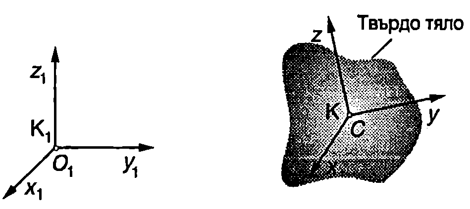
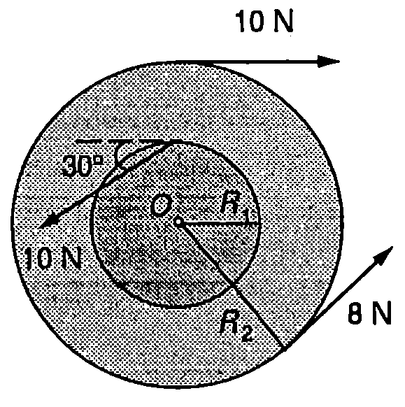
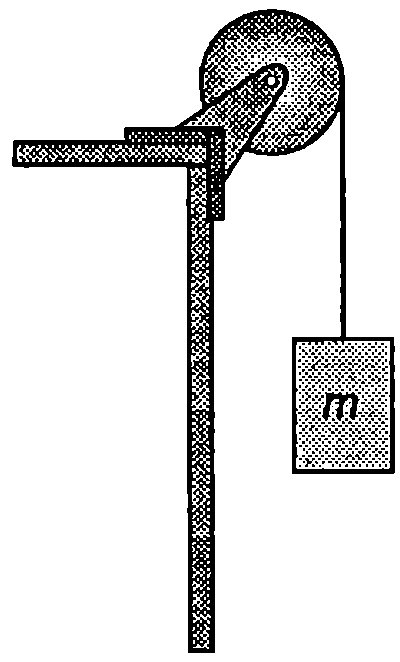

**Ъглова скорост**

За описване движението на твърдо тяло ще използваме две отправни системи: инерциална отправна система $K_1$ и неинерциална отправна система $K$, чиито оси са неподвижно свързани с твърдото тяло. Началото на $K$ може да се избере произволно, дори извън тялото. В повечето случаи обаче е най-удобно то да съвпада с центъра на масите $C$ на тялото (Фиг. \ref{fig:15.1}). Всички точки от тялото по определение са в покой спрямо $K$. Произволно движение на отправната система $K$ (т.е. на тялото) може да се представи като сума от две движения:

1. *Постъпателно движение*, при което координатните оси на $K$-системата не променят ориентацията си в пространството. За описване на постъпателното движение е достатъчно да се определи траекторията на началото $C$.

2. *Въртене* на $K$ с ъглова скорост $\vec\omega$ около моментна ос, минаваща през $C$.

Тъй като всички точки от тялото са в покой спрямо отправната система $K$, абсолютната скорост $\vec v_a$ на произволна точка $P$ от тялото е равна на нейната преносна скорост (вж. уравнение \eqref{eq:6.2} на стр. 43)
$$\vec v_a = \vec v_e = \vec v_C + \vec\omega\times\vec r,$$
където се скоростта на началото $C$ на $K$, а вторият член изразява преносната скорост на точка $P$, свързана с въртенето на $K$-системата.

**Теорема.** Ъгловата скорост $\omega$ не зависи от избора на началото на неинерциалната отправна система $K$, чиито оси са неподвижно свързани с твърдото тяло.



```

```
	`Фиг. 15.1`


```

```
	`Фиг. 15.2`


**Доказателство.** Разглеждаме две неинерциални отправни системи - $K$ и $K'$, чиито оси са неподвижно свързани с твърдото тяло. Началото на $K$ е в центъра на масите $C$, а на $K'$ - в произволна точка $O$ с радиус-вектор $\vec r_O$ (спрямо $K$). Да допуснем, че в даден момент $K$ се върти с ъглова скорост $\vec\omega$, а $K'$ се върти с друга ъглова скорост $\vec\omega'$. Тогава от уравнение \eqref{eq:15.1} абсолютната скорост на произволна точка $P$ от тялото може да се изрази по два начина (Фиг. \ref{fig:15.2}):
$$\vec v_a = \vec v_c + \vec\omega\times \vec r;
$$
$$\vec v_a = \vec v_O + \vec\omega' \times \vec r'$$
Съгласно с уравнение \eqref{eq:15.1} абсолютната скорост на точка $O$ е
$$\vec v_O = \vec v_C + \vec\omega \times \vec r_O.$$
Заместваме $\vec v_O$ от уравнение \eqref{eq:15.4} в \eqref{eq:15.3} и приравняваме десните страни на уравнения \eqref{eq:15.2} и \eqref{eq:15.3}. Получаваме
$$\vec\omega \times (\vec r - \vec r_0) = \vec\omega' \times \vec r'.$$
От Фиг. \ref{fig:15.2} се вижда, че $\vec r - \vec r_O =\vec r'$. Следователно $\vec\omega\times\vec r' =\vec\omega'\times\vec r'$ или
$$(\vec\omega - \vec\omega') \times \vec r'.$$

Тъй като точка $P$ е избрана произволно (произволен $\vec r'$), уравнение \eqref{eq:15.6} има решение само ако $\vec\omega - \vec\omega' = 0$, т.е. при $\vec\omega = \vec\omega'$.

С това теоремата е доказана. От нея следва, че в даден момент от времето всички отправни системи, чиито оси са неподвижно свързани с твърдото тяло, се въртят с еднаква ъглова скорост $\vec\omega$, т.е. техните моментни оси на въртене са успоредни една на друга и въртенето се извършва с еднаква по големина ъглова скорост. Скоростта на постъпателно движение на моментните оси на въртене е различна - тя е равна на абсолютната скорост на точката, в която е избрано началото на съответната неинерциална отправна система. Еднаквата ъглова скорост на всички неинерциални отправни системи, чиито координатни оси са неподвижно свързани с твърдото тяло, дава възможност да придадем на ъгловата скорост абсолютен характер, т.е. да не се уточнява въртенето на коя от свързаните с тялото неинерциални отправни системи се разглежда и да се нарече $\vec\omega$ *ъглова скорост на въртене на твърдото тяло*.


**Въртене на твърдо тяло около неподвижна ос**

Ще разгледаме частния случай, когато ъгловата скорост $\vec\omega$ на твърдо тяло не променя направлението си с течение на времето, а началото О на една от неинерциалните отправни системи, чиито оси са неподвижно свързани с твърдото тяло, остава в покой спрямо дадена инерциална отправна система $K_1$. Тогава можем да изберем началото на $K_1$ също в точка $O$, а осите $z_1$ и $z$ на двете отправни системи да са успоредни на $\vec\omega$ (Фиг. \ref{fig:15.3}). Тъй като по условие направлението на вектора $\vec\omega$ не се изменя, осите $z$ и $z_1$ ще съвпадат през цялото време на движението ($\vec\omega$ може да се изменя по големина и да сменя посоката си на противоположната). Такова движение на твърдото тяло се нарича въртене около неподвижната ос $z$.

Записваме уравнението за моментите \eqref{eq:14.10} спрямо неподвижната точка $O$
$$\frac{d\vec L}{dt} = \vec M,
$$
където $\vec L$ е моментът на импулса на тялото ($\vec L$ е векторната сума от моментите на импулса на всички материални точки, на които мислено може да се разбие твърдото тяло), а $\vec M$ е векторната сума от моментите на всички външни сили, действащи на твърдото тяло. Проекцията на векторното уравнение \eqref{eq:15.7} върху оста на въртене $z$ e


```

```
	`Фиг. 15.3`


$$\frac{d L_z}{dt} = M_z,
$$
където $L_z$, и $M_z$ са $z$-компонентите на векторите $\vec L$ и $\vec M$.

=Mz

Да разгледаме малък елемент от тялото (материална точка) с маса $m_i$, радиус-вектор $\vec r_i$, скорост $\vec v_i$ и момент на импулса $\vec L_i = m_i \vec r_i \times \vec v_i$ (Фиг. \ref{fig:15.3}). Проекцията на вектора $\vec L_i$ върху оста на въртене е

$$L_{iz} = L_i\cos\theta = m_ir_iv_i\cos\theta,$$

където сме отчели, че векторите $\vec r_i$ и $\vec v_i$ са взаимно перпендикулярни. Заместваме (вж. Фиг. \ref{fig:15.3}) $v_i = \omega R_i,$ $r_i = R_i/\cos\theta$ и получаваме: $L_{iz}=\omega m_i R_i^2$, където $R_i$ е разстоянието от разглеждания елемент до оста на въртене. Проекцията $L_z$ на момента на импулса на твърдото тяло е равна на алгебричната сума от проекциите (компонентите) на момента на импулса на всички малки елементи, на които сме разбили тялото
$$L_z = \sum L_{iz} = \omega \sum m_i R_i^2 = \omega I_z.
$$
Величината
$$I_z = \sum m_i R_i^2
$$
се нарича инерчен момент на твърдото тяло спрямо неподвижната ос на въртене $z$. Заместваме $L_z$ от уравнение \eqref{eq:15.9} в \eqref{eq:15.8} и получаваме уравнението за въртене на твърдо тяло около неподвижна ос
$$I_z \frac{d \omega}{dt} = M_z
$$
или
$$I_z \varepsilon = M_z
$$
където $\displaystyle\varepsilon = \frac{d \omega}{dt}$ е ъгловото ускорение.

**Момент на сила спрямо ос**

На твърдо тяло, което се върти около неподвижна ос $z$, действа сила $\vec F$. Моментът на силата $\vec M$ се определя спрямо произволна точка $O$ от оста $z$. Ще покажем, че проекцията $M_z$ на момента на силата върху оста $z$ не зависи от положението на началото $O$. Доказателството ще направим за частния случай, когато силата $\vec F$ лежи в равнина, перпендикулярна на оста $z$. Да разложим радиус-вектора $\vec r$ на приложната точка на силата на две компоненти: $\vec r = \vec r_{||} + \vec r_\perp$. Векторът $\vec r_{||}$ е успореден на оста $z$, а $\vec r_\perp$ --перпендикулярен на оста $z$ (Фиг. \ref{fig:15.4}). Моментът на силата спрямо точка $O$ e


```

```
	`Фиг. 15.4`


$$\vec M=\vec r\times\vec F=\vec r_{||}\times\vec F+\vec r_{\perp} \times\vec F = \vec M_{\perp} +\vec M_{||}$$

Векторът $\vec M_{\perp} = \vec r_{||}\times\vec F$ е перпендикулярен на оста $z$ (неговата проекция върху оста $z$ е нула). Векторът $\vec M_{||} = \vec r_{\perp}\times\vec F$ е успореден на оста $z$. Абсолютната стойност на проекцията $M_z$ на вектора $\vec M$ върху оста на въртене $z$ е равна на модула на вектора $\vec M_{||}$. От чертежа на Фиг. \ref{fig:15.4} се вижда, че
$$|M_z|=M_{||}=r_\perp F\sin\alpha = FR,
$$
където $R = r_\perp\sin\alpha$ е рамото на силата разстоянието от линията на действие на силата до оста на въртене $z$.

И така, големината на проекцията на момента на силата върху оста $z$ е равна на произведението от големината на силата $F$ и нейното рамо $R$ и не зависи от положението на началото $O$ върху оста $z$. Затова $M_z$ може да се разглежда като самостоятелна величина, наречена момент на силата (въртящ момент) спрямо оста $z$. Моментът на сила спрямо ос е скаларна величина, която може да има както положителни, така и отрицателни стойности. Въртящият момент е положителен ($M_z > 0$), когато векторът $M$ е насочен в положителната посока на оста $z$ (Фиг. \ref{fig:15.4}). Тогава силата $F$ се стреми да завърти тялото в посока, обратна на посоката на въртене на часовата стрелка (Фиг. \ref{fig:15.5}). Силите, които завъртат тялото по посока на часовата стрелка (Фиг. \ref{fig:15.5}), имат отрицателен въртящ момент ($M_z < 0$).


```

```
	`Фиг. 15.5`


```

```
	`Фиг. 15.6`


Ако силата $\vec F$ не лежи в перпендикулярна на оста $z$ равнина $\sigma$, тя може да се разложи на две компоненти: $\vec F = \vec F_{||} + \vec F_\perp$ Компонентата $F_{||}$ е успоредна на оста на въртене $z$, а нейният момент $\vec M_\perp = \vec r \times \vec F_{||}$ перпендикулярен на оста $z$ (Фиг. \ref{fig:15.6}), поради което проекцията му върху оста $z$ e нула. Затова моментът на силата $\vec F$ спрямо оста е равен на момента на компонентата $\vec F_\perp$, която лежи в равнина, перпендикулярна на оста $z$. Големината му се определя по формула \eqref{eq:15.13}
$$|M_z|=r_\perp F_\perp \sin\alpha = FR,
$$
където $F_\perp$ и $R$ са модулът и рамото на компонентата $\vec F_\perp.$ (Фиг. \ref{fig:15.6}).

От уравнения \eqref{eq:15.13} и \eqref{eq:15.14} се вижда, че ако се премества приложната точка на силата в направление на нейната линия на действие, моментът на силата (въртящият момент) спрямо оста $z$ не се изменя.

\begin{psexample}[label=ex:15.1]{Атвудова машина}{} През макара с радиус $R$, която може да се върти без триене около хоризонтална ос $O$, е прехвърлена неразтеглива нишка. На двата края на нишката са завързани теглилки с маси $m_1$ и $m_2$ (Фиг. \ref{fig:15.7}а). Определете големината на ускорението а на теглилките. Инерчният момент на макарата спрямо оста на въртене е $I$. Нишката не се хлъзга по макарата. Масата на нишката и съпротивлението на въздуха се пренебрегват.
\end{psexample}


```

```
	`Фиг. 15.7`

> [!note]- Решение
 Ще разглеждаме макарата и допиращата се до нея част от нишката като едно тяло, на което действат силата на тежестта $\vec G$, нормалната реакция на опората (оста $O$) $\vec N$ и вертикални сили на опъване от страна на останалите части от нишката. На Фиг. \ref{fig:15.7}б големините на силите на опъване са означени с $T_1$ и $T_2$. Рамото на силите $\vec G$ и $\vec N$ спрямо оста на въртене $O$ е нула, поради което те не създават въртящи моменти. Силите на опъване имат еднакво рамо $R$, равно на радиуса на макарата. Въртящите им моменти са с противоположни знаци (силата $T_2$ върти макарата по посока на часовата стрелка, а $T_1$ - в противоположната посока). Уравнението за въртене на твърдо тяло около неподвижна ос \eqref{eq:15.12} добива вида

$$I\varepsilon = T_1 R - T_2 R.$$

Между ъгловото ускорение $\varepsilon$ на макарата и ускорението $a$ на теглилките има кинематична връзка. Тъй като нишката е неразтеглива, теглилките се движат в противоположни посоки, като за равни интервали от време изминават еднакви разстояния. Това означава, че техните скорости и ускорения са равни по големина и противоположни по посока. Тангенциалното ускорението на всички точки от нишката също е а. Точките от периферията на макарата се движат заедно с нишката (нишката не се хлъзга) със същото тангенциално ускорение $a$. Следователно ъгловото ускорение на макарата в и ускорението а на нишката (телата) са свързани със съотношение \eqref{eq:3.7} от стр.25

$$\varepsilon = \frac{a}{R}$$

Нишката действа на теглилките със същите по големина сили на опъване $T_1$ и $T_2$ (Фиг. \ref{fig:15.7}б). Действително, да допуснем, че лявата част от нишката действа на макарата и на теглилката с маса $m_1$ с различни по големина сили. Тогава съгласно с третия принцип на механиката резултантната сила $F$, с която макарата и теглилката действат на нишката, ще бъде различна от нула нишката, чиято маса сме приели за нула, би се движила с безкрайно голямо ускорение.

Записваме уравнението за движение на двете теглилки по вертикалната ос $y$

$$mg-T_1 = m_1 a\text{ и }m_2g - T_2=-m_2a,$$

където сме приели, че теглилката с маса $m_1$ се спуска надолу.

От получената система от две уравнения определяме ускорението

$$a = \frac{m_1 - m_2}{(m_1 + m_2)\left(1 + \frac{I}{R^2(m_1+m_2)}\right)} g.$$

Когато макарата е много лека, т.е. когато нейният инерчен момент е много по-малък от инерчните моменти на двете теглилки спрямо оста на въртене ($I\ll R^2 (m_1 + m_2)$), за ускорението на теглилките се получава

$$a = \frac{m_1 - m_2}{m_1 + m_2} g.$$

**Двойка сили**

Две равни по големина и противоположни по посока сили, които лежат в една и съща равнина $\sigma$, образуват двойка сили. Ще определим въртящия момент на двойка сили спрямо ос, перпендикулярна на равнината $\sigma$ (Фиг. \ref{fig:15.8}). Двете сили въртят в една и съща посока, поради което моментите им имат еднакви знаци. Общият въртящ момент на двойката е
$$M_z = FR_1 + FR_2 = FR,
$$
където $R_1 + R_2 = R$ е разстоянието между линиите на действие на двете сили. Полученият резултат не зависи от положението на точката $O$, в която оста на въртене $z$ пресича равнината $\sigma$. Затова можем да говорим за въртящ момент $M$ на двойка сили, без да уточняваме положението на оста на въртене - големината и знака на $M$ спрямо всички оси, перпендикулярни на равнината $\sigma$, са еднакви.


```

```
	`Фиг. 15.8`


**Задачи**

1. Часовата и минутната стрелка на часовника Big Ben в Лондон са дълги съответно 2,7 m и 4,5 m и имат маси 60 kg и 100 kg. Определете моментите на силите на тежестта на двете стрелки спрямо оста на часовника, когато той показва: а) 6:00; 6) 9:00; в) 9:05; г) 11:05.

Приемете, че приложната точка на силата на тежестта е по средата на стрелките.

2. Велосипедно колело може да се върти около неподвижна ос $z$. Пресметнете въртящия момент на приложената към колелото сила, ако то се върти с ъглово ускорение $\varepsilon = 10$ rad/s$^2$. Инерчният момент на колелото спрямо оста $z$ e $I_z = 0,\!1$ kg-m$^2$.

3. Барабанът на автоматична пералня започва да се върти около неподвижната си ос $z$ под действие на постоянен въртящ момент $M_z = 4\ \mathrm{N.m}$ и след 3 s достига ъглова скорост $\omega = 60\ \mathrm{rad/s}$. Определете инерчния момент $I_z$ на барабана. Триенето се пренебрегва.

4. Роторът на електромотор с инерчен момент $I$ се върти около неподвижна ос. Ъгълът на завъртане на дадена точка от ротора се изменя с течение на времето по закона $\theta = c_1 t + c_2 t^2 + c_3 t^3$, където $c_1$, $c_2$ и $c_3$ са константи. Определете как се изменя с течение на времето въртящият момент на приложената към ротора сила.

5. Макара с инерчен момент $I= 0,\!1$ kg-m$^2$ се върти без триене около ос $z$, минаваща през точка $O$ и перпендикулярна на равнината на чертежа от Фиг. \ref{fig:15.9}. Вътрешният и външният радиуси на макарата са: $R_1= 10$ cm и $R_2 = 20$ cm. Определете: а) резултантния въртящ момент $M_z$ на всички сили, приложени към макарата; б) ъгловото ускорение $\varepsilon$ на макарата.


```

```
	`Фиг. 15.11`


```

```
	`Фиг. 15.12`


6. Върху макара с радиус $R = 6$ cm и инерчен момент $I = 0,\!02\ \mathrm{kg\cdot m^2}$ е навита неразтеглива нишка, към която е закачена теглилка с маса $m = 2$ kg (Фиг. \ref{fig:15.10}). Определете ускорението а на теглилката и силата на опъване на нишката $T$. Нишката не се хлъзга по макарата. Масата на нишката се пренебрегва.

7. Върху макара с радиус $R = 6$ cm и инерчен момент $I = 0,\!02\ \mathrm{kg\cdot m^2}$ е навита неразтеглива нишка. В началния момент $t = 0$ макарата е в покой, след което нишката започва да се тегли със сила (Фиг. \ref{fig:15.11}), чиято големина се изменя по закона $F = c_1t + c_2 t^2$, където $c_1 = 0,\!2$ N/s и $c_2 = 0,\!1$ N/s$^2$. Определете ъгловото ускорение $\varepsilon$ и ъгловата скорост $\omega$ на макарата 2 s след началото на движението (в момент $t = 2$ s).

8. Върху макара с радиус $R$ е навита неразтеглива нишка, към която в закачена теглилка с маса $m$ (Фиг. \ref{fig:15.10}). Ако нямаше триене в оста на макарата, теглилката щеше да се движи с ускорение $a = g/4$ ($g$ е земното ускорение). Поради триенето обаче ускорението на макарата е $a_1 = g/5$. По тези данни определете: а) инерчния момент $I$ на макарата; б) големината на въртящия момент на силата на триене $M_f$. Нишката не се хлъзга по макарата. Масата на нишката се пренебрегва.



```

```
	`Фиг. 15.9`



```

```
	`Фиг. 15.10`


9. Двете трупчета с маси $m_1 = 1,\!5$ kg и $m_2 = 2$ kg, показани на Фиг. \ref{fig:15.12}, са свързани с безтегловна неразтеглива нишка, прехвърлена през макара с радиус $R = 0,\!1$ m. Определете инерчния момент $I$ на макарата и силите на опъване $T_1$ и $T_2$ на двете части от нишката, ако трупчето с маса $m_1$ се изкачва по наклонената равнина с ускорение $a=2\ \mathrm{m/s^2}$. Триенето между трупчето и наклонената равнина се пренебрегва. Нишката не се хлъзга по макарата.

