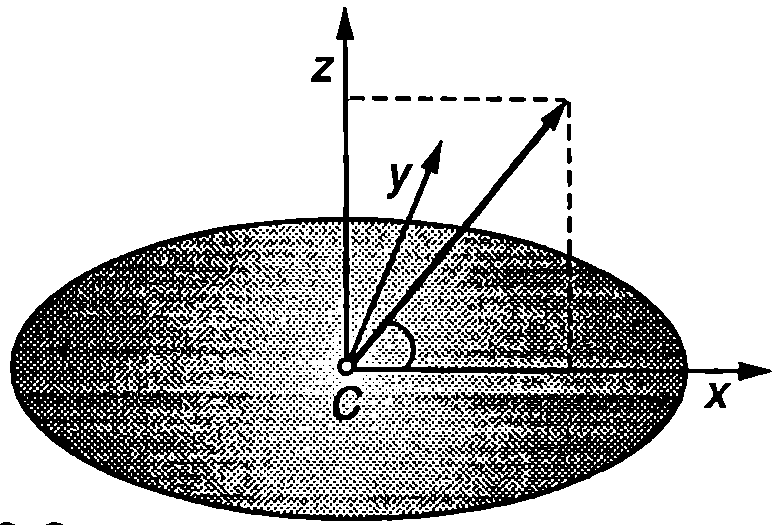
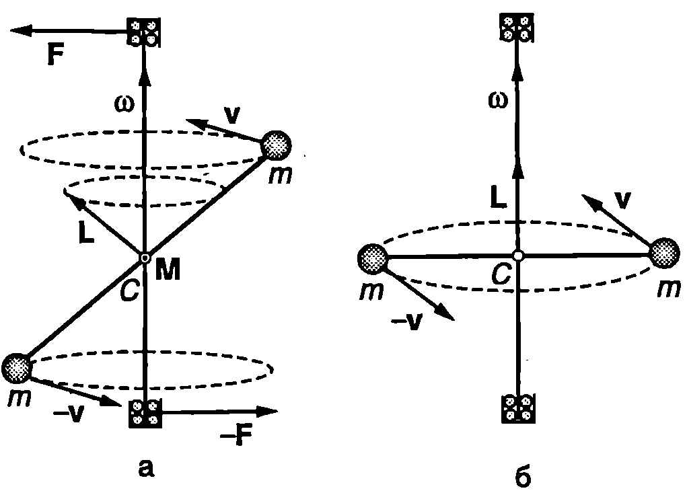
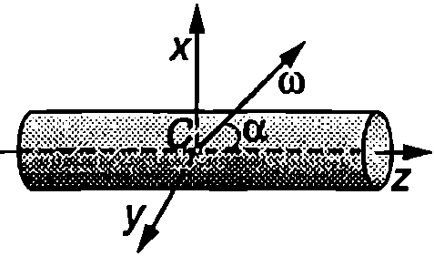

**Главни инерчни оси**

Нека началото О на неинерциалната отправна система, свързана с твърдо тяло, е неподвижно. Тялото се върти около моментна ос, минаваща през точка $O$. В общия случай векторът на момента на импулса на твърдото тяло не е насочен по оста на въртене, т.е. векторите $\vec L$ и $\vec\omega$ не са успоредни (Фиг. \ref{fig:18.1}). Доказва се, че при произволен избор на началото $O$ през него могат да се прекарат три взаимно перпендикулярни оси $x$, $y$ и $z$, при въртене около които моментът на импулса $\vec L$ е насочен по оста на въртене. Те се наричат главни инерчни оси на тялото за точка $O$. Удобно е главните инерчни оси да се изберат за координатни оси на отправната система, свързана с тялото. Инерчните моменти на тялото спрямо главните инерчни оси се наричат главни инерчни моменти ($I_x$, $I_y$ и $I_z$). Когато тялото се върти около главна инерчна ос, моментът на импулса и ъгловата скорост са свързани с уравненията
$$\vec L = I_x \vec\omega;
$$
$$\vec L = I_y \vec\omega;
$$
$$\vec L = I_z \vec\omega;
$$
Уравнение \eqref{eq:18.1} изразява връзката между $\vec L$ и $\vec\omega$, когато въртенето е около главната инерчна ос $x$, \eqref{eq:18.2} при въртене около $y$ и \eqref{eq:18.3} - около $z$. При въртене около произволна моментна ос, минаваща през началото О, моментът на импулса е


```

```
	`Фиг. 18.1`


```

```
	`Фиг. 18.2`


$$\vec L = I_x \omega_x \vec i + I_y \omega_y \vec j + I_z \omega_z \vec k;
$$
където $\omega_x$, $\omega_y$, и $\omega_z$ са проекциите на ъгловата скорост върху главните инерчни оси, избрани за координатни оси на неинерциалната отправна система (Фиг. \ref{fig:18.2}).

Доказва се, че когато началото $O$ е неподвижно, кинетичната енергия на твърдото тяло при произволно въртене е
$$E_k = \frac{1}{2} \left(I_x \omega_x^2 + I_y \omega_y^2 + I_z \omega_z^2\right).
$$
Главните инерчни оси, прекарани през центъра на масите $C$ на твърдо тяло, се наричат *главни централни инерчни оси*, а съответните инерчни моменти *главни централни инерчни моменти*.

Кинетичната енергия при произволно движение на твърдо тяло е
$$E_k = \frac{m v_C^2}{2} + \frac{1}{2} \left(I_x \omega_x^2 + I_y \omega_y^2 + I_z \omega_z^2\right).
$$
където $m$ е масата на тялото, $v_C$ - скоростта на центъра на масите на тялото, а $I_x$, $I_y$, и $I_z$ са главните централни инерчни моменти.

Най-лесно се намират главните централни инерчни оси на еднородни и симетрични тела. Например, ако тялото има равнина на симетрия, центърът на масите лежи върху нея. Една от главните централни инерчни оси е перпендикулярна на равнината на симетрия, а другите две лежат върху нея. Всички оси на симетрия са и главни централни инерчни оси (всички оси на симетрия преминават през центъра на масите).

Всяка ос, минаваща през центъра на еднородно кълбо или на еднородна сферична обвивка, е главна централна инерчна ос. За ротационните тела (диск, цилиндър, елипсоид, конус и др.) една от главните централни инерчни оси съвпада с оста на симетрия (избира за ос $z$ на неинерциалната отправна система, свързана с тялото). Всяка ос, която преминава през центъра на масите и е перпендикулярна на оста на симетрия, също е главна инерчна ос. Затова при ротационните тела за координатни оси $x$ и $y$ на неинерциалната отправна система могат да се вземат две произволни взаимно перпендикулярни оси, които минават през центъра на масите и са перпендикулярни на оста на симетрия - те винаги са главни оси. Инерчните моменти на ротационните тела спрямо всички главни централни инерчни оси, перпендикулярни на оста на симетрия, са равни: $I_x = I_y$.

> [!question] Пример 18.1
Определете кинетичната енергия на диск с маса $m$ и радиус $R$, въртящ се с ъглова скорост $\vec\omega$ около ос, която минава през центъра на масите $C$ на диска и сключва ъгъл $\theta$ с неговата повърхност.
\end{psexample}



```

```
	`Фиг. 18.3`

> [!note]- Решение
 Всички оси, които лежат в равнината на диска и минават през центъра на масите му, поради симетрията, са главни централни инерчни оси. Удобно е да изберем оста $y$ да бъде перпендикулярна на ъгловата скорост $\vec\omega$ (Фиг. \ref{fig:18.3}). Тогава проекциите на върху главните централни инерчни оси на диска са:
$$\omega_x = \omega \cos\theta; \omega_y = 0; \omega_z = \omega\sin\theta.$$

В уравнение \eqref{eq:18.6} за кинетичната енергия полагаме $v_C = 0$, $I_x= mR^2/4$, $I_z = mR^2/2$ и заместваме съответните компоненти на ъгловата скорост на диска. Получаваме

$$E_k = \frac{1}{2}(I_x\omega_x^2+I_z\omega_z^2)=\frac{1}{8}mR^2\omega^2(2\sin^2 \theta + \cos^2 \theta) =$$
$$=\frac{1}{8}mR^2\omega^2(1+\sin^2 \theta).$$

**Свободни оси**

На Фиг. \ref{fig:18.4}а е показана гира, която се върти с постоянна ъглова скорост $\vec\omega$ около метална ос, минаваща през центъра на масите на гирата. Оста в закрепена между лагери, които не позволяват тя да променя направлението си. Моментът на импулса $\vec L$ на гирата, определен спрямо неподвижния център на масите $C$ на гирата, остава постоянен по големина, но непрекъснато променя посоката си, описвайки кръгов конус около оста на въртене. Тъй като моментът на импулса може да се изменя само под действие на външни сили, следва изводът, че промяната на посоката на $\vec L$ се дължи на силите, с които лагерите действат на системата. Те създават двойка сили, лежаща в една равнина с оста на въртене. Въртящият момент $\vec M$ на двойката е перпендикулярен на $\vec L$ и води единствено до изменение на посоката на момента на импулса. Съгласно с третия принцип на механиката оста действа на лагерите с равни по големина и противоположни по посока сили. Казва се, че системата е *динамически небалансирана*. Динамичният дисбаланс при автомобилните колела, при въртящите се части на машини и др. води до тяхното бързо износване, поради което се вземат мерки за неговото отстраняване.

Дисбаланс няма, когато оста на въртене съвпада с главна централна инерчна ос. Тогава моментът на импулса $\vec L$ е насочен по оста на въртене (Фиг. \ref{fig:18.4}б) и по време на въртенето не се изменя нито по големина, нито по посока. Следователно в този случай за запазване неизменно направлението на оста на въртене не е необходимо към нея да се прилагат външни сили. Ос, чието положение в пространството в отсъствие на външни сили не се променя, когато тялото се върти с постоянна ъглова скорост около нея, се нарича свободна ос на тялото.



```

```
	`Фиг. 18.4`


```
Свободни оси.
```
	`Фиг. 18.5`


От казаното е ясно, че *главните централни инерчни оси са и свободни оси*.

Опитно и теоретично се доказва, че в отсъствие на външни сили устойчиво е само въртенето около главни централни оси (свободни оси), спрямо които инерчният момент на тялото има екстремална (максимална или минимална) стойност. Например, ако подхвърлим кибритена кутия (Фиг. \ref{fig:18.5}) и едновременно с това я завъртим, ще установим, че въртенето е устойчиво, ако се извършва около оста $z$ (инерчният момент $I_z$ има максимална стойност) или около оста $x$ (инерчният момент $I_x$ е минимален). Инерчният момент спрямо третата главна централна ос $y$ има междинна стойност ($I_x < I_y < I_z$), поради което въртенето около оста $y$ е неустойчиво -- кутията започва да се преобръща във въздуха. Ще отбележим, че в случая силата на тежестта не влияе на въртенето, защото е приложена към центъра на масите на кутията и не създава въртящ момент спрямо свободните оси (главните централни инерчни оси).


```
Устойчиво е въртенето около свободната ос, спрямо която инерчният момент на тялото е максимален.
```
	`Фиг. 18.6`


При наличие на външна сила, например силата на опъване на нишката, към която е закачено въртящото се тяло, устойчиво е само въртенето около главната централна ос, спрямо която инерчният момент на тялото има максимална стойност. Това се потвърждава от демонстрационните опити, схематично представени на Фиг. \ref{fig:18.6}. Верижка (а), диск (б) и тънка пръчка (в) се завързват с нишка за оста на центробежна машина. На фигурата е показано положението на телата, когато машината се върти с голяма ъглова скорост. Всяко от телата се върти около свободната си ос (главна централна инерчна ос), спрямо която инерчният му момент е максимален.

***Свободно движение на ротационно тяло**

Ще разгледаме движението на ротационно тяло, на което не действат сили. Ще смятаме, че центърът на масите C е неподвижен. Твърдото тяло в случая е затворена механична система, чийто момент на импулса се запазва: $\vec L = const$. Кинетичната енергия на въртене също се запазва. Моментът на импулса $\vec L$ е определен спрямо неподвижната точка $C$, която ще изберем едновременно за начало както на инерциална отправна система $K_1$, така и на неинерциална отправна система $K$, свързана с тялото. В общия случай посоката на ъгловата скорост $\vec\omega$ не съвпада с посоката на $\vec L$ (Фиг. \ref{fig:18.7}а). Избираме оста $z_1$ на $K_1$-системата да е насочена успоредно на $\vec L$, а координатните оси на $K$-системата да съвпадат с три от главните централни инерчни оси: оста и съвпада с оста на симетрия, а осите $x$ и $y$ за ротационно тяло могат да се изберат произволно. Заместваме $I_y = I_x$ в уравнението за момента на импулса \eqref{eq:18.4} и в уравнението за кинетичната енергия \eqref{eq:18.5}. Повдигаме на квадрат двете страни на уравнение \eqref{eq:18.4} и получаваме
$$\begin{aligned}
	&L^2 = L_x^2 + L_y^2 + L_z^2 = \\
	& = (\omega_x^2+\omega_y^2)I_x + \omega_z^2 I_z = const.
	\end{aligned}
$$
$$2E_k = (\omega_x^2+\omega_y^2)I_x + \omega_z^2 I_z = const.
$$

От уравнения \eqref{eq:18.7} и \eqref{eq:18.8} следва, че при $I_z\neq I_x$:
$$\omega_z = const;
$$
$$\omega_x +\omega_y = const.
$$
Следователно по време на движението проекцията на ъгловата скорост върху оста на симетрия (оста $z$) $\omega_z$ не се изменя. Да означим с $\theta$ ъгъла между осите $z$ и $z_1$. (Фиг. \ref{fig:18.7}). Проекцията на момента на импулса върху оста $z$ e $L_z= L\cos\theta$. От друга страна $L_z = \omega_z I_z$. Следователно $\cos\theta = \omega_z I_z/L = const$, т.е. ъгълът $\theta$ между неподвижната ос $z_1$ и оста на симетрия $z$, наречен *ъгъл на нутация*, не се изменя по време на движението.

Тъй като $I_x = I_y$, уравнение \eqref{eq:18.4} за момента на импулса може да се запише във вида L
$$\vec L = I_x \vec\omega_\perp + I_z \vec\omega_{||} = \vec L_\perp + \vec L_{||}
$$


```

```
	`Фиг. 18.7`


където $\vec\omega_\perp = \omega_x \vec i + \omega_y \vec j$ е компонентата на ъгловата скорост, която е перпендикулярна на оста на симетрия $z$, а $\vec\omega_{||} = \omega_z \vec k$ e успоредната на оста $z$ компонента (Фиг. \ref{fig:18.7}б). Съгласно с равенство \eqref{eq:18.10}
$$\omega_\perp^2 = \omega_x^2+\omega_y^2=const.$$
Следователно големината на ъгловата скорост не се изменя с течение на времето

$$\omega = \sqrt{\omega_\perp^2+\omega_{||}^2} = const.$$

Ще докажем, че през цялото време на движението векторът $\vec\omega$ (прекаран от неподвижното начало C) лежи в равнината $z_1z$. Действително, за да се изпълнява векторното равенство \eqref{eq:18.11}, във всеки момент от времето трите вектора, влизащи в него, трябва да лежат в една равнина. По определение векторите $\vec L$ и $\vec\omega_{||}$, са насочени съответно по осите $z_1$ и $z$, т.е. лежат в равнината $z_1z$. Следователно векторът, също лежи в нея, както и векторът е $\vec\omega=\vec\omega_{||}+\vec\omega_\perp$. И така, при свободно въртене (по инерция) на твърдо тяло с ротационна симетрия ъгловата скорост е във всеки момент от времето лежи във равнината $z_1z$, определена от вектора на момента на импулса (неподвижна ос $z_1$) и оста на симетрия на тялото (ос $z$). Ъгълът в между осите $z_1$ и $z$ не се изменя с течение на времето. Не се изменя също така ориентацията на вектора $\vec\omega$ спрямо осите $z_1$ и $z$, както и неговият модул $\omega$. Затова векторът може да се разложи по правилото на успоредника на две компоненти
$$\vec\omega = \vec\omega_1 + \vec\omega_2,
$$
където компонентата $\vec\omega_1$ е успоредна на оста $z$, а компонентата $\vec\omega_2$ е успоредна на оста $z_1$ (Фиг. \ref{fig:18.7}б), които не се изменят с течение на времето. Така свободното движение на тялото се представя като сума от две независими въртения: въртене на тялото с постоянна ъглова скорост $\vec\omega_1$ около оста му на симетрия ги едновременно с това въртене на самата ос $z$ (заедно с цялата равнина $z_1z$) около неподвижната ос $z_1$ с ъглова скорост $\vec\omega_2$. Такова движение на твърдо тяло се нарича *свободна (регулярна) прецесия*.

Ще пресметнем ъгловите скорости на прецесия $\vec\omega_1$ и $\vec\omega_2$. От триъгълниците на чертежа на Фиг. \ref{fig:18.7}б записваме
$$\omega_1 = \omega_{||} - \frac{\omega_\perp}{\tan\theta};\ \omega_2 = \frac{\omega_\perp}{\sin\theta}.
$$
От уравнение \eqref{eq:18.11} и от чертежа на Фиг. \ref{fig:18.7}в следват съотношенията:

$$L_\perp = \omega_\perp I_x; L_{||} = \omega_{||}I_z; \tan\theta = \frac{L_\perp}{L_{||}};\sin\theta=\frac{L_\perp}{L}.$$

След заместване на $\omega$, $\sin\theta$ и $\tan\theta$ в уравнения \eqref{eq:18.13} получаваме
$$\omega_1 = \frac{I_x - I_z}{I_x} \omega_{||};\ \omega_2 = \frac{L}{I_x}.
$$
Тялото се върти спрямо равнината $z_1z$ с ъглова скорост $\vec\omega_1$, а векторът $\vec\omega$ през цялото време лежи в равнината $z_1 z$. Следователно спрямо тялото векторът $\vec\omega$ се върти със същата по големина ъглова скорост, но в противоположна посока, т.е. векторът $\omega$ описва кръгов конус около оста на симетрия и с ъглова скорост
$$\omega_1' = -\omega_1 = \frac{I_z - I_x}{I_x} \omega_{||}
$$
Свободна прецесия извършват не само ротационните тела, но и всички твърди тела, за които $I_x = I_y$. При свободна прецесия тялото се върти около оста на симетрия $z$ с ъглова скорост $\omega_1$, а самата ос на симетрия описва кръгов конус, чиято ос съвпада с момента на импулса $\vec L$. Можем да използваме следния нагледен геометричен модел: Да построим два допиращи се кръгови конуса: единия чрез завъртане на вектора $\vec\omega$ около оста $z_1$, а другия чрез завъртане на вектора $\vec\omega$ около оста $z$ (Фиг. \ref{fig:18.7}г). Конусът 2 се търкаля без хлъзгане по повърхността на конуса 1. Във всеки момент от времето ъгловата скорост $\vec\omega$ е насочена по допирателната на двата конуса. При търкалянето конусът 2 се върти около оста си $z$ с ъглова скорост $\vec\omega_1$, а самата ос $z$ описва кръгов конус около неподвижната ос $z_1$ с ъглова скорост $\vec\omega_2$. Допирателната на двата конуса (ъгловата скорост $\vec\omega$) от своя страна се върти с ъглова скорост $\vec\omega_1'=-\vec\omega_1$ около оста $z$ и с ъглова скорост $\vec\omega_2$ около оста $z_1$.*

Задачи

1. Центрофуга с инерчен момент $I = 0,\!2~\mathrm{kg\cdot m^2}$ се върти около оста си (главна централна инерчна ос) с ъглова скорост $\omega = 30$ rad/s. Определете момента на импулса на центрофугата,

2. Диск с маса $m$ и радиус $R$ се върти с ъглова скорост $\omega$ около ос, която сключва ъгъл $\theta$ с повърхността на диска (Фиг. \ref{fig:18.3}). Определете големината на момента на импулса на диска.

*3. Еднороден цилиндър с маса $m$, радиус $R$ и височина и се върти с ъглова скорост около ос, която минава през центъра на масите C на цилиндъра и сключва ъгъл $\alpha$ с оста му на симетрия 2 (Фиг. \ref{fig:18.8}). Определете:

а) големината на момента на импулса $\vec L$ на цилиндъра;

6) ъгъла $\theta$, който векторът $\vec L$ сключва с оста на цилиндъра $z$;

в) кинетичната енергия на цилиндъра. Главните централни инерчни моменти на цилиндъра ca: $I_x = I_y=mR^2/4 + mh^2/12$; $I_z=mR^2/2$.

*4. Еднороден диск с маса $m$ и радиус $R$ се търкаля без хлъзгане по хоризонтална равнина и едновременно с това се върти с ъглова скорост $\omega_0$ около вертикална ос, разположена на разстояние а от центъра на на масите $C$ на диска (Фиг. \ref{fig:18.9}). Определете кинетичната енергия на диска.

***Указание.*** На Фиг. \ref{fig:18.9} са показани главните централни оси на диска. Компонентите на ъгловата скорост са: $\omega_x = \omega_0$, $\omega_y=0$ и $\omega_z = \omega_1$. Тъй като дискът се търкаля без хлъзгане, докажете, че между ъгловата скорост $\omega_1$ на въртене на диска около оста му ги ъгловата скорост $\omega_0$ на въртене около вертикалната ос има кинематична връзка: $\omega_0 d = \omega_1 R$. Използвайте уравнение \eqref{eq:18.6}, в което изразете скоростта $v_C$ на центъра на масите на диска чрез $\omega_0$ и $d$. Главните централни инерчни моменти на диска са: $I_x = I_y=mR^2/4$; $I_z=mR^2/2$.

*5. Еднороден диск се върти по инерция около своя център на масите. В началния момент ъгловата скорост $\omega$ сключва ъгъл $\alpha$ с повърхността на диска. Определете (вж. Фиг. \ref{fig:18.7}):

а) ъгловите скорости на прецесия $\omega_1$ и $\omega_2$;

6) ъгъла на нутация $\theta$.



```

```
	`Фиг. 18.8`


```

```
	`Фиг. 18.9`

