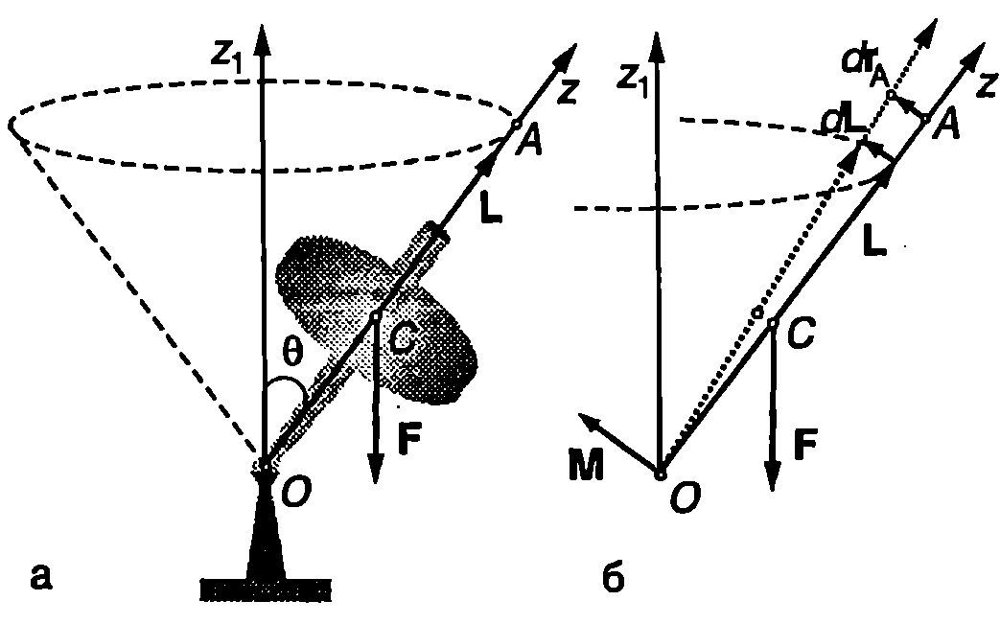
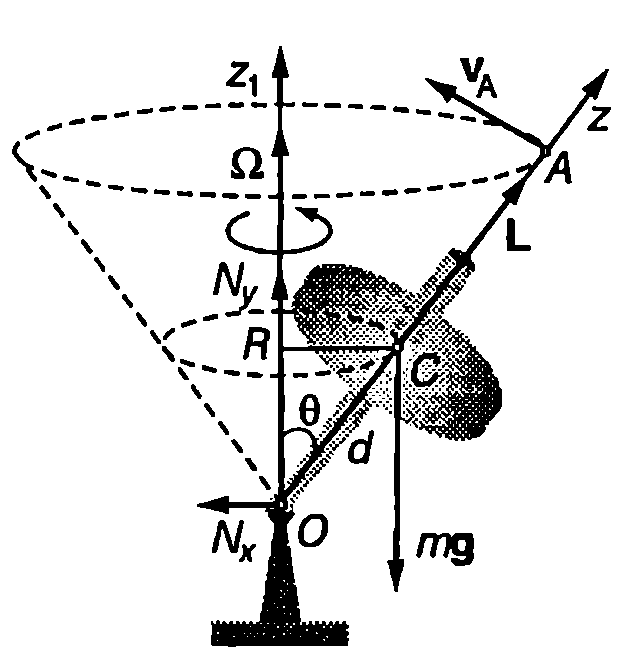

Елементарна теория на симетричен жироскоп

Симетричен жироскоп се нарича ротационно тяло, което се върти около неподвижна точка $O$ (в общия случай точка $O$ може да не съвпада с центъра на масите $C$ на тялото). Оста на симетрия на тялото се нарича ос на жироскопа. Моментната стойност на ъгловата скорост $\vec\omega$ може да се разложи на две компоненти: едната успоредна, а другата перпендикулярна на оста на жироскопа $z$ (Фиг. \ref{fig:19.1}).
$$\vec\omega = \vec\omega_{||} + \vec\omega_\perp.
$$
Ако $\omega_{||}\gg\omega_\perp$, можем да пренебрегнем перпендикулярната компонента $\omega_\perp$ на ъгловата скорост и да смятаме, че векторът $\vec\omega$ е винаги е насочен по оста $z$ (за жироскопите, които се използват в техниката, $\omega_{||}$ е стотици хиляди пъти по-голяма от $\omega_\perp$). Тогава съгласно с уравнение \eqref{eq:18.4} моментът на импулса
$$\vec L = I_x \vec\omega_\perp + I_z\vec\omega_{||} \approx I_z \vec\omega_{||}\approx I_z \vec\omega
$$
също е насочен по оста $z$. Следователно, в рамките на направеното приближение, за да изследваме как се изменя направлението на оста на жироскопа, достатъчно е да определим изменението на посоката на вектора $\vec L$ под действие на въртящите моменти на приложените към жироскопа сили. Когато на жироскопа не действат сили (свободен жироскоп), неговият момент на импулса $\vec L$ не се променя и оста на жироскопа запазва неизменна ориентацията си спрямо инерциална отправна система (например отправната система, свързана с неподвижните звезди). На това свойство на жироскопите се основават редица техни приложения: навигационни прибори като жирокомпаси и жирохоризонти, устройства за автоматично управление и стабилизация на движението на самолети (автопилот), ракети, морски съдове и др.


```

```
	`Фиг. 19.1`



```

```
	`Фиг. 19.2`


Да въздействаме върху оста на жироскопа за кратко време със сила $\vec F$, която създава въртящ момент $\vec M$ спрямо неподвижната точка $O$ (Фиг. \ref{fig:19.2}). Записваме уравнението за моментите
$$\frac{d\vec L}{dt} = \vec M
$$
Векторът $\vec M$ е насочен перпендикулярно на оста на жироскопа. Да разгледаме произволна точка $A$ от оста на жироскопа с радиус-вектор $\vec r_A$ (Фиг. \ref{fig:19.2}). Съгласно с направеното приближение моментът на импулса $\vec L$ винаги е насочен по оста на жироскопа, т.е. векторите $\vec r_A$ и $\vec L$ са колинеарни: $\vec r_A = c\vec L$, където $c$ е константа. Скоростта на точка $A$ е
$$\vec v_A = \frac{d\vec r_A}{dt} = c\frac{d\vec L}{dt} = c\vec M
$$
Следователно точка $A$ и заедно с нея оста на жироскопа се отклоняват в направление на вектора $\vec M$.

И така, ако върху оста на бързо въртящ се жироскоп се подейства със сила, оста не се завърта по посока на силата, както би станало, ако жироскопът беше неподвижен, а се отклонява по посока на въртящия момент $\vec M$, т.е. в перпендикулярно на силата направление.

Нека сега върху жироскопа действа постоянна сила, която по време на движението на жироскопа остава в равнината, определена от неподвижната ос $z_1$, минаваща през неподвижната точка $O$, и от оста на жироскопа $z$. Такава сила е например силата на тежестта (Фиг. \ref{fig:19.2}). Тъй като, както вече установихме, оста $z$ на жироскопа не се отклонява по посока на действащата сила, ъгълът $\theta$ между осите $z_1$ и $z$ остава постоянен, а скоростта на произволна точка $A$ от оста $z$ е перпендикулярна на равнината $z_1 z$. Следователно оста $z$ ще се върти около неподвижната ос $z_1$ с някаква ъглова скорост $\vec\Omega$, наречена *ъглова скорост на прецесия*. Самото движение на оста и се нарича *прецесия на жироскопа*. Точка $A$ от оста $z$ се движи по окръжност със същата ъглова скорост $\vec\Omega$.

Линейната и ъгловата скорост на точка $A$ са свързани с познатото съотношение

$$\vec v_A =\vec\Omega\times\vec r_A = \vec\Omega\times(c\vec L).$$

Заместваме $\vec v_A$ в уравнение \eqref{eq:19.4} и след като съкратим коефициента $c$ получаваме
$$\vec\Omega \times\vec L = \vec M.
$$
Това е основното уравнение в елементарната (прецесионна) теория на жироскопа. От него може да се определи ъгловата скорост на прецесия в различни конкретни случаи.

> [!question] Пример 19.1
Симетричен жироскоп се върти с ъглова скорост $\omega = 400$ rad/s около оста си на симетрия $z$, която сключва ъгъл $\theta = 30^\circ$ с вертикалата (Фиг. \ref{fig:19.3}).

а) Пресметнете ъгловата скорост $\Omega$ на прецесия и периода $T$ на прецесия.

б) Колко е хоризонталната компонента $N_x$ на силата на реакция на опората в неподвижната точка $O$ на жироскопа?

Масата на жироскопа е $m = 0,\!5$ kg, инерчният момент е $I_z = 1,\!2.10\ \mathrm{kg.m^2}$. Разстоянието от неподвижната точка $O$ до центъра на масите $C$ на жироскопа е $d = 0,\!1$ m.
\end{psexample}
> [!note]- Решение
 Ъгловата скорост на прецесия ще определим от основното уравнение \eqref{eq:19.5} в елементарната теория на жироскопа, което ще запишем като равенство между модулите на векторите
$$|\vec\Omega\times\vec L| = |\vec M|.$$



```

```
	`Фиг. 19.3`


Модулът на момента на силата на тежестта е $|\vec M|= mgd \sin\theta$. Векторът на ъгловата скорост на прецесия (Фиг. \ref{fig:19.3}) е насочен вертикално нагоре (по неподвижната ос $z_1$) и сключва ъгъл $\theta$ с момента на импулса $\vec L$. Следователно $|\vec\Omega\times\vec L = \Omega L\sin\theta = \Omega I_z\omega\sin\theta$, където сме отчели, че $L = I_z\omega$. След заместване на двата модула в основното уравнение, получаваме

$$\Omega = \frac{mgd}{I_z\omega} = \frac{(0,\!5\ \mathrm{kg}) (9,\!8\ \mathrm{m/s^2})(0,\!1\ \mathrm{m})}{(2.10^{-3}\ \mathrm{kg}) (400\ \mathrm{rad/s})} = -0,\!6\ \mathrm{\frac{rad}{s}}$$
$$T = \frac{2\pi}{\Omega} = 10,\!5\ \mathrm{s}.$$

Числените стойности показват, че ъгловата скорост на прецесия е много по-малка от ъгловата скорост на въртене на жироскопа. Освен това $\Omega$ не зависи от ъгъла $\theta$, който оста на жироскопа сключва с вертикалата.

б) Поради прецесията центърът на масите на жироскопа се движи с ъглова скорост 2 по окръжност с радиус $R = d\sin\theta$, която лежи в хоризонтална равнина (Фиг. \ref{fig:19.3}). Тъй като силата на тежестта няма хоризонтална компонента, движението по окръжност става единствено под действие на хоризонталната компонента $N_x$ на силата на реакция в опорната точка $O$: силата $N_x$ създава центростремителнато ускорение $a_n = \Omega^2 R$ на центъра на масите $C$. Записваме уравнението за движението на центъра на масите, $N_x = ma_n = m\Omega^2R$ и, след като заместим $R$, получаваме

$$N_x = m\Omega d\sin\theta = 9.10^{-3}\ \mathrm{N}.$$

**Прецесия на Земята**


```
Прецесия на Земята.
```
	`Фиг. 19.4`


Земята, която се върти около оста си с период 24 часа, може да се разглежда като жироскоп, чиято ос е наклонена спрямо равнината на земната орбита (Фиг. \ref{fig:19.4}). Ако Земята беше еднородно кълбо, резултантната гравитационна сила, с която и действат Луната и Слънцето, щеше да минава през центъра на масите $C$ на Земята и нямаше да създава въртящ момент спрямо точка $C$. В действителност обаче Земята е сплесната повече маса е натрупана в екваториалната област. Затова на частта 2 (Фиг. \ref{fig:19.4}), която е по-близо до Слънцето, действа по-голяма сила, отколкото на по-отдалечената част 1. Резултантната от двете сили не минава през центъра на масите на Земята и създава въртящ момент, чиято посока е показана на Фиг. \ref{fig:19.4}. Под негово действие Земята извършва бавна прецесия с период около 25 800 години. Луната, която е по-близо до Земята, оказва по-силно влияние върху прецесията, отколкото Слънцето. В резултат на прецесията се изменя времето от годината, когато определена звезда се вижда на дадено място от небосклона. За 2000 години това време се отмества с един месец. Бавно се отместват и годишните времена. Например след 12 900 години зимата ще се смени с лятото.

**Нутация**

Ако наблюдаваме внимателно движението на жироскоп, ще установим, че освен описване на кръгов конус с ъгъл $\theta$ (прецесия), оста на жироскопа извършва още едно движение периодично отклонение във вертикално направление, при което Ъгълът на наклона $\theta$ на оста се изменя в определени граници. Такова движение се нарича нутация. Нутацията се обяснява от точната теория на жироскопа, на която няма да се спираме. Ще се ограничим с качествено разглеждане на това явление. Нека в началния момент жироскопът е завъртян около оста си, която се придържа неподвижна под ъгъл $\theta_0$ спрямо вертикалата. Освобождаваме оста. Моментът на силата на тежестта е насочен хоризонтално. Следователно вертикалната компонента на момента на импулса на жироскопа не може да се изменя ($L\cos\theta_0 = const$). Когато жироскопът започне прецесия, центърът на масите му се движи с ъглова скорост $\Omega$ по окръжност с радиус $R$. На това движение на центъра на масите съответства момент на импулса $L_C = \Omega I_C=\Omega m R^2$, който е насочен вертикално нагоре. За да не се измени вертикалната компонента на пълния импулс на системата, т.е. за да се изпълнява равенството $L\cos\theta + \Omega mR^2 = L\cos\theta_0= const$, трябва оста на жироскопа, а заедно с нея и центърът на масите, да се спуснат надолу (нараства ъгълът $\theta$). Това означава, че в началния момент силата на нормална реакция $N_y$ в опорната точка $O$ (Фиг. \ref{fig:19.3}) е по-малка от силата на тежестта $mg$. Когато ъгълът $\theta$ нараства, силата $N_y$ също нараства и става по-голяма от $mg$. Центърът на масите достига някакво най-ниско положение, след което започва да се издига нагоре, при което издигане силата $N_y$ намалява и т.н. центърът на масите и оста на жироскопа извършват трептене във вертикално направление (нутация). Едновременно с това оста на жироскопа описва кръгов конус около вертикалната ос, минаваща през неподвижната точка на жироскопа (прецесия). Траекторията на центъра на масите при нутация зависи от началните условия. Нутацията може да се избегне, ако на жироскопа се даде начален тласък, така че той да получи допълнителен момент на импулса, равен на момента на импулса на кръговото движение на центъра на масите при прецесия. Такава прецесия (без нутация) се нарича *регулярна прецесия*.

**Задачи**

1. Детски пумпал с маса $m$ = 0,5 kg и инерчен радиус $\rho = 4$ cm е завъртян с ъглова скорост $\omega = 150$ rad/s върху хоризонтална маса. Оста на пумпала сключва ъгъл $\theta = 30^\circ$ с вертикалата. При какъв коефициент на триене и между масата и върха на пумпала последният няма да се хлъзга по масата? Разстоянието от опорната точка на пумпала до центъра на масите му е $d = 7$ cm.

2. В асансьор, който се издига равноускорително с ускорение $a$, е поставен жироскоп - еднороден диск с радиус $r$ и маса $m$ (Фиг. \ref{fig:19.3}). Разстоянието от неподвижната точка $O$ до центъра на масите на диска $C$ е $d$. Определете ъгловата скорост $\omega$ на диска, ако ъгловата скорост на прецесия е $\Omega$. Масата на пръчката, на която е закрепен дискът, се пренебрегва.
