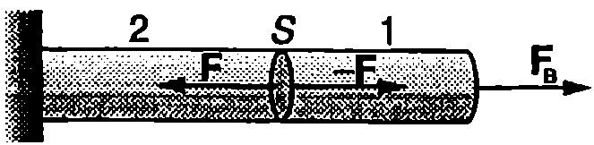
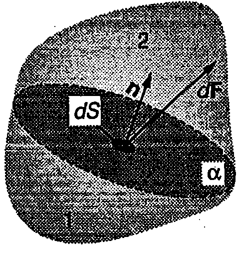
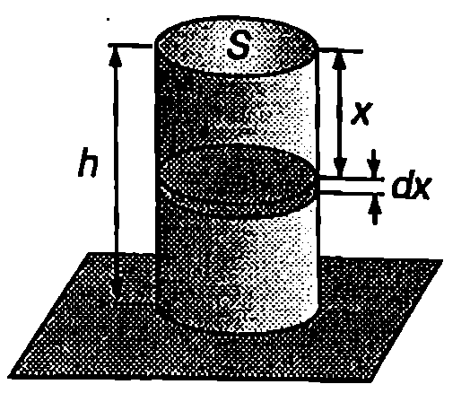

**Еластичност**

В най-общия смисъл под еластичност се разбира стремежът на телата да възстановят своя обем или форма, които са били изменени под действие на външни сили. Съществува два вида еластичност -- *обемна еластичност и еластичност на формата*. Обемната еластичност е характерна за всички тела, включително за течности те и газовете. При газовете обаче обемната еластичност има едностранен характер -- те се противопоставят на външните сили, стремящи се да намалят обема на газа, докато разширението се извършва свободно. Еластичност на формата притежават единствено твърдите тела. За някои твърди тела еластичността на форма та е слабо изразена. Такива тела се наричат пластични. Примери за пластични материали са восъкът, глината, оловото и др. Телата, направени от пластични материали, лесно изменят формата си под действие на външни сили.

**Еластични сили и напрежения**

На Фиг. \ref{fig:20.1} е показана цилиндрична пръчка, единият край на която е закрепен, а към другия е приложена сила $\vec F_\text{в}$. Да прекараме мислено напречно сечение, разделящо пръчката на две части. За да бъде част 18 покой, трябва силата $\vec F$ с която и действа другата част 2, да уравновесява външната сила $\vec F_\text{в}$, т.е. $\vec F + \vec F_\text{в} = 0$. Съгласно с третия принцип на механиката част 1 действа на част 2 с равна по големина и противоположна по посока сила $-\vec F$ (Фиг. \ref{fig:20.1}). Следователно, ако мислено разделим едно деформирано тяло на две части, те ще си взаимодействат със сили, разпределени по допирната повърхност на тези две части. Това са т.нар. вътрешни *еластични сили*. Еластичните сили са резултат от електромагнитните взаимодействия между атомите и молекулите. Тяхното изследване на атомно равнище е обект на физиката на твърдото тяло. Механиката дава само макроскопично описание на еластичните свойства на телата, като ги характеризира с макроскопични величини, които могат да се измерят експериментално.



```

```
	`Фиг. 20.1`



```

```
	`Фиг. 20.2`


Да разделим мислено деформирано тяло на две части. Еластичните сили на взаимодействие между тях са разпределени в общия случай неравномерно по разделителната повърхност а (Фиг. \ref{fig:20.2}). Да означим с $d\vec F$ силата, с която част 1 действа на част 2 през малката площадка $dS$ от $\alpha$. Разлагаме силата $d\vec F$ на две компоненти: нормална компонента $d\vec F_n$, насочена успоредно на нормалата $\vec n$ към площадката, и тангенциална компонента $d\vec F_\tau$, която е успоредна на площадката. Величината
$$\sigma_n = \frac{d F_n}{dS}
$$
се нарича *нормално еластично напрежение*, а величината.
$$\sigma_\tau = \frac{d F_\tau}{dS}
$$
се нарича *тангенциално еластично напрежение*.

Големината на нормалното и на тангенциалното напрежение зависи от ориентацията на разглежданата площадка. В случай на равномерно деформирано тяло може да се избере такова напречно сечение, че еластичните сили да са равномерно разпределени по цялото сечение и в зависимост от вида на деформацията да се насочени перпендикулярно или тангенциално на избраното сечение $S$. Тогава съответните напрежения са
$$\sigma_n = \frac{F}{S}
$$
или
$$\sigma_\tau = \frac{F}{S}.
$$
Еластичното напрежение е равно на еластичната сила, която действа на единица площ от деформираното тяло. Измерва се в нютон на квадратен метър (N/m$^2$) или паскал (1 Pa = 1 N/m$^2$).

**Закон на Хук**

Еднородна цилиндрична пръчка, единият край на която е закрепен, е разтегната равномерно под действието на външна сила (Фиг. \ref{fig:20.3}а). Да означим с $l_0$ дължината на пръчката в недеформирано състояние, а с $\Delta l$ нейното удължение след деформацията. Безразмерната величина
$$\varepsilon = \frac{\Delta l}{l_0}
$$
се нарича *относителна деформация* на пръчката.

Когато пръчката се разтяга, относителната деформация има положителни стойности ($\Delta l > 0$ и $\varepsilon > 0$). Еластичните сили са перпендикулярни на напречното сечение на пръчката, а съответстващите им нормални еластични напрежения се наричат *напрежения на разтягане* и се бележат с $t$ ($\sigma_n = t$). Когато външни сили свиват пръчката (Фиг. \ref{fig:20.3}б), относителната деформация е отрицателна ($\Delta l < 0$ и $\varepsilon < 0$), а съответните еластични напрежения се наричат *напрежения на налягане* или само *налягане* $p$ ($\sigma_n = p$).

Опитът показва, че при малки относителни деформации еластичните напрежения на разтягане (или на налягане р) са правопропорционални на относителната деформация е


```

```
	`Фиг. 20.3`


$$t = E\varepsilon \text{ и } p = -E\varepsilon
$$
Коефициентът на пропорционалност $E$ е константа, която не зависи от размерите на пръчката, а характеризира единствено еластичните свойства на материала, от който тя е направена. Нарича се модул на Юнг в чест на английския физик Томас Юнг (1773-1829). Модулът на Юнг се измерва в същите единици, както еластичното напрежение нютон на квадратен метър (N/m$^2$). От уравнение \eqref{eq:20.6} се вижда, че модулът на Юнг е равен на напрежението, което би възникнало при относителна деформация $\varepsilon$ = 1, при условие, че линейната зависимост \eqref{eq:20.6} остава в сила при такива големи деформации. Стойностите на модула на Юнг за някои материали са дадени в таблица 20.1.

Уравненията \eqref{eq:20.6} изразяват закона за еластичните деформации на разтягане или свиване на пръчка, който е установен експериментално още през 1678 година от английския физик Роберт Хук (1635-1703) и в негова чест се нарича *закон на Хук*.

**Пластичност**

В зависимост от големината на относителната деформация $\varepsilon$ експериментално са установени няколко области, в които зависимостта на напрежението от деформацията има различен характер. Например при разтягане на еднородна пръчка в началото, при много малки стойности на $\varepsilon$, зависимостта между напрежението на разтягане и относителната деформация $\varepsilon$ е линейна (Фиг. \ref{fig:20.4}) в сила в законът на Хук \eqref{eq:20.6}. Точка А от графиката


```

```
	`Фиг. 20.4`


на Фиг. \ref{fig:20.4} се нарича граница на линейност. След нея деформациите продължават да са еластични, т.е. след премахване на външната сила се възстановява недеформираното състояние, но зависимостта $t(\varepsilon)$ вече не е линейна. Точка В от графиката определя т.нар. граница на еластичност. След нея следва областта BC на пластични деформации след премахване на външната сила само частично се възстановява началното състояние. Точка C определя границата на издръжливост. Напрежението на разтягане $t_c$ (или налягането $p_c$), съответстващо на границата на издръжливост, е важна характеристика за здравината на материалите (вж. таблица 20.1).

Ако се премине границата на издръжливост, пръчката продължава да се разтяга, дори под действие на по-малки сили, и при достигане на точка 2 тя се скъсва. Ако точките C и О са разположени близо една до друга, материалът е крехък (чугун, стомана и др.). Когато точките C и D са отдалечени една от друга, материалът е мек (ковък) - меки са оловото, медта и др.

\begin{table}

	\begin{tabular}{ccc}
	Материал& Модул на Юнг $E, ~\mathrm{N/m^2}$& Граница на издръжливост, $t_c,~\mathrm{N/m^2}$\\
	Стомана& $20.10^{10}$& $5.10^8$\\
	Алуминий& $7.10^{10}$& $2.10^8$\\
	Стъкло& $7.10^{10}$& $4.10^7$\\
	Кости& $1,\!6,10^{10}$& $1,\!2.10^8$\\
	Кръвоносни съдове& $2.10^5$& \\
	\end{tabular}
```
Еластични свойства на някои материали.
```
	\label{table:20.1}
\end{table}

**Коефициент на Поасон**

При разтягане или свиване на цилиндрична пръчка се изменя не само дължината, но и диаметърът $D$ на пръчката. При свиване диаметърът нараства ($\Delta D > 0$), а при разтягане - намалява ($\Delta D < 0$). В недеформирано състояние пръчката има дължина $l_0$ и диаметър $D_0$. Външни сили разтягат пръчката, при което дължината и нараства с $\Delta l$, а диаметърът намалява с $\Delta D$. Отношението на модула на относителното изменение на диаметъра на пръчката към модула на относителното изменение на нейната дължина
$$\mu = \frac{|\Delta D/D_0|}{|\Delta l/l_0|}
$$
се нарича *коефициент на Поасон*, в чест на френския физик и математик Симеон Денис Поасон (1781-1840). Коефициентът на Поасон $\mu$ е безразмерна величина, характеризираща еластичните свойства на материалите.

В тази глава ще разглеждаме еластичните свойства на еднородни и изотропни тела. (Изотропни се наричат тела, чиито физични свойства, в частност еластични свойства, не зависят от направлението.) Доказва се, че модулът на Юнг $E$ и коефициентът на Поасон $\mu$ напълно определят еластичните свойства на изотропните еднородни твърди тела. Всички останали еластични модули, характеризиращи различните видове деформации, се изразят чрез $E$ и $\mu$.

**Еластична енергия на деформирана пръчка**

При деформиране на телата външни сили извършват работа. От своя страна деформираното тяло в процеса на възстановяване на недеформираното си състояние извършва работа върху околните тела, т.е. то притежава потенциална енергия. Потенциалната енергия на деформираните тела се нарича еластична потенциална енергия или за краткост само еластична енергия.

Ще пресметнем еластичната енергия на разтегната пръчка. Като отчетем уравнения \eqref{eq:20.4} и \eqref{eq:20.5}, записваме закона на Хук \eqref{eq:20.6} във вида
$$\frac{F}{S} = E \frac{\Delta l}{l_0} \text{ или } F = \frac{ES}{l_0}\Delta l
$$
където $S$ е напречното сечение на пръчката. Следователно еластичната сила $F$ е правопропорционална на удължението $\Delta l$ на пръчката. Ако пръчката се разтяга много бавно, може да се смята, че във всеки момент от времето тя е в покой, т.е. външната сила е равна по големина на еластичните сили на взаимодействие в произволно избрано напречно сечение на пръчката (Фиг. \ref{fig:20.1}): $F_\text{в} = F$. Работата на външната сила за безкрайно малко разтягане $dx$ на пръчката е

$$dA = F_\text{в}dx = Fdx = \frac{ES}{l_0} xdx.$$

Работата за разтягане на пръчката от $x$ = 0 до $x = \Delta l$ е
$$A = \frac{ES}{l_0} \int_0^{\Delta l} xdx = \frac{1}{2} \frac{ES}{l_0} (\Delta l)^2 = \frac{1}{2} F\Delta l,
$$
където $F$ е еластичната сила при деформация на пръчката $\Delta l$. Работата на външната сила е равна на изменението на еластичната енергия:
$$A = W - W_0 = W,
$$
където сме отчели, че в началния момент пръчката не е деформирана и сме приели, че еластичната енергия на недеформирано тяло е нула ($W_0 = 0$).

Еластичната енергия в единица обем от веществото се нарича обемна плътност на еластичната енергия
$$w = \frac{W}{V}.
$$
Заместваме обема на пръчката $V = l_0S$ и еластичната енергия $W = A = F\Delta l/2$. Получаваме
$$w = \frac{F\Delta l}{2S l_0} = \frac{1}{2} t\varepsilon = \frac{t^2}{2E}.
$$
където при преобразуването е използван законът на Хук \eqref{eq:20.6}

При деформация на свиване се получава аналогична формула за плътността на еластичната енергия
$$w = \frac{p^2}{2E}.
$$
където $p$ е налягането.

> [!question] Пример 20.1
Гумен цилиндър с маса $m$, височина $h$, напречно сечение $S$ и модул на Юнг $E$ е поставен върху хоризонтална равнина.

а) Да се определи енергията на еластичната деформация на цилиндъра, възникнала под действие на собственото му тегло.

б) Колко пъти ще нарасне еластичната енергия на цилиндъра, ако върху него се постави втори такъв цилиндър?
\end{psexample}



```

```
	`Фиг. 20.5`

> [!note]- Решение
 а) Плътността на еластичната енергия се изразява с формула \eqref{eq:20.13}. Налягането $p$ в цилиндъра е променливо -- зависи от височината. Разбиваме мислено цилиндъра на тънки дискове (Фиг. \ref{fig:20.5}). Плътността на енергията във всеки от тях е постоянна. Еластичната енергия на диска от Фиг. \ref{fig:20.5} е:
$$dW = wdV = \frac{p}{2E}Sdx.$$

Налягането $p$ в диска е
$$p=\frac{F}{S}=\frac{(mg/h)x}{S},$$
където сме отчели, че силата $F$, действаща върху горната повърхност на диска, е равна на теглото на частта от цилиндъра (с височина $x$), намираща се над тази повърхност. Заместваме $p$ и интегрираме

$$W = \frac{m^2g^2}{2ESh^2}\int_0^hx^2dx = \frac{m^2g^2h}{6ES}.$$

б) Двата еднакви цилиндъра образуват общ цилиндър с височина $2h$ и маса $2m$. Тъй като $W \propto m^2h$ (вж. горната формула), еластичната енергия на общия цилиндър ще бъде $W_1 = 8W$. Горният цилиндър има същата еластична енергия $W$, както ако се намираше върху хоризонталната равнина. Следователно еластичната енергия на долния цилиндър е $W_2 = 8W-W = 7W$, т.е. тя нараства 7 пъти.

**Задачи**

1. Цилиндричен гумен шнур с маса $m$ и напречно сечение $S$ виси, закачен на тавана. Определете относителното удължение $\Delta l/l$ на шнура под действие на собственото му тегло. Модулът на Юнг за гумата е $E$.

2. Еластична цилиндрична греда с маса $m$, дължина $l$ и напречно сечение $S$ се движи с ускорение с големина $a$, което е насочено по дължината на гредата и е еднакво за всички точки от гредата. Определете енергията на еластичната деформация, възникнала в резултат на движението с ускорение. Модулът на Юнг за материала на гредата е $E$.
