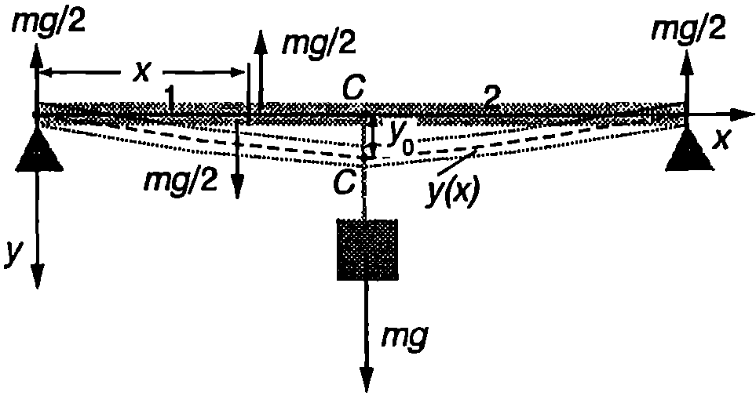
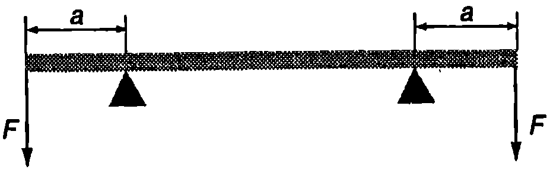
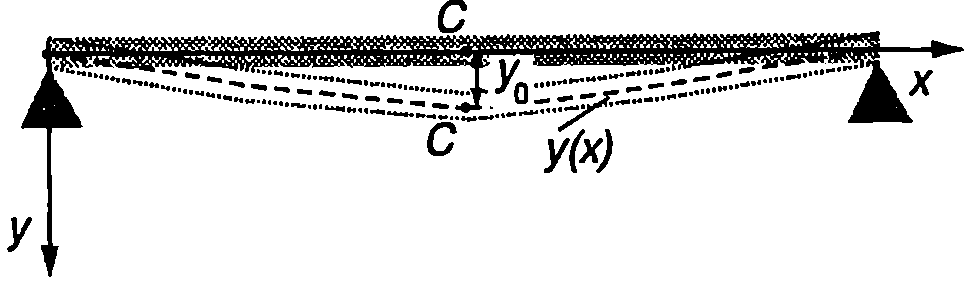

Освен разгледаните в \ref{sec:20} и \ref{sec:21} еднородни деформации, в еднородните изотропни твърди тела възникват и нееднородни деформации, при които едни части от тялото са по-силно деформирани, а други части по-слабо деформирани. Такива са деформациите на усукване и огъване, на които ще се спрем сега.

**Усукване**

Ще разгледаме еднороден цилиндър с дължина $l$ и радиус $R$, едната основа на който е закрепена неподвижно. Към другата основа е приложена двойка сили, която създава въртящ момент $\vec M$, насочен по оста $O$ на цилиндъра (Фиг. \ref{fig:22.1}а). Когато деформацията, предизвикана от двойката сили, не е много голяма, всяка радиална линия от долната основа, без да се изкривява, само се завърта на ъгъл $\varphi$ около оста $O$ (Фиг. \ref{fig:22.1}б). Аналогично завъртане извършват радиалните линии от всички напречни сечения на цилиндъра, като ъгълът на завъртане линейно нараства при увеличаване на разстоянието от даденото сечение до неподвижната основа. В резултат на тези завъртания, всяка линия от околната повърхност на цилиндъра, която първоначално е била успоредна на оста О, се изкривява цилиндърът се усуква


```
Усукване: а) линиите, които са били успоредни на оста О на цилиндъра, се изкривяват; б) външните слоеве от цилиндъра са по-силно деформирани от вътрешните слоеве; в) всеки малък елемент от цилиндъра (сивият паралелепипед от фигурата) е подложен на деформация на хлъзгане.
```
	`Фиг. 22.1`


(Фиг. \ref{fig:22.1}а). Усукването може да се разглежда като деформация на нееднородно хлъзгане. Нека мислено разделим плътния цилиндър на голям брой тънки цилиндрични слоеве и да разгледаме малък елемент от такъв един слой (Фиг. \ref{fig:22.1}в). При усукването на цилиндъра елементът претърпява деформация на хлъзгане. Колкото по-външен е цилиндричният слой, толкова по-голяма е деформацията му (Фиг. \ref{fig:22.1}б). Опитът и теорията доказват, че ъгълът на усукване $\varphi$ е правопропорционален на големината $M$ на приложения към цилиндъра въртящ момент и се изразява с формулата
$$\varphi = \frac{Ml}{G I_\text{п}}.
$$
където $l$ е в дължината на цилиндъра, $G$ e модулът на еластичност при хлъзгане за материала, от който той е направен. $I_\text{п}$ е геометричен фактор, наречен полярен инерчен момент, зависещ единствено от размерите и формата на подложеното на деформация на усукване тяло. Размерността на $I_\text{п}$ е m$^4$ (метър на четвърта степен). Например полярният инерчен момент на плътен цилиндър с радиус $R$ e
$$I_\text{п} = \frac{\pi R^4}{2}.
$$

Уравнение \eqref{eq:22.1} се записва във вида
$$M = f\varphi.
$$

Величината
$$f = \frac{GI_\text{п}}{l}
$$

се нарича *модул на усукване*. Модулът на усукване зависи както от еластичните свойства на веществото (посредством еластичния модул на хлъзгане $G$), така и от размерите и формата на твърдото тяло (от полярния инерчен момент $I_\text{п}$, а за цилиндрично тяло, например еластична нишка, и от дължината на цилиндъра).

> [!question] Пример 22.1
Модулът на еластичност при хлъзгане $G$ може да се определи, ако се измери периодът на торзионно махало. Торзионното махало представлява еластична нишка, на която е закачено тежко тяло. След усукване на нишката, под действие на еластичните сили, тялото започва да трепти с период $\displaystyle T = 2\pi\frac{I}{f}$, където $I$ е инерчният момент на тялото спрямо оста на въртене (ос на нишката), а $f$ е модулът на усукване за нишката.

За торзионно махало е използвана стоманена нишка с дължина $l = 50$ cm и радиус $R = 0,\!2$ mm. На нея е закачена тънка пръчка с маса $m = 50$ g и дължина $l = 15$ cm (Фиг. \ref{fig:22.2}).

Определете модула на еластичност при хлъзгане а за стоманата, ако периодът на махалото е $T = 2,\!96$ s.
\end{psexample}


```

```
	`Фиг. 22.2`

> [!note]- Решение
 От уравнения \eqref{eq:22.4} и \eqref{eq:22.2} изразяваме модула на усукване за нишката
$$f = \frac{\pi GR^4}{2l}$$

Изразяваме също така от формулата за периода на торзионното махало
$$f = \frac{4\pi^2 l}{T}$$

Приравняваме десните страни на двете равенства, заместваме инерчния момент на пръчката $I = mL^2/12$ и определяме модула на хлъзгане $G$ за стоманата

$$G=\frac{2\pi mlL^2}{3T^2R^4}=$$

$$=\frac{2\pi(0,\!05 kg) (0,\!5 m) (0,\!15 m)^2}{3(2,\!96 s) (0,\!2.10^{-3} m)} =8,\!4.10^{10} \ \mathrm{\frac{N}{m^2}}$$

**Огъване**

Да разгледаме еднородна пръчка с дължина в, към двата края на която са приложени външни сили с еднакви по големина и противоположни по посока въртящи моменти $M$ (Фиг. \ref{fig:22.3}а). Под тяхно действие пръчката се огъва горната й част се свива, а долната и част се разтяга. Повърхността, прекарана през средата на пръчката, не е деформирана. Тя разделя разтегнатата и свитата част и се нарича *неутрална повърхност*. Надлъжната ос на пръчката, която преминава през центъра на масите на всички напречни сечения, лежи върху неутралната повърхност. Нарича се *неутрална ос*. Във всяко напречно сечение възникват еластични сили на взаимодействие: над неутралната повърхност това са сили на натиск, а под нея -- на опън (Фиг. \ref{fig:22.3}а). Деформацията се нарича чисто огъване, ако резултантната от силите на опън е равна по големина на резултантната на силите на натиск. Тогава те образуват двойка сили, която създава въртящ момент, равен по големина на въртящия момент на външните сили, предизвикващи огъването.

Нека мислено отделим малък елемент от пръчката с дължина de (Фиг. \ref{fig:22.3}б). При чисто огъване напречните сечения, отделящи елемента $dl$, остават плоски, като се накланят едно спрямо друго. Доказва се, че големината на нормалните напрежения $\sigma_n$ с които останалите части на пръчката действат върху елемента $dl$ са правопропорционални на големината на приложения въртящ момент $M$ и нарастват линейно с разстоянието я до неутралната повърхност

$$\sigma_n = \frac{M}{I_\text{н}} s,
$$

където $I_\text{н}$ е геометричен фактор, който зависи от формата и размерите на напречното сечение на пръчката. Измерва се в единици $m^4$ (метър на четвърта степен) и се нарича инерчен момент на напречното сечение.

И така, чистото огъване може да се разглежда като нееднородна деформация на свиване и разтягане. Всички влакна, успоредни на неутралната повърхност и намиращи се над нея, са свити. Колкото


```
Огъване на пръчка.
```
	`Фиг. 22.3`


по-голямо е разстоянието $s$ от влакното до неутралната повърхност, толкова по-голямо е налягането ($\sigma_n = p$). Аналогично, напрежението на опъване ($\sigma_n = t$) е максимално за влакната от долната повърхност на пръчката.

При огъване неутралната ос на елемента $dl$ се изкривява. По аналогичен начин се изкривяват неутралните оси на останалите елементи от пръчката във всяка точка неутралната ос на огъната пръчка се характеризира с определен радиус на кривината $R$.

Доказва се, че големината на въртящият момент $M$ на еластичните сили в дадено напречно сечение на огъната пръчка в обратнопропорционален на радиуса на кривината на неутралната ос в това сечение
$$M = \frac{EI_\text{н}}{R},
$$
където $I_\text{н}$ е инерчният момент на напречното сечение, а $E$ е модулът на Юнг за материала на пръчката.

Да изберем началото $O$ на правоъгълна координатна система в единия край на пръчката, а оста $x$ да съвпада с неутралната ос преди огъването. След огъването различните точки от неутралната линия се намират на различни разстояния $y$ от оста $x$. Ако е известна функцията $y$($x$), задаваща аналитично неутралната линия след огъването, радиусът на кривината в точка с координата $x$ се изразява с известната от аналитичната геометрия формула

$$\frac{1}{R} = \frac{d^2y/dx^2}{(1+(dy/dx)^2)^\frac{3}{2}}.
$$

При $dy/dx \ll 1$, т.е. когато пръчката е само малко огъната, знаменателят на уравнение \eqref{eq:22.7} е приблизително равен на единица. Тогава

$$\frac{1}{R} = \frac{d^2 y}{dx^2}.
$$

Заместваме радиуса на кривината $R$ от уравнение \eqref{eq:22.6} в \eqref{eq:22.8} и получаваме диференциално уравнение за деформацията на огъване $y$

$$\frac{d^2 y}{dx^2} = \frac{M}{EI_\text{н}},
$$

което се решава чрез непосредствено интегриране при отчитане на съответните гранични условия.

> [!question] Пример 22.2
За да се определи модулът на Юнг за стоманата, направен е следният опит: Стоманена пластинка с дължина $l = 40$ cm, широчина $b = 1,\!5$ cm и дебелина $a = 1,\!5$ mm е подпряна в двата и края, както е показано на Фиг. \ref{fig:22.4}. Към средата C на пластинката е закачена теглилка с маса $m$ = 1 kg, която предизвиква деформация на огъване. Пресметнете модула на Юнг за стоманата, ако деформацията на огъване за средната точка $C$ е $y = 15,\!5$ mm.

Инерчният момент на напречното сечение на пластинката е $I_\text{н} = a^3b/12$. Масата на пластинката се пренебрегва.
\end{psexample}


```

```
	`Фиг. 22.4`

> [!note]- Решение
 Поради симетрията, силите на реакция в двете опори са равни по големина. Тъй като тяхната сума уравновесява теглото $mg$ на теглилката (Фиг. \ref{fig:22.5}), следва изводът, че всяка една от двете сили на реакция има големина $mg/2$. Да разгледаме напречно сечение, разположено на разстояние к от единия край на пластинката. От условието за равновесие на лявата част 1 на пластинката следва, че дясната част и действа с вертикална сила $mg/2$. Двете равни по големина и противоположни по посока сили $mg/2$, приложени на частта 1, образуват двойка сили с въртящ момент $(mg/2)x$, който уравновесява въртящия



```

```
	`Фиг. 22.5`


момент $M$ на еластичните сили, с които част 2 действа на част 1: $M = mgx/2$. Заместваме $M$ в уравнение \eqref{eq:22.9} и получаваме
$$\frac{d^2 y}{dx^2} =-\frac{mgx}{2EI_\text{н}},$$
където със знака минус сме отчели, че втората производна на $y$ по $x$ е отрицателна (оста $y$ е насочена към изпъкналата страна на кривата $y$($x$)).

Интегрираме веднъж полученото диференциално уравнение
$$\frac{dy}{dx} =-\frac{mgx^2}{4EI_\text{н}} + C_1.$$

Константата $C$, определяме от граничното условие $dy/dx = 0$ при $x = 1/2$ (от симетрията следва, че допирателната към средната точка $C$ е успоредна на оста $x$, т.е. първата производна по $x$ в тази точка е нула). След заместване определяме $\displaystyle C_1 = \frac{mgl^2}{16EI_\text{н}}$ Заместваме $C_1$, интегрираме втори път и определяме огъването (провисването) $y$ на пластинката

$$y =-\frac{mgx^3}{12EI_\text{н}} + \frac{mgl^2}{16EI_\text{н}} x + C_2.$$

От граничното условие $y$ = 0 при $x$ = 0 (краят на пластинката остава неподвижен) определяме константата $C$: $C = 0$. Полагаме $x = l/2$ и определяме огъването $y_0$ за средната точка $C$
$$y_0 = \frac{mgl^3}{48EI_\text{н}} = \frac{mgl^3}{4Ea^3 b},$$
където сме заместили инерчния момент на напречното сечение на пластинката. От полученото равенство пресмятаме модула на Юнг

$$E= \frac{mgl^3}{4y_0a^3b} =$$
$$= \frac{(1\ \mathrm{kg}) (9,\!8\ \mathrm{m/s^2}) (0,\!4\ \mathrm{m})^3}{4(15,\!5.10\ \mathrm{m}) (1,\!5.10^{-3}\ \mathrm{m})^3 (0,\!015\ \mathrm{m})} = 2.10^{11}\ \mathrm{\frac{N}{m^2}}$$

**Задачи**



```

```
	`Фиг. 22.6`


1. Еднородна пръчка АВ лежи върху две опори, разположени симетрично на разстояние $a$ от двата края на пръчката (Фиг. \ref{fig:22.6}). Към краищата А и В са приложени две еднакви сили с големина $F$, насочени перпендикулярно на пръчката. Под действие на тези две сили и на силите на реакция на двете опори пръчката се огъва. Докажете, че неутралната линия на огънатата пръчка е дъга от окръжност и изразете радиуса на тази окръжност $R$ чрез големината на силите $F$, разстоянието $a$, модула на Юнг $E$ за материала на пръчката и инерчния момент на нейното напречно сечение $I_\text{н}$. Теглото на пръчката се пренебрегва.

2. Определете огъването $y_0$ на свободния край на пластинка, единият край на която е неподвижно закрепен в стена, а на другия (свободния) край действа сила с големина $F$ (Фиг. \ref{fig:22.7}). Дължината на пластинката е в, инерчният момент на напречното й сечение е $I_\text{н}$. Модулът на Юнг за материала на пластинката е $E$. Теглото на пластинката се пренебрегва.


```

```
	`Фиг. 22.7`


*3. Еднородна пластинка с маса $m$, дължина $l$, широчина $b$ и дебелина $a$ е подпряна в двата и края на две хоризонтални опори (Фиг. \ref{fig:22.8}). Пластинката се огъва под действие на собственото си тегло. Изразете огъването $y$ на неутралната линия на пластинката, като функция на разстоянието $x$ до единия и край: $y$($x$). Определете разстоянието $y_0$, на което се спуска надолу центърът на масите C на пластинката в резултат на огъването.



```

```
	`Фиг. 22.8`


Инерчният момент на напречното сечение на пластинката е $I = a^3 b/12$. Модулът на Юнг за материала на пластинката е $E$.
