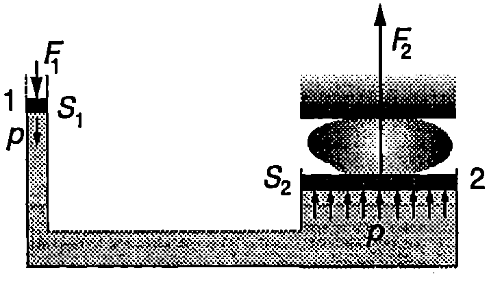
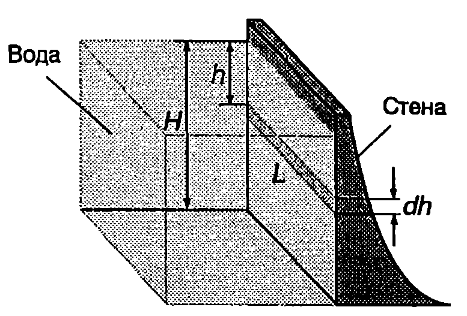
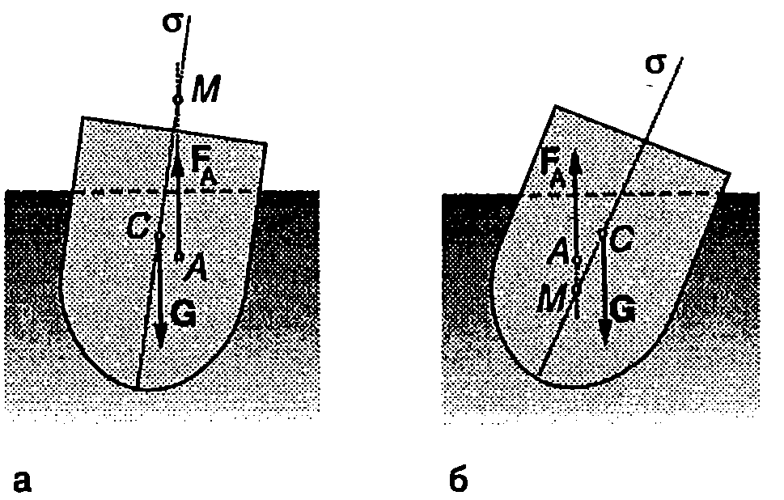
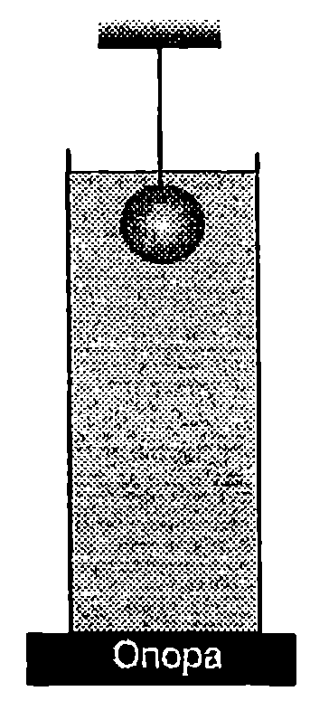

**Закон на Паскал**

Силите, които действат на всеки елемент от флуид, могат да се разделят на две групи: масови (обемни) сили и повърхнинни сили. Масовите сили са разпределени в целия обем на разглеждания елемент от флуида и са правопропорционални на неговата маса (масови са силата на тежестта и инерчните сили). Повърхнинните сили са приложени само върху повърхността на отделния елемент и характеризират взаимодействието му с останалата част от флуида.

Да отделим мислено в обема на флуид, който се намира в равновесие, малък куб с площ на стените $dS$. На него действа масовата сила на тежестта и повърхнинните сили на натиск, породени от налягането $p$ на околния флуид (Фиг. \ref{fig:24.1}). В неподвижните флуиди, поради отсъствие на еластичност на формата, не възникват тангенциални напрежения. Нека за момент се абстрахираме от действието на силата на тежестта, т.е. да пренебрегнем масата на флуида. Тогава от условието за равновесие следва, че силите на натиск $F = pdS$, които действат върху всяка двойка срещуположни стени на куба, трябва да се уравновесяват. В противен случай кубът би се движил по посока на по-голямата сила, което противоречи на условието, че флуидът е в покой. Тъй като площите $dS$ на всички стени на куба са еднакви, стигаме до заключението, че налягането $p$ върху тях също е еднакво. Ако кубът се допира до стените на съда (Фиг. \ref{fig:24.1}), условието за равновесие изисква налягането $p$ на флуида да е равно на външното налягане $p_0$, с което действа стената на съда.

Следователно в условия, когато може да се пренебрегне силата на тежестта, налягането във всички точки от неподвижен флуид е еднакво и равно на приложеното към флуида външно налягане $p_0 = const$. До това заключение пръв достига френският физик и математик Блез Паскал (1623-1662). Законът на Паскал гласи:

**Допълнителното налягане, приложено на произволно място върху затворен в съд несвиваем флуид, се предава без изменение във всички точки от флуида и върху стените на съда.**

Когато всяка сутрин в банята натискате с ръка тубичката с паста за зъби, вие виждате закона на Паскал в действие. На този закон се основава действието на хидравличните преси и други устройства, които използват затворени в съд течности. Принципът на действие на хидравличната преса се демонстрира от Фиг. \ref{fig:24.2}. Върху буталото с площ $S_1$ се прилага сила $F_1$, която създава налягане $p = F_1/S$,. Съгласно със закона на Паскал това налягане се предава без изменение във всички точки от течността и върху второто бутало, чиято площ е $S_2$. Течността действа на второто бутало със сила на натиск

$$F_2 = pS_2 = \frac{S_2}{S_1} F_1.
$$

При хидравличните преси $S_2\gg S_1$. Затова в резултат на действието на малката външна сила $F_1$, приложена към буталото 1, възниква многократно по-голяма сила на натиск върху буталото 2: казва се, че се печели сила. По аналогичен начин след натискане с малка сила на спирачния педал налягането се предава без изменение в спирачната течност и многократно се увеличава силата, с която челюстите или спирачните дискове действат на колелата на автомобила.


```

```
	`Фиг. 24.1`



```
Хидравлична преса.
```
	`Фиг. 24.2`


**Хидростатично налягане**

Да разгледаме вертикален съд, запълнен с еднородна несвиваема течност с плътност $\rho$. Отделяме мислено елемент от течността с форма на цилиндър, чиито основи с площ $S$ са успоредни на повърхността. Горната основа се намира на дълбочина $h$. Височината $dh$ на цилиндъра е безкрайно малка. Тъй като цилиндърът е в равновесие, трябва сумата от проекциите върху оста $h$ на всички повърхнинни и масови сили да е равна на нула (Фиг. \ref{fig:24.3})

$$Sp(h)-Sp(h+dh) + g\rho Sdh = 0.$$

Съкръщаваме $S$ и записваме уравнението във вида

$$dp = \rho gdh,$$

където $dp = p(h+dh) -p(h)$ e разликата в налягането върху двете основи на цилиндъра. След интегриране получаваме:

$$p = \rho gh + C.$$

Константата $C$ определяме от граничното условие: на повърхността на течността (при $h = 0$) налягането е равно на външното атмосферно налягане $p_0$, т.е. при $h = 0$, $p = C = p_0$. Следователно

$$p = \rho gh + p_0.
$$

Величината $\rho gh$ се нарича хидростатично налягане. Хидростатичното налягане е резултат от действието на силата на тежестта. В отворен съд с течност хидростатичното налягане е еднакво за всички точки, които се намират на определена дълбочина $h$. Съгласно със закона на Паскал всяко допълнително налягане има еднаква стойност в цялата течност. Следователно пълното налягане (външно + хидростатично) е еднакво във всички точки от течността, които лежат на една и съща хоризонтална равнина.


> [!question] Пример 24.1
Определете силата на натиск, с която водата действа на вертикална язовирна стена с широчина $L$. Язовирът е напълнен с вода до височина $H$ (Фиг. \ref{fig:24.4}).
\end{psexample}



```

```
	`Фиг. 24.4`

> [!note]- Решение
 Хидростатичното налягане на дълбочина $h$ е $p= \rho gh$, където $\rho$ е плътността на водата. (Не отчитаме атмосферното налягане, тъй като то действа и от двете страни на стената.) На тънка ивица от стената с широчина $dh$ и площ $dS = Ldh$, намираща се на дълбочина п (Фиг. \ref{fig:24.4}), водата действа със сила на нормален натиск $dF = pdS = \rho ghLdh$. Резултантната сила е

$$F = \int dF = \int_0^H \rho gLhdh = \frac{1}{2}\rho gLH^2.$$

Тъй като хидростатичното налягане нараства с дълбочината, долната част от стената в подложена на по-голям натиск отколкото горната част. Затова язовирните стени се правят по-дебели в основата си.


```

```
	`Фиг. 24.3`


**Манометри и барометри**

Манометрите и барометрите са уреди за измерване на налягане. Най-простият манометър представлява U-видна тръба, запълнена с течност, единият край на която е отворен, а другият е свързан към съд с газ, чието налягане в трябва да се определи (Фиг. \ref{fig:24.5}). Тъй като точки А и В лежат в една хоризонтална равнина, налягането в тях е еднакво. Следователно

$$p = p_A = p_B = \rho g h + p_0$$

Ако се измери разликата във височините $h$ на течността в двете рамена на манометъра, може да се определи налягането


```
Отворен манометър с течност.
```
	`Фиг. 24.5`


на газа в съда (атмосферното налягане $p_0$ е известно). На практика с такъв манометър се измерва разликата $\Delta p$ между налягане то на газа и външното атмосферно налягане, която е равна на хидростатичното налягане на стълба течност с височина $h$ в отворената тръба на манометъра:

$$\Delta p = p-p_0 = \rho gh.$$

През 1643 година ученикът на Галилей - италианският физик Евангелиста Торичели (1608-1647) създава първия живачен барометър, с който измерва атмосферното налягане. Барометърът на Торичели е стъклена тръба с дължина около 80 см, която отначало се запълва с живак, а след това се обръща и отвореният й край се потапя в съд с живак (Фиг. \ref{fig:24.6}). Част от живака се излива, а пространството над стълба живак се запълва единствено с пари на живака, чието налягане при стайна температура може да се пренебрегне, т.е. $p = 0$ (Фиг. \ref{fig:24.5}). Налягането в точка $A$ е равно на хидростатичното налягане $\rho gh$ на стълба живак, а налягането в точка $B$ e равно на външното атмосферно налягане $p_0$. Тъй като двете точки са на едно равнище, налягането в тях е еднакво: $p_0 = \rho gh$.


```
Живачен барометър (тръба на Торичели).
```
	`Фиг. 24.6`


Така чрез измерване на височината ѝ на живачния стълб може да се определи атмосферното налягане. Височината $h$, измерена в милиметри, се използва като извънсистемна единица за налягане: 1 mm На стълб е налягане, равно на хидростатичното налягане на живачен стълб с височина 1 mm,

Една *стандартна атмосфера* (1 atm) е налягане, равно на хидростатичното налягане на живачен стълб с височина точно равна на 760 mm при температура 0°C и земно ускорение $g = 9,\!80665\ \mathrm{m/s^2}$. При тази температура плътността на живака е $p = 13\ 595\ \mathrm{kg/m^3}$. От формулата за хидростатично налягане $p = \rho gh$ получаваме, че стандартната атмосфера е равна на

$$1\ \mathrm{atm} = (13595\ \mathrm{kg/m^3}) (9,\!80665\ \mathrm{m/s^2}) (0,\!760\ \mathrm{m}) = 101\ 325\ \mathrm{Pa}.$$

**Закон на Архимед**

Тъй като хидростатичното налягане нараства с дълбочината $h$, на по-долните части от повърхността на потопено в течност твърдо тяло течността действа с по-големи сили на нормален натиск, отколкото върху горната повърхност на тялото. В резултат на събирането на силите, действащи върху всички елементи от повърхността на тялото, се получава равнодействаща сила $\vec F_A$, насочена вертикално нагоре (Фиг. \ref{fig:24.7}а). Силата $\vec F_A$ се нарича изтласкваща сила.

Древногръцкият учен Архимед (3 в. пр.н.е.) открива закон, според който

**на всяко тяло, потопено в течност (или газ), действа изтласкваща сила, равна по големина на теглото на изместения от тялото обем течност (или газ).**

Изтласкващата (архимедова) сила $\vec F_A$ е насочена вертикално нагоре, а приложната и точка е центърът на тежестта на изместения обем течност (газ).

Законът на Архимед може да се изведе с помощта на следното просто разсъждение: Да разгледаме тяло с произволна форма, което е потопено в течност. Течността упражнява налягане върху тялото, т.е. действа върху неговата повърхност със


```

```
	`Фиг. 24.7`


сили на нормален натиск, чиято резултантна е изтласкващата сила $\vec F_A$ (Фиг. \ref{fig:24.6}а). Нека мислено отстраним тялото и освободения от него обем $V$ запълним със същата течност, която остава мислено отделена от околната течност с повърхност $S$, еднаква с повърхността на тялото (Фиг. \ref{fig:24.7}б). Тъй като при тази въображаема замяна повърхността 5 не се изменя по положение, форма и размери, силите на натиск, с които околната течност действа на повърхността $S$, също няма да се изменят. Не се променя и резултантната сила $\vec F_A$. Освен силата $\vec F_A$, на отделения обем от течността действа и силата на тежестта $\vec G_\text{т} = V\rho \vec g$. От условието, разглежданият обем течност да е в механично равновесие, следва, че силите $\vec F_A$ и $\vec G_\text{т}$ ca равни по големина и противоположни по посока, т.е. изтласкващата сила $\vec F_A$ е равна по големина на силата на тежестта $\vec G_\text{т}$ (следователно и на теглото) на изместения от тялото обем течност и е насочена вертикално нагоре. Освен това, силата $\vec F_A$ трябва да е приложена в същата точка, както силата на тежестта $\vec G_\text{т}$ -- в центъра на тежестта $A$ на изместения обем течност. В противен случай механичното равновесие се нарушава, защото двете сили образуват двойка сили, която създава въртящ момент.

**Плаване на телата**

На закона на Архимед се основава теорията на плаването, чийто основи полага швейцарският математик Леонард Ойлер (1707-1783). Обемът на изместената от плавателния съд (например кораб) вода се нарича *водоизместимост* на съда. Да разгледаме симетричен кораб, който се намира в равновесие на повърхността на водата. Силата на тежестта $\vec G$ на кораба се уравновесява от архимедовата сила $\vec F_A$. Архимедовата сила $\vec F_A$ е приложена в центъра на тежестта $A$ на изместения от кораба обем вода, който се нарича център на водоизместимост. Силата на тежестта обаче е приложена в центъра на тежестта $C$ на кораба. При накланяне на кораба положението на центъра на водоизместимост спрямо кораба се измества. Тогава приложните точки на силите $\vec G$ и $\vec F_A$ вече не лежат на една и съща вертикална линия: $\vec G$ и $\vec F_A$ образуват двойка сили. Когато двойката сили се стреми да изправи кораба, неговото положение е устойчиво. Ако двойката сили накланя още повече кораба - положението му е неустойчиво и той се преобръща.

За симетричен кораб центърът на тежестта $C$ лежи в равнината на симетрия а (Фиг. \ref{fig:24.8}). Точката $M$, в която линията на действие на архимедовата сила $\vec F_A$ пресича равнината на симетрия, се нарича метацентър. При накланяне на кораба положението на метацентъра се изменя. Корабът е устойчив, ако най-ниското положение, до което достига метацентърът, се намира над центъра на тежестта. Тогава двойката сили изправя кораба (Фиг. \ref{fig:24.8}а). Ако при накланянето метацентърът премине под центъра на тежестта $C$, двойката сили сменя посоката на въртене и преобръща кораба (Фиг. \ref{fig:24.8}б). Като мярка за устойчивостта на кораба служи разстоянието $CM$, наречено метацентрална височина. Колкото по-голяма е метацентралната височина, толкова по-устойчив е корабът.



```
а) Когато метацентърът M се намира над центъра на тежестта C, корабът е устойчив. 6) Ако M премине под C-корабът се преобръща.
```
	`Фиг. 24.8`


**Задачи**

1. Медицинска сестра натиска буталото на спринцовка със сила 10 N. Колко е налягането на течността в спринцовката, ако площта на буталото е 3 cm$^2$?

2. Пресметнете хидростатичната разлика в кръвното налягане (в паскали и в mm Hg стълб) на кръвта в мозъка и в пръстите на краката на човек, ако разликата във височините на тези две части от тялото е 170 cm. Плътността на кръвта е $1060\ \mathrm{kg/m^3}$.

3. Белите дробове на човека могат да функционират нормално, ако изменението на външното налягане не надминава 5\% от нормалното атмосферно налягане. На каква максимална дълбочина може да плува човек, който диша с помощта на шнорхел?

4. Ведро с вода се намира в асансьор, който се движи с ускорение $a$, насочено вертикално нагоре. Определете налягането $p$ на дълбочина А под повърхността на водата.

5. Пластмасово топче плава във вода. Колко е плътността на топчето, ако 3/4 от неговия обем се намира под водата? Плътността на водата e $1000\ \mathrm{kg/m^3}$.

6. В чаша, пълна догоре с вода, плава парче лед. Ще се излее ли вода от чашата, ако се стопи ледът? Обосновете отговора си.

7. Топче плава на границата на две несмесващи се течности, чиито плътности са дадени на Фиг. \ref{fig:24.9}. Колко е плътността $\rho_\text{т}$ на топчето?


```

```
	`Фиг. 24.9`


8. Обемът на първата теглилка $V_1$ (Фиг. \ref{fig:24.10}) е по-голям от обема $V_2$ на втората теглилка. Когато половината от обема на всяка от тях е потопен във водата, везните са уравновесени. Ще се наруши ли равновесието, ако теглилките изцяло се потопят във водата? Плътността и на двете теглилки е по-голяма от плътността на водата. Обосновете отговора си.


```

```
	`Фиг. 24.10`


9. Яйце плава в солена вода, при което 5\% от обема на яйцето се намира над водата. Ако внимателно върху солената вода се налее чиста вода, така че солената и чистата вода да не се смесват, тогава половината от обема $V$ на яйцето ще е потопен в чистата вода, а другата половина в солената вода. Колко е плътността $\rho_c$ на солената вода? Плътността на чистата вода е $\rho = 999\ \mathrm{kg/m^3}$.

10. Кълбо с обем $V$ и плътност $\rho_1$ е завързано към външна опора и е потопено изцяло в дълбок съд с течност с плътност $\rho_2$ (Фиг. \ref{fig:24.11}). Срязват нишката и кълбото потъва надолу в течността, като достига максималната си скорост преди да докосне дъното на съда. Теглото на течността заедно със съда е $P$. Определете силата $P_1$, с която съдът натиска опората:

а) преди да се среже нишката;

6) непосредствено след нейното срязване;

в) когато кълбото се движи с постоянна скорост.



```

```
	`Фиг. 24.11`


11. В опростен модел звезда се разглежда като кълбо с радиус $R$ от несвиваем флуид с плътност $\rho$. Ускорението на свободно падане на повърхността на звездата е $g_0$. Вътре в звездата ускорението на свободно падане се изменя по закона $\displaystyle g = \frac{g_0}{R}r$, където $r$ е разстоянието до центъра на звездата. Определете хидростатичното налягане на флуида като функция от разстоянието $r$ до центъра на звездата. Колко е налягането в центъра на звездата?


