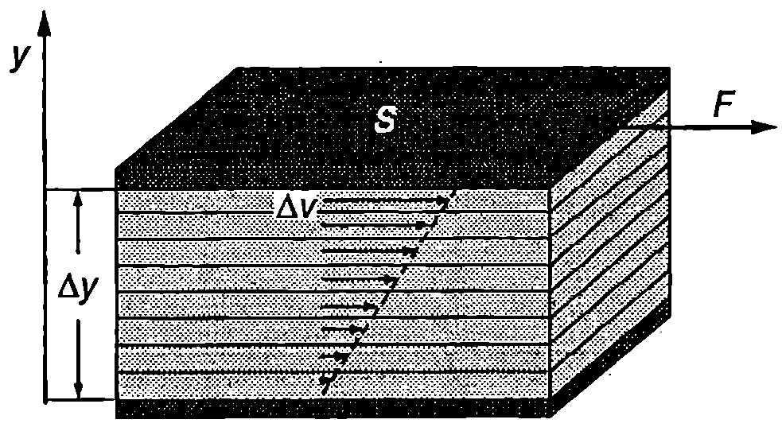
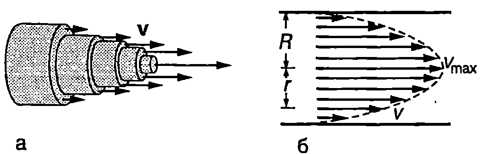
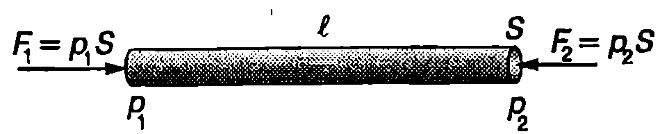

**Вискозитет**

От закона на Бернули за идеален флуид следва, че ако флуидът тече с постоянна скорост по цилиндрична хоризонтална тръба, налягането във всички сечения на тръбата е еднакво (вж. уравнение \eqref{eq:25.9}). Опитът обаче показва, че стационарно течение е възможно само ако се поддържа постоянна разлика в налягането в двата края на тръбата. Налягането трябва да намалява по дължината на тръбата, за да може натискът, породен от тази разлика в налягането, да преодолее силите на вътрешно триене, препятстващи движението на реалните флуиди.

Когато два слоя от реален флуид се движат (хлъзгат) един спрямо друг, между тях възникват тангенциални сили на взаимодействие, които се стремят да забавят слоя, който се движи с по-голяма скорост, и да ускорят слоя с по-малка скорост. На причините за възникване на такива сили ще се спрем по-подробно в \ref{sec:35}. Тук ще се ограничим с разглеждането само на закона за вътрешното триене, открит експериментално от Нютон.

На Фиг. \ref{fig:26.1} са показани две еднакви успоредни пластинки, всяка с площ $S$, разделени от тънък слой флуид. Долната пластинка се придържа неподвижна, а горната се движи със скорост $\Delta v$ спрямо нея. Опитът показва, че за такова движение на горната пластинка е необходима сила с големина $F$, която е правопропорционална на площта $S$ на пластинките и на разликата в техните скорости $\Delta v$ и е обратнопропорционална на разстоянието $\Delta y$ между двете пластинки



```

```
	`Фиг. 26.1`


$$F = \eta S \frac{\Delta v}{\Delta y}.
$$

Коефициенът на пропорционалност $\eta$ (ета) се нарича *коефициент на вътрешно триене* или *вискозитет* на флуида. Тъй като частиците, които са в непосредствена близост до двете пластинки, прилепват към тях, уравнение \eqref{eq:26.1} всъщност изразява тангенциалната сила на взаимодействие между два слоя от флуида, които се движат с различни скорости. Когато разстоянието между слоевете е безкрайно малко ($dy$), тангенциалната сила на вътрешно триене между тях е
$$F = \eta S \frac{d v}{d y}.
$$

Величината $dv/dy$ се нарича *градиент на скоростта*. Той характеризира бързината, с която се изменя скоростта в направление на оста $y$. Уравнение \eqref{eq:26.2} изразява закона на Нютон за вътрешното триене.

Единицата за вискозитет се въвежда от закона на Нютон за вътрешното триене

$$\eta = \frac{Fdy}{Sdv} \to [\eta] = \mathrm{\frac{N\cdot m}{m^2\cdot m/s}}= \mathrm{Pa\cdot s}$$

Вискозитетът $\eta$ е характеристика на флуида. Например маслата имат голям вискозитет, а водата по-малък. Вискозитетът на газовете е много по-малък от вискозитета на течностите. За даден флуид вискозитетът зависи от параметрите, характеризиращи вътрешното му състояние, и преди всичко от температурата. В таблица 26.1 са дадени вискозитетите на някои флуиди при различни температури.

**Ламинарно и турбулентно течение**

Вискозен флуид тече по цилиндрична тръба. Частиците, които са в контакт със стената на тръбата, прилепват към нея и са неподвижни. Ако мислено разделим флуида на тънки цилиндрични слоеве, те ще се хлъзгат един спрямо друг, движейки се с различни скорости. Колкото по-далеч от


\begin{table}

	\begin{tabular}{cccccc}
	Температура, °C& Рициново масло& Вода& Сух въздух& Кръв& Кръвна плазма\\
	0& 5,3& 1,792.$10^{-3}$& 1,71.$10^{-5}$& & \\
	20& 0,986& 1,005.$10^{-3}$& 1,81.$10^{-5}$& 3.$10^{-3}$& 1,8.$10^{-3}$
\\
	37& & 0,695.$10^{-3}$& 1,87.$10^{-5}$
& 2,08.$10^{-3}$& 1,26.$10^{-3}$\\
	60& 0,08& 0,469.$10^{-3}$& 2,00.$10^{-5}$& & \\
	80& 0,03& 0,357.$10^{-3}$& 2,09.$10^{-5}$ & & \\
	100& 0,017& 0,284.$10^{-3}$& 2,18.$10^{-5}$& & \\
	\end{tabular}
```
Вискозитет на някои флуиди в единици Pa-s
```
	\label{tab:26.1}
\end{table}

стените на тръбата е един слой, толкова по-голяма в неговата скорост. Максимална е скоростта на частиците, които се движат по оста на тръбата (Фиг. \ref{fig:26.2}а). Течение, при което частиците на флуида като че ли са разделени на отделни слоеве, които само се хлъзгат един спрямо друг, без да се смесват, се нарича *ламинарно* течение (от латински lamina пластинка). Ламинарното движение е стационарно: то е устойчиво и картината на токовите линии не се изменя с течение на времето.

Доказва се (вж. пример 26.3), че при ламинарно течение по дълга цилиндрична тръба скоростта в произволно напречно сечение на тръбата се изменя по закона

$$v = v_{\max} \left(1-\frac{r^2}{R^2}\right).
$$

където $R$ е радиусът на тръбата, $r$ -- разстоянието до нейната ос, а $v_{\max}$ е скоростта на частиците, които се движат по оста на тръбата. Параболичният профил на скоростта, съответстващ на уравнение \eqref{eq:26.3}, е показан на Фиг. \ref{fig:26.2}б. Важна характеристика на течението е неговата средна скорост $v_\text{ср}$. Това е такава постоянна скорост, еднаква за всички частици от флуида, при движение с която през напречното сечение на тръбата за единица време би преминавал същият обем от флуида, както при реалното течение, където отделните слоеве се движат с различни скорости.

Доказва се (вж. пример \ref{ex:26.3}), че когато разпределението на скоростта се описва с уравнение \eqref{eq:26.3}, средната скорост е

$$v_\text{ср} = \frac{v_{\max}}{2}.
$$

Ламинарно течение се демонстрира с опита от Фиг. \ref{fig:26.3}а. По оста на тръба, по която тече вода, се пуска тънка струя от оцветена вода. Когато течението е ламинарно, струята остава ясно очертана и не се смесва с чистата водата. При увеличаване на скоростта на водата настъпва момент, когато рязката граница между оцветената и неоцветената течност изчезва (Фиг. \ref{fig:26.3}б). Започва смесване на водата от различните слоеве и течението става турбулентно (от латински turbulentus - неспокоен). Скоростта, при която ламинарното течение преминава в турбулентно,


```
а) Ламинарно движение; б) турбулентно движение.
```
	`Фиг. 26.3`


се нарича критична скорост. При турбулентно течение частиците на флуида се движат по сложни, пресичащи се траектории, които непрекъснато се изменят с времето.



```
Ламинарно течение по цилиндрична тръба.
```
	`Фиг. 26.2`


Теоретичният анализ на движението на вискозен флуид показва, че по принцип е възможно ламинарно течение с произволно големи скорости -- такова движение не противоречи на законите на хидродинамиката. Оказва се обаче, че само ламинарните течения с малки скорости са устойчиви. Ако в такова течение в някоя малка област възникне флуктуация, т.е. отклонение от стационарността, тя бързо затихва с времето и не оказва влияние на общия поток на флуида. Обратно, дори много малки флуктуации, възникващи в бързи ламинарни течения, се разрастват и обхващат все по-големи обеми от флуида. Затова ламинарните течения с голяма скорост са неустойчиви и не се реализират на практика. Като критерий за устойчивостта на течението

служи безразмерната величина

$$\mathrm{Re} = \frac{\rho v_\text{ср} l}{\eta},
$$

наречена *число на Рейнолдс* в чест на ирландския физик и инженер Осборн Рейнолдс (1842-1912). Числото на Рейнолдс се определя от плътността $\rho$ на флуида, от неговата средна скорост $v_\text{ср}$, от характерния размер на напречното сечение на потока $l$ (например диаметъра на тръбата, по която тече флуида: $l = d$) и от вискозитета $\eta$ на флуида. За всяко конкретно течение съществува определена *критична стойност* $\mathrm{Re}_\text{кр}$ на числото на Рейнолдс. Когато Re < $\mathrm{Re}_\text{кр}$, ламинарното течение е устойчиво и се реализира на практика. При Re > $\mathrm{Re}_\text{кр}$ ламинарното движение става неустойчиво, случайните флуктуации се разрастват и движението преминава в турбулентно. Критичната стойност на числото на Рейнолдс обикновено се определя експериментално. За течение по кръгла цилиндрична тръба $\mathrm{Re}_\text{кр}$ е около 2200. Загубата на устойчивост и преходът към турбулентност, както и детайлната характеристика на турбулентните течения, са едни от най-сложните въпроси на хидродинамиката, които все още не са напълно изучени.

Турбулентните течения се характеризират с по-големи загуби на енергия, отколкото ламинарните. Освен че се отделя топлина в резултат на вътрешното триене, при турбулентните движения се излъчват и механични (звукови вълни) с хаотично изменящи се честоти и амплитуди, т.е. такова движение е съпроводено от звуков шум. Регистрирането на шума, свързан с турбулентното движение на кръвта, дава възможност да се изследва сърдечната дейност и да се регистрират някои сърдечни аномалии.

> [!question] Пример 26.1
По аортата кръвта се движи със средна скорост 0,3 m/s, а по една от артериите със скорост 0,02 m/s. Диаметърът на аортата е 2 cm, а на артерията 0,8 cm. Пресметнете числото на Рейнолдс за потока на кръвта в двата кръвоносни съда и направете извод за характера на течението. Плътността на кръвта е $\rho = 1,\!1.10^3\ \mathrm{kg/m^3}$, а вискозитетът й е $\eta = 2,\!1.10^{-3}$ Pas.
\end{psexample}
> [!note]- Решение
 Числото на Рейнолдс за кръвния поток през аортата (цилиндрична тръба) е

$$\mathrm{Re} = \frac{\rho v_\text{cp}}{\eta} = \frac{(1,\!1.10^3 \ \mathrm{kg/m^3}) (0,\!3 \ \mathrm{m/s}) (0,\!02 \ \mathrm{m})}{2,\!1.10^{-3} \ \mathrm{Pa\cdot s}} = 3100.$$

Тъй като Re > $\mathrm{Re}_\text{кр}$ ($\mathrm{Re}_\text{кр}$ = 2200), кръвният поток през аортата е турбулентен.

За артерията: Re = 80. Следователно движението на кръвта по артериите е ламинарно.

Ще обърнем внимание, че получените резултати имат характер само на груба оценка. Кръвта съдържа твърди частици, а нейният вискозитет зависи от скоростта.

**Формула на Поазьой**

Френският физик Жан Луи Мари Поазьой (1799-1869) изследва движението на кръвта в кръвоносните съдове и установява експериментално, че обемният поток $Q$, т.е. обемът вискозен флуид, преминал за единица време през напречното сечение на цилиндрична тръба, е правопропорционален на разликата в налягането $\Delta p$ в двата края на тръбата и на четвъртата степен на нейния радиус $R$. Освен това потокът е обратнопропорционален на дължината $l$ на тръбата и на вискозитета $\eta$ на флуида

$$Q = \frac{\pi R^4 \Delta p}{8\eta\rho}.
$$

Уравнение \eqref{eq:26.6} се нарича *формула на Поазьой*. Тя е в сила за ламинарен поток, но с приближение може да се прилага и за някои турбулентни течения, например за кръвоносната система на човека и животните. Специално ще подчертаем силната зависимост ($R^4$) на обемния поток $Q$ от радиуса $R$ на тръбата. Например, ако радиусът $R$ се увеличи само с 19\%, потокът нараства 2 пъти. Тази силна зависимост на $Q$ от $R$ дава възможност чрез съкращаване на мускулите, които обвиват стените на кръвоносните съдове, лесно да се регулира потокът на кръвта дори малко свиване на кръвоносния съд води до значително намаляване на кръвния поток. От друга страна, например поради артеросклероза, еластичността на кръвоносните съдове намалява, а отлагането на холестерин върху стените им води до намаляване на техния вътрешен радиус. За да се подържа нормалното за организма кръвообръщение, трябва да се увеличи разликата в налягането $\Delta p$, което от своя страна води до претоварване на сърцето.

> [!question] Пример 26.2
Обемният поток на кръвта през голямата артерия на куче е $Q = 1\ \mathrm{cm^3/s}$. Радиусът на артерията е $R = 0,\!4$ cm. Определете:

а) средната и максималната скорост на кръвта;

б) разликата в налягането $\Delta p$ в двата края на участък от артерията с дължина $l = 10$ cm;

в) необходимата мощност $P$ за поддържане на кръвния поток през този участък от артерията.

Вискозитетът на кръвта е $\eta = 2,\!1.10^{-3}$ Pa-s.
\end{psexample}
> [!note]- Решение
 а) Обемният поток $Q$ е равен на произведението от средната скорост $v_\text{ср}$ и напречното сечение $S$ на тръбата. Следователно

$$v_\text{ср} = \frac{Q}{S} = \frac{Q}{\pi R^2} = \frac{(1.10^{-6}\ \mathrm{m^3/s})}{3,\!14(4.10^{-3}\ \mathrm{m})^2} =0,\!02\ \mathrm{\frac{m}{s}}.$$

Максималната скорост на кръвта определяме от формула \eqref{eq:26.4}

$$v_{\max} = 2 v_\text{ср} = 0,\!04 \mathrm{\frac{m}{s}}.$$

б) Разликата в налягането определяме от формулата на Поазьой \eqref{eq:26.6}
$$\Delta p = \frac{8\eta l v_\text{ср}}{R^2} = \frac{8(2,\!1.10^{-3} \ \mathrm{Pa\cdot s}) (0,\!1\ \mathrm{m}) (0,\!02\ \mathrm{m/s})}{(4.10^{-3} \ \mathrm{m})2} = 2,\!1 \ \mathrm{Pa}.$$



```

```
	`Фиг. 26.4`


в) Резултантната сила на натиск, която действа на кръвта в разглеждания участък от артерията (Фиг. \ref{fig:26.4}), е: $F = S(p_1 - p_2) = S\Delta p.$

Механичната мощност на силата $F$ e $P = Fv_\text{ср} = S\Delta p v_\text{ср} = \pi R^2 \Delta p v_\text{ср} = 2,\!1.10^{-6} W$.

Пресметнатата механична мощност се получава в резултат на работата на сърцето. Силите на вътрешно триене преобразуват механичната енергия в топлина. За сравнение ще отбележим, че скоростта на метаболизма в случая е около 10 W, т.е. механичната мощност на сърцето е една много малка част от общата мощност, отделена при обмяната на веществата.

> [!question] Пример 26.3
По хоризонтална цилиндрична тръба с дължина $l$ и радиус $R$ тече несвиваем флуид с вискозитет $\eta$. Налягането в двата края на тръбата е съответно $p_1$ и $p_2$ (Фиг. \ref{fig:26.4}).

а) Изразете скоростта $v$ на флуида като функция от разстоянието до оста на тръбата и определете максималната скорост $v_{\max}$.

б) Определете обемния поток $Q$ на флуида.

в) Докажете, че средната скорост $v_\text{ср}$ на флуида е равна на половината от максималната му скорост $v_{\max}$.
\end{psexample}
> [!note]- Решение
 а) Да отделим мислено от потока цилиндър с радиус $r$, чиято ос съвпада с оста на тръбата (Фиг. \ref{fig:26.5}а). На флуида в цилиндъра действа хоризонтална сила на натиск с големина $F_1 = (p_1 - p_2) S=(p_1-p_2) \pi r^2$, насочена по посока на движението на флуида. Освен това околният флуид действа на повърхността на цилиндъра със сила на вътрешно триене $F_2$, която е насочена в противоположната посока и се стреми да забави флуида. Големината на силата на вътрешно триене се изразява от закона на Нютон \eqref{eq:26.2}

$$F_2 = -\eta S_2\frac{dv}{dr} = -\eta 2\pi rl\frac{dv}{dr},$$


```

```
	`Фиг. 26.5`


където $S_2 = 2\pi rl$ е околната повърхност на цилиндъра, а $dv/dr$ e градиентът на скоростта: скоростта се изменя най-бързо в радиално направление от оста на тръбата към нейната повърхност. Знакът минус отчита, че скоростта на флуида намалява при отдалечаване от оста на тръбата, т.е. при $dr >0$ $dv < 0$. При стационарно течение двете сили се уравновесяват, т.е. $F_1 = F_2$ или
$$(p_1-p_2)\pi r^2 = -\eta 2\pi r l \frac{dv}{dr}.$$
Разделяме променливите ги и
$$dv=-\frac{p_1 - p_2}{2\eta l}rdr.$$
Интегрираме и получаваме
$$v = -\frac{p_1 - p_2}{4\eta l} r^2 +C.$$

Стойността на константата $C$ определяме от граничното условие: частиците на флуида, които са в контакт с тръбата, прилепват към нея и остават неподвижни, т.е. $v = 0$ при $r = R$.

Следователно $\displaystyle C=\frac{p_1-p_2}{4\eta l}R^2$. Заместваме $C$ и получаваме зависимостта на скоростта $v$ на флуида от разстоянието $r$ до оста на тръбата

$$v = \frac{(p_1- p_2)R^2}{4\eta l}\left(1-\frac{r^2}{R^2}\right).$$

Функцията $v(r)$ има максимум при $r=0$, т.е. частиците, преминаващи по оста на тръбата, се движат с максимална скорост

$$v_{\max} = \frac{(p_1 - p_2)R^2}{4\eta l}.$$

6) Разделяме мислено напречното сечение на тръбата на тънки концентрични пръстени. На Фиг. \ref{fig:26.5}б е показан един от пръстените с радиус $r$, дебелина $dr$ и площ $dS = 2\pi rdr$. Тъй като пръстенът е безкрайно тънък, всички частици, преминаващи през него, се намират на еднакво разстояние от оста на тръбата и имат еднаква скорости. Обемният поток на флуида през разглеждания пръстен е

$$dQ=vds =\frac{(P_1-P_2)R^2}{4\eta l} (1-\frac{r^2}{R^2})2\pi r dr.$$

За да определим потока през цялото напречно сечение на тръбата, интегрираме в граници от $r = 0$ до $r = R$
$$Q = \frac{\pi (p_1 - p_2)R^2}{2\eta l}\int_0^R(r-\frac{r^3}{R^2})dr.$$
Получаваме формулата на Поазой \eqref{eq:26.6}
$$Q = \frac{\pi(p_1 - p_2) R^4}{8\eta l} = \frac{\pi R^4 \Delta p}{8\eta l},$$
където $\Delta p= (p_1 - p_2)$ е разликата в налягането в двата края на тръбата.

в) По определение $Q = S v_\text{ср} = \pi R^2 v_\text{ср}$. Приравняваме десните страни на това равенство и формулата на Поазьой и изразяваме средната скорост
$$v_\text{ср} = \frac{(p_1 - p_2) R^2}{8\eta l} = \frac{v_{\max}}{2},$$
където сме отчели получения в подточка а) резултат за максималната скорост $v_{\max}$.

**Задачи**

1. Върху голяма хоризонтална плоча в поставена стъклена пластинка с площ $S = 0,\!1$ m$^2$ Между пластинката и плочата има тънък слой от течност с постоянна дебелина $d = 2$ mm. Каква хоризонтална сила трябва да се приложи към пластинката, за да се движи тя със скорост $v = 0,\!1$ m/s? Разгледайте случаите, когато течността е:

а) вода с вискозитет $\eta$ = 0,001 Pas;

б) масло с вискозитет $\eta$ = 0,01 Pas.

Защо маслото се предпочита пред водата като смазочен материал?

2. Как ще се измени кръвният поток през артерия, ако радиусът на артерията се намали $\sqrt{2}$ пъти? Разликата в налягането да се приеме за постоянна.

3. Аортата на възрастен човек има радиус $R = 1,\!3$ cm. Определете изменението на налягането $\Delta p$ на разстояние $l = 20$ cm по нейната дължина, ако кръвният поток е $Q = 0,\!1\ \mathrm{l/s}$. Вискозитетът на кръвта е $\eta = 2,\!1.10^{-3}$ Pas.

4. От вертикална цилиндрична тръба, запълнена с вискозна течност, за време изтича половината течност. За колко време ще изтече цялата течност?

5. Тънка цилиндрична тръба с дължина в и диаметър $d$ е запълнена изцяло с течност с плътност $\rho$ и вискозитет $\eta$. Определете времето, за което ще изтече течността от тръбата, ако тя е наклонена под ъгъл $\alpha$ спрямо хоризонта.
