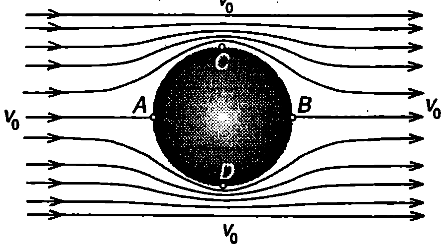
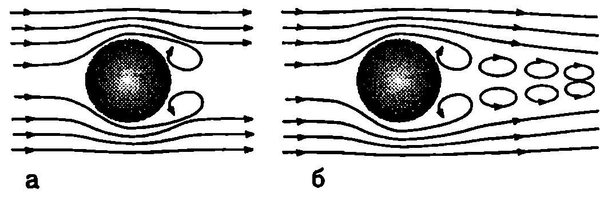
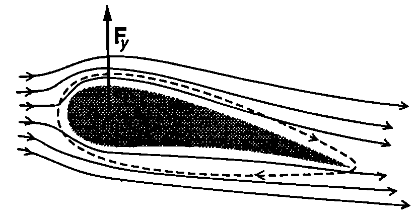

**Парадокс на Д'Аламбер - Ойлер**

През 1744 година френският математик Жан Льо Ронд Д'Аламбер (1717-1783) и независимо от него Ойлер (през 1745 г.) доказват теоретично, че при праволинейно и равномерно движение на твърдо тяло с произволна форма в безкраен идеален флуид тялото не изпитва съпротивление от страна на флуида. Опитът обаче показва друго: всички флуиди оказват съпротивление на движещите се в тях тела. Това несъответствие между изводите на теорията и резултатите от експеримента в наречено парадокс на Д'Аламбер Ойлер.

За да изясним отсъствието на съпротивление, ще анализираме частния случай, когато твърдо тяло с форма на кълбо се движи праволинейно и равномерно със скорост $v_0$ в безкраен идеален флуид. Удобно е задачата да се разглежда в отправна система, свързана с тялото. В тази отправна система тялото е неподвижно, а далеч от него частиците на флуида се движат по праволинейни траектории с постоянна скорост $v_0$ - токовите линии са успоредни прави. В близост до кълбото те се закривяват и симетрично го обхващат от всички страни (Фиг. \ref{fig:27.1}). В челната точка $A$ и в задната точка $B$, където се прекъсва токова линия, скоростта на флуида е нула, а налягането съгласно със закона на Бернули е максимално. Най-голяма е скоростта на флуида, обтичащ кълбото, в точки C и D, където токовите линии са най-гъсто разположени. От закона на Бернули следва, че в тези точки налягането е минимално. Следователно в предната полусфера налягането е максимално в челната точка $A$, след това намалява и достига минимална стойност върху окръжността, разделяща предната и задната полусфери. След това налягането нараства и в най-задната точка $B$ достига същата максимална стойност, както в челната точка $A$. Поради симетрията, разпределението на налягането върху двете полусфери е еднакво и резултантната на силите на нормален натиск върху кълбото е нула. Тъй като флуидът е идеален, той не действа на тялото с тангенциални сили. Така стигаме до извода, че резултантната сила, с която флуидът действа на кълбото, в нула, т.е. той не оказва съпротивление на движението на тялото.

**Граничен слой и откъсване**



```

```
	`Фиг. 27.1`


```

```
	`Фиг. 27.2`


Главната причина за възникване на сили на съпротивление при движение на твърдо тяло във флуид е вискозитетът. Преди да разгледаме тези сили ще се спрем на влиянието на вискозитета върху обтичането на твърдо тяло от флуид. Към повърхността на тялото прилепват частици от вискозния флуид и се образува тънък преходен слой, наречен *граничен слой*, в който скоростта на флуида плавно се изменя от нула върху повърхността на тялото до някаква крайна стойност, характерна за Външния поток. Извън граничния слой градиентът на скоростта $dv/dy$ в перпендикулярно на потока направление е нула и съгласно със закона на Нютон \eqref{eq:26.2} сили на вътрешно триене не възникват. Следователно вискозитетът на флуида се проявява само в граничния слой. Бихме могли условно да приемем, че твърдото тяло заедно с обвиващия го граничен слой образуват едно ново ``ефективно'' тяло, което се обтича от идеален флуид. Налягането върху ефективното тяло, т.е. върху външната повърхност на граничния слой, се изменя по аналогичен начин, както в разгледания вече пример с кълбото, обтичано от идеален флуид. В челната част налягането е голямо, след това намалява, а в задната част отново нараства. По същия начин се разпределя налягането и в граничния слой. Скоростта на флуида в него обаче е по-малка от скоростта на външния флуид. Затова, докато повишаващото се налягане по посока на потока води само до известно намаляване на скоростта на флуида извън граничния слой, то може да преустанови движението на по-бавните частици от граничния слой и дори да ги накара да се движат в обратна посока. На Фиг. \ref{fig:27.2} схематично е показано разпределението на скоростите в граничния слой. Под линията на нулева скорост възниква обратно течение, което води до нарастване на дебелината $\delta$ на граничния слой и до откъсване на потока от твърдото тяло. Точката $S$, от която започва линията на нулевата скорост, се нарича *точка на откъсване*. С течение на времето масата на флуида, въвлечен в обратното движение, нараства и основният поток се изтласква все по-далеч от повърхността на тялото. Възниква област на турбулентно вихрово движение, която навлиза в обема на флуида. Нейната граница е неустойчива, в определен момент се затваря и тази област се откъсва от повърхността на тялото под формата на *вихър*. Вътре във вихъра частиците на флуида извършват въртеливо движение. Законът за запазване момента на импулса изисква едновременно да се откъсват по два вихъра, в които частиците да се въртят в противоположни посоки: общият момент на импулса на двата вихъра е нула (Фиг. \ref{fig:27.3}а). След като се откъснат от тялото, вихрите се отнасят от основния поток, като образуват *вихрова улица* зад него (Фиг. \ref{fig:27.3}б).



```

```
	`Фиг. 27.3`


**Аеродинамични сили**

Вискозните флуиди действат на движещи се в тях твърди тела със сили на натиск и на вътрешно триене, разпределени по цялата повърхност на тялото. Резултантната на тези сили се нарича аеродинамична сила. Посоката и големината на аеродинамичната сила $\vec F$ зависи от формата и размерите на тялото, от неговата ориентация спрямо посоката на движение, от скоростта и ускорението, от свойствата на флуида и др. Аеродинамичната сила може да се разложи на две компоненти: $\vec F_x$, насочена обратно на посоката на движение, и $\vec F_y$ - перпендикулярна на посоката на движение (Фиг. \ref{fig:27.4}). Силата $\vec F_x$ се нарича сила на челно или аеродинамично съпротивление, а $\vec F_y$ аеродинамична подемна сила.


```
Аеродинамичната сила $\vec F$ има две компоненти: челно съпротивление $\vec F_x$ и подемна сила $\vec F_y$
```
	`Фиг. 27.4`


Определянето на аеродинамичните сили при зададени условия на полета е основната задача на аеродинамиката. В повечето случаи тя се решава експериментално. Аеродинамичните експерименти се извършват в специални аеродинамични тръби и тунели, в които се моделира движението на самолети, ракети, снаряди и др.

Тук ще се ограничим само с качествено разглеждане на причините за възникването на аеродинамични сили и на основните закони, които ги описват.

Челно съпротивление

Два са основните фактори, определящи челното съпротивление при движение със скорости, по-малки от скоростта на звука във флуида (дозвукови скорости):

1. тангенциалните сили на вътрешно триене;

2. откъсването на потока от повърхността на тялото, водещо до образуване на вихри.

Кой от двата фактора в преобладаващ, зависи от скоростта или по-точно от

числото на Рейнолдс $\displaystyle \mathrm{Re} = \frac{v\rho l}{\eta}$, където в случая $l$ е характерният размер на тялото, $v$ е скоростта на тялото, а $\rho$ и $\eta$ както и във формула \eqref{eq:26.5} са съответно плътността и вискозитетът на флуида.

При малки скорости (Re < 1) вискозитетът на флуида се проявява непосредствено чрез тангенциалните сили на вътрешно триене, които се стремят да забавят тялото. Британският физик Джордж Габриел Стокс (1819-1903) установява, че големината на силата на вътрешно триене $F_c$ е правопропорционална на скоростта на тялото и на вискозитета $\eta$ на флуида и зависи от размерите и формата на тялото. За сферично тяло с радиус $r$ силата на вътрешно триене е равна на
$$F_c = 6\pi\eta r\nu.
$$

Формулата на Стокс \eqref{eq:27.1} има разнообразни практически приложения. С нейна помощ например може да се изчисли постоянната скорост $v_0$, която достига частица (прашинка, капка и др.) при свободно падане във вискозна среда. Може също така, ако се измери $v_0$, да се определи радиусът на частицата.

При увеличаване на скоростта на тялото (при Re$\geq$ 1) вискозитетът започва да оказва непряко влияние на челното съпротивление посредством явленията откъсване на потока и образуване на вихри. Тези явления водят до изменение на разпределението на налягането около твърдо то тяло: налягането в зоната на турбулентно вихрово движение (вихрова улица) се понижава и възниква резултантна сила на натиск $\vec F_x$, насочена в противоположна на движението посока. Още Нютон установява експериментално, че големината на силата на натиск $F_x$ е правопропорционална на квадрата на скоростта $v$ на тялото

$$F_x=\frac{1}{2}C_x\rho Sv^2.
$$

където $\rho$ е плътността на флуида, $S$ е площта на проекцията на тялото върху равнина, перпендикулярна на посоката на неговата скорост. $C_x$ е числен коефициент, наречен *коефициент на челно съпротивление*, чиято стойност зависи от формата на тялото. Телата със заоблена и удължена форма (Фиг. \ref{fig:27.5}а) имат малък коефициент на челно съпротивление. Те се обтичат добре от флуида, при което скоростта му се променя плавно и възникващите разлики в налягането са малки. Затова областта, в която става откъсване на потока и се образуват вихри, е изместена в най-задната (стеснена) част на тялото. Вихровата улица е много тясна, поради което челното съпротивление е малко. Обратно, ако тялото е ограничено от остри ръбове (Фиг. \ref{fig:27.5}б), около тях налягането рязко се изменя, което води до интензивни обратни потоци и образуване на вихри: вихровата улица е широка и коефициентът на челно съпротивление е голям. Силите на вътрешно триене и силите на натиск, които възникват при движение на твърдо тяло във вискозен флуид, водят до необратимо превръщане на кинетичната енергия на тялото във вътрешна енергия. Силите на вътрешно триене в граничния слой непосредствено преобразуват кинетичната енергия в топлинна енергия. Силите на натиск преобразуват част от кинетичната енергия на тялото в кинетична енергия на вихрите, която впоследствие се трансформира във вътрешна енергия и флуидът се загрява. Друг механизъм на дисипация на кинетичната енергия е превръщането й в енергия на ударните вълни, които се създават при движение с много големи (свръхзвукови) скорости. Затова при преминаване на звуковата бариера челното съпротивление рязко нараства.


```

```
	`Фиг. 27.5`


> [!question] Пример 27.1
Определете радиуса $r$ на сферична прашинка, ако тя пада във въздух с постоянна скорост $v_0 = 2$ cm/s. Плътността на прашинката е $\rho = 2.10^3\ \mathrm{kg/m^3}$. Плътността на въздуха е $\rho_0 = 1,\!2\ \mathrm{kg/m^3}$, а вискозитетът му е $\eta = 1,\!8.10^{-5}$ Pa-s. Обосновете приложимостта на формулата на Стокс в този случай.
\end{psexample}
> [!note]- Решение
 На прашинката действат три сили: силата на тежестта $G = mg = \rho Vg$, където $V = \frac{4}{3}\pi r^3$ е обемът на прашинката; архимедовата сила $F_A= \rho_0 Vg$, силата на вътрешно триене, която се определя по формулата на Стокс $F_c = 6\pi\eta rv$. Посоките на трите сили са показани на Фиг. \ref{fig:27.6}. Големините на силите $G$ и $F_A$ не зависят от скоростта, докато големината на силата на съпротивление $F_c$ нараства линейно със скоростта. Затова отначало скоростта на прашинката нараства, докато се достигне някаква максимална скорости, при която равнодействащата на трите сили става нула.
След това движението продължава с постоянна скорост. От условието (Фиг. \ref{fig:27.6})


```

```
	`Фиг. 27.6`

$$G = F_A + F_c$$
или
$$\rho \left(\frac{4}{3}\pi r^3\right)g = \rho_0 \left(\frac{4}{3}\pi r^3\right)g +6\pi\eta r v_0$$
определяме радуса на прашинката
$$r = \sqrt{\frac{9\eta v_0}{2(\rho - \rho_0)g}} = \sqrt{\frac{9\eta v_0}{2\rho g}} = 9.10^{-6}\ \mathrm{m}.$$

Критерий за приложимостта на формулата на Стокс е стойността на числото на Рейнолдс. В случая тя е

$$\mathrm{Re} = \frac{v_0 \rho_0 r}{\eta} = \frac{(0,\!02\ \mathrm{m/s}) (1,\!2\ \mathrm{kg/m^3}) (9.10^{-6}\ \mathrm{m})}{1,\!8.10^5\ \mathrm{Pa\cdot s}} = 0,\!012.$$

Тъй като числото на Рейнолдс е много по-малко от единица, определящо е съпротивлението на вискозно триене, което се описва с формулата на Стокс.

**Подемна сила**


```

```
	`Фиг. 27.7`


Подемна сила възниква при обтичане на несиметрично тяло, например крило на самолет. Напречното сечение на крилото, показано на Фиг. \ref{fig:27.7}, има характерна форма, наречена *профил на Жуковски* в чест на руския учен Николай Егорович Жуковски (1847-1921). Подобно на челното съпротивление, възникването на подемна сила е свързано с наличието на граничен слой. Освен постъпателно движение, частиците от граничния слой извършват и въртеливо движение, което е свързано с наличието на градиент на скоростта в граничния слой в перпендикулярно на основния поток направление. Затова движението в граничния слой е вихрово. За частиците над крилото преобладава въртенето по посока на часовата стрелка, а за частиците под крилото въртенето в противоположната посока. При обтичането на несиметрично крило точката на откъсване 5 се измества в непосредствена близост до заострения край. Откъсването на потока става главно под крилото и в образувания вихър преобладават частиците, въртящи се в противоположната на часовата стрелка посока (Фиг. \ref{fig:27.7}). Тъй като в затворената система крило-флуид е в сила законът за запазване момента на импулса, около крилото възниква кръгово движение (циркулация) на флуида от основния поток в противоположната посока, т.е. по посока на движението на часовата стрелка (Фиг. \ref{fig:27.7}). Циркулационното движение се наслагва към постъпателното движение на потока около крилото, в резултат на което скоростта на флуида $v_1$ над крилото се оказва по-голяма от скоростта $v_2$ под него (Фиг. \ref{fig:27.8}). Съгласно с уравнението на Бернули под крилото се образува област на повишено налягане $p_2$, а над него -- област на понижено налягане $p_1$. Разликата в налягането обуславя появата на вертикална сила на натиск (подемна сила) $\vec F_y$.



```

```
	`Фиг. 27.8`


Доказва се, че големината на подемната сила се изразява с аналогично на \eqref{eq:27.2} уравнение

$$F_y=\frac{1}{2}C_y\rho Sv^2,
$$

където $S$ е площта на крилото, $\rho$ е плътността на въздуха, $v$ е скоростта на самолета (или скоростта на потока далеч от самолета, когато движението се разглежда в отправна система, в която самолетът е неподвижен). $C_y$ е безразмерен коефициент на подемната сила, който зависи от формата на крилото, от неговата ориентация (от ъгъла, който крилото сключва с хоризонталната равнина, наречен *ъгъл на атаката*) и от числото на Рейнолдс.

**Летене на птиците**

Ако наблюдаваме излитането на дребните и на едрите птици, ще установим някои съществени различия. Например за малкото врабче е достатъчно да подскочи и след едно-две размахвания на крилата достига необходимата за полета минимална скорости. Големите птици, например лебедът, отначало размахват криле, като постепенно увеличават скоростта им, докато излетят. Тези особености можем да обясним качествено с помощта на формула \eqref{eq:27.3} за подемната сила и метода на подобието (вж. \ref{sec:23}).

При хоризонтален полет подемната сила трябва да уравновесява силата на тежестта $G = mg$, където те масата на птицата. Ако приемем птиците за геометрично подобни, площта $S$ на крилата им е правопропорционална на характерния размер $l$ на птицата. Следователно подемната сила е $F_y \propto l^2 v^2$. От друга страна, силата на тежестта е правопропорционална на масата $m$, която от своя страна е пропорционална на $l^3$. Приравнявайки двете сили, получаваме $l^3\propto l^2 v^2$ или $v\propto l^{\frac{1}{2}}$.

Следователно за по-едрите птици е необходима по-голяма скорост $v$ за да излетят. Това обяснява защо те отначало махат с крила, стремейки се да достигнат нужната за излитането минимална скорост.

**Задачи**

1. Сферична кръвна клетка с радиус $r = 5.10^{-6}$ m и плътност $\rho = 1,\!3.10^3\ \mathrm{kg/m^3}$ се намира в затоплена водна среда. Определете постоянната скорост $v$, с която потъва клетката. Водата има плътност $\rho_0 = 1,\!0.10^3\ \mathrm{kg/m^3}$ и вискозитет $\eta = 0,\!65.10^{-3}$ Pa-s.

2. Парашутист с маса $m$ = 100 kg при отворен парашут пада с постоянна скорост $v_1 = 5$ m/s. Каква ще бъде установилата се постоянна скорост $v_2$ за парашутистка с маса $m_2$ = 50 kg, която скача със същия парашут? Челното съпротивление е пропорционално на квадрата на скоростта.

3. Самолет с маса 10 000 kg трябва да достигне скорост 120 m/s, за да излети. С каква минимална скорост може да излети същият самолет, ако носи допълнителен товар 5000 kg? 4. Минималната скорост на полета на врабче с маса $m_1$ = 40 g e $v_1 = 5$ m/s. Колко е минималната скорости за лебед с маса $m_2$ = 5 kg? Решете задачата, като използвате два модела на подобие:

а) с един характерен размер $l$;

б) с два характерни размера $l$ и $r$, свързани със съотношението $l\propto r^{\frac{1}{2}}$.

5. Даден вертолет може да се издигне нагоре при механична мощност на двигателя $P$. Каква механична мощност $P_1$ е необходима за издигането на друг вертолет, който е геометрично подобен на дадения, като всичките му линейни размери са намалени 2 пъти?
