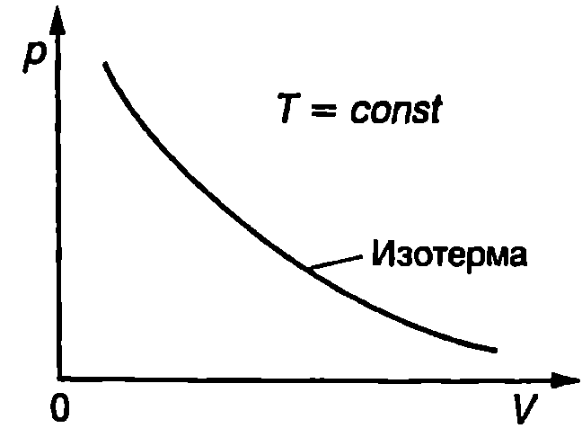
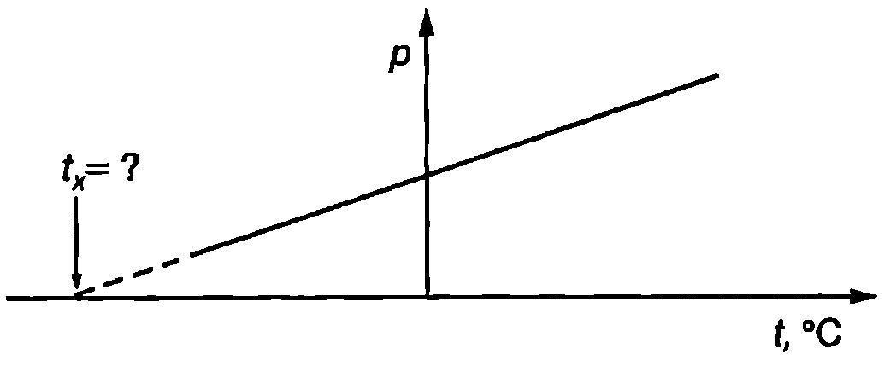

**Закон на Бойл-Мариот**

Уравнение \eqref{eq:28.3}, което се използва при измерване температурата с газов термометър, обединява два емпирични закона, формулирани много преди да се създаде техниката на газовата термометрия. Първият закон е открит от ирландския химик и физик Роберт Бойл (1627-1691) през 1662 година. До същия резултат по самостоятелен път през 1676 година достига и френският физик Едмè Мариот (1620-1684). Законът на Бойл-Мариот гласи:

**Налягането $p$ на газовете при постоянна температура е обратнопропорционално на техния обем $V$.**

$$p = \frac{const}{V} \text{ или } pV = const.
$$

На $pV$-диаграма, която изразява графично зависимостта на налягането $p$ на газа от неговия обем $V$, законът на Бойл-Мариот се представя с хипербола (Фиг. \ref{fig:29.1}), която е прието да се нарича *изотерма*.



```
Закон на Бойл-Мариот.
```
	`Фиг. 29.1`


**Закон на Шарл (Гей-Люсак)**

Вторият емпиричен закон е открит през 1787 г. от френския физик Жак Шарл (1746 -1823). До същия резултат по независим път достига и съотечественикът му Джозеф Гей-Люсак (1778-1850), който пръв публикува резултатите от своите измервания през 1802 година. Законът на Шарл (във Франция този закон се нарича закон на Гей-Люсак) гласи:

При постоянно налягане ($p = const$) обемът на газовете нараства по линеен закон с температурата.

Когато температурата на газа се измерва в келвини, законът на Шарл се изразява с уравнението

$$V= const . T \text{ или } \frac{V}{T} = const.
$$

Опитът показва, че за реалните газове законите на Бойл-Мариот и на Шарл са само приблизително верни. Колкото по-голямо е налягането на реалния газ, толкова по-силни отклонения от тези закони се наблюдават. Газове, за които законите на Бойл-Мариот и на Шарл точно се изпълняват при всяко налягане и температура, се наричат *идеални газове*. Свойствата на силно разредените газове са много близки до свойствата на идеалния газ. За тях зависимостите \eqref{eq:29.1} и \eqref{eq:29.2} се изпълняват с висока точност. При умерени условия (например стайна температура и атмосферно налягане) отклоненията на реалните газове от законите за идеалния газ са малки и в повечето случаи могат да не се отчитат.

Ще отбележим, че ако термометричното вещество на газовия термометър беше идеален газ, той щеше да показва термодинамичната температура при произволно налягане. Затова описаната в \ref{sec:28} газова температурна скала се нарича също скала на идеален газов термометър.

**Закон на Авогадро**

През 1811 година италианският учен Амадео Авогадро (1776-1856) изказва хипотезата, че в равни обеми газ при еднаква температура $T$ и налягане $p$ се съдържат еднакъв брой молекули, независимо от химическия състав на газа. Това предположение, известно като *закон на Авогадро*, се потвърждава експериментално за всички достатъчно разредени газове. Законът на Авогадро се изпълнява абсолютно точно за идеален газ, а за реалните газове при нормални условия той е само приблизително верен.

Една от основните единици в Международната система (SI) е за количество вещество и се нарича mol (мол). Генералната конференция по мерки и теглилки през 1971 година дава следното определение на единицата mol: ``1 mol е количеството вещество на система, съдържаща толкова структурни елемента, колкото атома се съдържат в 0,012 kg от изотопа въглерод 12 ($^{12}C$). При използване на мола видът на структурните елементи трябва да бъде определен и може да бъде атоми, молекули, йони, електрони или други частици или определени групировки от тях''.

Посредством единицата mol може да се даде друга формулировка на закона на Авогадро: 1 mol от всяко вещество в газово състояние при постоянна температура $T$ и налягане $p$, при условие че газът може да се смята за идеален, заема точно определен обем. При нормални условия ($p = 101\ 325$ Pa и $T = 273,\!15$ К) моларният \eqref{eq:29.3} обем на всички идеални газове е

$$V_M = 22,\!413\ 83.10^{-3}~\mathrm{m^3/mol}.$$

Броят на структурните елементи (атоми, молекули, йони или други частици) в 1 mol е наречен в чест на Авогадро число на Авогадро и се означава с $N_A$. Един от най-точните експериментални методи за определяне стойността на числото на Авогадро се основава на измерването на електричния заряд, необходим за електролитно разлагане на известен брой молове от сложно вещество. Най-точната получена досега стойност на числото на Авогадро е

$$N_A = (6,\!022\ 136\ 7\pm 0,\!000\ 003\ 6).10^{23}~\mathrm{mol^{-1}}.$$

***Забележка.*** Ще обърнем внимание, че $N_A$ е физична константа, която има размерност mol$^{-1}$ (мол на минус първа), затова е правилно да се нарича константа на Авогадро, а не число на Авогадро. Ние обаче ще използваме термина число на Авогадро, тъй като той трайно се е наложил в учебната и научната литература.

> [!question] Пример 29.1
Определете броя на молекулите, които се съдържат в $1~\mathrm{m^3}$ въздух при нормални условия.
\end{psexample}
> [!note]- Решение
 Съгласно със закона на Авогадро обемът на 1 mol идеален газ при нормални условия е $V_M = 22,\!4.10^{-3}~\mathrm{m^3/mo}$l. В обем $V = 1~\mathrm{m^3}$ въздух, разглеждан като идеален газ, има

$$n =\frac{V}{V_M} = \frac{1~\mathrm{m^3}}{22,\!4.10^{-3}~\mathrm{m^3/mol}}= 44,\!6~\mathrm{mol}.$$

Броят на молекулите в такова количество газ е

$$N=nN_A = (44,\!6~\mathrm{mol}) (6,\!02.10^{23}~\mathrm{mol^{-1}}) = 2,\!68.10^{25}.$$

**Уравнение за състоянието на идеален газ**

Термодинамична система, която се описва само от един независим външен параметър, се нарича проста система. Съгласно с втория постулат на термодинамиката всички равновесни вътрешни параметри са функции на външните параметри и на температурата. Следователно налягането $p$ (вътрешен параметър) за проста система се определя единствено от външния параметър обем ($V$) на системата и от температурата й $T$

$$p = p(V,T).
$$

Уравнение \eqref{eq:29.3} се нарича *уравнение за състоянието на термодинамичната система*. Неговото извеждане излиза извън рамките на термодинамиката. То може да бъде получено експериментално или с помощта на методите на молекулната физика.

За идеалния газ, който е пример за проста система, уравнението за състоянието се получава като обобщение на трите експериментални закона на Бойл - Мариот, Шарл и Авогадро. Такова обобщение е направено за пръв път през 1834 година от френския физик Б.П.Е. Клапейрон (1799-1864), а в 1874 година руският химик Дмитри Иванович Менделеев (1834-1907) извежда уравнението за състоянието на 1 mol идеален газ. Уравнението на Клапейрон-Менделеев за състоянието на произволно количество идеален газ се записва във вида

$$pV = \frac{m}{M} RT = nRT,
$$

където $m$ е масата на газа, $M$ е моларната му маса, $n = m/M$ е броят на моловете, а $R$ е универсалната газова константа. Най-точната измерена досега стойност на универсалната газова константа е

$$R= (8,\!314\ 510\pm0,\!000\ 070)~\mathrm{\frac{J}{mol\cdot K}}$$

> [!question] Пример 29.2
В цилиндър с бутало се намира идеален газ с обем $V_1 = 2.10^{-3}~\mathrm{m^3}$, налягане $p= 5.10^5~\mathrm{Pa}$ при температура $T_1 = 300~\mathrm{K}$. Газът се разширява докато достигне обем $V_2 = 4.10^{-3}~\mathrm{m^3}$. Определете крайната температура $T_2$ на газа, ако налягането е $p_2 = 3.10^5~\mathrm{Pa}$.
\end{psexample}
> [!note]- Решение
 Тъй като количеството на газа (броят на моловете $n$) не се изменя по време на процеса, уравнението на Клапейрон-Менделеев за началното и за крайното състояние на газа се записва във вида

$$p_1 V_1 = nRT_1\text{ и }p_2V_2 = nRT_2.$$

Изключваме $nR$ и от двете уравнения получаваме

$$\frac{p_1 V_1}{T_1}=\frac{p_2 V_2}{T_2}$$

Записано в този вид, уравнението за състоянието на идеалния газ е удобно да се използва при решаване на задачи, в които не е дадено количеството на газа, но е известно, че то е постоянно, а освен това се знае как се изменят два от параметрите на газа. В конкретната задача е известно как се изменят налягането и обема на газа и се търси неговата температура в крайното състояние. От горното уравнение изразяваме $T_2$ и получаваме

$$T_2=T_1\frac{P_2V_2}{p_1 V_1} = 300~\mathrm{K} \frac{(3.10^5~\mathrm{Pa})(4.10^{-9}~\mathrm{m^3})}{(5.10^5~\mathrm{Pa})(2.10^{-3}~\mathrm{m^3})} = 360~\mathrm{K}.$$

**Закон на Далтон**

През 1801 година британският физик и химик Джон Далтон (1766-1844) установява експериментално, че налягането на смес от химически невзаимодействащи идеални газове е равно на сумата от техните парциални налягания (закон на Далтон)

$$p = p_1 + p_2 + p_3 + \dots + p_N = \sum_{i=1}^N p_i.
$$

Парциално се нарича налягането, което би имал даде газ, ако при същата температура $T$ сам заемаше целия обем $V$, предоставен на газовата смес. Да означим с $n_i$, броя на моловете на $i$-тия газ. Неговото парциално налягане $p_i$ удовлетворява уравнението за състоянието $\displaystyle p_i = \frac{n_i RT}{V}.$ Сумираме аналогичните равенства за всички газове от сместа и съгласно със закона на Далтон получаваме
$$p = \sum_{i=1}^N p_i = \left(\sum_{i=1}^N n_i\right) \frac{RT}{V} = n\frac{RT}{V},
$$
където $\displaystyle n = \sum_{i=1}^N n_i$. Следователно смес от химически невзаимодействащи идеални газове удовлетворява същото уравнение за състоянието, както химически еднороден идеален газ.

> [!question] Пример 29.3
В съд с обем $V = 0,\!1~\mathrm{m^3}$ се намира газова смес от $m_1 = 0,\!28$ kg азот и $m_2 = 0,\!64$ kg кислород. Определете налягането на газовата смес при температура $t = 27$ °C. Моларната маса на азота (N$_2$) е $M_1 = 0,\!028$ kg/mol, а на кислорода (O$_2$) е $M_2 = 0,\!032$ kg/mol.
\end{psexample}
> [!note]- Решение
 В съда се съдържат
$$n =\frac{m_1}{M_1} = \frac{0,\!28~\mathrm{kg}}{0,\!028~\mathrm{kg/mol}} = 10\text{ mol азот и}$$
$$n_2 = \frac{m_2}{M_2} = \frac{0,\!64~\mathrm{kg}}{0,\!032~\mathrm{kg/mol}} = 20\text{ mol кислород.}$$

Количеството вещество на газовата смес e $n = n_1 + n_2 = 30$ mol. Налягането на газовата смес определяме от уравнение \eqref{eq:29.6}

$$p= \frac{nRT}{V} = \frac{(30~\mathrm{mol}) (8,\!3~\mathrm{J/mol\cdot K}) (300~\mathrm{K})}{0,\!1 ~\mathrm{m^3}} = 7,\!5.10^5~\mathrm{Pa}.$$

Ще обърнем внимание, че в уравнението за състоянието на идеалния газ температурата е в келвини, затова преди да направим числените пресмятания превърнахме дадената в условието на задачата числена стойност на температурата от градуси Целзий в келвини.

**Задачи**

1. Като използвате уравнението за състоянието на идеален газ, докажете, че плътността на газа се изразява с уравнението

$$\rho = \frac{pM}{RT},$$

където $p$ е налягането на газа, $M$ -- моларната му маса, $R$ -- универсалната газова константа, а $T$ е температурата на газа.

Пресметнете плътността на въздуха при стайна температура ($T = 300$ К) и атмосферно налягане ($p= 1.10^5$ Pa). Моларната маса на въздуха е $M = 0,\!029$ kg/mol.

2. Кои закони при идеалния газ са представени графично на Фиг. \ref{fig:29.2}?


```

```
	`Фиг. 29.2`


3. Кой от законите при идеалния газ е представен графично на Фиг. \ref{fig:29.3}? Колко градуса Целзий е температурата $t_x$?

4. Стъкленият балон на електрическа крушка с нагреваема жичка се запълва с инертен газ при температура $t_1 = 150$ °C. До какво налягане трябва да се напълни балонът, така че при температура на газа $t_2 = 300$ °C, която се установява, когато крушката свети, налягането на му да не надминава атмосферното налягане $1.10^5$ Pa?

5. Колко молекули се съдържат в $1~\mathrm{cm^3}$ въздух при стайна температура (300 К) и атмосферно налягане ($1.10^5$ Pa)?



```

```
	`Фиг. 29.3`


6. В съвременна лабораторна постановка, която работи при свръхвисок вакуум, налягането на газа във вакуумната камера е $5.10^{-13}$ Pa. Колко молекули се съдържат в $1~\mathrm{cm^3}$ от такъв газ при температура 300 К?

7. Въздухът в стая с обем $50~\mathrm{m^3}$ се намира при температура 27°C. Колко допълнителни молекули въздух ще влязат в стаята, ако температурата се понижи с 5 градуса? Атмосферното налягане да се приеме за постоянно и равно на $1.10^5$ Pa.

8. Метален контейнер съдържа 500 g амоняк (NH$_3$) с налягане $2.10^5$ Pa при температура 37°C. В контейнера има малка дупка, през която изтича газ. След известно време е установено, че температурата на газа е 17°C, а налягането е $1,\!6.10^5$ Pa. Колко грама амоняк са изтекли от контейнера,

9. 1 mol сух въздух съдържа 0,78 mol азот (N$_2$), 0,21 mol кислород (O$_2$), 0,009 mol аргон (Ar), 0,0004 mol въглероден диоксид (CO$_2$) и следи от други газове. Пресметнете парциалните налягания на азота, кислорода, аргона и въглеродния диоксид, когато въздухът се намира при налягане 1 atm.

10. Човек получава кислородно отравяне, когато парциалното налягане на кислорода във въздуха, който диша, достигне 0,8 atm. На каква максимална дълбочина водолаз може да използва обикновен въздух за дишане? Хидростатичното налягане на водата нараства с 1 atm на всеки 10,3 m дълбочина.

***Указание:*** Налягането на въздуха, който диша водолазът, трябва да е равно на външното налягане. Използвайте резултата от зад.9.

11. При нормални условия 1 mol въздух съдържа 0,21 mol кислород. Какво би трябвало да е съдържанието на кислород във въздуха на голяма надморска височина, където атмосферното налягане е 0,6 atm, за да има там кислородът същото парциално налягане, както във въздуха на морското равнище?

12. Дадено количество идеален газ, което първоначално се намира при температура 300 К, започва да се разширява по закона $pV^{3/2} = const$. Определете температурата на газа, когато обемът му нарасне 4 пъти.

13. Идеален газ извършва равновесен процес, който се описва с уравнението $p = p_0 - cV^2$, където $p_0$ и $c$ са положителни константи, а $V$ е моларният обем на газа. Определете максималната температура, до която може да достигне газът при този процес.
