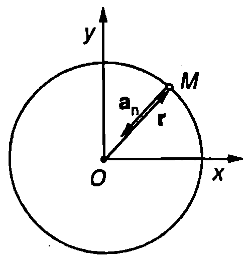
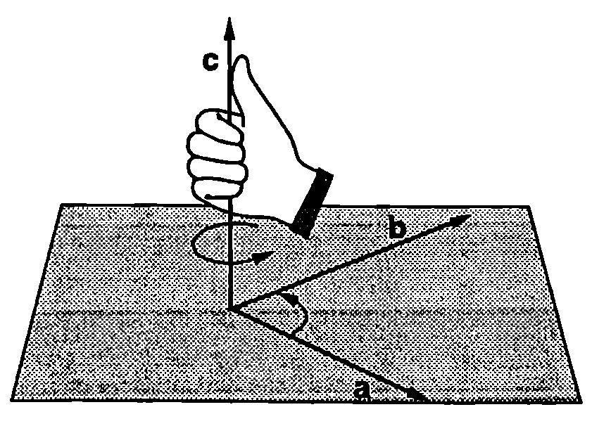
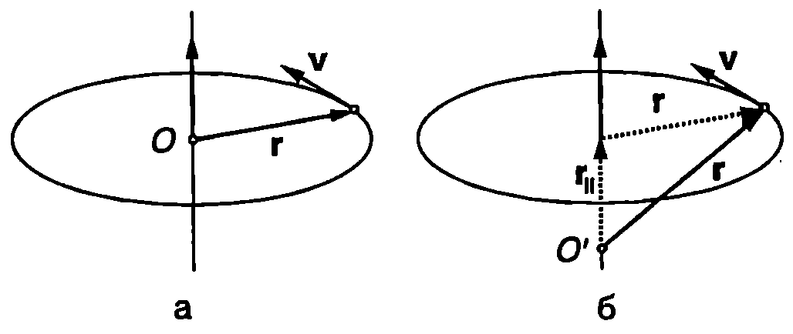
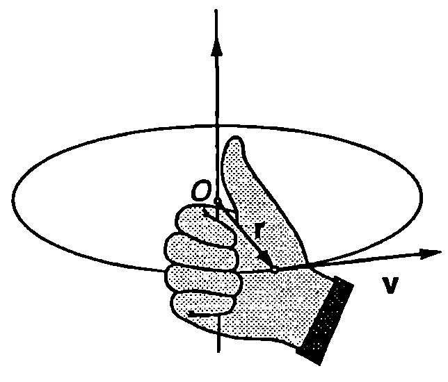
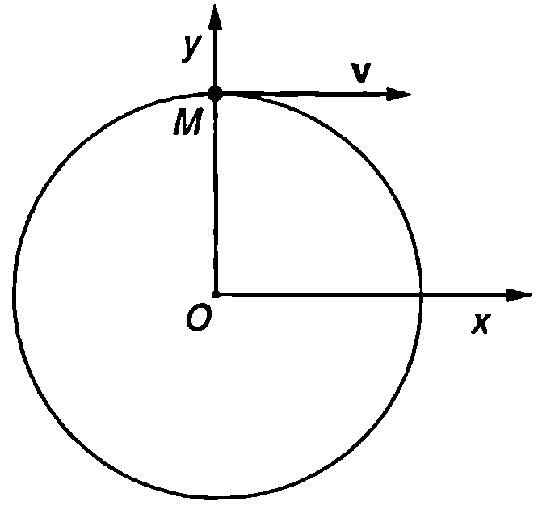

**Ускорение**

Както за всяко криволинейно движение, при движението по окръжност ускорението $\vec a$ може да се представи като сума от две компоненти (Фиг. \ref{fig:3.1}): тангенциално ускорение $\vec a_\tau$ и нормално ускорение $\vec a_n$ ($\vec a = \vec a_\tau+ \vec a_n$). Ускорението $\vec a$ винаги е насочено навътре към окръжността. Когато го лемината на скоростта нараства, тангенциалното ускорение е насочено по посока на скоростта $\vec v$, а векторите $\vec v$ и $\vec a$ сключват остър ъгъл (Фиг. \ref{fig:3.1}а). При закъснително движение векторите $\vec v$ и $\vec a$ сключват тъп ъгъл, а тангенциалното ускорение $\vec a_\tau$ е насочено в противоположна на скоростта $\vec v$ посока (Фиг. \ref{fig:3.1}б).

Нормалното ускорение при движение по окръжност винаги е насочено към центъра на окръжността, поради което се нарича още *центростремително ускорение*. Неговата големина зависи от скоростта $v$ и от радиуса $r$ на окръжността
$$a_n = \frac{v^2}{r}
$$
При равномерно движение по окръжност $a = 0$ и $v = const$. Тъй като $r$ също е константа, от уравнение \eqref{eq:3.1} следва, че равномерното движение по окръжност се извършва с постоянно по големина ускорение, което в насочено към центъра на окръжността (Фиг. \ref{fig:3.1}в).

**Периодично движение**


```

```
	`Фиг. 3.1`

Движения, които се извършват по един и същ начин, повтаряйки се през равни интервали от време, се наричат *периодични движения*. Най-малкият интервал от време, след който се повтарят стойностите на всички физични величини, характеризиращи движението, се нарича *период* $T$. *Честотата* $\nu$ показва колко пъти за единица време (1 s) се повтаря едно периодично движение. По определение двете величини са свързани със съотношението
$$T = \frac{1}{\nu} \text{ или } \nu =\frac{1}{T}
$$
Честотата $\nu$ има размерност $\mathrm{s^{-1}}$ (секунда на минус първа). В чест на немския физик Хайнрих Херц (1857-1894) единицата за честота е наречена херц ($\mathrm{1 Hz = 1 s^{-1}}$).

Равномерното движение по окръжност е прост пример за периодично движение. Лесно се установява връзката между скоростта $v$, периода $T$ и честотата $\nu$. За време $t = T$ материалната точка извършва едно пълно завъртане и изминава път, равен на дължината $2\pi r$ на окръжността. Тогава
$$v = \frac{2\pi r}{T} = 2\pi r\nu.
$$
Ще обърнем внимание, че в общия случай неравномерното движение по окръжност не е периодично движение. При него се променя времето за едно завъртане, а също така в дадена точка от окръжността скоростта и ускорението на материалната точка са различни при различните обиколки.

**Ъглова скорост и ъглово ускорение**

На Фиг. \ref{fig:3.2} е показана материална точка, която се движи по окръжност с радиус $r$. За малък интервал от време $dt$ тя се премества от точка $M$ до точка $N$ и описва дъга с дължина $ds$. Ъгълът $d\theta$, на който се завърта радиусът $r$, свързващ материалната точка с центъра на окръжността, се нарича *ъгъл на завъртане* (измерва се в радиани). Големината на ъгъла на завъртане $d\theta$ и дължината на дъгата $ds$ са свързани с известното от геометрията съотношение $d\theta = ds/r$. Разделяме двете страни на това равенство на $dt$ и получаваме:

$$\frac{d\theta}{dt} = \frac{ds}{dtr} = \frac{v}{r}$$
където сме отчели, че $ds/dt = v$.


```

```
	`Фиг. 3.2`



```

```
	`Фиг. 3.3`


Величината
$$\omega = \frac{d\theta}{dt} = \frac{v}{r}
$$
се нарича *ъглова скорост* на материалната точка. Ъгловата скорост $\omega$ е равна на първата производна на ъгъла на завъртане $\theta$ по времето $t$. Тя се измерва в единици rad/s (радиан за секунда). Уравнение \eqref{eq:3.4} изразява връзката между ъгловата скорост $\omega$ и големината на скоростта $v$. При неравномерно движение по окръжност тези две величини се изменят с течение на времето. За равномерно движение по окръжност от уравнения \eqref{eq:3.3} и \eqref{eq:3.4} ъгловата скорост може да се изрази чрез периода $T$ или чрез честотата $\nu$:
$$\omega = 2\pi\nu = \frac{2\pi}{T}.
$$
Първата производна на ъгловата скорост $\omega$ по времето $t$ (или втората производна на ъгъла на завъртане $\theta$ по времето $t$) се нарича *ъглово ускорение* $\varepsilon$ на материалната точка
$$\varepsilon = \frac{d\omega}{dt} = \frac{d^2\omega}{dt^2}.
$$
Ъгловото ускорение показва бързината, с която се променя ъгловата скорост. При равномерно движение по окръжност $\omega = const$ и $\varepsilon = 0$. Между ъгловото ускорение $\varepsilon$ и тангенциалното ускорение $a_\tau$ съществува връзка, която може да се определи с помощта на уравнения \eqref{eq:3.6}, \eqref{eq:3.4} и \eqref{eq:2.19}

$$\varepsilon = \frac{d\omega}{dt} = \frac{d}{dt} \left(\frac{v}{r}\right) = \frac{1}{r} \left(\frac{dv}{dt}\right) = \frac{a_\tau}{r} \text{, т.е.}$$

$$\varepsilon = \frac{a\tau}{r}.
$$
За описване движението на материална точка по окръжност е удобно да се използва правоъгълна координатна система с начало в центъра $O$ на окръжността (Фиг. \ref{fig:3.3}). Тогава радиус-векторът $\vec r$ на материалната точка има постоянен модул, равен на радиуса $r$ на окръжността, но по време на движението непрекъснато променя посоката си (описва окръжност). Като се отчетат уравнения \eqref{eq:3.1} и \eqref{eq:3.4}, нормалното ускорение се записва във векторна форма
$$\vec a_n = -\left(\frac{v}{r}\right)^2 \vec r = -\omega^2 \vec r.
$$
Знакът минус показва, че нормалното (центростремителното) ускорение винаги е насочено в противоположна на радиус-вектора $\vec r$ посока, т.е. към центъра на окръжността (Фиг. \ref{fig:3.3}).

> [!question] Пример 3.1
> Материална точка извършва равнопроменливо движение ($\varepsilon = const$) по окръжност с радиус $r$. Определете законите, по които се изменят ъгловата скорост $\omega$ и ъгълът на завъртане $\theta$ като функция на времето $t$. В началния момент ($t = 0$) $\omega=\omega_0$ и $\theta = 0$.

> [!note]- Решение
> При равнопроменливо криволинейно движение (в частност движение по окръжност) са в сила същите закони за големината на скоростта и за пътя, както при равнопроменливото праволинейно движение. Необходимо е само в уравнения \eqref{eq:1.8} и \eqref{eq:1.13} да заместим големината на ускорението а с големината на тангенциалното ускорение $a_\tau$:
> 
> $$v = v_0 \pm a_\tau t;\quad s = v_0 t \pm \frac{a_\tau t^2}{2}$$
> 
> където знакът ``+'' е за равноускорително движение, а знакът ``-'' е за равнозакъснително движение. Заместваме $v = \omega r$, $v_0 = \omega_0 r$, $a = \varepsilon r$ и $s = r\theta$ и след като съкратим получаваме
> 
> $$\omega = \omega_0 \pm \varepsilon t;\quad \theta = \omega_0 t \pm \frac{\varepsilon t^2}{2}.$$
> 
> Следователно при равнопроменливо движение по окръжност между ъгловите величини, които го характеризират (ъгъл на завъртане $\theta$, ъглова скорост $\omega$ и ъглово ускорение $\varepsilon$), съществуват аналогични зависимости, както при линейните величини (път $s$, скорост $v$ и тангенциално ускорение $a_\tau$). Тези зависимости могат формално да се получат, ако в законите за скоростта и пътя се замести $s$ с $\theta$, $v$ с $\omega$ и $a_\tau$ с $\varepsilon$.

**Векторно произведение на два вектора**

Редица физични величини, с които ще се запознаем по-нататък (например ъглова скорост, момент на сила, момент на импулса, кориолисова сила, магнитна сила и др.), се представят като векторно произведение на други две векторни физични величини. Затова най-напред ще припомним някои от основните свойства на векторното произведение (означава се със символа ``$\times$''), изучени в курса по математика. По определение векторно произведение на два вектора $\vec a$ и $\vec b$ се нарича вектор $\vec c = \vec a \times \vec b$ с модул
$$c = ab|\sin\alpha|,
$$
където $a$ и $b$ са модулите на векторите $\vec a$ и $\vec b$, $\alpha$ е ъгълът между двата вектора. Векторът $\vec c$ е насочен перпендикулярно на равнината, в която лежат векторите $\vec a$ и $\vec b$. Посоката му се определя по правилото на дясната ръка (Фиг. \ref{fig:3.4}): ако поставим дясната си ръка така, че свитите пръсти да сочат от вектора $\vec a$ към вектора $\vec b$ в посока на по-малкия ъгъл между тях, тогава опънатият палец сочи посоката на векторното произведение $\vec c = \vec a\times\vec b$.

Векторното произведение е антикомутативно, т.е. $\vec a\times\vec b = -\vec b\times\vec a$. Ако два вектора са колинеарни ($\alpha = 0$ или $\alpha = \pi$), тяхното векторно произведение е нула.



```
Векторно произведение на два вектора.
```
	`Фиг. 3.4`


**Ъгловата скорост като вектор**

Движението на материална точка по окръжност може да се разглежда като въртене около ос, перпендикулярна на равнината, в която лежи окръжността и минаваща през нейния център $O$ (Фиг. \ref{fig:3.5}). Векторът на ъгловата скорост $\vec\omega$ е насочен в направление на оста на въртене и се дефинира чрез равенството
$$\vec v = \vec\omega\times\vec r
$$
където за начало на координатната система може да се вземе както центърът $O$ на окръжността (Фиг. \ref{fig:3.5}а), така и произволна друга точка $O'$, лежаща върху оста на въртене (Фиг. \ref{fig:3.5}б).



```
Векторът на ъгловата скорост е насочен успоредно на оста на въртене,
```
	`Фиг. 3.5`


Посоката на вектора на ъгловата скорост $\vec\omega$ се определя по правилото на дясната ръка, което в конкретния случай е най-удобно да се прилага по следния начин: обхващаме с дланта на дясната си ръка окръжността, така че пръстите да сочат посоката на движение, тогава опънатият палец сочи посоката на ъгловата скорост (Фиг. \ref{fig:3.6}).



```
Посоката на вектора на ъгловата скорост $\vec\omega$ се определя по правилото на дясната ръка.
```
	`Фиг. 3.6`


> [!question] Пример 3.2
> Докажете, че от векторното уравнение $\vec v = \vec\omega \times\vec r$ следва скаларното уравнение $v = \omega R$, изразяващо връзката между големината на скоростта $v$, големината на ъгловата скорост $\omega$ и радиуса $R$ на окръжността. Разгледайте два случая:
> 
> а) началото на координатната система съвпада с центъра на окръжността;
> 
> б) за начало на координатната система е избрана произволна точка $O'$ от оста на въртене.

> [!note]- Решение
>  а) Когато радиус-векторът $\vec r$ е прекаран от центъра на окръжността (Фиг. \ref{fig:3.5}а), неговият модул е равен на радиуса $R$ на окръжността, а векторите $\vec r$ и $\vec v$ са взаимно перпендикулярни (ъгълът между тях е $\alpha = \pi/2$). Тогава
> 
> $$v =\omega r \sin |\alpha| = \omega R\sin \frac{\pi}{2}=\omega R.$$
> 
> б) Радиус-векторът $\vec r$ може да се разложи на две компоненти: $\vec r = \vec r_{||} + \vec r_\perp$, където компонентата $\vec r_{||}$ е успоредна на оста на въртене, а $\vec r_\perp$ перпендикулярна на оста на въртене (Фиг. \ref{fig:3.5}б). Тогава
> 
> $$\vec v = \vec\omega\times\vec r = \vec\omega\times(\vec r_{||}+\vec r_{\perp}) = \vec\omega\times\vec r_{||}+\vec\omega\times\vec r_{\perp} = \vec\omega\times \vec r_{\perp},$$
> 
> където е отчетено, че векторите $\vec\omega$ и $\vec r_{||}$, са успоредни (Фиг. \ref{fig:3.5}б), поради което векторното им произведение е нула. Векторът $\vec r_{\perp}$ е перпендикулярен на скоростта $\vec v$, а модулът му е равен на радиуса на окръжността $R$. Следователно
> 
> $$v = \omega r_{\perp}|\sin\alpha| = \omega R \sin\frac{\pi}{2} = \omega R.$$

**Задачи**

1. Материална точка се движи равномерно по окръжност с радиус $r = 10$ cm с период $T = 2$ s. Определете ъгловата скорост и центростремителното ускорение на материалната точка.

2. Пресметнете центростремителното ускорение на точка, която се намира: а) на земния екватор; б) на северния полюс. Радиусът на Земята е $R = 6400$ km.

3. Космонавт се върти в центрофуга, като описва окръжност с радиус $r = 5$ m, лежаща в хоризонтална равнина. При каква ъглова скорост центростремителното ускорение на космонавта е $6g$ ($g$ - земно ускорение)?

4. Електрон се движи в еднородно магнитно поле по кръгова орбита с радиус $r = 10$ cm. Определете скоростта $v$ на електрона, ако честотата на въртене $\nu = 2\times10^4$ Hz.


```

```
	`Фиг. 3.7`


5. Частица започва да се движи по окръжност с радиус $r = 0,\!1$ m. Ъгълът на завъртане се изменя с течение на времето по закона $\theta = ct^2$, където $c = 0,\!5\ \mathrm{rad/s^2}$. Определете тангенциалното, нормалното и пълното ускорение на частицата в момент $t = 2$ s.

6. На Фиг. \ref{fig:3.7} е показана частица, която се движи по окръжност и в даден момент преминава през точка $M$ от окръжността. Като използвате данните от фигурата, определете големината на скоростта на частицата в този момент.

7. Частица, която първоначално е в покой, започва да се движи по окръжност с радиус $r = 0,\!2$ m c постоянно ъглово ускорение $\varepsilon = 0,\!6\ \mathrm{rad/s^2}$. След колко секунди векторът на пълното ускорение $\vec a$ на частицата ще сключва ъгъл $30^\circ$ с вектора на скоростта $\vec v$? Пресметнете големината на $\vec a$ в този момент.

8. Материална точка $M$ се движи равномерно със скорост $v$ по окръжност с радиус $r$. Положението на материалната точка в началния момент $t = 0$ в показано на Фиг. \ref{fig:3.8}. Запишете кинематичните уравнения на движението на материалната точка $x(t)$ и $y(t)$ спрямо правоъгълната координатна система, показана на фигурата. Центърът на окръжността лежи в началото на координатната система.



```

```
	`Фиг. 3.8`
