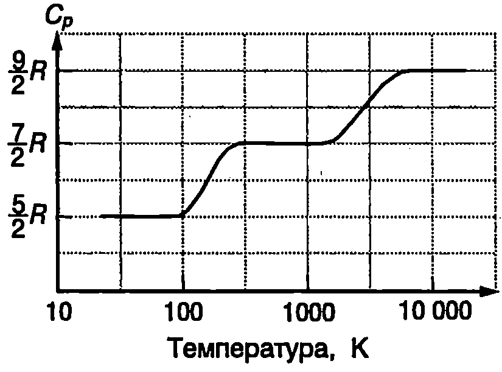

**Степени на свобода**

В класическата молекулно-кинетична теория атомите се разглеждат като материални точки, а всяко макроскопично тяло - като система от материални точки, чието движение и взаимодействие се описва от законите на класическата механика. Броят на независимите координати, чрез които може еднозначно да се определи положението на всички материални точки от една механична система, се нарича брой на степените на свобода на системата.

Например в пространството положението на материална точка се задава с трите и декартови координати $x$, $y$ и $z$, т.е. съгласно с даденото определение тя има три степени на свобода. Система от $N$ материални точки, на чието движение не са наложени допълнителни ограничения (връзки), има 3 степени на свобода: по 3 за всяка материална точка.

Двуатомна молекула може да се разглежда като система от две материални точки, между които съществува твърда връзка - разстоянието между материалните точки не се изменя при движението на молекулата. Подобно на твърдо тяло, положението на молекулата в пространството е точно определено, ако са зададени (Фиг. \ref{fig:33.1}):

а) координатите $x$, $y$, $z$ на центъра на масите $C$ на молекулата;

б) ъглите $\theta$ и $\phi$, които правата, минаваща през двата атома, сключва с две взаимно перпендикулярни оси, пресичащи се в центъра на масите $C$.

Декартовите координати $x$, $y$, $z$ и ъглите $\theta$ и $\phi$ определят петте степени на свобода на молекулата: три степени на свобода на постъпателно движение и две степени на свобода на въртене.


```

```
	`Фиг. 33.1`


Според друг механичен модел на двуатомна молекула връзката между атомите не е твърда, а е еластична. Съгласно с този модел под външно въздействие може да се измени големината на разстоянието между атомите, при което възникват еластични сили на взаимодействие и атомите извършват трептене около центъра на масите C. Такава молекула има допълнителна степен на свобода на трептене.

**Равномерно разпределение на енергията по степени на свобода**

В статистическата физика се доказва следната теорема за разпределението на кинетичната енергия между частиците на равновесна термодинамична система:

**На всяка степен на свобода на една частица съответства еднаква средна кинетична енергия, равна на $\displaystyle \frac{1**{2}kT$, където $T$ е абсолютната температура, а $k$ е константата на Болцман.}

С помощта на теоремата за равномерното разпределение на енергията по степени на свобода се определя средната енергия $\bar\varepsilon$ на топлинно движение на частиците, ако се знае абсолютната температура $T$ и броят $i$ на степените на свобода

$$\bar\varepsilon = \frac{i}{2} kT.
$$

Например частиците на едноатомен газ (Не, Ne, Ar и др.) могат да се разглеждат като материални точки с $i = 3$ степени на свобода и средна кинетична енергия на топлинно движение $\bar\varepsilon =\displaystyle \frac{3}{2}kT$.

Молекулите на двуатомните газове (H$_2$, N$_2$, O$_2$ и др.), когато не извършват трептения (молекули с твърда връзка), имат $i = 5$ степени на свобода. Средната кинетична енергия на постъпателно и въртеливо движение на такава молекула е $\bar\varepsilon =\displaystyle \frac{5}{2}kT$.

Трептенията се характеризират както с кинетична, така и с потенциална енергия. Затова на тази степен на свобода съответства средно два пъти по-голяма енергия: $kT/2$ кинетична енергия и $kT/2$ потенциална енергия. Следователно двуатомна молекула, която освен постъпателно и въртеливо движение извършва и трептене (молекула с еластична връзка), има средна енергия $\bar\varepsilon =\displaystyle \frac{7}{2}kT$, т.е. за нея $i = 7$. (В случая $i$ е сумата от степените на свобода на постъпателно движение, на въртеливо движение и от удвоения брой на степените на свобода на трептене.)

**Топлинни капацитети на идеален газ**

Броят на молекулите в $n$ mol идеален газ e $N = nN_A$, където $N_A$ е числото на Авогадро. Всяка молекула има средна кинетична енергия $\displaystyle\bar\varepsilon = \frac{i}{2}kT$. Тъй като при идеалния газ се пренебрегва потенциалната енергия на взаимодействие между молекулите, вътрешната енергия и на газа е сума от кинетичните енергии на отделните молекули
$$U = n \bar\varepsilon = nN_A \frac{i}{2}kT.
$$

Заместваме $N_A k = R$ за вътрешната енергия на $n$ mol идеален газ получаваме
$$U = \frac{i}{2}nRT.
$$

От уравнение \eqref{eq:33.3} определяме моларния топлинен капацитет на идеалния газ при постоянен обем $C_V$

$$C_V = \frac{dU}{ndT} = \frac{i}{2}R.
$$

Изобарният моларен капацитет $C_p$ се определя от формула \eqref{eq:33.4} и от уравнението на Майер \eqref{eq:31.9}

$$C_p = C_V + R = \frac{i+2}{2} R.
$$

От равенства \eqref{eq:33.4} и \eqref{eq:33.5} изразяваме показателя на адиабатата $\gamma$ (коефициент на Поасон -- вж. стр.172)
$$\gamma = \frac{C_p}{C_V} = \frac{i+2}{i}.
$$

За едноатомен газ: $i = 3$ и $\gamma$ = 5/3 = 1,667. За двуатомен газ с твърда връзка между атомите в молекулата (атомите не трептят): $i = 5$ и $\gamma$ = 7/5 = 1,4.

Тези теоретични стойности за коефициента на Поасон се съгласуват много добре с експерименталните стойности, измерени при стайна температура и нормално атмосферно налягане (табл.33.1).

\begin{table}

	\begin{tabular}{cccc}
	Едноатомен газ& $\gamma$& Двуатомен газ& $\gamma$\\
	Хелий (Не)& 1,660& Водород (H$_2$)& 1,407\\
	Неон (Ne)& 1,64& Азот (2)& 1,398\\
	Аргон (Ar)& 1,65& Кислород (02) & 1,398\\
	\end{tabular}
```
Експериментални стойности на коефициента на Поасон $\gamma$ за някои газове при температура $T = 293$ К и нормално атмосферно налягане.
```
	\label{table:2.1}
\end{table}

**Понятие за квантова теория на топлинните капацитети**



```
Температурна зависимост на изобарния моларен топлинен капацитет на водорода (H$_2$).
```
	`Фиг. 33.2`


От класическата молекулно-кинетична теория следва, че топлинните капацитети $C_V$ и $C_p$, на идеалния газ са правопропорционални на универсалната газова константа $R$ и не зависят от температурата. Тяхната стойност се определя от броя на степените на свобода $i$ на газа. Този извод обаче не се съгласува с експерименталните резултати. На Фиг. \ref{fig:33.2} е показана графика на експериментално получената температурна зависимост на изобарния моларен топлинен капацитет $C_p$, на водорода (H$_2$). Вижда се, че стойността на $C_p$ нараства стъпаловидно с повишаване на температурата. За да обясни тази зависимост, класическата теория прави изкуственото предположение, че при ниски температури степените на свобода на въртеливо движение и трептене на двуатомните и многоатомните молекули са ``замразени'' - при ниски температури молекули те могат да извършват само постъпателно движение, на което съответстват $i = 3$ степени на свобода и $C_p = 5R/2$. При повишаване на температурата отначало се ``размразяват'' степените на свобода на въртене и $C_p$, нараства на $7R/2$. При много високи температури се ``размразяват'' и степените на свобода на трептене. Съгласно с използваните по-горе механични модели на молекулата това означава, че връзката между двата атома се променя от твърда връзка в еластична връзка, поради което топлинният капацитет $C_p$ нараства на $9R/2$. Класическата теория обаче не е в състояние да обясни това необичайно прекратяване на трептенията и въртеливото движение на молекулите при ниски температури. Отговор на тази загадка дава квантовата теория. В квантовата механика се доказва, че енергията $\varepsilon$, на въртеливо движение на молекулите, както и тяхната енергия на трептене $\varepsilon$, се квантува. Това означава, че: 1. енергията може да има само определени дискретни стойности, които са отделени една от друга от забранени енергетични интервали; 2. съществува минимална енергия на въртене $\varepsilon_\text{в}$ (min) и минимална енергия на трептене $\varepsilon_\text{т}$ (min).

Дискретният набор от разрешени стойности за енергията на въртене $\varepsilon_\text{в}$ и на енергията на трептене $\varepsilon_\text{т}$ е показан схематично на Фиг. \ref{fig:33.3}. В процеса на взаимодействие (удар) помежду си две молекули могат да обменят енергия, която е от порядъка на средната енергия на $kT$ на топлинното движение. Да допуснем, че газът се намира при ниска температура, където е в сила неравенството $kT\ll \varepsilon_\text{в}(\min)\ll \varepsilon_\text{т}(\min)$. Тогава енергията $kT$ не е достатъчна, за да се възбуди въртене или трептене на молекулите. (Ще отбележим, че дори при $T = 0$ К молекулите извършват т, нар, нулеви квантово-механични трептения. Тези трептения обаче не зависят от температурата и не дават принос в топлинния капацитет.) При увеличаване на температурата отначало се възбужда въртене на молекулите с минималната възможна енергия $\varepsilon_\text{в}$ (min), а след това и с по-големите разрешени енергии. При достатъчно висока температура, когато $kT\gg \varepsilon_\text{в}(\min)$, вече има молекули с най-различна енергия на въртене, съответстваща на много голям брой от разрешените енергетични нива. Тогава дискретността на енергетичния спектър практически престава да влияе на топлинните капацитети, които достигат стойности, съответстващи на класическия идеален газ с пет степени на свобода.

При по-нататъшно увеличаване на температурата става възможно да се възбудят и трептения отначало с минималната разрешена енергия $\varepsilon_\text{т}$, (min), а след това и с по-големи енергии. При много високи температури, когато $kT\gg \varepsilon_\text{т}(\min)$, в газа се срещат молекули с най-различни енергии на трептене, съответстващи на голям брой от енергетичните нива на трептене и дискретният спектър на енергията на трептене практически престава да влияе на топлинните капацитети: изобарният моларен топлинен капацитет $C_p$, на двуатомния газ достига стойност 9R/2, съответстваща на класическия идеален газ с $i = 7$ (Фиг. \ref{fig:33.2}).


```

```
	`Фиг. 33.3`


Задачи

1. 3 mol двуатомен идеален газ ($i = 5$) се нагрява при постоянен обем. Колко джаула количество топлина е необходимо, за да се повиши температурата на газа с 50 К?

2. Два мола едноатомен идеален газ се разширява при постоянно налягане, при което температурата на газа нараства с $\Delta T = 50$ К. Пресметнете: а)изменението на вътрешната енергия на газа; 6) погълнатото от газа количество топлина; в) работата на газа.

3. Пресметнете вътрешната енергия на 1 kg въздух с температура 300 К. Разгледайте въздуха като двуатомен идеален газ с моларна маса 0,029 kg/mol, чийто молекули извършват само постъпателни и въртеливи движения.
