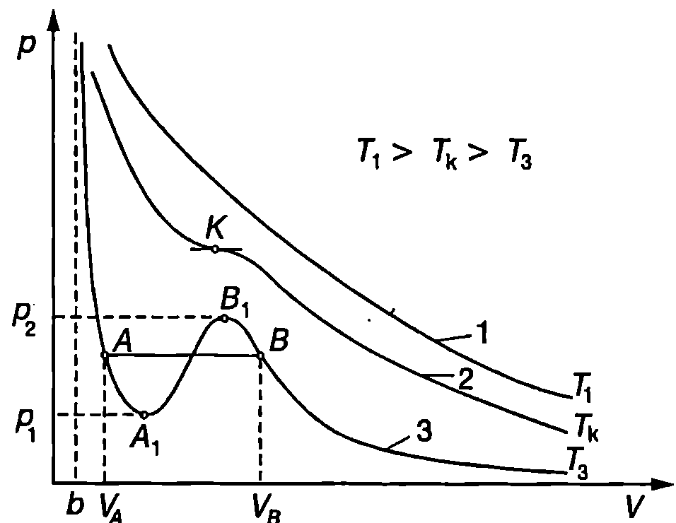
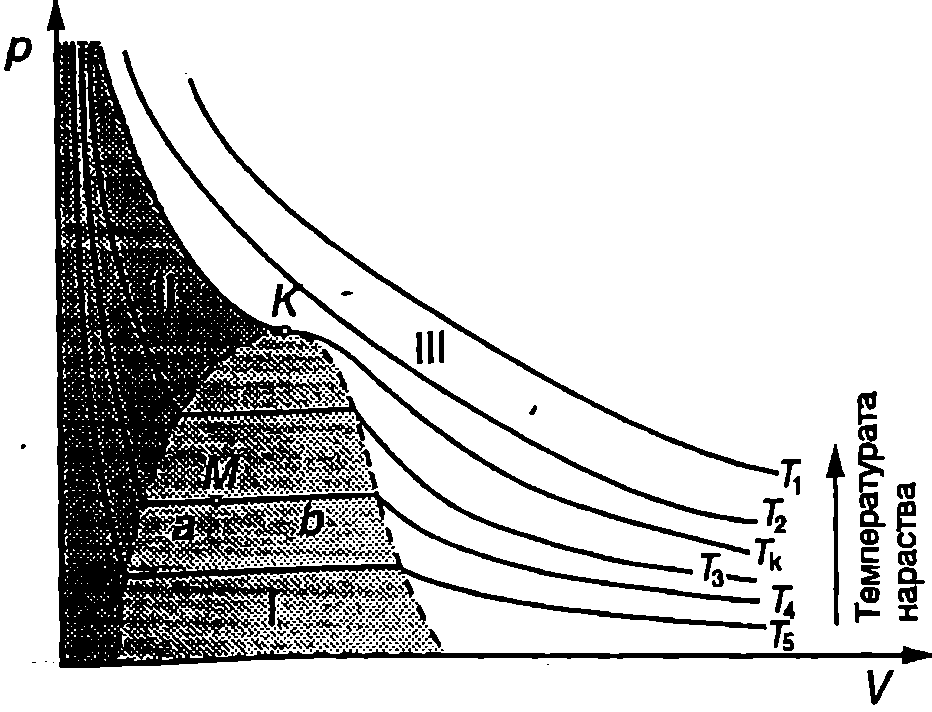

**Уравнение на Ван дер Ваалс**

При определени условия поведението на реалните газове съществено се отличава от това, което предвижда моделът на идеалния газ. Например при свиване реалните газове могат да се втечнят, което не се обяснява от уравнението на Клапейрон-Менделеев. Основният недостатък на модела на идеалния газ в в това, че той заменя сложните по своя характер сили на привличане и отблъскване между молекулите с еластичен удар. Емпирично са установени повече от 150 уравнения, които се използват за по-точно описване състоянието на реалните газове. В тях молекулните сили се отчитат чрез въвеждане на различни константи, които се определят експериментално. Най-простото от тези уравнения е получено през 1873 г. от холандския физик Ван дер Ваалс (1837-1923) и носи неговото име. Ван дер Ваалс въвежда в уравнението за състоянието $pV = RT$ на 1 mol идеален газ две поправки, чрез които отчита молекулните сили на привличане и на отблъскване.

Уравнението на Ван дер Ваалс за 1 mol газ има вида

$$(p + \frac{a}{V^2})(V-b) = RT.
$$

където $V$ е моларният обем на газа (измерва се в единици $\mathrm{m^3/mol}$), $a$ и $b$ са константи, които не зависят от температурата. Константата $a$ отчита силите на взаимно привличане между молекулите. Поради взаимното привличане между молекули те, освен налягането $p$, определено в модела на идеалния газ, при реалните газове възниква допълнително молекулно налягане $\displaystyle p_m = \frac{a}{V^2}$. Силите на отблъскване се отчитат чрез втората константа $b$. Тъй като силите на отблъскване рязко нарастват на малки разстояния, молекулите не могат да се доближат една до друга на разстояния, по-малки от ефективния диаметър на молекулите. Това ограничение се отчита в уравнението на Ван дер Ваалс, като моларният обем $V$ (обемът на съда, в който се намира 1 mol газ) се заменя с някакъв по-малък ефективен обем $V-b$, достъпен за движение на молекулите.

Газ, който точно се подчинява на уравнение \eqref{eq:40.1}, се нарича *вандерваалсов газ*. В действителност, за реалните газове константите $a$ и $b$ в уравнение \eqref{eq:40.1} зависят от температурата. Установено е също така, че при голямо налягане поведението на реалните газове съществено се отклонява от уравнението на Ван дер Ваалс. Независимо от това уравнението на Ван дер Ваалс може да се използва при всяка температура и налягане за качествено описване поведението на реалните газове и на тяхното втечняване.

> [!question] Пример 40.1
Запишете уравнението на Ван дер Ваалс за $n$ mol газ.
\end{psexample}
> [!note]- Решение
 Уравнението за състоянието на идеалния газ често се записва по два начина:

1. за $n$ mol газ: $pV = nRT$;

2. за 1 mol газ: $pV = RT$.

Тъй като $n$ е размерна физична величина (mol), в двете уравнения обемът и има различна размерност. В първото уравнение $V$ e обемът на газа (измерва се в $\mathrm{m^3}$), докато във второто уравнение $V$ е моларният обем (измерва се в $\mathrm{m^3/mol}$).

В уравнението на Ван дер Ваалс \eqref{eq:40.1} $V$ e моларният обем. Ще означим временно моларния обем с $V_M$ и ще запишем уравнение \eqref{eq:40.1} във вида
$$\left(p+\frac{a}{V_M^2}\right)(V_M - b) = RT$$

Обемът $V$ на $n$ mol газ е $V = nV_M$. В уравнението на Ван дер Ваалс заместваме $V_M = V/n$ и получаваме
$$\left(p+\frac{an^2}{V^2}\right)(V - nb) = nRT$$

Това е уравнението на Ван дер Ваалс, записано за произволно количество ($n$ mol) газ. В него $V$ е целият обем, зает от газа.

**Изотерми на вандерваалсов газ**

Качествените различия между идеалния газ и вандерваалсовия газ изпъкват най-ясно, когато се съпоставят изотермите на двата газа. При много високи температури различията са само количествени. Действително, да запишем уравнение \eqref{eq:40.1} във вида
$$p = \frac{RT}{V-b} - \frac{a}{V^2}.
$$

При високи температури едночленът $a/V^2$ може да се пренебрегне и на $pV$-диаграма изотермите ($T = const$) се представят с хиперболите (крива 1 на Фиг. \ref{fig:40.1})
$$p = \frac{RT}{V-b},
$$
които са подобни на хиперболите $p = RT/V$, изразяващи закона на Бойл-Мариот при идеалните газове. От уравнение \eqref{eq:40.3} се вижда, че асимптоти на хиперболите $p(V)$ са изобарата $p = 0$ и изохората $V = b$. Всяка друга изобара $p = const$ пресича такава изотерма само в една точка.

За да изследваме вида на изотермите на вандерваалсовия газ при произволни температури, ще умножим двете страни на уравнение \eqref{eq:40.1} по $V^2$. След елементарни преобразования се получава
$$pV^3 - (RT+pb) V^2 + aV - ab = 0.
$$



```
Изотерми на вандерваалсов газ.
```
	`Фиг. 40.1`


Това е кубично уравнение за обема $V$, в което температурата $T$ и налягането $p$ влизат като параметри. Тъй като всички коефициенти са реални, съгласно с теорията на кубичните уравнения уравнение \eqref{eq:40.4} може да има или само един или три реални корена. При зададени стойности $p = p_i$ и $T = T_i$ на двата параметъра, на $pV$ -диаграмата на всеки корен съответства точка, в която изобарата $p=p_i$ пресича изотермата $T = T_i$. Както видяхме по-горе, при високи температури (изотерма 1 на Фиг. \ref{fig:40.1}) пресечната точка е само една, т.е. уравнение \eqref{eq:40.4} има само един реален корен. При по-ниски температури и подходящи стойности на налягането реалните корени са три ($V_1$, $V_2$ и $V_3$). Този случай се илюстрира с изотермата $T = T_3$ от Фиг. \ref{fig:40.1}, която се пресича в три точки от всички изобари, разположени между изобарите $p=p_1$ и $p=p_2$. За разлика от изотермите при високи температури (крива 1), при които налягането монотонно намалява при увеличаване на обема, изотермите с по-ниска температура съдържат вълнообразен участък (участъкът $AB$ на крива 3), в който налягането отначало намалява ($AA_1$), после нараства ($AB_1$) и отново намалява ($B_1B$). При определена междинна температура $T_k$ уравнение \eqref{eq:40.4} има три еднакви корена $V_1 = V_2 = V_3 = V_k$ (крива 2 на Фиг. \ref{fig:40.1}). Температурата $T_k$ се нарича критична температура, а съответстваща та и изотерма -- *критична изотерма*. Критичната изотерма монотонно се спуска надолу. Тя няма екстремуми, а само една инфлексна точка $K$, допирателната в която е хоризонтална. Точката $K$ се нарича *критична точка*. Състоянието на веществото, което съответства на критичната точка, се нарича *критично състояние*. То се характеризира с критични параметри: критично налягане $p_k$, критичен обем $V_k$ и критична температура $T_k$.

**Изотерми на реален газ**



```
Изотерми на реален газ.
```
	`Фиг. 40.2`


Доказва се, че състоянията, съответстващи на вълнообразния участък $AB$ (Фиг. \ref{fig:40.1}) от изотермите на вандерваалсовия газ са неустойчиви, поради което в действителност или изобщо не се реализират, или само част от тях могат да се достигнат при специални условия (това са т. нар. метастабилни състояния, които тук няма да разглеждаме). Експерименталните изследвания показват, че когато реален газ се свива изотермно при температура $T$, която е по-ниска от критичната температура $T_k$ ($T<T_k$), отначало (при обем $V>V_B$) изотермата на реалния газ практически съвпада с изотермата на вандерваалсовия газ (крива 3 на Фиг. \ref{fig:40.1}). В точка $B$ обаче състоянието на газа става неустойчиво и той започва да се втечнява. Казано с други думи, започва разпадането на еднородната до този момент газова термодинамична система на две физически еднородни части или фази газова фаза и течна фаза. При по-нататъшното свиване налягането не се изменя, докато не се достигне състояние А, в което газът изцяло се е превърнал в течност и системата отново е станала еднородна. След това се извършва изотермно свиване на получената течност, което отново добре се описва от изотермата на Ван дер Ваалс. Следователно вместо вълнообразна област реалните изотерми съдържат хоризонтален участък, в който системата е двуфазна.

На Фиг. \ref{fig:40.2} са показани няколко изотерми на реален газ. Прекъснатата линия, която съединява краищата на хоризонталните участъци на изотермите, отделя на $pV$-диаграмата двуфазната област 1, в която двете фази течна и газова, се намират в равновесие помежду си. По-тъмната област II на диаграмата съответства на течната фаза, а областта III на газовата фаза на веществото.

Отношението на масата $m_\text{т}$ на течността към масата на газа $m_\text{г}$ в произволно състояние $M$ от хоризонталния (двуфазен) участък на една изотерма се определя по правилото на лоста: то е равно на отношението $b/a$ на отсечките, на които точка $M$ дели хоризонталната част от изотермата (Фиг. \ref{fig:40.2})
$$\frac{m_\text{т}}{m_\text{г}} = \frac{b}{a}.
$$

От Фиг. \ref{fig:40.2} се вижда, че при нарастване на температурата хоризонталният участък на съответните изотерми става все по-тесен и за критичната изотерма той се свива в една точка критичната точка $K$. Изотермите, които съответстват на температури $T > T_k$, изобщо нямат хоризонтален участък. Оттук следва изводът, че газовете могат да бъдат втечнени чрез свиване само ако температурата е по-ниска от критичната температура $T_k$ за съответния газ. Изотермното свиване при надкритични температури води до непрекъснато увеличаване на плътността на газа, без той да се превръща в течност. В таблица 40.1 са дадени критичните температури и критичното налягане за някои вещества.


\begin{table}

	\begin{tabular}{cccc}
	Вещество& Критична температура °C& K& Критично налягане atm\\
	Вода, H$_2$O& 374& 647& 218\\
	Хлор, C& 144& 417& 76\\
	Кислород, O$_2$& -118& 155& 50\\
	Азот, $_2$& -147& 126& 33,5\\
	Водород, H$_2$& -240& 33,3& 12,8\\
	Хелий, Не& -267,9& 5,3& 2,3\\
	\end{tabular}
```
Критична температура и критично налягане за някои вещества.
```
	\label{table:40.1}
\end{table}

В зависимост от температурата, често се използват два различни термина за газовата фаза на едно вещество. Когато температурата е по-ниска от критичната, се предпочита терминът *пари* - парите могат да се втечнят чрез изотермно свиване. При надкритични температури се използва терминът *газ*.

**Задачи**

1. Покажете, че работата, която извършва 1 mol вандерваалсов газ при изотермно разширение от обем $V_1$ до обем $V_2$, е
$$A = RT\ln\left(\frac{V_2-b}{V_1-b}\right)+a\left(\frac{1}{V_2}-\frac{1}{V_1}\right).$$
