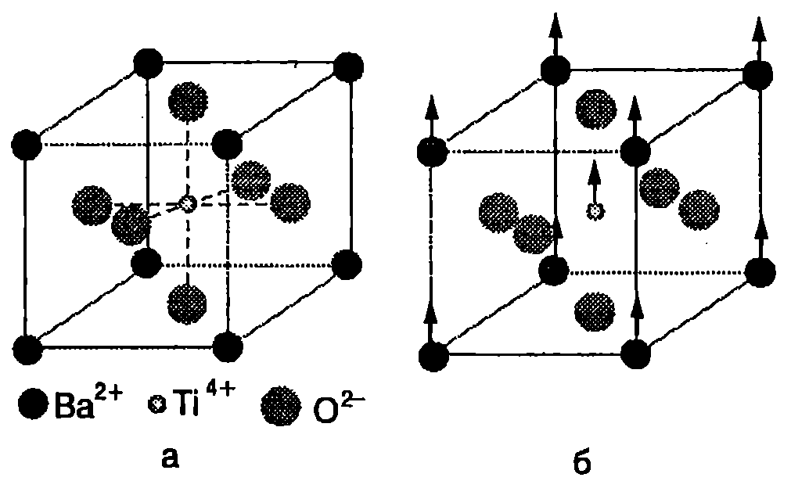

**Фази**

Фаза се нарича съвкупността от еднородни и еднакви по своите свойства макроскопични части от една термодинамична система, които са отделени от останалите части на системата с гранични повърхности и могат да се извлекат от нея по механичен начин. Ще поясним даденото определение с няколко примера:

1. В чаша с вода плават парчета лед. Системата е двуфазна: по механичен път парчетата лед (твърда фаза) могат да се отделят от водата (течна фаза).

2. На повърхността на чаша с вода е налят слой от олио. В случая също имаме двуфазна система. Двете течни фази (вода и олио) са разделени от гранична повърхност.

3. При мъгла малките водни капки и въздухът също образуват двуфазна система, съставена от газова и течна фаза. Всяка капчица е отделена от въздуха с гранична повърхност.

В една система може да има няколко твърди или течни фази, но само една газова фаза, тъй като всички газове се смесват помежду си. Например въздухът е еднофазна система, независимо, че представлява смес от различни газове. Две несмесващи се течности образуват двуфазна система, а смесващите се течности след разбъркване образуват еднофазна система.

**Фазово равновесие**

Пример за различни фази на едно и също вещество са трите му агрегатни състояния: твърдо, течно и газово. За някои кристални вещества твърдото състояние може да се реализира чрез различни кристални модификации. Това явление се нарича полиморфизъм. Например диамантът и графитът са две различни твърди фази на въглерода, които се различават една от друга по кристалната си структура. Друг пример е ледът, който има 9 полиморфни разновидности. Важна задача на термодинамиката е да установи условията, при които система, съставена от две или повече фази на едно вещество, се намира в равновесие. Фазовото равновесие включва топлинно и механично равновесие. За топлинното равновесие е необходимо всички фази от системата да имат еднаква температура. Когато две фази са разделени с плоска граница, условието за механично равновесие се свежда до изискването налягането от двете страни на границата да е еднакво. За фазовото равновесие е необходимо и още едно условие: масата на всяка една от фазите да не се променя с течение на времето, т.е. да не става превръщане на веществото от една фаза в друга фаза.

Експерименталните и теоретичните изследвания показват, че равновесие между две фази на едно вещество може да съществува само в определен температурен интервал. На всяка стойност на температурата $T$ в този интервал съответства точно определено налягане $p$, при което равновесието е възможно. На $pT$-диаграма състоянието на равновесие между две фази се представя с линията

$$p = f(T).
$$

Доказва се, че три фази на едно вещество могат да са в равновесие само при една единствена стойност $T_\text{т}$ на температурата и $p_\text{т}$ на налягането. На $pT$-диаграмата на това равновесно състояние съответства точка с координати ($T_\text{т},p_\text{т}$), наречена *тройна точка*. Равновесие на повече от три фази на едно вещество изобщо не е възможно.

**Фазови преходи от първи род**

Преминаването на веществата от една фаза в друга се нарича фазов преход. Обикновено фазовите преходи са съпроводени с поглъщане или с отделяне на определено количество топлина, наречено *скрита топлина* или само *топлина на прехода*.

**Фазови преходи, при които се отделя или се поглъща топлина, се наричат фазови преходи от първи род.**

Те са свързани с промяна на обема, енергията и ентропията на веществото. Примери за фазови преходи от първи род са преходите между различните агрегатни състояние на веществото. Преходът от твърда в течна фаза се нарича топене, а обратният преход от течна в твърда фаза втвърдяване или кристализация. При нормално атмосферно налягане кристалните твърди тела се топят при точно определена температура, наречена температура на топене. Аморфните твърди тела, например стъклото и асфалта, нямат определена температура на топене. При нагряване те се размекват и постепенно преминават в течно състояние.

Количеството топлина, необходимо за разтопяването на единица маса от кристално вещество, нагрято до температурата на топене, се нарича специфична топлина на топене $\lambda$. От определението следва, че тяло с маса $m$ трябва да погълне количество топлина
$$Q = \lambda m,
$$
за да се разтопи. Съгласно със закона за запазване на енергията обратният процес на кристализация е съпроводен с отделяне на същото количество топлина, каквото се поглъща при топенето.

Преминаването на веществото от течна в газова фаза се нарича изпарение или парообразуване. Количеството топлина, необходимо за изпарение на единица маса от веществото, се нарича специфична топлина на изпарение (парообразуване) $r$. Необходимото количество топлина $Q$ за изпаряване на $m$ килограма от веществото е

$$Q = r m.
$$

> [!question] Пример 41.1
Пресметнете изменението на ентропията при разтапянето на 0,5 kg лед, намиращ се при температура 0 °C. Специфичната топлина на топене на леда е $\lambda = 3,\!33.10^5$ J/kg.
\end{psexample}
> [!note]- Решение
 Ще разглеждаме топенето на леда като равновесен процес, протичащ при постоянна температура $T = 273$ К, при който термодинамичната система поглъща количество топлина $Q=\lambda m$. Нарастването на ентропията е
$$\Delta S = \frac{Q}{T} = \frac{\lambda m}T;$$
$$\Delta S = \frac{(3,\!33.10~\mathrm{J/kg}) (0,\!5~\mathrm{kg})}{273~\mathrm{K}} = 610~\mathrm{\frac{J}{K}}.$$

**Фазови преходи от втори род**

При фазовите преходи от първи род става скокообразно изменение на състоянието на веществото. Например, ако се нагрее до температурата на топене, кристал преминава скокообразно от твърдо в течно състояние. При полиморфните превръщания в точката на фазовия преход веществото преминава от една кристална модификация в друга, т.е. става скокообразно изменение в симетрията на подреждане на атомите в кристала. Характерно за фазовите преходи от I род е, че в точката на прехода двете фази съществуват едновременно, намират се в равновесие помежду си и имат различни свойства.

Съществуват и друг вид фазови преходи, при които измененията в състоянието на веществото се извършват постепенно (плавно), а не скокообразно. Например при високи температури кристалът BaTiO$_3$ има кубична структура, като във върховете на елементарния куб (Фиг. \ref{fig:41.1}) са разположени йони на бария (Ba$^{2+}$), в средата на стените йони на кислорода (O$^{2-}$), а в центъра на куба йони на титана (Ti$^{4+}$). Когато температурата намалява и достигне определена стойност $T_k$, йоните Ba$^{2+}$ и Ti$^{4+}$ започват да се изместват спрямо йоните на кислорода O$^2$ в направление на едно от ребрата на куба и се променя симетрията на кристала: кубът се деформира. Такива плавни изменения в структурата на кристала се наричат фазов преход от втори род. При температурата $T_k$ на фазовия преход кубът не е деформиран и нискотемпературната фаза на бариевия титанат съвпада с кубичната високотемпературна фаза.



```
Фазов преход от втори род. а) Високотемпературната фаза на бариевия титанат е кубична: във върховете на куба са разположени йоните Ba$^{2+
```$, в центъра на стените на куба - йоните O$^{2-}$, а йонът Ti$^{4+}$ е в центъра на куба. б) Под температурата на фазовия преход структурата леко се деформира: йоните Ba$^2$+ и Ti$^{4+}$ се отместват спрямо йоните на кислорода O$^{2-}$.}
	`Фиг. 41.1`


Друг пример за фазов преход от втори род е преминаването на някои вещества от парамагнитно във феромагнитно състояние. В случая кристалната структура не се променя, а стават само изменения в разположението на елементарните магнитни моментите преминават от по-неподредено състояние (високотемпературна парамагнитната фаза) в по-подредено състояние (нискотемпературна феромагнитна фаза). Преходът на някои метали, сплави и керамики в свръхпроводящо състояние също е фазов преход от втори род. При него стават изменения само в електронната система на веществото в свръхпроводящо състояние тя е ``по-подредена''.

За разлика от фазовите преходи от първи род, преходите от втори род не са свързани с поглъщане или отделяне на топлина. В точката на прехода не се изменят също така обемът, вътрешната енергия и ентропията. Фазовите преходи от втори род обикновено са съпроводени само със скокообразни изменения на топлинните капацитети и на коефициентите на топлинно разширение.

> [!question] Пример 41.2
При ниски температури топлинният капацитет $C_n$ на металите е пропорционален на абсолютната температура $T: C_n=aT$. Ако металът премине в свръхпроводящо състояние, зависимостта става: $C_s = bT^3$ ($a$ и $b$ са константи). Докажете, че в точката на фазовия преход $T_k$ топлинният коефициент търпи скок $\Delta C = C_s - C_n = 2aT_k$.
\end{psexample}
> [!note]- Решение
 От данните в условието на задачата можем да определим зависимостта на ентропията $S$ на метала от температурата във високотемпературната ($n$ -- нормална) фаза и в нискотемпературната ($S$ -- свръхпроводяща) фаза. От определението за топлинен капацитет $C_n = \delta Q/dT$ и от уравнението на втория принцип на термодинамиката $\delta Q = TdS_n$, следва, че: $C_n = aT = TdS_n/dT$. След непосредствено интегриране получаваме: $S_n = aT$. Аналогично: $C_s = bT^3 = TdS_s/dT$, откъдето след интегриране получаваме: $S_s = bT^3/3$.

В точката на фазовия преход от втори род ентропията не се изменя, т.е. $S_n (T_k) = S_s(T_k)$ или $aT_k = bT_k^3/3$. От последното равенство намираме връзката между коефициентите $a$ и $b$:
$$b = \frac{3a}{T_k^2}.$$

Търсеният скок в топлинния капацитет на метала при фазовия преход от втори род нормален метал-свръхпроводник е
$$\Delta C = C_s - C_n = \left(\frac{3a}{T_k^2}\right) T_k^3 - aT_k = 2aT_k$$

**Задачи**

1. Течният хелий има много ниска температура на кипене 4,2 К (при нормално атмосферно налягане) и много малка специфична топлина на парообразуване $r = 2,\!1.10^4$ J/kg (около 100 пъти по-малка от тази на водата). За да се сведе до минимум топлообменът с околната среда, течният хелий се съхранява в специални съдове, чиято външна част се охлажда от течен азот. Пресметнете загубите на течен хелий поради изпарението за едно денонощие, ако хелият в съда получава при топлообмена с околната среда постоянна топлинна мощност 0,2 W.

2. За разтапяне на топка от мокър сняг е необходимо два пъти по-малко количество топлина, отколкото за стопяване на парче лед със същата маса, чиято начална температура е -10 °C. Колко процента е водата в снежната топка? Специфичният топлинен капацитет на леда е 2100 J/(kg-K), а специфичната му топлина на топене е 333 kJ/kg.

3. Пресметнете изменението на ентропията на 2 kg алуминий, който се втвърдява при постоянна температура 660 °C (температура на топене и на втвърдяване на алуминия). Специфичната топлина на топене на алуминия е $4.10^5$ J/kg.

4. Айсберг с маса $10^{10}$ kg е носен от течението Гълфстрийм, температурата на чиято вода в 22 °C. Температурата на леда е 0°C. ) Колко в максималният възможен КПД на топлинна машина, която използва водата на течението за нагревател, а айсбергът за охладител?

6) Колко механична работа ще извърши такава машина, докато айсбергът се разтопи? Специфичната топлина на топене на леда в $3,\!33.10^5$ J/kg.

