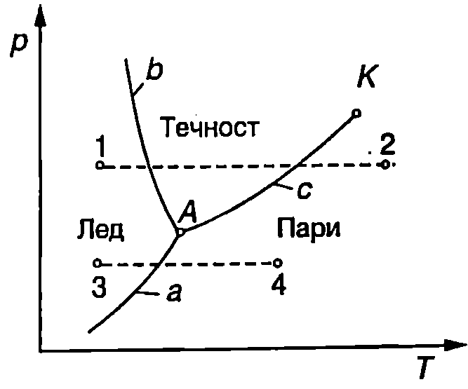

**Уравнение на Клапейрон-Клаузиус**

За решаването на разнообразни по своя характер задачи се използва т.нар. метод на термодинамичните цикли: разглежда се обратим цикъл (най-често цикъл на Карно), за който се прилагат първият и вторият принцип на термодинамиката. Ще използваме този метод, за да изразим скритата топлина на изпарение $r$ като функция на термодинамичните параметри на веществото. На Фиг. \ref{fig:42.1} са показани две безкрайно близки изотерми на втечняване на дадено вещество с температури съответно $T$ и $T-dT$. Съставяме елементарен цикъл на Карно, включващ изотермите $ab$ и $cd$ и адиабатите $bc$ и $da$. Изотермното разширение $ab$ на двуфазната система течност - наситена пара се извършва при постоянно налягане $p$, а изотермното свиване са при постоянно налягане $p-dp$. (Наситени пари се наричат пари, които са в равновесие със своята течност.) При процеса $ab$ вещество с маса $m$ преминава от течно в газово състояние, при което обемът нараства с $\Delta V_1 = m(v_\text{п}-v_\text{т})$, където $v_\text{п}$ е специфичният обем на парата (обем на единица маса от парата), а $v_\text{т}$ е специфичният обем на течността. При изотермното разширение $ab$ системата извършва положителна работа
$$A_1 = p \Delta V_1 = pm (v_\text{п} - v_\text{т}).
$$

Тъй като двете изотерми са безкрайно близки, изменението на обема при изотермното свиване е $\Delta V_2 = -\Delta V_1$ (разликата в абсолютните стойности на двете величини е безкрайно малка величина от втори порядък, която се пренебрегва). Работата на системата при процеса $cd$ е
$$A_2 = (p-dp) \Delta V_2 = -(p-dp)m (v_\text{п} - v_\text{т}).
$$

При адиабатното разширение системата върши положителна работа, а при адиабатното свиване отрицателна работа. Тъй като двете изотерми са безкрайно близки, общата работа при адиабатните процеси също в безкрайно малка величина, но от втори порядък, и се пренебрегва. Общата работа за един цикъл е
$$dA = A_1 + A_2 = m (v_\text{п} - v_\text{т}) dp,
$$
където е отчетено, че за елементарния цикъл на Карно общата работа е безкрайно малка величина, тъй като стойностите на $A_1$ и $A_2$ са много близки по големина и имат противоположни знаци. Системата получава топлина от околната среда само при изотермното разширение $ab$. (При изотермното свиване системата отдава топлина, а при адиабатните процеси няма топлообмен.) Погълнатото количество топлина $Q_1$ се използва за превръщане на вещество с маса $m$ от течност в наситена пара при постоянна температура $T$ и постоянно налягане $p$, т.е. $Q =rm$, където $r$ е специфичната топлина на изпарение. Съгласно с теоремата на Карно, КПД на цикъла на Карно е
$$\eta = \frac{A}{Q_1} = \frac{T_1-T_2}{T_1}.$$

В случая: $A =dA= m(v_\text{п}-v_\text{т})dp$; $Q_1 = rm$; $T_1 = T$ и $T_2 = T-dT$. След заместване и елементарни преобразования за специфичната топлина на изпарение получаваме
$$r = (v_\text{п} - v_\text{т}) T \frac{dp}{dT}.
$$


```

```
	`Фиг. 42.1`


Това уравнение се нарича уравнение на Клапейрон-Клаузиус. От него може да се пресметне специфичната топлина на парообразуване $r$. За целта експериментално се измерва зависимостта $p(T)$ на налягането $p$ на наситените пари от температурата $T$, пресмята се производната $dp/dT$ и от уравнението на Клапейрон-Клаузиус \eqref{eq:42.4} се определя $r$.


Съгласно с теоремата на Карно КПД на цикъла на Карно не зависи от вида на работното вещество. Затова направеният извод на уравнението на Клапейрон-Клаузиус остава в сила и за другите фазови преходи от първи род. В общия случай то се записва във вида
$$q_{12} = (v_2 - v_1) T \frac{dp}{dT},
$$
където $q_{12}$ е специфичната топлина на прехода от фаза 1 във фаза 2, а $v_1$ и $v_2$ са специфичните обеми на веществото в двете фази.

> [!question] Пример 42.1
Определете температурната зависимост на налягането на наситените водни пари, ако е известно, че при нормално атмосферно налягане водата кипи при температура 100 °C.

***Указание.*** В уравнението на Клапейрон-Клаузиус \eqref{eq:42.4} да се пренебрегне температурната зависимост на специфичната топлина на изпарение $r$. Да се пренебрегне също така специфичният обем $v_\text{т}$ на течността, тъй като той е много по-малък от специфичния обем $v_\text{п}$ на парата. Водните пари да се разглеждат като идеален газ.
\end{psexample}
> [!note]- Решение
 От уравнението за състоянието на идеалния газ $\displaystyle pV = \frac{m}{M}RT$ изразяваме специфичния обем на водните пари
$$v_\text{п} = \frac{V}{m} = \frac{RT}{Mp}.$$

В уравнението на Клапейрон-Клаузиус заместваме $v_\text{п}$, полагаме $v_\text{т} = 0$ и получаваме:

$$r=\frac{RT^2}{Mp}\frac{dp}{dT} \text{ или } \frac{dp}{p} =\frac{rM}{RT^2} dT.$$

Тъй като сме приели специфичната топлина на изпарение $r$ за константа, горното уравнение се интегрира непосредствено и се получава:
$$p=C\exp\left(-\frac{rM}{RT}\right)$$

Константата $C$ определяме от условието, че при температура $T = T_0 = 373$ К налягането на наситените водни пари е равно на нормално атмосферно налягане $p = p_0 = 1\ \mathrm{atm} =10^5\ \mathrm{Pa}$. (Ще припомним известния от училищния курс по физика факт, че водата започва да кипи, когато налягането на наситените пари стане равно на външното налягане.) След заместване получаваме $\displaystyle C = p_0 \exp\left(\frac{rM}{RT_0}\right)$. Търсената температурна зависимост на налягането на наситените водни пари е
$$p = p_0 \exp\left\{\frac{rM}{R}\left(\frac{1}{T_0}-\frac{1}{T}\right)\right\}.$$

**Фазови диаграми**

В повечето случаи интегриране на уравнението на Клалейрон-Клаузиус \eqref{eq:42.5} и получаване на аналитичен израз за кривата $p = f(T)$, описваща равновесието между две фази, е невъзможно, тъй като не са известни температурните зависимости на специфичните обеми на фазите и на специфичната топлина на прехода. Това налага тези криви да се определят експериментално. На $pT$-диаграмата от Фиг. \ref{fig:42.2} са показани кривите на фазовото равновесие между трите агрегатни състояния (фази) на водата. Кривата на сублимация а разделя твърдата фаза (лед) от газовата фаза (водни пари). Твърдата фаза и течната фаза са разделени от кривата на топене $b$, а течната фаза и газовата фаза - от кривата на изпарение $c$. Трите криви се пресичат в тройната точка $A$, в която трите фази се намират в равновесие помежду си. Температурата на тройната точка на водата е 0,01 °C и, както вече беше отбелязано (вж. стр.155), е единствената реперна точка в скалата на газовия термометър. Налягането на наситените водни пари в тройната точка е 611,2 Pa. Кривата на изпарение се прекъсва също и в критичната точка $K$.



```
Фазова диаграма на водата.
```
	`Фиг. 42.2`


Кривите $a$, $b$ и $c$ в близост до тройната точка $A$ могат да се анализират качествено с помощта на уравнението на Клаузиус-Клапейрон. Наклонът на тези криви в тройната точка е:
$$\frac{dp}{dT} = \frac{\lambda+r}{T(v_\text{п}-v_\text{л})}\text{ крива }a$$
$$\frac{dp}{dT} = \frac{\lambda}{T(v_\text{т}-v_\text{л})}\text{ крива }b$$
$$\frac{dp}{dT} = \frac{r}{T(v_\text{п}-v_\text{т})}\text{ крива }c$$

където $v_\text{л}$, $v_\text{т}$ и $v_\text{п}$ са съответно специфичните обеми на леда, течността и наситените водни пари, а $T$ -- температурата на тройната точка на водата. В първото уравнение е отчетено, че съгласно със закона за запазване на енергията специфичната топлина на сублимация е равна на сумата $\lambda + r$ от специфичните топлини на топене $\lambda$ и на парообразуване $r$, определени също в тройната точка. От трите уравнения могат да се направят следните изводи:

1. Наклонът на кривата на сублимация а и на кривата на изпарение с е положителен ($dp/dT > 0$), защото водните пари имат по-малка плътност и по голям специфичен обем от водата и от леда ($v_\text{п}>v_\text{л}$ и $v_\text{п}>v_\text{т}$). Наклонът на кривата а е по-голям, защото топлината на сублимация $\lambda + r$ е по-голяма от топлината на изпарение $r$ ($v_\text{п}-v_\text{т} \approx v_\text{п}-v_\text{л}$).

2. Наклонът на кривата на топене $b$ е отрицателен ($dp/dT < 0$), защото ледът има по-малка плътност и по-голям специфичен обем от водата ($v_\text{л}>v_\text{т}$). Затова при увеличаване на налягането температурата на топене на леда намалява. Веществата, чиито обем при топене нараства, имат положителен наклон на кривата на топене.

Ще отбележим, че поради отрицателния наклон на кривата на топене на леда например е възможно да се карат зимни кънки. Коефициентът на триене между стоманата и сухия лед е голям и пързалянето би било силно затруднено. Натискът на кънката върху леда обаче води до увеличаване на налягането, при което ледът започва да се топи при по-ниска температура и се получава тънък течен слой, който значително намалява триенето.

Диаграми, подобни на показаната на Фиг. \ref{fig:42.2}, се наричат *фазови диаграми* или *диаграми на състоянието*. С тяхна помощ могат да се проследят фазовите преходи, които се извършват във веществото при един или друг процес. Например с пунктир на Фиг. \ref{fig:42.2} са показани два процеса на нагряване на леда при постоянно налягане. Ако налягането е по-голямо от налягането на наситените водни пари в тройната точка (изобарата 12), процесът е съпроводен с два фазови прехода: топене на леда, а след това изпарение на водата. Втората изобара 3-4, където налягането в по-ниско от налягането на наситените водни пари в тройната точка на водата А, описва процес само с един фазов преход сублимация на леда.

**Задачи**

1. а) Като предположите, че атмосферата се намира при постоянна температура и че специфичната топлина на изпарение на водата $r$ не зависи от температурата и от налягането, покажете, че температурата на кипене на водата се изменя с надморската височина $h$ по закона $\displaystyle T = T_0\left(1-\frac{gh}{r}\right)$, където $T_0 = 373$ К е температурата на кипене на водата на морския бряг, т.е. при нормално атмосферно налягане.

б) Пресметнете температурата на кипене на водата на площад Ал. Невски ($h = 550$ m). Специфичната топлина на изпарение на водата е $r = 2,\!26.10^6$ J/kg.

***Указание.*** Използвайте барометричната формула (уравнение \eqref{eq:34.11} на стр. 186) и резултата от пример 42.1.

2. С помощта на фазовата диаграма от Фиг. \ref{fig:42.2} проследете какви фазови преходи ще се извършат с чиста вода, намираща се в съд с постоянна температура -1 °C при много голямо налягане, ако налягането започне бавно да намалява.

