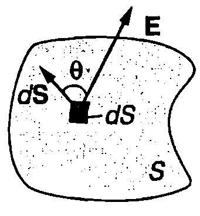
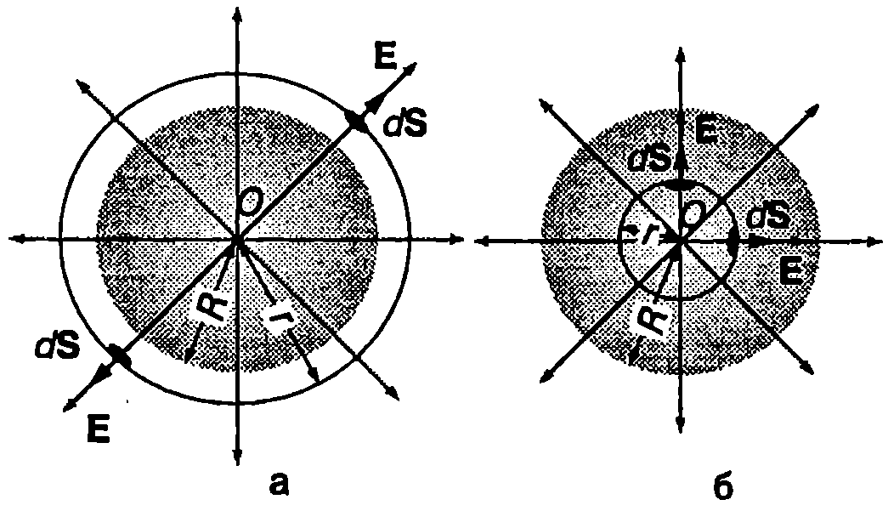
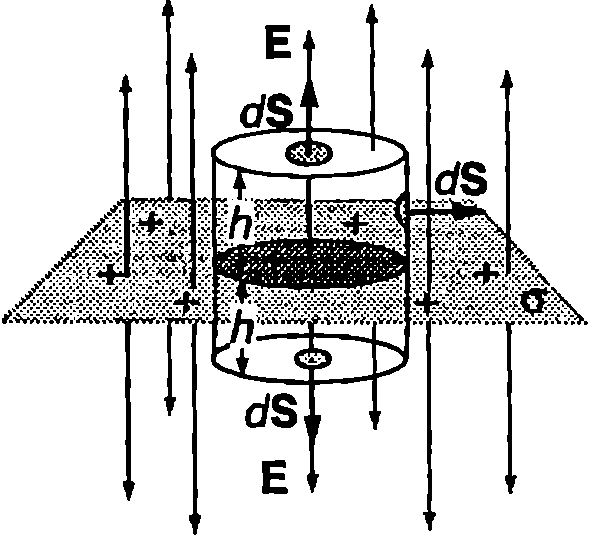

**Поток на интензитета**

Да разгледаме повърхност с форма на правоъгълник с площ $S$, разположена перпендикулярно на силовите линии на еднородно електрично поле с интензитет $\vec E$ (Фиг. \ref{fig:45.1}а). Скаларната величина
$$\Phi_E = ES
$$
се нарича поток на интензитета на електричното поле през повърхността $S$. Величината $\Phi_E$ има нагледна геометрична интерпретация: ако силовите линии са начертани така, че гъстотата им да е правопропорционална на големината на интензитета $E$, тогава потокът $\Phi_E$ е правопропорционален на броя на силовите линии, пресичащи повърхността $S$.

На Фиг. \ref{fig:45.1}б единичният вектор $\hat{n}$ на нормалата към повърхността $S$ сключва ъгъл $\theta$ с вектора на интензитета $\vec E$ на еднородното поле. От чертежа се вижда, че броят на силовите линии, пресичащи повърхността $S$, е равен на броя на силовите линии, които пресичат нейната проекция с площ $S \cos \theta$ върху равнина, перпендикулярна на интензитета $\vec E$. Тогава потокът на интензитета е
$$\Phi_E = ES \cos \theta = E_n S
$$
където $E_n = E \cos \theta$ е проекцията на вектора $\vec E$ върху нормалата към повърхността. Ще обърнем внимание, че потокът $\Phi_E$ е алгебрична величина: $\Phi_E > 0$, когато векторите $\vec E$ и $\hat{n}$ сключват остър ъгъл ($\cos \theta > 0$), а когато $\cos \theta < 0$, потокът е отрицателен. Ще наречем ``лицева'' страната, от която сме избрали да излиза единичният вектор $\hat{n}$, а другата страна ``опака''. Потокът $\Phi_E$ на интензитета е положителен, когато силовите линии пробождат повърхността от ``опаката'' към ``лицевата'' страна, и отрицателен в обратния случай.


```

```
	`Фиг. 45.1`



```

```
	`Фиг. 45.2`


```

```
	`Фиг. 45.3`


Ще определим потока на интензитета в общия случай, когато повърхността $S$ има произволна форма, а полето не е еднородно. Разделяме повърхността $S$ на безкраен брой малки елементи с площ $dS$. На Фиг. \ref{fig:45.2} схематично е представен един от тях. Всеки елемент ще характеризираме с вектор $d\vec S$, чийто модул е равен на площта $dS$ на елемента, а посоката му съвпада с посоката на единичния вектор $\hat{n}$ на нормалата към този елемент, т.е. $d\vec S = dS \hat{n}$. Тъй като елементът е безкрайно малък, електричното поле в неговите граници е еднородно. Тогава съгласно с формула \eqref{eq:45.2} потокът $\Phi_E$ през елемента $dS$ е
$$d\Phi_E = \vec E \cdot d\vec S = E dS \cos \theta
$$
т.е. той е равен на скаларното произведение на векторите $\vec E$ и $d\vec S$.

За да определим потока $\Phi_E$ през цялата повърхност $S$, трябва да сумираме (интегрираме) потоците през всички безкрайно малки елементи:
$$\Phi_E = \int_S \vec E \cdot d\vec S
$$

На Фиг. \ref{fig:45.3} е показана затворена повърхност $S$ с произволна форма. В електростатиката такива повърхности се наричат гаусови повърхности. Когато повърхността е затворена, прието е единичните вектори $\hat{n}$ на нормалите към нея, както и векторите $d\vec S$, да са насочени навън (Фиг. \ref{fig:45.3}). Тогава силовите линии, които излизат през повърхността, създават положителен поток, а които влизат -- отрицателен поток. За затворена повърхност $S$ формула \eqref{eq:45.4} за потока на интензитета се записва във вида
$$\Phi_E = \oint_S \vec E \cdot d\vec S
$$

**Закон на Гаус**

Ще установим връзката между потока на интензитета на електричното поле през затворена (гаусова) повърхност и електричните заряди, които създават това поле. Ще започнем с най-простия случай на отделен положителен точков заряд $q$. За гаусова повърхност ще изберем сфера с радиус $r$, чийто център съвпада със заряда $q$ (Фиг. \ref{fig:45.4}). Силовите линии на полето излизат радиално от заряда и са перпендикулярни на повърхността на сферата. Следователно за всяка точка от сферата векторите $\vec E$ и $d\vec S$ са еднопосочни, т.е. $\vec E \cdot d\vec S = E dS$. Освен това модулът на вектора $\vec E$ има една и съща стойност
$$E = \frac{q}{4 \pi \varepsilon_0 r^2}$$
във всички точки от сферата, тъй като те се намират на еднакво разстояние $r$ от заряда $q$. Потокът през малък елемент с площ $dS$ от повърхността на сферата е
$$d\Phi_E = E dS = \frac{q}{4 \pi \varepsilon_0 r^2} dS,$$
а потокът през цялата сфера е
$$\Phi_E = \oint_S \vec E \cdot d\vec S = \frac{q}{4 \pi \varepsilon_0 r^2} \oint_S dS = \frac{q}{4 \pi \varepsilon_0 r^2} (4 \pi r^2) = \frac{q}{\varepsilon_0}.
$$


```

```
	`Фиг. 45.4`


```

```
	`Фиг. 45.5`

Следователно потокът на интензитета през сферата е правопропорционален на големината на заряда $q$. Ще докажем, че този резултат остава в сила, когато гаусовата повърхност $S$, заграждаща точковия заряд $q$, има произволна форма. Описваме около заряда две гаусови повърхности: концентрична сфера с радиус $r_1$ и затворена повърхност $S$ с произволна форма (Фиг. \ref{fig:45.5}). Отделяме мислено тесен конус (телесен ъгъл $d\Omega$) с връх в заряда $q$, който отсича от сферата малък елемент с площ $dS_1$, а от повърхността $S$ -- малък елемент с площ $dS$ (Фиг. \ref{fig:45.5}). Потокът на интензитета през $dS_1$ е
$$d\Phi_1 = \vec E \cdot d\vec S_1 = E(r_1) dS_1,$$
а през $dS$ е
$$d\Phi_2 = \vec E \cdot d\vec S = E(r) dS \cos \theta = E(r) dS',$$
където $\theta$ е ъгълът между вектора $\vec E$ и нормалата към елемента $dS$, $E(r_1)$ и $E(r)$ са големините на интензитета на полето в точките $A_1$ и $A$, т.е. на разстояния $r_1$ и $r$ от точковия заряд, а $dS' = dS \cos \theta$ е проекцията на $dS$ върху сфера с радиус $r$, концентрична на сферата с радиус $r_1$. Както е известно от стереометрията, площите $dS_1$ и $dS'$, които отсича телесният ъгъл $d\Omega$ от двете концентрични сферични повърхности, са свързани със съотношението
$$\frac{dS_1}{r_1^2} = \frac{dS'}{r^2}.$$
Тъй като интензитетът $E$ намалява обратнопропорционално на разстоянието до заряда $q$,
$$E(r) = \frac{q}{4 \pi \varepsilon_0 r^2}, \quad E(r_1) = \frac{q}{4 \pi \varepsilon_0 r_1^2}.$$
Следователно
$$d\Phi_2 = E(r) dS' = \frac{q}{4 \pi \varepsilon_0 r^2} dS' = \frac{q}{4 \pi \varepsilon_0 r_1^2} dS_1 = E(r_1) dS_1 = d\Phi_1.$$
И така, съгласно със закона на Кулон интензитетът на електричното поле намалява по закона на обратните квадрати ($E \propto 1/r^2$). Това намаляване на интензитета при отдалечаване от заряда се компенсира напълно от нарастването на площта на елементите ($dS \propto r^2$). Затова потоците през елементите $dS_1$ и $dS'$ са равни.

На всеки един от малките елементи $dS$, на които мислено разделяме гаусовата повърхност $S$, съответства получен по описания по-горе начин елемент $dS'$ и елемент $dS_1$ от сферата $S_1$. Следователно пълният поток през гаусовата повърхност е
$$\Phi_E = \oint_S \vec E \cdot d\vec S = \oint_{S_1} \vec E \cdot d\vec S = \frac{q}{\varepsilon_0}.
$$

Нека точковият заряд $q$ се разположи извън гаусовата повърхност $S$. В този случай телесният ъгъл $d\Omega$, с връх в заряда $q$, или изобщо не пресича повърхността $S$, или я пресича два пъти (Фиг. \ref{fig:45.6}). Като повторим направените вече разсъждения, стигаме до извода, че потоците $d\Phi_1$ и $d\Phi_2$ през двата малки елемента $dS_1$ и $dS_2$ са равни по големина. Потокът $d\Phi_1$ обаче е отрицателен, защото силовите линии пресичат $dS_1$ от ``лицевата'' към ``опаката'' страна, а потокът $d\Phi_2$ е положителен, тъй като силовите линии пресичат $dS_2$ от ``опаката'' към ``лицевата'' страна. Затова общият поток през двата елемента е нула:
$$d\Phi_1 + d\Phi_2 = 0.$$
Нула е и пълният поток, който полето на заряда създава през затворената повърхност $S$.

Следователно, ако точковият заряд се намира вътре в обема, заграден от гаусовата повърхност, потокът на интензитета на неговото електрично поле е $\Phi_E = q/\varepsilon_0$, независимо от формата и размерите на гаусовата повърхност. Когато зарядът се намира извън този обем, потокът е нула ($\Phi_E = 0$).


```

```
	`Фиг. 45.6`

С помощта на принципа на суперпозицията полученият резултат се обобщава за произволна система от точкови заряди (или заредени тела, които могат да се разглеждат като съвкупност от точкови заряди). Всеки заряд $q_i$ от системата създава поле с интензитет $\vec E_i$. Потокът на интензитета на това поле през избраната гаусова повърхност е $\Phi_{E_i} = q_i/\varepsilon_0$, ако зарядът $q_i$ е вътре в обема, заграден от тази повърхност, или $\Phi_{E_i} = 0$, ако зарядът $q_i$ е извън този обем. Съгласно с принципа на суперпозицията интензитетът на електростатичното поле $\vec E$ е векторна сума от интензитетите на полетата на отделните заряди, а неговият поток е алгебрична сума от потоците на тези полета:
$$\Phi_E = \oint_S \vec E \cdot d\vec S = \oint_S \left(\sum \vec E_i\right) \cdot d\vec S = \sum \Phi_{E_i} = \frac{q_{\text{п}}}{\varepsilon_0},
$$
където $q_{\text{п}}$ е пълният заряд (алгебричната сума от положителните и отрицателните заряди), разположен в обема, заграден от повърхността $S$. Уравнението
$$\Phi_E = \oint_S \vec E \cdot d\vec S = \frac{q_{\text{п}}}{\varepsilon_0}
$$
изразява закона на Гаус в електростатиката, който гласи:

**Във вакуум потокът на интензитета на електричното поле през произволна затворена повърхност (гаусова повърхност) е равен на отношението на пълния заряд $q_{\text{п**}$, намиращ се в заградения от повърхността обем, и електричната константа $\varepsilon_0$.}

Законът на Гаус дава възможност лесно да се пресметне интензитетът на електричното поле в случаите, когато електричните заряди са разпределени симетрично. Ще разгледаме три конкретни примера.

> [!question] Пример 45.1
Електричен заряд $q$ ($q > 0$) е разпределен равномерно в обема на кълбо с радиус $R$. Определете интензитета на електричното поле на кълбото на разстояние $r$ от неговия център $O$. Разгледайте два случая:
а) $r > R$;
б) $r < R$.
\end{psexample}
> [!note]- Решение
 Разпределението на електричния заряд има сферична симетрия. Затова електричното поле също е със сферична симетрия: силовите линии са прави линии, които излизат от центъра на кълбото (Фиг. \ref{fig:45.7}).

а) Отчитайки симетрията на полето, избираме за гаусова повърхност сфера с радиус $r$ ($r > R$), чийто център съвпада с центъра на кълбото (Фиг. \ref{fig:45.7}а). Съгласно със закона на Гаус потокът на електричното поле през сферичната повърхност $S$ е
$$\Phi_E = \oint_S \vec E \cdot d\vec S = \frac{q}{\varepsilon_0},$$
където сме отчели, че целият заряд $q$ на кълбото се намира в обема, заграден от сферичната гаусова повърхност. Разделяме мислено сферата на малки елементи с площ $dS$, които ще характеризираме с вектори $d\vec S$, насочени перпендикулярно на повърхността на сферата. Тъй като силовите линии на полето също са перпендикулярни на повърхността на сферата, векторът на интензитета на електричното поле $\vec E$ на повърхността на всеки малък елемент е успореден на съответния вектор $d\vec S$ (Фиг. \ref{fig:45.7}б). Следователно $\vec E \cdot d\vec S = E dS$. Освен това от сферичната симетрия на полето следва, че интензитетът $E$ има еднаква големина за всички точки от повърхността на сферата, защото те се намират на равни разстояния от центъра на симетрия $O$. Следователно
$$\Phi_E = \oint_S E dS = E \oint_S dS = E (4 \pi r^2) = \frac{q}{\varepsilon_0},$$
където $4 \pi r^2$ е площта на сферата. От горното уравнение изразяваме интензитета
$$E = \frac{q}{4 \pi \varepsilon_0 r^2}.
$$
Следователно електричен заряд $q$, разпределен равномерно в обема на кълбо, създава електрично поле, което извън кълбото е еднакво с полето на точков заряд $q$, поставен в центъра на кълбото.



```

```
	`Фиг. 45.7`


б) Повтаряме същите разсъждения, както при $r > R$, и построяваме сферична гаусова повърхност с радиус $r < R$ (Фиг. \ref{fig:45.7}в). Единствената разлика е, че в този случай само част от заряда $q$ на кълбото се намира в обема, заграден от гаусовата повърхност. За да определим заряда $q_{\text{п}}$, който се намира в кълбото с радиус $r$, трябва да умножим заряда в единичен обем $\rho = q/\left(\frac{4}{3} \pi R^3\right)$ по обема $\frac{4}{3} \pi r^3$ на това кълбо:
$$q_{\text{п}} = \rho \cdot \frac{4}{3} \pi r^3 = \frac{q r^3}{R^3}.$$
Прилагаме закона на Гаус:
$$\Phi_E = E (4 \pi r^2) = \frac{q_{\text{п}}}{\varepsilon_0} = \frac{q r^3}{\varepsilon_0 R^3},$$
и определяме интензитета на електричното поле вътре в кълбото:
$$E = \frac{q}{4 \pi \varepsilon_0 R^3} r.
$$
Вътре в кълбото интензитетът на електричното поле нараства по линеен закон с разстоянието $r$ до центъра на кълбото. Графиката на функцията $E(r)$ е показана на Фиг. \ref{fig:45.8}. Ще обърнем внимание, че двете решения (за $r > R$ и $r < R$) съвпадат при $r = R$, т.е. на повърхността на кълбото.


```

```
	`Фиг. 45.8`


> [!question] Пример 45.2
Да се определи интензитетът на електричното поле, което се създава във вакуум от равномерно заредена безкрайна равнина. Повърхнинната плътност на заряда е $\sigma$ ($\sigma > 0$). (Повърхнинна плътност се нарича зарядът на единица площ от равнината.)
\end{psexample}
> [!note]- Решение
 Поради симетрията силовите линии на полето са насочени перпендикулярно на равнината. За гаусова повърхност избираме цилиндър с височина $2h$, чиито основи са успоредни на заредената равнина (Фиг. \ref{fig:45.9}). Тъй като силовите линии на полето са успоредни на околната повърхност на цилиндъра, те не я пресичат и потокът на интензитета през околната повърхност е нула. От симетрията следва, че големината на интензитета на полето на едно и също разстояние от двете страни на равнината е еднаква. Следователно потокът през всяка една от основите на цилиндъра е $E S$, където $S$ е площта на основата. Пълният поток през цилиндъра е $2 E S$. Съгласно със закона на Гаус:
$$\Phi_E = 2 E S = \frac{q_{\text{п}}}{\varepsilon_0} = \frac{\sigma S}{\varepsilon_0},$$
където $q_{\text{п}} = \sigma S$ е зарядът на кръга с площ $S$, който цилиндърът отсича от заредената равнина. Интензитетът на полето на разстояние $h$ от равнината е
$$E = \frac{\sigma}{2 \varepsilon_0}.
$$
Следователно интензитетът $E$ не зависи от разстоянието $h$, т.е. равномерно заредена безкрайна равнина създава еднородно електрично поле, чиито силови линии са насочени перпендикулярно на равнината.



```

```
	`Фиг. 45.9`


> [!question] Пример 45.3
Да се определи интензитетът на електричното поле, което се създава във вакуум от равномерно заредена безкрайна праволинейна нишка. Линейната плътност на заряда е $\lambda$ ($\lambda > 0$). (Линейна плътност се нарича зарядът на единица дължина от нишката.)
\end{psexample}
> [!note]- Решение
 Поради симетрията силовите линии са прави линии, които излизат радиално от нишката (Фиг. \ref{fig:45.10}). Гаусовата повърхност трябва да се избере така, че да се използва аксиалната (осева) симетрия на полето. На това изискване отговаря цилиндърът с радиус $r$ и дължина $l$ от Фиг. \ref{fig:45.10}, чиято ос съвпада с нишката. Двете основи на цилиндъра са успоредни на силовите линии, затова потокът през тях е нула. Околната повърхност на цилиндъра е перпендикулярна на силовите линии. Тъй като всички точки от нея са на еднакво разстояние $r$ от нишката, от симетрията следва, че големината на интензитета $E$ в тях е еднаква. Следователно потокът на интензитета през околната повърхност на цилиндъра е
$$\Phi_E = E S = E (2 \pi r l).$$
Съгласно със закона на Гаус:
$$\Phi_E = E (2 \pi r l) = \frac{q_{\text{п}}}{\varepsilon_0} = \frac{\lambda l}{\varepsilon_0},$$
където $q_{\text{п}} = \lambda l$ е зарядът на тази част от нишката, която се намира вътре в цилиндъра, т.е. в обема, заграден от избраната от нас гаусова повърхност. От полученото уравнение изразяваме интензитета
$$E = \frac{\lambda}{2 \pi \varepsilon_0 r}.
$$
Следователно интензитетът $E$ на електричното поле на равномерно заредена безкрайна праволинейна нишка намалява обратно пропорционално на разстоянието $r$ до нишката.


```

```
	`Фиг. 45.10`


**Задачи**

1. Електричен заряд $q$ е разпределен равномерно върху повърхността на сфера с радиус $R$. Определете интензитета на електричното поле:
а) вътре в сферата;
б) извън сферата.

2. Кълбо с радиус $R = 0,\!1~\mathrm{m}$ е заредено равномерно. Обемната плътност на заряда е $\rho = 2 \times 10^{-6}~\mathrm{C/m^3}$. Определете интензитета на електричното поле на разстояние $r = 0,\!05~\mathrm{m}$ от центъра на кълбото.

3. Определете силата, с която равномерно заредена непроводяща пластинка привлича точков заряд $q = 1 \times 10^{-9}~\mathrm{C}$, намиращ се много близо до повърхността на пластинката, но далече от нейните краища. Повърхнинната плътност на заряда на пластинката е $\sigma = 3 \times 10^{-7}~\mathrm{C/m^2}$.

4. Електричен заряд е разпределен равномерно в обема на безкраен цилиндър с радиус $R$. Определете интензитета на електричното поле:
а) извън цилиндъра;
б) в цилиндъра.
Зарядът на единица дължина от цилиндъра е $\lambda$.

5. Атомът на водорода може да се разглежда като съставен от положителен точков заряд $+e$ (протон), разположен в центъра на атома, около който е разпределен в пространството отрицателен заряд $-e$ (зарядът на електрона). Обемната плътност на отрицателния заряд се изменя по закона
$$\rho = -C e^{-2 r/r_B},$$
където $C$ е константа, $r_B = 0,\!53.10^{-10}~\mathrm{m}$ е радиусът на Бор, а $r$ е разстоянието до центъра на атома.
а) Като използвате факта, че атомът е електронеутрален, определете константата $C$.
б) Определете интензитета на електричното поле на разстояние $r_B$ от центъра на атома. 
