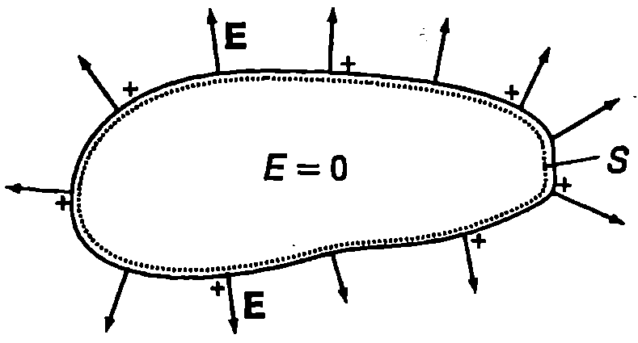
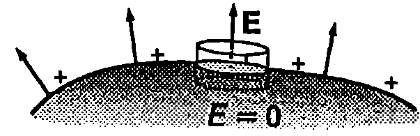
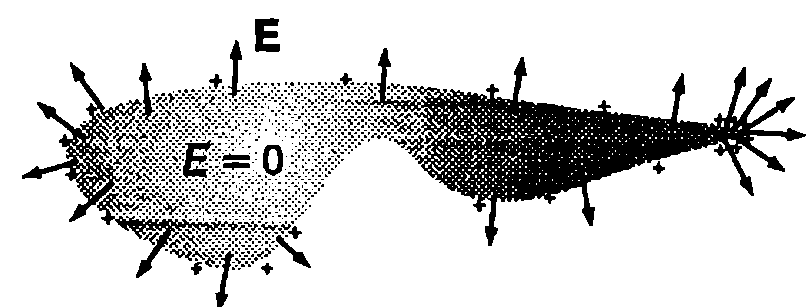
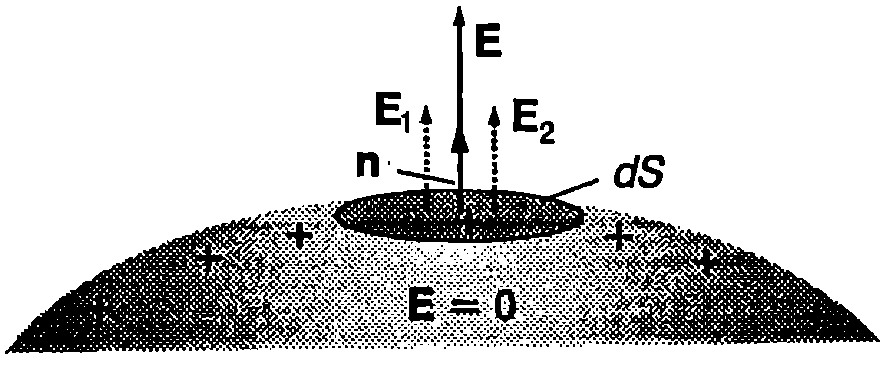

**Електрично поле във веществото**

Веществата са изградени от атоми, молекули и йони, които съдържат заредени частици - електрони и атомни ядра. Всяка заредена частица създава собствено електрично поле, а съгласно с принципа на суперпозицията полето във веществото е сума от полетата на отделните микрочастици. Това микроскопично поле обаче е изключително нееднородно и много бързо се изменя на разстояния от порядъка на размерите на атома. Интензитетът му в дадена точка зависи от положението на всички заредени частици. Поради огромния брой микрочастици не е възможно непосредствено да се определи интензитетът на микроскопичното поле и да се проследи изменението му с времето. Затова макроскопичната електродинамика не отчита атомния строеж на веществото и свързаните с него резки изменения на полето между два съседни атома (йона). Подобно на хидродинамиката тя разглежда веществата като непрекъснати среди и характеризира електричните им свойства с макроскопични величини: плътност на заряда $\rho$ и интензитет $\vec E$ на макроскопичното поле. Величините $\rho$ и $\vec E$ са равни на средните стойности на съответните микроскопични величини. Усредняването се извършва за много малки от макроскопична гледна точка области, които обаче включват много голям брой микрочастици. Чрез тази процедура се изглаждат всички резки изменения на микроскопичното поле на малки (атомни) разстояния, които са свързани с атомния строеж на веществото, при което остават само плавните изменения на полето на макроскопични разстояния. Дискретното разпределение на зарядите се заменя с непрекъснато разпределение, което се характеризира със средната обемна плътност $\rho$ на заряда (или повърхнинната му плътност $\sigma$).

**Електростатично равновесие**

Съгласно с електронната теория металните проводници са изградени от положителни йони, разположени във възлите на кристалната решетка, и свободни електрони, които се движат в целия обем на метала. Само на повърхността на проводниците действат сили, които не позволяват на свободните електрони да напуснат проводника. Тези сили електростатиката не изучава. В рамките на електростатиката дори не е необходимо да се отчита, че в действителност в металите се движат само свободните електрони, а положителните йони остават на местата си във възлите на кристалната решетка. Правилни решения на задачите на електростатиката дава и най-простият модел, според който както отрицателните, така и положителните заряди могат свободно да се движат в обема на проводника, без да го напускат. И най-слабото външно електрично поле привежда в движение свободните електрони. Движението продължава, докато интензитетът на полето вътре в проводника стане нула, т.е. докато свободните електрони се преразпределят така, че тяхното електрично поле изцяло да компенсира външното поле. Ще подчертаем, че във всички разглеждания по-нататък става дума за макроскопичното поле. ``Релефът'' на микрополето, т.е. неговите резки изменения в близост до йоните на метала, сравнително малко се влияе от външните полета. Когато не се извършва пренасяне на заряди през обема или по повърхността на проводника, казваме, че той се намира в състояние на електростатично равновесие. (Хаотичното топлинно движение на свободните електрони не води до пренасяне на електричен заряд, поради което то не се отчита.) Електростатичното равновесие се характеризира със следните важни свойства:

1. Интензитетът на електростатичното поле във всички точки вътре в проводника е нула ($\vec E = 0$).



```

```
	`Фиг. 47.1`


2. Некомпенсираните заряди се разполагат само по повърхността на проводника. Действително, да придадем на проводник с произволна форма допълнителен заряд $q$. Ще докажем, че той се разпределя по повърхността на проводника. Избираме гаусова повърхност $S$, разположена непосредствено под повърхността на проводника (Фиг. \ref{fig:47.1}). При електростатично равновесие интензитетът на електричното поле $\vec E$ във всяка точка от обема на проводника, включително и в точките от повърхността $S$, е равен на нула. Потокът на интензитета през затворената повърхност $S$ също е нула. Тогава от закона на Гаус следва, че вътре в обема, заграден от повърхността $S$, няма некомпенсирани заряди, т.е. целият допълнителен заряд $q$ се разпределя само върху повърхността на проводника.

3. Всички точки от обема и повърхността на проводника имат еднакъв потенциал. Да допуснем, че в две точки от обема на проводника потенциалът е различен. Това означава, че на заряд, който се пренася от едната точка в другата, действат електрични сили, което противоречи на условието електричното поле в обема на проводника да е нула.

4. Извън проводника интензитетът на електричното поле е насочен перпендикулярно на повърхността му, която е еквипотенциална (Фиг. \ref{fig:47.1}). Ако интензитетът имаше компонента, успоредна на повърхността на проводника, тогава на свободните заряди от повърхността щяха да действат тангенциални електрични сили и те биха се преразпределили така, че в равновесното положение тангенциалната компонента на интензитета да стане нула.



```

```
	`Фиг. 47.2`


С помощта на закона на Гаус лесно се установява връзката между интензитета $\vec E$ на електричното поле непосредствено над повърхността на проводника и повърхнинната плътност $\sigma$ на електричните заряди. За гаусова повърхност избираме прав цилиндър с много малки размери, част от който е вътре в проводника, а другата част е извън него (Фиг. \ref{fig:47.2}). Основите на цилиндъра (с площ $dS$) са успоредни на повърхността на проводника. Силови линии пробождат единствено външната основа на цилиндъра, тъй като вътре в проводника полето е нула, а извън него силовите линии са успоредни на околната повърхност на цилиндъра. Съгласно със закона на Гаус $\oint \vec E \cdot d\vec S = E\,dS = (\sigma\,dS)/\varepsilon_0$, откъдето

$$E = \frac{\sigma}{\varepsilon_0}
$$

5. Най-много некомпенсирани заряди се натрупват в изпъкналите (заострени) части на проводниците. Ако на сферичен проводник се придаде допълнителен заряд $q$, той се разпределя равномерно върху цялата повърхност. За проводници с неправилна форма обаче разпределението на некомпенсираните заряди е неравномерно. Доказва се, че най-голяма е повърхнинната плътност $\sigma$ на зарядите в изпъкналите части на проводника и най-малка във вдлъбнатите (Фиг. \ref{fig:47.3}). Съгласно с уравнение \eqref{eq:47.1} интензитетът $\vec E$ на полето е най-голям около изпъкналите части на проводника.



```

```
	`Фиг. 47.3`


Около заострените краища на зареден проводник полето може да стане толкова силно, че да започне изтичане на заряди. Възниква т.нар. електричен вятър. Механизмът е следният. Около острието се създава силно нееднородно поле. Под действие на силите на това поле неутралните молекули на въздуха се поляризират и се привличат към острието. Когато се докоснат до него, молекулите се зареждат с едноименен на острието заряд и веднага се отблъскват в противоположна посока. Тъй като силите, с които острието отблъсква заредените молекули, са много по-големи от силите, с които се привличат неутралните поляризирани молекули, молекулите ще се отдалечават с по-големи скорости в сравнение със скоростите на приближаване към острието. Така възниква електричен вятър - поток от заредени въздушни молекули, отдалечаващи се от острието. Електричният вятър например може да загаси свещ.


```

```
	`Фиг. 47.4`


На Фиг. \ref{fig:47.4} е показан интересен демонстрационен опит, наречен въртележка на Франклин. Металните остриета на въртележката се зареждат от електростатична машина. При възникването на електричен вятър, т.е. при отблъскването на заредените въздушни молекули от остриетата, се изпълнява законът за запазване на импулса: молекулите и остриетата получават равни по големина и противоположни по посока импулси, в резултат на което въртележката се завърта.

При силни полета механизмът на изтичане на заряди от остриета е по-сложен. В силното поле около острието става йонизация на въздушните молекули и възникват два противоположни потока от положителни и от отрицателни йони. Ако например зарядът на острието е отрицателен, положителните йони се привличат към него, а отрицателните се отблъскват. След като достигнат острието, положителните йони се неутрализират, като отнемат част от отрицателния заряд на острието. На подобни процеси се основава действието на гръмоотвода.

**Електростатична индукция**

Да доближим наелектризирана с положителен заряд стъклена пръчка до електронеутрален метален проводник (Фиг. \ref{fig:47.5}). Свободните електрони се привличат от пръчката и част от тях се натрупват в по-близката до нея част от повърхността на проводника, която се зарежда с отрицателен заряд. Поради създадения недостиг на електрони по-отдалечената повърхност на проводника се зарежда с положителен заряд.

Явлението, при което под влияние на външно поле става преразпределение на свободните електрони и едни части от повърхността на проводниците се зареждат с положителен заряд, а други с отрицателен заряд, се нарича електростатична индукция, а зарядите - индуцирани.

Индуцираните заряди се разпределят по такъв начин върху повърхността на проводника, че електричното поле в обема му да е нула, т.е. вътре в проводника полето на индуцираните заряди напълно да компенсира външното поле. Извън проводника полето също е суперпозиция от външното поле и полето на индуцираните заряди. Неговите силови линии са перпендикулярни на повърхността на проводника, която е еквипотенциална (Фиг. \ref{fig:47.5}).

Нека мислено да отстраним вътрешната част на еднородния проводник от Фиг. \ref{fig:47.5}. Получава се тънка проводяща обвивка. Тъй като вътрешната част не съдържа некомпенсирани заряди, нейното премахване не влияе на електричното поле и на разпределението на индуцираните заряди върху оставащата част. Следователно, както в обема на еднороден проводник, така и вътре в тънка проводяща обвивка, електричното поле е нула. Затова кух метален проводник екранира електричното поле на всички външни заряди. Екраниращото действие се използва широко в практиката за електростатична защита. Например, за да се предпазят от влиянието на външни полета, чувствителните електромагнитни измервателни уреди се поставят в метални кутии. Със същата цел стените на някои научноизследователски лаборатории се облицоват с метално фолио.


```

```
	`Фиг. 47.5`


Защитата от статичното електричество се осъществява чрез заземяване - свързване на проводящите тела чрез метална жица за земята, която е проводник с огромни размери. Например, когато корпусът на машина е електрически изолиран от земята, при работа на машината той може да се наелектризира и възниква голяма потенциална разлика между него и земята, представляваща опасност за човека. За да се избегне тази опасност, корпусът се заземява. Тогава между корпуса на машината и земята не може да съществува потенциална разлика, тъй като те образуват един общ проводник, във всички точки от който потенциалът е един и същ.

> [!question] Пример 47.1
На проводник, който се намира далече от други проводящи тела или електрични заряди, е придаден допълнителен заряд. Той се разпределя по повърхността на проводника, където некомпенсираните (допълнителни) едноименни заряди взаимно се отблъскват. В резултат на това отблъскване повърхността на проводника е подложена на действието на механични сили, които се стремят да я разтегнат. Представете силата $\vec f$, която действа на единица площ от повърхността, като функция на повърхнинната плътност $\sigma$ на заряда и на интензитета $\vec E$ на електричното поле непосредствено над заредената повърхност.
\end{psexample}
> [!note]- Решение
 Да отделим мислено от повърхността на заредения проводник малък елемент с площ $dS$. Интензитетът на електричното поле непосредствено над елемента се изразява с уравнение \eqref{eq:47.1}, което може да се запише във векторен вид:

$$\vec E = \frac{\sigma}{\varepsilon_0} \vec n$$

където $\vec n$ е единичен вектор, насочен по външната нормала към елемента (Фиг. \ref{fig:47.6}). Съгласно с принципа на суперпозицията интензитетът $\vec E$ на полето е векторна сума от интензитета $\vec E_1$ на полето на зарядите $dq = \sigma\,dS$, разположени върху елемента с площ $dS$, и интензитета $\vec E_2$ на полето на всички останали заряди:



```

```
	`Фиг. 47.6`


$$\vec E = \vec E_1 + \vec E_2.$$

В точка, която се намира на безкрайно малко разстояние над центъра на елемента $dS$, зарядите от този елемент създават същото поле, както равномерно заредена безкрайна равнина с повърхнинна плътност на заряда $\sigma$:

$$\vec E_1 = \frac{\sigma}{2\varepsilon_0} \vec n.$$

Следователно (вж. пример 45.2). Интензитетът на полето на останалите заряди е

$$\vec E_2 = \vec E - \vec E_1 = \frac{\sigma}{\varepsilon_0} \vec n - \frac{\sigma}{2\varepsilon_0} \vec n = \frac{\sigma}{2\varepsilon_0} \vec n.$$

Зарядите от малкия елемент $dS$ се намират в полето $\vec E_2$, създадено от всички останали заряди, поради което им действа сила

$$d\vec F = dq \cdot \vec E_2 = (\sigma\,dS) \cdot \frac{\sigma}{2\varepsilon_0} \vec n = \frac{\sigma^2}{2\varepsilon_0} dS \cdot \vec n.$$

Силата, действаща на единица повърхност от проводника, е

$$\vec f = \frac{d\vec F}{dS} = \frac{\sigma^2}{2\varepsilon_0} \vec n = \frac{\varepsilon_0 E^2}{2} \vec n
$$

където сме използвали, че $E = \sigma/\varepsilon_0$. Следователно силата $\vec f$, действаща на единица повърхност от проводника, е правопропорционална на квадрата на интензитета $E$ и е насочена навън, перпендикулярно на повърхността на проводника.

**Задачи**

1. Метална сфера е внесена в еднородно електрично поле с интензитет $200\,\text{V/m}$, насочен на север. Определете интензитета на електричното поле, което създават вътре в сферата индуцираните на нейната повърхност заряди.

**Указание.** Използвайте принципа на суперпозицията.

2. Земната повърхност е заредена отрицателно и създава електрично поле с интензитет $E = 130\,\text{V/m}$. Колко некомпенсирани електрона се съдържат на $1~\mathrm{m^2}$ от земната повърхност?

3. Две заредени метални сфери с радиуси $R_1 = 1\,\text{cm}$ и $R_2 = 10\,\text{cm}$ са отдалечени една от друга на разстояние, което е много по-голямо от $R_2$. Сферите са свързани с метална жица. Интензитетът на електричното поле на повърхността на голямата сфера е $E_2 = 400\,\text{V/m}$. Определете интензитета $E_1$ на полето на повърхността на малката сфера.
