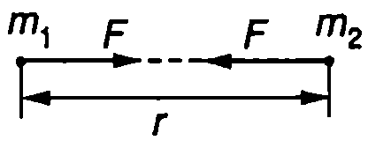
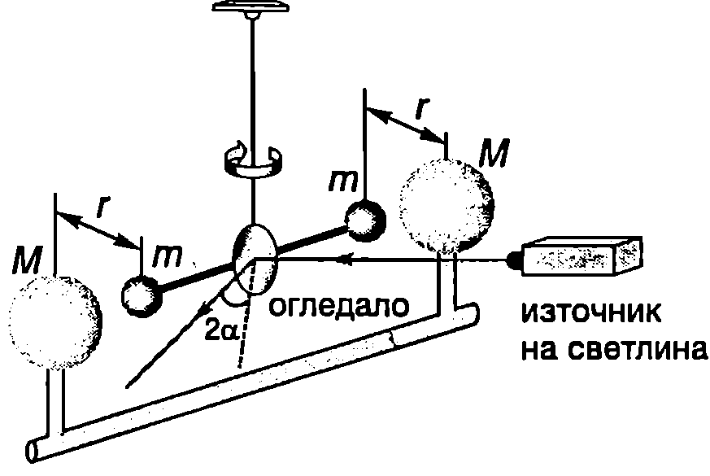
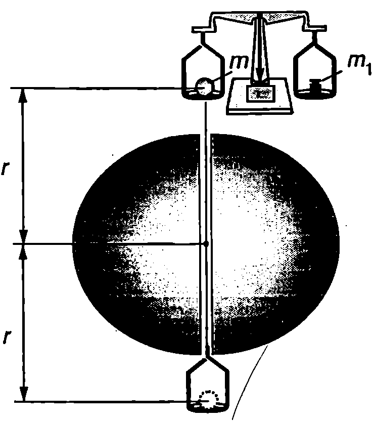
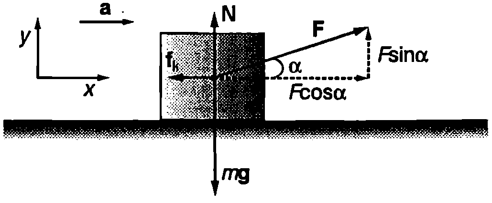

Динамиката изучава движението на телата под действие главно на гравитационни сили, сили на триене и сили на еластичност. Силите на еластичност ще разгледаме в Глава 5, а тук ще се ограничим с изучаването само на гравитационните сили и силите на триене. Гравитацията е едно от четирите фундаментални взаимодейстия в природата. Силите на триене и еластичните сили са проява на друго фундаментално взаимодействие електромагнитното. В края на този параграф ще направим кратък обзор на фундаменталните взаимодействия и на съвременните теории, които се стремят да обединят тези взаимодействия и да ги опишат от единна гледна точка.

**Гравитационни сили**

Съгласно с първия принцип на механиката телата, които не взаимодействат с други тела, се движат праволинейно и равномерно (или се намират в покой). Всички други движения се извършват под действие на сили. Какви сили заставят планетите да се въртят около Слънцето, а Луната - около Земята? Като обобщава резултатите от многобройни астрономически наблюдения Нютон стига до извода, че небесните тела взаимно се привличат със сили, имащи същата природа, както силите, с които Земята привлича заобикалящите ни тела (например падащата от дървото ябълка). Сили на всеобщо привличане (гравитационни сили) действат между всички тела във Вселената: както между Слънцето и планетите, така и между Земята и ``ябълката на Нютон''. Законът на Нютон за гравитацията гласи:

**Между всеки две тела (материални точки) от Вселената действат сили на взаимно привличане, наречени гравитационни сили, чиято големина е правопропорционална на произведението от масите на телата и е обратнопропорционална на квадрата на разстоянието между тях.**

Ако материалните точки имат маси $m_1$ и $m_2$ и са разположени на разстояние $r$ една от друга (Фиг. \ref{fig:5.2}), големината на гравитационната сила е
$$F = \gamma \frac{m_1 m_2}{r^2}
$$
където $\gamma$ е универсална природна константа, наречена *гравитационна константа* Стойността на гравитационната константа е определена експериментално. Тя е
$$\gamma = 6,\!67.10^{-11}~\mathrm{N\cdot m^2/kg^2}.$$

Съгласно с третия принцип на механиката гравитационните сили на привличане между две материални точки са равни по големина и противоположни по посока (Фиг. \ref{fig:5.2}). Те действат в направление на правата, съединяваща материалните точки.


```
Според легендата, Нютон, наблюдавайки как пада ябълка, потънал в дълбоки размишления за причината, по която всички предмети се увличат в посока, съвпадаща с посоката към центъра на Земята. Според друг (опростен) вариант на тази легенда, когато на главата на Нютон паднала ябълка, осенила го идеята за всеобщото привличане.
```
	`Фиг. 5.1`



```

```
	`Фиг. 5.2`


```

```
	`Фиг. 5.3`


Ще отбележим, че уравнение \eqref{eq:5.1} изразява големината на силата на гравитационно взаимодействие между две материални точки. Може обаче да се докаже математически, че по същата формула се определят гравитационните сили на привличане между еднородно кълбо и материална точка или между две еднородни кълба (Фиг. \ref{fig:5.3}). В този случай разстоянието се измерва от центъра на кълбата.

> [!question] Пример 5.1
> Земята привлича Луната с гравитационна сила $2.10^{20}~\mathrm{N}$. Колко нютона е силата, с която Луната действа на Земята? Масата на Земята е 80 пъти по-голяма от масата на Луната.

> [!note]- Решение
> Съгласно с третия принцип на механиката силите на взаимодействие между две тела винаги са равни по големина и противоположни по посока. Следователно Луната, въпреки че има много по-малка маса, привлича Земята със същата сила ($2.10^{20}~\mathrm{N}$), с каквато и действа Земята.

> [!question] Пример 5.2
> Две еднородни топки с маси $m_1 = 1~\mathrm{kg}$ и $m_2 = 10~\mathrm{kg}$ са разположени на разстояние $r = 1~\mathrm{m}$ една от друга (Фиг. \ref{fig:5.3}). Пресметнете гравитационната сила, с която те взаимно се привличат.

> [!note]- Решение
> Гравитационната сила се определя от закона на Нютон \eqref{eq:5.1}
> 
> $$F=\gamma \frac{m_1 m_2}{r^2} = (6,\!67.10^{-11}) \frac{(1~\mathrm{kg}) (10~\mathrm{kg})}{(1~\mathrm{m})^2} = 6,\!67.10^{-10}~\mathrm{N}.$$
> 
> Това е много малка сила -- приблизително равна на теглото на песъчинка с диаметър 0,1 mm. Толкова малки сили е много трудно да бъдат измерени експериментално. Затова, въпреки че гравитацията е универсално свойство на материята, във всекидневния живот ние не можем непосредствено да наблюдаваме ефекта от гравитационното привличане между две земни тела с обичайни размери.

**Гравитационна константа**

Гравитационната константа $\gamma$ е измерена през 1789 година от английския физик Хенри Кавендиш (1731-1810). Опитът на Кавендиш е сред най-важните за развитието на физиката експерименти, защото $\gamma$ е една от фундаменталните физични константи. Ако е известна нейната стойност, могат да се пресметнат редица други величини: например масите на Земята, Слънцето и на другите небесни тела и едновременно с това да се провери законът на Нютон за гравитацията.

Опитната постановка е показана схематично на Фиг. \ref{fig:5.4}. Две еднакви топчета с маси $m$ са закрепени на двата края на лека хоризонтална пръчка, която е окачена на вертикална нишка. Близо до топчетата се поставят две големи оловни кълба, всяко с маса $M$. Гравитационните сили на привличане $F$ на топчетата към оловните кълба завъртат пръчката и нишката се усуква. Като се измери ъгълът на усукване на нишката $\alpha$, определя се силата $F$. (Доказва се, че големината на силата $F$ e правопропорционална на ъгъла $\alpha$.) Тъй като се малък ъгъл (около $1^\circ$), за точното му измерване се използва светлинен лъч, отразен от прикрепеното към нишката огледалце. Когато са известни $m$, $M$. $F$ и $r$ (Фиг. \ref{fig:5.4}), гравитационната константа $\gamma$ се изразява от уравнение \eqref{eq:5.1} и се пресмята числената ѝ стойност.



```
Опит на Кавендиш
```
	`Фиг. 5.4`

**Сила на тежестта**

Ако приемем Земята за инерциална отправна система, познатата от училищния курс по физика сила на тежестта $G = mg$ е равна на гравитационната сила, с която Земята привлича телата, намиращи се в близост до нейната повърхност. Ще разглеждаме Земята като еднородно кълбо с радиус $R_\text{З}$ и маса $M_\text{З}$, а телата върху нейната повърхност ще приемем за материални точки. Тогава силата на тежестта, която действа на тяло с маса $m$, се определя от закона на Нютон \eqref{eq:5.1}
$$G = \gamma \frac{m M_3}{R_3^2} = mg,
$$
където земното ускорение
$$g = \gamma \frac{M_3}{R_3^2} = const
$$
е еднакво за всички тела, намиращи се в близост до земната повърхност. (Влиянието на въртенето на Земята върху земното ускорение е разгледано в \ref{sec:7}.)

> [!question] Пример 5.3
> Как се изменя земното ускорение $g$ като функция на височината над земната повърхност? Разгледайте случая, когато $h \leq R_\text{З}$, където $R_\text{З}$ е радиусът на Земята.

> [!note]- Решение
> Земното ускорение $g(h)$ на височина $h$ е
> 
> $$g(h) = \gamma \frac{M_\text{З}}{(R_\text{З}+h)^2} = g \frac{1}{(1+h/R_\text{З})^2},$$
> 
> където $g$ е земното ускорение на повърхността на Земята, т.е. при $h = 0$. Тъй като по условие $h/R_\text{З} \leq 1$, ще използваме формулата $(1 + x)^n \approx 1 + nx$, която е в сила за малки стойности на $x$, т.е. при $x \leq 1$ (в случая $n = 2$). Тогава
> 
> $$g(h) = g(1-\frac{2h}{R_\text{З}}).$$
> 
> т.е. земното ускорение намалява приблизително по линеен закон при увеличаване на височината $h$ над земната повърхност.

> [!question] Пример 5.4
> На Фиг. \ref{fig:5.5} е представена принципната схема на извършения от Ф. Йоли през 1878 г. опит за определяне на гравитационната константа. Към едното рамо на везни са прикрепени две блюда, свързани с нишка, която преминава през тесен канал, прокаран по диаметъра на тежко оловно кълбо с маса $M$. Двете блюда се намират на еднакво разстояние $r$ от центъра на кълбото. Когато върху горното блюдо се постави топче с маса $m$, везните се уравновесяват от теглилка с маса $m_1$, поставена на дясното блюдо (Фиг. \ref{fig:5.5}). Ако топчето се премести на долното блюдо, за уравновесяване на везните е необходима теглилка с маса $m_2$. По тези данни определете гравитационната константа.

> [!note]- Решение
> Условието за равновесие на везните, когато топчето се намира на горното блюдо, e
> $$m_1 g = mg + F,$$
> където $m_1 g$ и $mg$ са силите на тежестта, действащи върху теглилката и топчето. $F = \gamma \frac{mM}{r^2}$ е големината на допълнителната гравитационна сила, с която оловното кълбо привлича топчето.
> 
> Когато топчето се премести на долното блюдо, новото условие за равновесие е
> $$m_2g = mg - F.$$
> Изваждаме почленно двете уравнения и получаваме $(m_1- m_2)g = 2F$, откъдето определяме гравитационната константа
> 
> $$\gamma = \frac{(m_1-m_2)gr^2}{2mM}$$
> 
> В резултат на своите опити Йоли получава за гравитационната константа стойност $\gamma = (6,\!673 \pm 0,\!003).10^{-11}~\mathrm{N\cdot m^2/kg^2}$.
> 
> 
> 
> ```
> Опит на Йоли
> ```
> 	`Фиг. 5.5`

**Принцип за еквивалентност**

В динамиката масата е мярка за инертността на телата. Затова масата, която влиза в уравнението на втория принцип на механиката $\vec F = m \vec a$ ще наречем инертна маса ($m = m_\text{и}$). Гравитационното взаимодействие се характеризира с гравитационната маса $m_\text{г}$. В направените дотук разглеждания негласно предполагахме, че двете маси са еднакви ($m = m_\text{и} = m_\text{г}$). Сега ще се спрем по-подробно на този въпрос, тъй като съвсем не е очевидно защо две толкова различни на пръв поглед явления - инерция и гравитация, трябва да се описват с една и съща физична величина.

Под действие на силата на тежестта $G$ тяло с инертна маса $m = m_\text{и}$, се движи с ускорение $a$, чиято големина се определя от уравнението на втория принцип на механиката: $G = m_\text{и} a$. От друга страна, силата на тежестта е гравитационна сила, която се изразява от нютоновия закон за гравитацията $\displaystyle G = \gamma \frac{m_\text{г}.M_\text{З}}{R^2_\text{З}}$, в който влиза гравитационната маса $m_\text{г}$ на тялото. От тези две уравнения изразяваме ускорението $a$
$$a = \frac{m_\text{г}}{m_\text{и}}\left(\frac{\gamma M_\text{З}}{R^2_\text{З}}\right)$$
където изразът в скобите в константа. Експериментално е установено с голяма точност, че всички тела, пуснати от една и съща точка, падат с еднакво ускорение $a = g = const$. Следователно отношението $m_\text{г}/m_\text{и}$, има една и съща стойност за всички тела и при подходящ избор на измерителните единици (на стойността на гравитационната константа $\gamma$) то може да се положи равно на единица, т.е. $m_\text{и} = m_\text{г} = m$.

Не съществува нито един експериментален факт, който да сочи възможни различия между гравитационната и инертната маса. Затова във физиката се формулира общ принцип, според който те са еквивалентни. *Айнщайн поставя принципа за еквивалентност на гравитационната и инертната маса* в основите на Общата теория на отностелността (теория на гравитацията). Към принципа за еквивалентност ще се върнем отново в следващия параграф, при изучаването на инерчните сили и състоянието на безтегловност.

**Сили на триене**

Движението на телата в реални условия винаги е съпроводено с действие на сили на триене. Триенето между повърхностите на две твърди тела, в отсъствие на течен или газов слой между тях, се нарича сухо триене, а триенето между два слоя от течност или газ *вътрешно* или *вискозно* триене.

При движението на твърдо тяло във флуид (течност или газ) се извършва вискозно триене между прилепналия към тялото слой от флуида и заобикалящия го флуид. Обикновено силите на вискозно триене са значително по-малки от силите на сухо триене. Затова тънък слой от смазка, който прави триенето между две повърхности отчасти вискозно, води до намаляване на силите на триене.

Първата техническа революция е свързана с откриването на колелото, защото силите на триене при търкаляне са значително по-малки от силите на триене при хлъзгане. В процеса на еволюцията природата се е изявила като ``талантлив инженер'', който умело използва силите на триене в своите биологически конструкции. Например, когато ходим или бягаме, ние не се безпокоим за силите на триене в ставите. Ставите на човека и другите млекопитаещи се смазват от синовиалната течност, която се изцежда през порите на ставните хрущяли (Фиг. \ref{fig:5.6}). Затова при движение триенето в ставите е малко. В покой синовиалната течност се абсорбира обратно от хрущяла и триенето рязко нараства, което спомага за поддържане на фиксираното положение.


```
Ставите на човека и млекопитаещите се смазват от течност, която намалява триенето.
```
	`Фиг. 5.6`


**Закони за сухото триене**

Сили на триене възникват в резултат на електромагнитното взаимодействие между молекулите на триещите се повърхности. Тези молекулярни взаимодействия са сложни и все още недостатъчно изучени. Основните закономерности обаче, които характеризират сухото триене на макроскопично равнище, са установени експериментално още в 1699 г. от френския учен Амонтон, а по-късно (през 1785 г.) са изследвани по-подробно от Кулон. Да разгледаме тяло с маса $m$, поставено на хоризонтална поставка. Силата на тежестта $m\vec g$, която действа на тялото, се уравновесява от силата на нормална реакция на опората $\vec N$ и тялото се намира в покой (Фиг. \ref{fig:5.7}а). Да приложим към него хоризонтална сила $\vec F$ и постепенно да увеличаваме нейната големина. При малки стойности на $\vec F$ тялото остава в покой, което показва, че между допиращите се повърхности възникват сили на триене. Поставката действа на тялото със сила на триене $\vec f_s$, която е равна по големина и противоположна по посока на движещата сила $\vec F$ (Фиг. \ref{fig:5.7}б). Силата на триене $\vec f_s$, се нарича сила на триене при покой или сила на статично триене. В зависимост от големина та на движещата сила $F$ силата на триене при покой може да се изменя от нула до някаква максимална стойност $f_{s max}$. Когато силата $F$ стане по-голяма от $f_{s max}$, тялото започва да се движи и възниква сила на триене при хлъзгане $\vec f_k$, която се нарича още *сила на кинетично триене*. Експериментално са установени следните закономерности (закони на Амонтон-Кулон):


```

```
	`Фиг. 5.7`

1. Максималната сила на триене при покой $f_{s max}$ не зависи от площта на триещите се повърхности. Например, ако трупчето от Фиг. \ref{fig:5.7} се завърти, така че в контакт с поставката да е по-малката му стена, силата $f_{s max}$ не се изменя.

2. За дадена двойка повърхности максималната сила на триене при покой е правопропорционална на големината на силата на нормална реакция на опората $N$
$$f_{s \max} = k_s N
$$
Коефициентът на пропорционалност $k_s$ се нарича *коефициент на статично триене*. Той зависи от вида и състоянието (чистотата) на триещите се повърхности. За чисти метални повърхности $k_s$ обикновено е в интервала от 0,3 до 1. При използване на смазочни масла той намалява. Например синовиалната течност намалява коефициента на статично триене в ставите до 0,003.

3. Силата на триене при хлъзгане $f_k$ (кинетично триене) е по-малка от максималната сила на статично триене $f_{s max}$. Тя не зависи от площта на триещите се повърхности и е правопропорционална на големината на силата на нормална реакция на опората $N$
$$f_k = k_k N
$$
където $k_k$ е коефициент на кинетично триене, който подобно на $k_s$ зависи от вида и състоянието на триещите се повърхности.

4. Коефициентът на кинетично триене практически не зависи от скоростта на движение.

Ще отбележим, че в редица случаи разликата между коефициентите на статично и кинетично триене е малка. Затова в много от задачите по механика тя се пренебрегва и се използва един и същ коефициент на триене $k$ - както за определяне максималната сила на триене при покой, така и на силата на триене при хлъзгане.

> [!question] Пример 5.5
> Коефициентът на триене $k$ между две повърхности, например между книга и канцеларска гума, може да се определи по следния начин: Гумата се поставя върху книгата и книгата бавно се накланя. При определен ъгъл на наклона $\alpha = \alpha_1$ гумата започва да се хлъзга по книгата. Определете коефициента на триене $k$, ако $\alpha_1 = 30^\circ$.

> [!note]- Решение
> В задачите от движение на тяло, на което действат сили на триене, трябва да се обърне специално внимание на правилното определяне големината и посоката на тези сили.

1. Силата на триене при покой е равна по големина и противоположна по посока на равнодействащата на всички други сили, приложени към тялото. Обикновено от данните в условието на задачата може да се съобрази в каква посока тялото би започнало да се движи, ако нямаше триене силата на триене при покой е насочена в противоположната на тази посока. Например, ако без триене тялото би започнало да се движи на изток, следва изводът, че силата на триене, която го задържа в покой, е насочена на запад.

2. Силата на триене при хлъзгане винаги е насочена в противоположна на движението (на скоростта) посока. Големината и е $f = kN$. Същата формула може да се използва при пресмятане на максималната сила на триене при покой. Важен момент при решаването на задачи в определянето на големината на силата на реакция на опората $N$. Ще обърнем внимание, че силата на реакция е равна по големина на силата на тежестта, $N = mg$, само в частния случай, когато тялото е поставено върху хоризонтална опора и не му действат други сили, които имат вертикални компоненти (освен силата на тежестта и силата на реакция на опората). В общия случай силата на реакция $N$ не е равна на силата на тежестта. Големината и се определя от уравнението на втория принцип на механиката, което се записва по компоненти: едната координатна ос се избира успоредна на опората, а другата перпендикулярна на опората

В конкретната задача на гумата действат три сили (Фиг. \ref{fig:5.8}): силата на тежестта $m\vec g$, силата на реакция на опората $\vec N$ и силата на триене при покой $\vec f_s$. (Силата на триене удържа гумата в покой, т.е. тя е насочена обратно на посоката, в която гумата би започнала да се движи, ако нямаше триене.) Записваме уравнението на втория принцип на механиката

$$m\vec g+ \vec N+\vec f_s = m\vec a = 0,$$

където сме отчели, че гумата е в покой, т.е. $a = 0$. Избираме правоъгълна координатна система (Фиг. \ref{fig:5.8}) и записваме горното векторно уравнение по компоненти

по $x$: $mg\sin\alpha = 0$;

по $y$: $-mg\cos\alpha + N = 0$.


```

```
	`Фиг. 5.8`


От второто уравнение изразяваме силата на тежестта и я заместваме в първото уравнение. За силата на триене получаваме
$$f=\left(\frac{N}{\cos\alpha}\right)sin\alpha = N\tan\alpha.$$

Когато ъгълът на наклона стане $\alpha = \alpha_1$, силата на триене при покой достига максималната си стойност $f_s = f_{s\max} = kN$, след което гумата започва да се хлъзга надолу. Заместваме $\alpha = \alpha_1$ и $f_s = kN$, съкращаваме на $N$ и за коефициента на триене получаваме

$k = \tan\alpha_1$; при $\alpha = 30^\circ$, k = 0,58.

> [!question] Пример 5.6
> Тяло с маса $m$ започва да се хлъзга по хоризонтална равнина под действие на сила $\vec F$, която сключва ъгъл $\alpha$ с хоризонта. Коефициентът на триене между тялото и равнината е $k$. Определете ускорението на тялото.

> [!note]- Решение
> От условието на задачата става ясно, че тялото започва да се движи по посока на хоризонталната компонента на силата $\vec F$. Следователно силата на триене при хлъзгане $\vec f_k$ е насочена в противоположната посока (Фиг. \ref{fig:5.9}). Записваме уравнението на втория принцип на механиката за движението на тялото
> 
> $$\vec F + m\vec g + \vec N + \vec f_k = m\vec a.$$
> 
> Избираме координатна система с ос $x$, насочена хоризонтално, по посока на ускорението а на тялото, и ос $y$, която е насочена вертикално нагоре. Записваме уравнението на втория принцип на механиката по компоненти
> 
> 
> ```
> 
> ```
> 	`Фиг. 5.9`
> 
> по $x$: $F\cos\alpha - f = ma$;
> 
> по $y$: $F\sin\alpha-mg + N = 0$.
> 
> Силата на триене при хлъзгане $f_k = kN$. От уравнението за $y$-компонентите изразяваме силата на реакция на опората $N = mg - F\sin\alpha$ и я заместваме във формулата за силата на триене $f = k(mg - F\sin\alpha)$. След това заместваме $f_k$ в уравнението за $x$-компонентите и определяме ускорението
> $$a= \frac{F\cos\alpha-k(mg-F\sin\alpha)}{m}.$$

**Фундаментални взаимодействия**

Независимо от огромното разнообразие от взаимодействия между телата, съгласно със съвременните представи всички те се свеждат до четири фундаментални взаимодействия. Това са (подреждането е направено по интензивността на взаимодействията): 1. гравитационно взаимодействие; 2. слабо взаимодействие, на което в повечето случаи се дължат процесите на разпадане и превръщане на елементарните частици; 3. електромагнитно взаимодействие; 4. силно взаимодействие между т. нар. адрони голям клас елементарни частици, към които спадат протоните и неутроните.

Съвременните физични теории показват, че всяко взаимодействие се осъществява чрез обмен на определен вид частици (кванти), които са носители на взаимодействието. Най-добре изучено е електромагнитното взаимодействие, чиито носители са квантите на електромагнитното поле, наречени *фотони*. През 1983 г. бяха експериментално открити т. нар. *междинни векторни бозони*, които са носители на слабото взаимодействие. Понастоящем е разработена единна теория на електрослабите взаимодействия.

Носители на силното взаимодействие са *глюоните*, частици които ``слепват'' кварките - съставните частици на адроните. Една от проявите на силното взаимодействие са ядрените сили, които удържат протоните и неутроните в ядрата на атомите. Ще отбележим, че взаимодействието между отделните адрони (например между протоните и неутроните в ядрото) е само остатъчен ефект от много по-интензивното взаимодействие между техните градивни частици кварките, подобно на междумолекулното взаимодействие, което може да се разглежда като остатъчен ефект от електричното взаимодействието между електроните и ядрата.

Теорията предсказва два вида кванти на гравитационното взаимодействие, наречени *гравитони* и *гравитино*. Създаването на цялостна квантова теория на гравитацията се сблъсква със сериозни трудности. Гравитационните вълни и квантите на гравитационното поле все още не са експериментално регистрирани.

Правят се опити да се обединят електрослабите и силните взаимодействия (Велико обединение) и да се опишат от единна теория. Особен интерес през последните години предизвиква супергравитацията - теория, която прави опит да приложи единен подход при описване на всички взаимодействия, включително и гравитационното.

**Задачи**

1. Когато се допират, две еднакви еднородни кълба взаимно се привличат с гравитационна сила $F$. Ако кълбата се раздалечат, така че разстоянието между центровете им да стане 1 m, силата на привличане е $F/25$. Колко е радиусът на кълбата?

2. Пресметнете гравитационната сила, с която Земята привлича Луната. Масата на Земята е $6.10^{24}$ kg, масата на Луната в $7,\!4.10^{22}$ kg, а разстоянието от Земята до Луната е $3,\!8.10^8$ m.

3. Колко е ускорението при свободно падане на повърхността на планета, която има същата маса, както Земята, но е с 2 пъти по-малък радиус?

4. а) Колко е ускорението на свободно падане на повърхността на планета с радиус $R$ и средна плътност $\rho$?

6) На Земята Малкият принц тежи 350 N. Колко е теглото на Малкия принц на неговата планета, която има същата плътност, както Земята, но радиусът й е 100 пъти по-малък?

5. Пресметнете средната плътност на Земята $\rho$, ако са известни земното ускорение $g$, радиусът на земята $R_3$ и гравитационната константа $\gamma$.

6. Планетите действат с големи гравитационни сили на своите спътници. Ако разстоянието от спътника до центъра на планетата е по-малко от определена критична стойност $L_\text{кр}$, гравитационната сила става толкова голяма, че разрушава спътника на малки парчета. Критичното разстояние се определя по формула та $L = 2,\!5R(\rho_\text{п}/\rho_\text{с})^{1/3}$, където $R$ е радиусът на планетата, $\rho_\text{п}$ е плътността на планетата, а $\rho$ е плътността на спътника. Учените предполагат, че е възможно пръстените на планетите гиганти да са се получили в резултат на гравитационно разрушаване на спътници.

Най-близкият до Юпитер спътник Йо се движи по орбита с радиус 421 000 km. На какво разстояние Йо трябва да се доближи до центъра на Юпитер, за да се разруши на парчета? Радиусът на Юпитер e 71 000 km, а плътността му е около 3 пъти по-малка от плътността на Йо.

7. Три материални точки, всяка с маса $m$, са разположени във върховете на равностранен триъгълник със страна $a$. Определете големината на гравитационната сила, която действа на всяка една от материалните точки. Гравитационното взаимодействие с околните тела не се отчита.

8. На Фиг. \ref{fig:5.10} в показано еднородно кълбо с радиус $R$, в което има сферична дупка с радиус $R/2$. Масата на кълбото преди да се издълбае дупката е $M$. Определете гравитационната сила, с която кълбото привлича малкото топче с маса $m$, разположено на разстояние $3R$ от центъра на кълбото.

***Указание.*** От гравитационната сила, с която действа плътно кълбо, извадете гравитационната сила, с която действа веществото, с което мислено запълваме сферичната дупка, за да получим плътно кълбо.

9. Шейна с маса $m$ се изкачва с постоянна скорост по наклонен участък от пистата с ъгъл на наклона $\alpha$. На шейната действа сила $\vec F$, която е насочена нагоре, успоредно на пистата. Определете коефициента на триене между шейната и пистата.

10. Тяло се хлъзга надолу по наклонена равнина с ъгъл на наклона $\alpha$. Определете ускорението на тялото, ако коефициентът на триене между тялото и наклонената равнина е $k$.

11. На хокейна шайба е придадена начална скорост, така че тя се хлъзга нагоре по наклонена равнина с ъгъл на наклона $\alpha$. Шайбата се движи равнозакъснително с ускорение $a$, докато спре. След това тя започна да се спуска надолу с ускорение $a$/2. Определете коефициента на триене между шайбата и наклонената равнина.

12. По наклонена равнина с ъгъл на наклона $\alpha$ се спуска тяло с маса $m$, на което действа хоризонтална сила с големина $F$ (Фиг. \ref{fig:5.11}). Коефициентът на триене между тялото и равнината е $k$.

а) Определете ускорението $a$ на тялото.

б) Пресметнете числената стойност на ускорението, ако $F = mg/4$, $k = 0,\!2$, $\alpha = 45^\circ$.

13. По наклонена равнина с ъгъл на наклона $\alpha$ се изкачва тяло с маса $m$, на което действа хоризонтална сила с големина $F$ (Фиг. \ref{fig:5.12}). Коефициентът на триене между тялото и равнината е $k$.

а) Определете ускорението а на тялото.

6) Пресметнете числената стойност на ускорението, ако $F= 2mg$, $k=0,\!2$, $\alpha = 45^\circ$.

14. При скоростно спускане скиор с маса $m = 90$ kg се движи по склон с ъгъл на наклона $\alpha = 30^\circ$. Коефициентът на триене между ските и снега е $k = 0,\!07$. Силата на съпротивление на въздуха е правопропорционална на квадрата на скоростта: $F = cv^2$, където $c = 0,\!7$ kg/m. Колко е максималната скорост $v_{\max}$, която може да достигне скиорът?


```

```
	`Фиг. 5.10`


```

```
	`Фиг. 5.11`


```

```
	`Фиг. 5.12`
