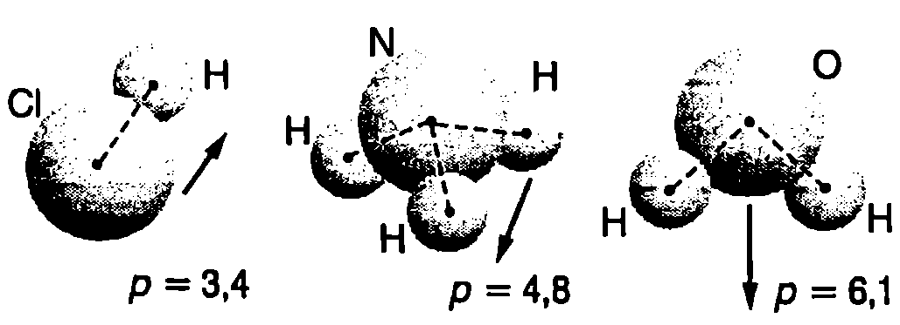

**Поле на електричен дипол**

На Фиг. \ref{fig:50.1} са показани два равни по големина и противоположни по знак електрични заряда $q$ и $-q$, разположени на фиксирано разстояние $l$ един от друг. За нагледност можем да приемем, че зарядите са закрепени на краищата на непроводяща пръчка. Потенциалът на електричното поле, което двата заряда създават в произволна точка $A$, е (Фиг. \ref{fig:50.1})
$$\varphi = \frac{q}{4\pi\varepsilon_0 r_2} - \frac{q}{4\pi\varepsilon_0 r_1} = \frac{q (r_1 - r_2)}{4\pi\varepsilon_0 r_1 r_2}.
$$
Когато разстоянието $l$ между зарядите е много по-малко от разстоянията $r_1$ и $r_2$ до точката, в която се изследва полето, разглежданата система от два заряда се нарича *електричен дипол*. В този случай с приближение можем да положим
$$r_1r_2 = r^2\text{ и }r_1-r_2 = l\cos\theta,$$
където $r$ е модулът на радиус-вектора, прекаран от дипола към точката на наблюдение А, а $\theta$ е ъгълът между вектора $\vec l$ (с начало в отрицателния заряд и край в положителния заряд) и радиус-вектора $\vec r$. Тъй като разстоянието $l$ е много малко, не е съществено от коя точка на дипола е прекаран радиус-векторът $\vec r$. Той може да започва например от положителния заряд, от отрицателния заряд или от средата на отсечката $l$ (Фиг. \ref{fig:50.1}). Във всички случаи ъгълът между векторите $l$ и $\vec r$ е приблизително един и същ (равен на $\theta$). След заместване на $r_1 r_2$ и $r_1 - r_2$, за потенциала се получава


```

```
	`Фиг. 50.1`

$$\varphi = \frac{ql\cos\theta}{4\pi\varepsilon_0 r^2}.
$$
Формула \eqref{eq:50.2} показва, че при отдалечаване от дипола потенциалът на електричното му поле намалява много бързо -- обратнопропорционално на квадрата на разстоянието $r$ до дипола, докато потенциалът на полето на отделен точков заряд се изменя по-бавно ($\propto 1/r$).

Електричният дипол се характеризира с векторната величина
$$\vec p = q\vec l,
$$
наречена електричен диполен момент.

Като отчетем, че $\vec p \cdot\vec r = qlr\cos\theta$, изразяваме потенциала \eqref{eq:50.2} чрез диполния момент $\vec p$:
$$\varphi = \frac{\vec p \cdot\vec r}{4\pi\varepsilon_0 r_3}.
$$


```

```
	`Фиг. 50.2`


На Фиг. \ref{fig:50.2} са показани силовите линии на полето на електричен дипол. Доказва се, че интензитетът $E$ на полето намалява обратнопропорционално на третата степен на разстоянието до дипола ($E\propto 1/r^3$) и се изразява с формулата
$$\vec E = \frac{1}{4\pi\varepsilon_0}\left(\frac{3(\vec p \cdot\vec r)\vec r}{r_5} - \frac{\vec p}{r_3}\right).
$$
Ще обърнем внимание, че потенциалът и интензитетът на полето на електричен дипол се изразяват съответно с формули \eqref{eq:50.4} и \eqref{eq:50.5} само в т.нар. далечна област, т.е. на разстояния, които са много по-големи от разстоянието $l$ между двата заряда. Близката област, в която тези формули не са в сила, на Фиг. \ref{fig:50.2} за нагледност е оградена с пунктир.

**Електричен дипол във външно електрично поле**

Електричен дипол с диполен момент $\vec p$ е поставен в еднородно електрично поле с интензитет $\vec E$. На двата заряда от дипола действат равни по големина и противоположни по посока сили $\vec F_1 = -\vec F_2 = q\vec E$, които образуват двойка сили, стремяща се да завърти дипола (Фиг. \ref{fig:50.3}а). Въртящият момент на двойката сили е


```

```
	`Фиг. 50.3`


$$M = Fd = qEl\sin\theta = pE\sin\theta,$$
където $d = l\sin\theta$ е разстоянието между линиите на действие на двете сили (вж. част 1, стр. 92). Уравнението за въртящия момент се записва във векторен вид:
$$\vec M = \vec p \times \vec E
$$
Двойката сили завърта дипола и го ориентира така, че посоката на вектора на диполния му момент $\vec p$ да съвпадне с посоката на интензитета $\vec E$ на полето (Фиг. \ref{fig:50.3}б).

Ще пресметнем потенциалната енергия на дипола, когато е поставен в еднородно електрично поле. Да означим с $\varphi_1$ и $\varphi_2$ потенциалите на точките, в които се намират зарядите $-q$ и $+q$ на дипола (Фиг. \ref{fig:50.4}). Потенциалната енергия на дипола е равна на сумата от потенциалните енергии на двата заряда:
$$W = -q \varphi_1 + q \varphi_2 = q (\varphi_2 - \varphi_1).$$

Изразяваме потенциалната разлика $\varphi_2 - \varphi_1$ чрез интензитета $\vec E$ на полето и разстоянието $d$ между еквипотенциалните повърхности с потенциали $\varphi_1$ и $\varphi_2$ (на опростената двумерна схема от Фиг. \ref{fig:50.4} това е разстоянието между двете успоредни линии, представени с пунктир):
$$\varphi_2 - \varphi_1 = -E d = -E l \cos\theta.$$

След заместване във формулата за енергията $W$ на дипола се получава
$$W = -Eql \cos\theta = -\vec p \cdot \vec E,
$$


```

```
	`Фиг. 50.4`

т.е. потенциалната енергия на дипола е равна на взетото с обратен знак скаларно произведение на електричния диполен момент $\vec p$ и интензитета $\vec E$ на електричното поле. От формула \eqref{eq:50.7} следва, че потенциалната енергия на дипола е минимална, $W_{\min} =- p E<0$, когато той е ориентиран по полето (Фиг. \ref{fig:50.3}б).

Енергията на дипола е максимална, $W_{\max} =pE>0$, когато посоките на векторите $\vec p$ и $\vec E$ са противоположни. Електричните сили на полето се стремят да завъртят дипола и да го ориентират по посока на полето, т.е. да го приведат в състояние с минимална потенциална енергия.

Уравнение \eqref{eq:50.7} остава в сила и в случая, когато външното електрично поле не е еднородно. Тъй като разстоянието $l$ между двата заряда на дипола е много малко, изменението на полето на разстояние $l$ може да не се отчита.

**Поляризуемост на атомите**

Съгласно с квантовата механика електронът в атома на водорода може да се намира с определена вероятност на различни разстояния от ядрото. Затова традиционният за класическата механика въпрос, в коя точно точка от пространството се намира електронът в даден момент, в квантовата механика губи смисъл. Вместо като точков заряд, електронът може да се разглежда като ``размазан'' в пространството около ядрото заряд, който се характеризира с обемна плътност р. Плътността на заряда р е правопропорционална на вероятността електронът да се намира в дадената област (точка) от пространството. Електричното поле, което създава обгръщащият ядрото ``облак'' от отрицателен заряд (електронен облак) на разстояния, много по-големи от размерите на атома, е еквивалентно на полето, създадено от отрицателен точков заряд с големина, равна на големината на заряда на целия електронен ``облак''. Точката, в която трябва да се постави този заряд, се нарича *ефективен център на отрицателния заряд*. Тъй като размерите на ядрото са много по-малки от размерите на атома, ядрото може да се разглежда като точка, която е ефективен център на положителния заряд на атома.


```

```
	`Фиг. 50.5`


Установено е, че когато атомът на водорода се намира в основно състояние, разпределението на електронната плътност е сферически симетрично, т.е. $\rho$ зависи единствено от разстоянието $r$ до ядрото. В този случай ефективният център на отрицателния заряд е разположен в центъра на атома, т.е. съвпада с ефективния център на положителния заряд.

Аналогични разглеждания могат да се направят и за другите атоми. Когато ефективният център на отрицателния заряд в един атом съвпада с ефективния център на положителния заряд, атомът няма електричен диполен момент (Фиг. \ref{fig:50.5}а). Ако такъв атом се постави във външно електрично поле обаче, електричните сили на полето го деформират: електронният ``облак'' и ядрото се изместват в противоположни посоки (Фиг. \ref{fig:50.5}б). Ефективните центрове на положителните и на отрицателните заряди вече не съвпадат и атомът се *поляризира*, т.е. получава *индуциран диполен момент* $\vec p$. В относително слаби електрични полета индуцираният диполен момент $\vec p$ е правопропорционален на интензитета $\vec E$ на полето:
$$\vec p = \alpha \vec E
$$
Коефициентът на пропорционалност $\alpha$ е характерна константа за дадения вид атоми, наречена поляризуемост на атома. За да определим поляризуемостта $\alpha$ на водородния атом, ще използваме следния най-прост класически модел. Ще приемем (Фиг. \ref{fig:50.6}а), че атомното ядро (протонът) е неподвижно, а електронът под действие на кулоновата сила на привличане $\displaystyle F = \frac{e^2}{4\pi \varepsilon_0 r_B^2}$ обикаля около протона по кръгова орбита с радиус $r_B = 0,\!053\ \mathrm{nm}$ (радиус на Бор). В този случай центърът на окръжността е едновременно ефективен център на положителните и на отрицателните заряди, поради което диполният момент на атома е нула.


```

```
	`Фиг. 50.6`


В електрично поле орбитата на електрона се измества. На Фиг. \ref{fig:50.6}б е показан случаят, когато интензитетът $\vec E$ на външното поле е перпендикулярен на равнината на орбитата. Под действие на електричните сили електронът и протонът се отместват в противоположни посоки: центърът на орбитата на електрона, т.е. ефективният център на отрицателния заряд, се оказва на разстояние $l$ от протона. В резултат на това отместване атомът получава диполен момент ${p} = e {l}$. Големината на индуцирания диполен момент се определя от условието външната сила $- e\vec E$, която действа на електрона, да се уравновесява от успоредната на полето $F_x$ компонента на кулоновата сила (Фиг. \ref{fig:50.6}б):
$$F_{\parallel} = F \cos \theta = \frac{e^2}{4\pi \varepsilon_0 r^2} \cdot \frac{l}{r} = eE$$
В относително слаби полета, когато силата $eE$ е много по-малка от кулоновата сила $F$ на привличане на електрона към ядрото, радиусът $r_B$ на орбитата практически не се изменя, а отместването $l$ е много по-малко от $r_B$. Тогава $r \approx r_B$, и след заместване в горното равенство получаваме
$$p = el = 4\pi\varepsilon_0 r_B^3 E = \alpha E,
$$
където
$$\alpha = 4\pi\varepsilon_0 r_B^3 = 0,\!17.10^{-40}\ \mathrm{F.m^2}
$$
е поляризуемостта на водородния атом. Точните пресмятания на поляризуемостта $\alpha$ на водородния атом, основаващи се на квантовата механика, дават резултат, който се различава от формула \eqref{eq:50.10} само с числен множител 9/2

Поляризуемостта на атомите може да се определи експериментално. Стойностите на поляризуемостта а за някои атоми са представени в табл. 50.1.


\begin{table}

	\begin{tabular}{cccccccccc}
	Елемент& H& He& Li& Be& C& Ne& Na& Ar& K\\
	$\alpha$& 0,73& 0,23& 13& 10& 1,7& 0,44& 30& 1,8& 38\\
	\end{tabular}
```
Поляризуемоста на някои атоми в единици $\times 10^{-40
```$ F.m$^2$.}
	\label{table:50.1}
\end{table}

От таблицата се вижда, че алкалните метали литий, натрий и калий имат голяма поляризуемост $\alpha$, която нараства с атомния номер на елемента. В най-външната си електронна обвивка те имат само един валентен електрон, който е слабо свързан с атома. На този електрон се дължи лесното ``деформиране'' и поляризиране на атомите на алкалните метали във външно поле. За инертните газове хелий, неон и аргон са характерни значително по-малки стойности на $\alpha$. Външната електронна обвивка на атомите на инертните газове е изцяло запълнена и електронната им структура е ``по-твърда'' сравнително слабо се ``деформира'' под действие на външно електрично поле.

**Полярни и неполярни молекули**

Някои молекули имат електричен диполен момент дори в отсъствие на външно електрично поле. Това са несиметрични молекули, в които ефективните центрове на положителните и на отрицателните заряди не съвпадат. Молекулите със собствен диполен момент се наричат полярни молекули. На Фиг. \ref{fig:50.7} са показани три типични полярни молекули на хлороводорода, на амоняка и на водата. Дадена е също посоката и големината на техните диполни моменти. Водната молекула например е полярна, защото двата атома на водорода са разположени несиметрично спрямо кислородния атом: осите O-H сключват



```
Полярни молекули (HCl, NH$_3$ и H$_2$O). Стойностите на електричния диполен момент на молекулите са в единици $\times 10^{-30
```$ C.m.}
	`Фиг. 50.7`


помежду си ъгъл около 105°. На големия собствен електричен диполен момент на молекулите се дължи свойството на водата да е добър разтворител. Той оказва съществено влияние и на химичните реакции във водните разтвори.

Симетричните молекули нямат собствен диполен момент, тъй като при тях ефективните центрове на положителните и отрицателните заряди съвпадат. Например, за разлика от водата, двата атома на кислорода в молекулата на въглеродния диоксид (CO$_2$) са разположени симетрично от двете страни на атома на въглерода и молекулата е неполярна. Други примери за неполярни молекули са O$_2$, CH$_4$ и BF$_3$.

**Задачи**

1. Точките $A$ и $B$ от Фиг. \ref{fig:50.8} се намират на еднакво разстояние от електричния дипол $D$.

а) Определете посоката на интензитета на електричното поле на дипола в тези две точки.

б) В точка $A$ електричното поле на дипола има интензитет $E_A = 2.1 \times 10^{-5}\ \mathrm{V/m}$. Определете интензитета на полето в точка $B$.


```

```
	`Фиг. 50.8`


**Указание.** Използвайте уравнение \eqref{eq:50.5}.

2. Молекулата на водата има собствен диполен момент $p = 6.1 \times 10^{-30}\ \mathrm{C \cdot m}$. Проба, в която се съдържа 1, е поставена в еднородно електрично поле с интензитет $E = 3.1 \times 10^{5}\ \mathrm{V/m}$. Приемете, че диполните моменти на всички водни молекули са ориентирани по посока на електричното поле. Колко джаула работа трябва да се извърши, за да се завъртят всички молекули, така че диполните им моменти да са насочени перпендикулярно на електричното поле?

3. Електричен дипол с диполен момент $\vec p$ се намира в еднородно електрично поле с интензитет $\vec E_0$. Диполът е ориентиран по посока на полето. Докажете, че една от еквипотенциалните повърхности е сфера, в центъра на която се намира диполът, и определете нейния радиус $r$.

**Указание.** Използвайте принципа на суперпозицията. Приемете, че в точката, в която се намира диполът, потенциалът на еднородното поле е нула. В този случай потенциалът и интензитетът на еднородното поле са свързани със съотношението $\varphi_0 = -\vec E_0 \cdot \vec r$. Използвайте и уравнение \eqref{eq:50.4}. 
