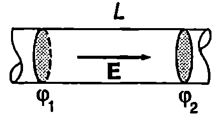

**Електричен ток**

Електричен ток се нарича насоченото движение на електрични заряди. Токът в металите е насочено движение на електрони, тъй като само валентните електрони на метала могат свободно да се преместват под действие на електрични полета, докато положителните йони не напускат възлите на кристалната решетка. Свободни токови носители в електролитите са положителните и отрицателните йони, а в газовете могат да съществуват както подвижни електрони, така и йони. Сноповете от електрони, протони или йони, които се получават в ускорителите на заредени частици, също са примери за електричен ток. Скоростта на насочено движение на зарядите при протичане на електричен ток се нарича *дрейфова скорост*.

За посока на тока се приема посоката, в която се движат положителните заряди. Когато токът се обуславя от движението на отрицателни заряди неговата посока е противоположна на посоката на движение на зарядите. Например токът в електрическата верига от Фиг. \ref{fig:52.1} тече от положителния към отрицателния полюс на източника, докато свободните електрони в металния проводник, свързващ двата полюса, се движат в противоположната посока от отрицателния към положителния полюс на източника.

Нека в средата, където се извършва движение на електрични заряди (метал, газ и т.н.) отделим мислено повърхност с площ $S$. Да означим с $dq$ електричния заряд, който преминава през повърхността за време $dt$. Електричният ток през повърхността $S$ се дефинира с равенството
$$I = \frac{dq}{dt}.
$$


```

```
	`Фиг. 52.2`


```

```
	`Фиг. 52.1`


Електричният ток е равен на заряда, който преминава през повърхността за единица време. Измерва се в *ампери* (А). Токът е 1 А, ако за 1 s през повърхността на преминава заряд 1C:
$$1~\mathrm{A} = 1~\mathrm{C/s}.$$

**Плътност на тока**

По аналогия с хидродинамиката (вж.~\ref{sec:25}) насоченото движение на електричните заряди може да се онагледи с токови линии и токови тръби. Ще разгледаме най-простия случай, когато в проводящата среда има само един вид подвижни заредени частици, всяка със заряд $q_0$ ($q_0>0$). Ще смятаме, че концентрацията $n$ на заредените частици е постоянна и всички свободни заряди се движат праволинейно и равномерно с еднаква дрейфова скорост $v_d$. В този случай токовите линии са прави линии. На Фиг. \ref{fig:52.2} е показана цилиндрична токова тръба с напречно сечение $S$. При движението си електричните заряди не пресичат повърхността на токовата тръба (като пример за токова тръба може да служи повърхността на цилиндричен проводник, по който тече ток). За време $dt$ през дадено напречно сечение $S$ на токовата тръба преминават всички свободни заряди, които се намират на разстояние $L \leq v_d dt$ от него. Техният брой е $N = n(v_d dt S)$. Пренесеният през напречното сечение на тръбата заряд е
$$dq = q_0 N = q_0 n v_d S dt.$$
Токът през напречното сечение на токовата тръба е
$$I = \frac{dq}{dt} = nq_0 v_d S.
$$
Зарядът, който преминава за единица време през единица площ от напречното сечение на токовата тръба, се нарича *плътност на тока* $j$:
$$j = \frac{dq}{dtdS} = \frac{I}{S} = nq_0 v_d.
$$
Полученият резултат се обобщава и всяка точка от средата, в която тече ток, се характеризира с векторната величина плътност на тока
$$\vec j = n q_0 \vec v_d.
$$
Посоката на вектора $\vec j$ съвпада с посоката на дрейфовата скорост $\vec v_d$ на положителните заряди. Ако е известна плътността на тока във всяка точка от средата (в общия случай в различните точки векторът има различна големина и посока), може да се пресметне токът през произволна повърхност $S$. За целта повърхността $S$ мислено се разделя на безкраен брой малки елементи $dS$. Тъй като елементът $dS$ е безкрайно малък, плътността на тока във всяка негова точка е постоянна. По аналогичен начин, както при пресмятането на потока на интензитета на електричното поле (вж. \ref{sec:45}), за тока през елемента $dS$ (Фиг. \ref{fig:52.3}) получаваме
$$dI = \vec j\cdot d\vec S$$


```

```
	`Фиг. 52.3`


Токът през повърхността $S$ е сума (интеграл) от токовете през всички малки елементи:
$$I = \int_S \vec j \cdot d\vec S
$$
> [!question] Пример 52.1
По меден проводник с напречно сечение $S = 1~\mathrm{mm^2}$ тече ток $I = 1~\mathrm{A}$. Определете дрейфовата скорост на електроните. Плътността на медта е $\rho = 8,\!9 \cdot 10^3~\mathrm{kg/m^3}$, моларната маса е $M = 0,\!0636~\mathrm{kg/mol}$. Приемете, че на всеки атом Cu се пада по един свободен електрон.
\end{psexample}
> [!note]- Решение
 От уравнение \eqref{eq:52.2} изразяваме дрейфовата скорост на свободните електрони:
$$v_d = \frac{I}{n e S}$$
Концентрацията на свободните електрони $n$ е равна на концентрацията на атомите на медта (на броя атоми в единица обем от проводника). В единица обем се съдържат ${\rho_1}/{M}$ мола вещество, а в един мол вещество има $N_A$ атома ($N_A$ -- число на Авогадро). Следователно $\displaystyle n = \frac{\rho N_A}{M}$. Заместваме $n$ и $q_0 = e$ във формулата за дрейфовата скорост и получаваме:
$$v_d = \frac{I M}{S e \rho N_A}=$$
$$\frac{(1~\mathrm{A}) (0,\!0636~\mathrm{kg/mol})}{(1 \cdot 10^{-6}~\mathrm{m^2}) (1,\!6 \cdot 10^{-19}~\mathrm{C}) (8,\!9 \cdot 10^3~\mathrm{kg/m^3}) (6,\!02 \cdot 10^{23}~\mathrm{mol^{-1}})}=$$
$$= 7,\!4 \cdot 10^{-5}~\mathrm{m/s} = 27~\mathrm{cm/h}$$
Следователно дрейфовата скорост е много малка в случая на свободните електрони са необходими почти 4 часа, за да преминат през проводник с дължина 1 метър. Защо тогава лампата в стаята светва веднага след натискането на ключа? При затварянето на веригата електричното поле, което привежда в насочено движение свободните електрони, се разпространява в проводниците със скоростта на светлината ($c = 3.10^8 ~\mathrm{m/s}$) По този начин ``командата'' да започнат да се движат (електричното поле) достига почти едновременно до всички електрони.

**Уравнение за непрекъснатост**

В проводяща среда, в която тече ток, мислено отделяме затворена повърхност $S$. Ще означим с ${dq}/{dt}$ бързината (скоростта), с която се изменя положителният заряд в обема $V$, заграден от повърхността $S$. Съгласно със закона за запазване на електричния заряд, изменението на заряда в обема $V$ е равно на заряда, преминал през повърхността $S$ за същото време, т.е. на тока $I$ през $S$:
$$I = -\frac{dq}{dt}$$

Знакът минус показва, че токът $I$ през повърхността $S$ и изменението на заряда вътре в нея имат противоположни знаци. Когато зарядът намалява ($dq < 0$), положителните заряди напускат повърхността ($I > 0$). Обратно, при $dq > 0$, положителни заряди навлизат през повърхността $S$ в обема $V$, т.е. $I < 0$. Изразяваме тока от уравнение \eqref{eq:52.5} и получаваме
$$\oint_S \vec j \cdot d\vec S = -\frac{dq}{dt}
$$

Това равенство се нарича уравнение за непрекъснатост: токът през произволна затворена повърхност $S$ е равен на взетата с обратен знак скорост на изменение на електричния заряд в обема $V$, заграден от тази повърхност. Уравнението за непрекъснатост е следствие от закона за запазване на електричния заряд. (Направете аналогия с уравнението за непрекъснатост при флуидите (вж. част 1, \ref{sec:25})).

**Закон на Ом**

Както знаем от електростатиката, при електростатично равновесие електричното поле в обема на проводниците е нула. Когато това условие не е изпълнено, под действие на електричните сили свободните заряди извършват насочено движение, т.е. в проводящата среда тече ток. Експерименталните изследвания показват, че в редица вещества (проводящи среди) плътността на тока $\vec j$ е правопропорционална на интензитета $\vec E$ на електричното поле:
$$\vec j = \sigma\vec E
$$
Коефициентът на пропорционалност $\sigma$ се нарича *специфична проводимост* на средата.

Когато специфичната проводимост $\sigma$ не зависи от интензитета $\vec E$ на полето, казваме, че е в сила законът на Ом. Законът на Ом гласи:

**Плътността на тока $j$ е правопропорционална на интензитета на електричното поле $E$, т.е. отношението на модулите на векторите $\vec j$ и $\vec E$ не зависи от полето**
$$\frac{j}{E} = \sigma = const
$$
Опитът показва, че законът на Ом е в сила за голям брой проводящи вещества, включително и за повечето метали. В анизотропни среди, например в някои кристали, посоките на векторите $\vec j$ и $\vec E$ не съвпадат. В такива случаи вместо уравнение \eqref{eq:52.7} се използват по-сложни съотношения.

В уравнения \eqref{eq:52.7} и \eqref{eq:52.8} влиза интензитетът на полето, което се създава в проводящата среда при протичане на ток. Доказва се, че когато средата е еднородна, в повечето важни за практиката случаи характеристиките на това поле са същите, както на електростатичното поле, което би се създало между дадените електроди, ако на тях се подаде същото напрежение, както при наличие на ток, а проводящата среда се замени с вакуум. Следователно токовите линии в еднороден проводник съвпадат със силовите линии на това електростатично поле.

За да запишем закона на Ом в познатия вид от училищния курс по физика, ще разгледаме еднороден цилиндричен метален проводник с дължина 1 и напречно сечение S (Фиг. \ref{fig:52.4}). Когато между две напречни сечения на проводника се поддържа постоянна потенциална разлика (постоянно напрежение) $U = \phi_1 - \phi_2$, в ограничения от тях обем на проводника се създава еднородно електрично поле с интензитет $E = U/L$. Токът през напречното сечение на проводника е $I = jS$. Заместваме $j = I/S$ и $E = U/L$ в уравнение \eqref{eq:52.8} и получаваме
$$U = \frac{L}{\sigma S}I = \frac{\rho L}{S}I
$$
където $\rho = 1/\sigma$ е реципрочната стойност на специфичната проводимост, която се нарича специфично съпротивление на проводника. Величината
$$R = \frac{U}{I} = \frac{\rho L}{S}
$$
се нарича *съпротивление* на проводника. Уравнение \eqref{eq:52.10} изразява математически друга формулировка на закона на Ом, която е частен случай на тази, представена с уравнения \eqref{eq:52.7} и \eqref{eq:52.8}:

**Съпротивлението $R = U/I$ на проводника не зависи от тока $I$ и от приложеното напрежение $U$.**

Между тока и напрежението в проводниците, за които е в сила законът на Ом, съществува линейна зависимост
$$U = RI,
$$
представена графично на Фиг. \ref{fig:52.5}.

Единицата за електрично съпротивление се нарича ом (2). Съпротивлението на даден проводник е 12, ако при напрежение 1 V през него протича ток 1 А, т.е.
12 = 1 A



```

```
	`Фиг. 52.4`


```

```
	`Фиг. 52.5`

2
45

Специфичното съпротивление
$$\rho = \frac{RS}{L}
$$
се измерва в единици $\Omega\cdot m$ (ом-метър), а специфичната проводимост $\sigma = 1/\rho$ -- в единици $\mathrm{\Omega^{-1}\cdot m^{-1}}$ (ом на минус първа степен - метър на минус първа степен).

> [!question] Пример 52.2
Колко метра проводник от нихром (нихромът е сплав от никел, хром, желязо и манган) с напречно сечение $S = 0,\!3~\mathrm{mm^2}$ ви е необходим, за да направите нагревател със съпротивление $30 \, \Omega$? Специфичното съпротивление на нихрома е $\rho = 1,\!5 \cdot 10^{-6} \, \Omega \cdot \text{m}$.
\end{psexample}
> [!note]- Решение

$$L = \frac{R \cdot S}{\rho} = \frac{(30 \, \Omega) \cdot (0,\!3 \cdot 10^{-6}~\mathrm{m^2})}{1,\!5 \cdot 10^{-6} \, \Omega \cdot \text{m}} = 6~\mathrm{m}$$
\begin{psexample}[label=ex:52.3]{*}{}
В обема на еднороден меден проводник със специфична проводимост $\sigma = 5,\!9 \cdot 10^7 \, \Omega^{-1} \cdot m^{-1}$ е внесен допълнителен електричен заряд $q_0$. Оценете времето, след което ще се установи електростатично равновесие.
\end{psexample}
> [!note]- Решение
 Както знаем от електростатиката, допълнителните заряди се разпределят по повърхността на проводника. Ако допълнителният заряд се внесе в обема на проводника, ще протече ток, който ще доведе до преразпределение на зарядите. Токът се прекратява, когато се установи електростатично равновесие. Нека вътре в проводника мислено отделим затворена (гаусова) повърхност $S$, която да загражда допълнителния заряд. Записваме закона на Гаус:
$$\oint_S \vec E \cdot d\vec s = \frac{q}{\varepsilon_0},$$
където $q$ е допълнителният заряд, който се намира в момента $t$ в обема, заграден от повърхността $S$. Както вече отбелязахме, електростатичното поле $\vec E$, което би се създало от неподвижните заряди във вакуум, съвпада с полето в проводящата среда при протичане на ток. Умножаваме двете страни на горното равенство по проводимостта $\sigma$ на проводника и като отчетем закона на Ом $\vec j = \sigma \vec E$, получаваме
$$\oint_S \vec j \cdot d\vec s = \frac{\sigma q}{\varepsilon_0}.$$

Записваме уравнението за непрекъснатост:
$$\oint_S \vec j \cdot d\vec s = -\frac{dq}{dt},$$
и приравняваме десните страни на двете уравнения:
$$-\frac{dq}{dt} = \frac{\sigma q}{\varepsilon_0} \quad \text{или} \quad \frac{dq}{q} = -\frac{\sigma}{\varepsilon_0} dt.$$

След интегриране получаваме:
$$q = q_0 \exp\left(-\frac{\sigma}{\varepsilon_0} t\right),$$
Следователно зарядът $q$ намалява по експоненциален закон. След време $t$ = $\tau$ = ${\varepsilon_0}/{\sigma}$ = $({8,\!85 \cdot 10^{-12}~\mathrm{F/m}})/(5,\!9 \cdot 10^7 \,\mathrm{\Omega^{-1} \cdot m^{-1}})$ = $1,\!5 \cdot 10^{-19}~\mathrm{s}$ той ще намалее $e = 2,\!71$ пъти. Времето $\tau$ се нарича *време на релаксация*. То показва от какъв порядък е времето, след което се установява електростатично равновесие в проводника. Поради голямата проводимост на металните проводници в тях електростатично равновесие се установява практически мигновено.

**Задачи**

1. Електронният сноп, който формира образа върху екрана на домашния телевизор, представлява електричен ток $I = 60~\mathrm{mA}$. Колко електрона попадат върху екрана на телевизора за време $t = 16~\mathrm{s}$?

2. Близо до Земята протоните от слънчевия вятър имат концентрация $n = 8.7 \times 10^6~\mathrm{m^{-3}}$ и се движат със скорост $v = 470~\mathrm{km/s}$. Определете плътността на тока, създаден от протоните.

3. Информацията в нервната система на човека се предава чрез електрични сигнали, разпространяващи се по нервни влакна, наречени аксони. Пресметнете електричното съпротивление на цилиндричен аксон с радиус $r = 5 ~\mathrm{\mu m}$, дължина $l = 1~\mathrm{cm}$ и специфично съпротивление $\rho = 2.2 \, \Omega \cdot \text{m}$.

4. Два цилиндрични еднородни проводника с напречно сечение $S$ са свързани, както е показано на Фиг. \ref{fig:52.6}. По проводниците тече постоянен ток $I$. Специфичната проводимост на двата проводника е съответно $\sigma_1$ и $\sigma_2$ ($\sigma_1 > \sigma_2$).

Определете:

а) интензитета на електричното поле във всеки един от проводниците;

б) големината и знака на електричния заряд $Q$, който е натрупан в контактното напречно сечение $S$ между двата проводника.


```

```
	`Фиг. 52.6`


**Указание.** Използвайте законите на Ом и на Гаус.
