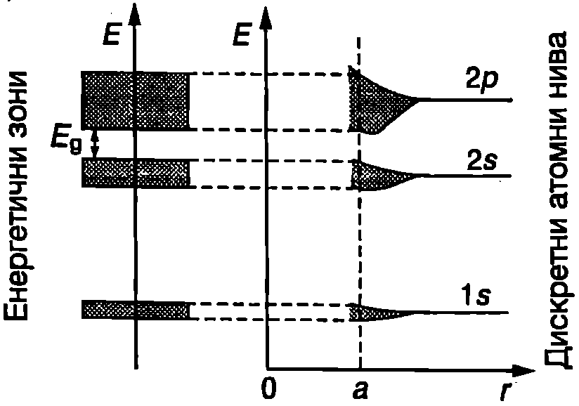
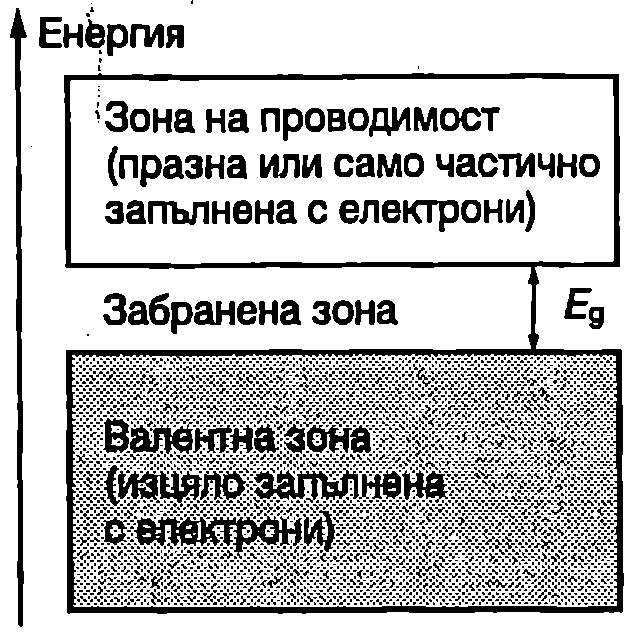

Специфичното съпротивление на чистите метали при ниски температури е от порядъка на $10^{-12}~\mathrm{\Omega\cdot m}$, докато при някои диелектрици то достига $10^{20}~\mathrm{\Omega\cdot m}$. Изключително широкият диапазон на изменение на съпротивлението не може да се обясни с модела на свободните електрони, който разгледахме. Този модел не дава отговор на въпроса защо някои кристали са изолатори, други са отлични проводници на електричен ток, а на трети електричните свойства зависят силно от температурата (полупроводници).

Отговор на тези въпроси дава зонната теория на твърдото тяло. Ще разгледаме качествено само основните идеи и резултати на тази квантова теория и ще проследим измененията, които настъпват в енергетичния спектър на електроните, когато отделните атоми се обединят в кристал.

Енергетични нива на електроните в атома

Както е известно от училищните курсове по физика и химия, състоянието на електроните в атома се определя от четири квантови числа: главно квантово число $n$, орбитално число $l$, магнитно число $m$ и спиново число $s$. Орбиталното квантово число може да взема стойности $l = 0, 1, 2, 3\dots (n - 1)$, т.е. $n$ на брой различни стойности. Магнитното квантово число $m$ приема $(2l + 1)$ различни стойности: $m = 0, \pm1; \pm2, \dots\pm l$. Спиновото квантово число на електроните може да има само две стойности: $s = 1/2$ или $s = -1/2 $.

Състоянията, за които орбиталното квантово число е $l = 0$ е прието да се означават с буквата $s$ и да се наричат $s$-състояния независимо от стойностите на останалите квантови числа. Състоянията с $l = 1$ се наричат $p$-състояния, с $l=2$ -- $d$-състояния, $l = 3$ -- $f$-състояния. Електроните, които се намират в тях, се наричат съответно $s$-, $p$-, $d$- или $f$-електрони.

В изолирания атом енергията на електроните се определя само от главното квантово число $n$ и от орбиталното квантово
число е. На Фиг. \ref{fig:55.1} схематично е показано запълването с електрони на нивата с главни квантови числа $n = 1 , 2$ и 3. В $s$-състоянията съгласно с принципа на Паули могат да се намират само по два електрона с противоположни спинове. В $p$-състоянията електроните се различават не само по спина, но и по магнитното квантово число, което може да има три различни стойности: $m = - 1, 0$ и $+ 1$. Казва се, че $p$-състоянията са трикратно изродени: на една и съща енергия отговарят три състояния с различно $m$, във всяко от които се разполагат по два електрона. В общия случай степента на израждане $g$ e равна на броя на стойностите, които може да приема магнитното число $m$: $g = 2l + 1$ Максималният брой на електроните, запълващи $g$-кратно изродено ниво, е


```

```
	`Фиг. 55.1`

$$N = 2g = 2(2l + 1)$$

На Фиг. \ref{fig:55.1} е използван един от общоприетите начини за означаване на електронната конфигурация на атомите: първата цифра показва главното квантово число, буквата -- орбиталното квантово число, а горният индекс над буквата -- броя на електроните в даденото състояние.

**Разрешени и забранени енергетични зони**

В изолирания атом дискретните електронни състояния са следствие от взаимодействието на електроните с атомното ядро, както и между отделните електрони на атома. В кристалите, поради малките разстояния между атомите, възникват нови сили: сили на взаимодействие между ядрата, между електроните, принадлежащи на различни атоми, и между всички електрони и всички ядра на кристала. Тези взаимодействия не са в състояние изцяло да разрушат изходната електронна структура на атомите. Затова съществува сходство между електронната структура на отделните атоми и на кристалите. От друга страна, в резултат на изброените допълнителни взаимодействия се появяват нови ефекти, характерни за твърдите тела:

1. На всяко енергетично ниво от отделния атом в кристала съответства определен енергетичен интервал (зона) с много близо разположени едно до друго разрешени състояния (нива).

2. Поради малките разстояния $a$ между атомите в кристала електронните обвивки на съседните атоми, особено външните, частично се припокриват. Това означава, че електрон, намиращ се на дадено ниво, принадлежащо на един атом, може с определена вероятност да премине в също то ниво на съседен атом, а електронът от съседния атом да прескочи в друг атом и т.н. За такива преходи не е необходима Допълнителна енергия и електроните от различните атоми могат непрекъснато да разменят местата си, т.е. те вече не принадлежат на конкретен атом, а на кристала като цяло.

Как възникват енергетичните зони? Нека $N$ еднакви атома са разположени толкова далеч един от друг, че да не взаимодействат помежду си. Тогава на всяко дискретно ниво на отделния атом в разглеждания ``кристал'' ще съответстват $N$ нива с еднаква енергия, т.е. едно $N$-кратно изродено ниво (или $Ng$-кратно изродено, ако изходното ниво има $g$-кратно израждане). Когато атомите се приближават един към друг, всеки от тях попада в нарастващото електрично поле на своите съседи, което води до снемане на израждането: нивата, които първоначално са имали еднаква енергия, се разцепват (Фиг. \ref{fig:55.2}). Разцепването се обяснява с това, че електроните от изроденото ниво взаимодействат по различен начин с допълнителното електрично поле на съседните атоми, т.е с периодичното кристално поле.



```

```
	`Фиг. 55.2`


Следователно на дискретните нива в отделния атом в кристала съответстват енергетични зони с близо разположени енергетични нива. Разрешените зони са разделени от забранени зони: интервали от енергия, в които няма електронни състояния. Колкото по-външни са електроните, толкова по-силно е влиянието на периодичното кристално поле и разрешените зони са по-широки. Обратно, с увеличаване на енергията на електроните ширината на забранените зони намалява.

> [!question] Пример 55.1
Оценете разликата в енергиите на две съседни нива в $s$-зона с ширина $E = 1$ eV на кристал с $N = 10^{22}$ атома.
\end{psexample}
> [!note]- Решение
 Да приемем с приближение, че нивата са разположени на еднаква енергия едно от друго. Тогава разликата в енергиите на две съседни нива е $\Delta E = E/N = 10^{-22}$ eV. Това е толкова малка стойност, че разпределението на електроните по енергия в рамките на една зона може да се смята за непрекъснато, т.е. да не се отчита дискретната енергетична структура. Но фактът, че броят на състоянията в зоната, макар и много голям, е все пак краен, играе важна роля за свойствата на кристалите.

**Валентна зона и зона на проводимост**

Запълването на разрешените зони с електрони става по същия начин, както нивата в атомите: в съответствие с принципа на Паули на всяко ниво могат да се разполагат най-много два електрона. Тъй като броят на електроните в кристала е ограничен, запълнени се оказват само определен брой зони (разположени най-ниско по отношение на енергията им). Последната, изцяло запълнена с електрони зона, се нарича *валентна зона* (Фиг. \ref{fig:55.3}). Разположената над нея частично запълнена или с изцяло свободни нива разрешена зона, се нарича *зона на проводимост*. Валентната зона и зоната на проводимост са разделени от забранена зона с ширина $E_g$.



```

```
	`Фиг. 55.3`


Вътрешните зони (разрешени и забранени) почти не влияят на свойствата на твърдите тела и по-нататък няма да ги разглеждаме. Решаващо значение за свойствата на кристалите има зоната на проводимост. Когато тя е частично запълнена с електрони, кристалът има висока електропроводимост, типична за металите. Диелектрици и полупроводници са кристалите, в чиито зони на проводимост при температура $T = 0$ К няма електрони.

**Метали**

Типични представители на кристалите с частично запълнена зона на проводимост са алкалните метали, които имат само по един електрон в най-външната си електронна обвивка. Например при натрия ($2p^63s^1$) последните, изцяло запълнени с електрони нива, са $2p$-нивата, от които се формира валентната зона. В $3s$-нивата се намира само по един електрон (вместо 2 електрона) и те образуват запълнена до половината зона на проводимост (Фиг. \ref{fig:55.4}).

Високата електропроводимост на металите се дължи на електроните от зоната на проводимост. Техните свойства се описват добре от модела на свободните електрони, който разгледахме. В зонната теория енергията на Ферми $\varepsilon_F$ (за изроден електронен газ при температура 0 К) е равна на разстоянието (енергетично) от дъното на зоната на проводимост до най-високото запълнено с електрони ниво (Фиг. \ref{fig:55.4}).


```

```
	`Фиг. 55.4`


**Диелектрици и полупроводници**

Типични представители на кристалите, в чиято зона на проводимост при температура 0 К няма електрони, са ковалентните кристали на елементите от IV група на периодичната система: диамантът C ($2s^22p^2$), силицият Si ($3s^23p^2$) и германият Ge ($4s^24p^2$). Характерно за тях е, че валентните $s$- и $p$-състояния не образуват самостоятелни зони. В кристала те се разцепват по такъв начин, че създават две смесени (хибридни) $s+p$-зони. Четирите валентни електрона запълват изцяло долната (валентна) $s+p$-зона, а в горната (проводима) $s+p$-зона нивата остават свободни (Фиг. \ref{fig:55.4}).

Електроните от валентната зона, когато тя е запълнена изцяло с електрони, не участват в пренасянето на електричния заряд при протичане на ток. Действително, за да се ускорят от външно електрично поле, те трябва да получат допълнителна енергия, т.е. да преминат в по-високоенергетични състояния. Това обаче е невъзможно, защото всички нива в зоната са запълнени с електрони и такива преходи противоречат на принципа на Паули. Преходи в свободните нива от зоната на проводимост също са невъзможни, защото за тях е необходима голяма енергия-трябва да се преодолее забранената зона $E_g$. Следователно кристалите с изцяло запълнена с електрони валентна зона и празна зона на проводимост при ниски температури са изолатори.

От гледна точка на зонната теория между диелектрици и полупроводници няма разлика това са кристали, в чиято зона на проводимост при 0 К няма електрони. Делението е условно и се основава на ширината на забранената зона $E_g$. Към диелектриците се причисляват кристалите с големи $E_g$ ($E_g \geq 3 ~\mathrm{eV}$). Например за диаманта $E_g = 5, 2~\mathrm{eV}$

При типичните полупроводници ширината на забранената зона е от порядъка (или по-малка) на 1 eV: $E_g = 1,\!17~\mathrm{eV}$ за Si и $E_g = 0,\!74 ~\mathrm{eV}$ за Ge при температура 0 К.

При $T = 0~\mathrm{K}$ чистите полупроводници са изолатори.
