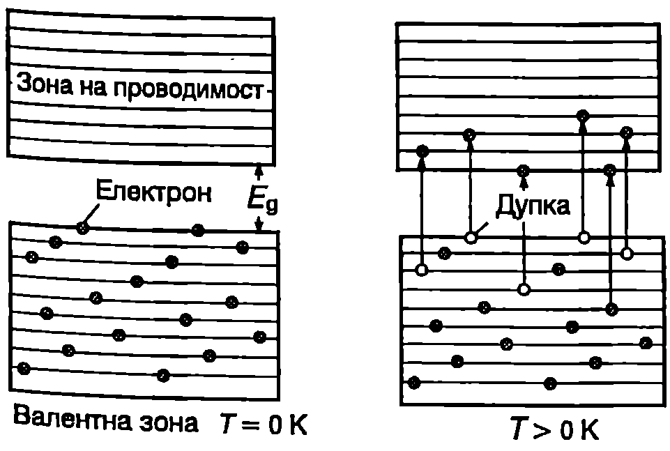
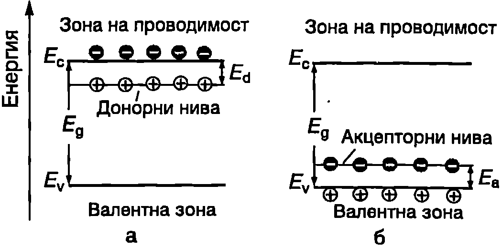

**Електрони и дупки**

Полупроводников кристал е поставен в електрично поле. Електрон от валентната зона, който се движи със скорост $\vec v_i$, създава електричен ток $-e\vec v_i$,. Когато валентната зона е изцяло запълнена с електрони, електричното поле не променя симетрията в тяхното разпределение по скорости: на всеки електрон със скорост $\vec v$ съответства електрон, който се движи със скорост $-\vec v$. Затова пълният ток $\vec J$, обусловен от движението на всичките $N$ електрона от валентната зона, е равен на нула:
$$\vec J = -e\sum_{i=1}^N \vec v_i = 0.
$$
Нека един от електроните, който във валентната зона е имал скорост $\vec v_k$, да премине в зоната на проводимост. За да се определи токът, дължащ се на останалите във валентната зона електрони, трябва сумирането в уравнение \eqref{eq:56.1} да се извърши по всички електрони от валентната зона, с изключение на к-тия електрон:
$$\vec J = -e\sum_{i=1 (i\neq k)}^N \vec v_i = -e \sum_{j=1}^N \vec v_i - (-e\vec v_k) = e\vec v_k,
$$
където е отчетено равенство \eqref{eq:56.1}.



```

```
	`Фиг. 56.1`


Следователно пълният ток, дължащ се на всички електрони от валентна зона с едно свободно място, е еквивалентен на тока, получен в резултат на движението само на една частица с положителен заряд $+e$, намираща се в свободното състояние. Тази частица се нарича *$p$-носител* или *дупка*. Подобно на електроните, дупките се характеризират с енергия, импулс и маса. Те запълват състоянията около върха на валентната зона по същия начин, както електроните заемат състоянията около дъното на зоната на проводимост (Фиг. \ref{fig:56.1}). Дупките са квазичастици, т.е. те не са частици в обичайния смисъл на това понятие, а физичните им свойства произтичат от реалното движение на електроните от валентната зона.

**Ефективна маса**

В класическата механика ускорението $\vec a$ на едно тяло и приложената към него сила $\vec F$ са свързани чрез уравнението $\vec F = m\vec a$, изразяващо втория принцип на механиката, където масата те мярка за инертността на тялото. Как се ускорява под действие на външно електрично поле електрон, намиращ се в периодичното кристално поле? За решаването на тази задача могат да се използват два подхода:

1. Да се определи равнодействащата на всички вътрешни сили $\vec F_\text{в}$ и уравнението на втория принцип на механиката да се запише във вида $\vec F + \vec F_\text{в} = m\vec a$. Сложният характер на изменение на вътрешните сили (на кристалното поле) обаче прави невъзможно решаването на това уравнение.

2. Електронът се разглежда като свободна частица (квазичастица), а влиянието на периодичното електрично поле в кристала се отчита, като действителната инертна маса $m_e$ на електрона се замени с т. нар. *ефективна маса* $m_e^*$. Тогава уравнението на втория принцип на механиката запазва вида си
$$\vec F = m_e^* \vec a.
$$

Ефективната маса може не само да се различава от масата на свободния електрон, но дори да бъде отрицателна, което се илюстрира от Фиг. \ref{fig:56.2}. Ако вътрешната сила $\vec F_\text{в}$ е насочена по посока на външната сила $\vec F$ (Фиг. \ref{fig:56.2}б), електронът се движи с по-голямо ускорение от ускорението, с което би се движил свободен електрон под действие само на силата $\vec F$. Съгласно с уравнение \eqref{eq:56.3} това съответства на по-малка ефективна маса: инертността на електрона е по-малка и той по-бързо реагира на външно въздействие. От енергетична гледна точка в случая кинетичната енергия на електрона нараства не само в резултат на работата на външната сила, но и за сметка на намаляване на потенциалната му енергия в периодичното поле на кристала. Анализирайте самостоятелно случаите, показани на Фиг. \ref{fig:56.2}а, в и г.


```

```
	`Фиг. 56.2`


По аналогичен начин се въвежда ве личината ефективна маса на дупките. Доказва се, че електроните от дъното на зоната на проводимост и дупките от върха на валентната зона имат положителни ефективни маси. Тяхната кинетична енергия се записва във вида
$$E_e = \frac{p^2}{2m_e^*};\quad E_h =\frac{p^2}{2m_h^*},
$$
където $m_e^*$ и $m_h^*$ са ефективните маси на електроните и дупките (индексът ``h'' идва от английски: hole -- дупка).

Зависимостта на енергията на електроните и дупките от техния импулс $p$ е показана на Фиг. \ref{fig:56.3}. Енергията на електроните се отчита от дъното $E_c$ на зоната на проводимост, а на дупките от върха $E_v$ на валентната зона. За повечето полупроводници $m_e^* < m_h^*$, поради което параболата $E_h(p)$ на Фиг. \ref{fig:56.3} е начертана по-широка. Ефективните маси се определят експериментално и с тяхна помощ се описват електричните свойства на твърдите тела.


```

```
	`Фиг. 56.3`


Свободни токови носители в полупроводниците са електроните от зоната на проводимост и дупките от валентната зона. Полупроводници, в които появата на свободни токови носители в свързана с преходи на електрони от валентната зона в зоната на проводимост, се наричат полупроводници със собствена проводимост. Собствената проводимост е обусловена от едновременното движение на еднакъв брой електрони и дупки, наречени собствени токови носители. Концентрациите на двата типа собствени токови носители са еднакви: $n_i = p_i$, където $n_i$ е концентрацията на собствените електрони, а $p_i$ на дупките.


```

```
	`Фиг. 56.4`


В електрично поле с интензитет $\vec E$ електроните и дупките се движат в противоположни посоки, но създаденият от тях ток има една и съща посока посоката на външното електрично поле (Фиг. \ref{fig:56.4}). За специфичната проводимост на полупроводниците, както при металите, е в сила уравнение \eqref{eq:53.12}, само че трябва да се отчете наличието на два типа токови носители:
$$\sigma=\sigma_e+\sigma_h = n_i e \mu_e +p_i e \mu_h,
$$
където $\mu_e$ и $\mu_h$ са съответно подвижностите на електроните и на дупките. Формула \eqref{eq:53.11} за подвижността също остава в сила, като масата на свободния електрон се заменя с ефективната маса на електроните и дупките:
$$\mu_e = \frac{e\tau}{m_e^*};\quad\mu_h = \frac{e\tau}{m_h^*}.
$$
За повечето полупроводници $m_e^* < m_h^*$, поради което електроните имат по-голяма подвижност.

> [!question] Пример 56.1
Подвижността на електроните в германия (Ge) при стайна температура е $\mu_e = 4500~\mathrm{cm^2/(V\cdot s)}$. Определете подвижността на дупките, ако на тях се дължи $44\%$ от собствената проводимост на германия.
\end{psexample}
> [!note]- Решение
 За германия:
$$\sigma_h = 0,\!44\sigma = 0,\!44(\sigma_e + \sigma_h).$$
Концентрациите на собствените електрони и дупки са равни: в уравнение \eqref{eq:56.5} полагаме $p = n$, съкращаваме на $en$, и като отчетем горното равенство, получаваме:
\[
\mu_h = 0,\!44(\mu_e + \mu_h);\
\mu_h = \frac{0,\!44\mu_e}{0,\!56} \approx 3500~\mathrm{\frac{cm^2}{V\cdot s}}.
\]

**Зависимост на собствената проводимост от температурата**

При полупроводниците зависимостта $\sigma(T)$ се определя от два фактора: от температурната зависимост на подвижността (дължината на свободния пробег) и на концентрацията на свободните токови носители. Основните механизми на разсейване на токовите носители в полупроводниците са същите, както при металите: разсейване от трептенията на кристалната решетка и от примеси. Те дават степенна зависимост на подвижността от температурата:
$$\mu\propto T^{-\alpha} (\alpha \leq 2,\!5)
$$
Много по-съществен за проводимостта на полупроводниците е другият фактор, който при металите отсъства -- температурната зависимост на концентрацията на свободните токови носители. При повишаване на температурата все повече електрони получават необходимата енергия, за да преодолеят забранената зона и да преминат в зоната на проводимост. Затова, както показват пресмятанията, концентрацията на собствените носители нараства с температурата по експоненциален закон:
$$n_i = p_i \propto \exp\left(-\frac{E_g}{2kT}\right),
$$
където $E_g$ е ширината на забранената зона, а $k$ -- константата на Болцман.

Експонентата е много бързо променяща се функция, поради което множителят $\exp(-E/2kT)$ доминира в температурната зависимост на проводимостта. Значително по-слабата зависимост на подвижността от температурата във формула \eqref{eq:56.5} може и да не се отчита. Приема се, че зависимостта $\sigma(T)$ се определя само от изменението на концентрацията на токови носители: $\sigma$ нараства с температурата по същия експоненциален закон, както концентрацията на токовите носители, т.е.
$$\sigma = \sigma_0 \exp\left(-\frac{E_g}{2kT}\right),
$$
където $\sigma_0$ е константа. Специфичното съпротивление $\rho = 1/\sigma$ намалява експоненциално при повишаване на температурата:
$$\rho = \rho_0 \exp\left(\frac{E_g}{2kT}\right),
$$
Чрез измерване на зависимостта $\rho(T)$ може да се определи експериментално ширината на забранената зона на полупроводник със собствена проводимост.

**Донори и акцептори**

Досега разглеждахме зонната структура на идеалните кристали, която се състои от редуващи се разрешени и забранени зони. Примесите в реалните кристали водят до нарушаване на идеалната периодичност на кристалното поле и в забранената зона възникват дискретни енергетични нива на примесите, на които могат да се разполагат електрони.

Да разгледаме силициев кристал, в който част от атомите на четиривалентния Si са заместени от петвалентния атом на фосфора (P). Четири от неговите валентни електрони образуват ковалентни връзки със съседните атоми на Si - енергетичните нива на тези електрони попадат във валентната зона. Петият електрон не участва в ковалентните връзки. Той е много по-слабо свързан към атома на фосфора P и енергетичното му ниво се оказва разположено в забранената зона, непосредствено под дъното на зоната на проводимост (Фиг. \ref{fig:56.5}а). Ако на такъв електрон се придаде допълнителна енергия $E_d$, наречена *енергия на активация*, той преминава в зоната на проводимост. На освободеното място се създава дупка. За разлика от дупките във валентната зона, дупките на примесните нива са неподвижни: те са локализирани около определен примесен атом и не участват в насоченото движение на зарядите при протичане на електричен ток.



```

```
	`Фиг. 56.5`

Примеси, в резултат на чиято йонизация се създават свободни електрони в зоната на проводимост и свързани към примесите дупки, се наричат *донори*, а техните енергетични нива в забранената зона *донорни нива*. Полупроводници, в които проводимостта се определя от донорите, се наричат електронни полупроводници, или полупроводници от $n$-тип.

Нека част от атомите на Si са заместени с тривалентния атом на индия (In). На индия не достига един електрон, за да образува четири ковалентни връзки с най-близките съседни атоми на Si. Такъв електрон може да се привлече от някой друг атом Si, за което е необходима енергия $E_a$. След захващане на електрон примесният атом се превръща в отрицателен йон. Съгласно със зонната теория процесът изглежда така: примесните атоми създават в забранената зона енергетични нива, раз положени на разстояние $E_a$ над върха на валентната зона (Фиг. \ref{fig:56.5}б). Електрон от валентната зона, след като получи допълнителна енергия $E_a$, наречена енергия на активация, се захваща на примесно ниво. Там той е пространствено локализиран около примесния атом, а във валентната зона се създава свободна дупка.

Примеси, които захващат електрони от валентната зона и по този начин създават в нея дупки, се наричат *акцептори*. Техните енергетични нива се наричат *акцепторни нива*. Полупроводници, в които проводимостта се определя от създадените от акцепторите дупки, се наричат полупроводници с *$p$-тип проводимост*.

**Температурна зависимост на концентрацията на свободните токови носители**

Ще разгледаме полупроводник от $n$-тип с донорни нива, разположени близо до дъното на зоната на проводимост ($E_d \ll E_g$).

При абсолютната нула те са запълнени с електрони, а зоната на проводимост в свободна -- кристалът е изолатор.

При повишаване на температурата най-напред започва термична активация на електрони от донорните нива, които преминават в зоната на проводимост. Доказва се, че концентрацията и на електроните нараства с температурата по същия експоненциален закон $n \propto \exp(-E_d/2kT)$, както концентрацията на собствените носители, само че енергията на активация е равна на $E_d$ (енергия на йонизация на донорите), а не на ширината на забранената зона $E_g$. Температурният интервал, в който проводимостта на кристала се определя от йонизацията на донорите, се нарича *област на примесна проводимост* (Фиг. \ref{fig:56.6}).

При по-нататъшно повишаване на температурата се преминава в областта на изтощаване на примесите. В нея повечето донори вече са йонизирани и концентрацията на токовите носители почти не се изменя. От друга страна, температурата все още е твърде ниска, за да се появят голям брой собствени носители (тъй като $E_g \gg E_d$, за преминаване на електрони от валентната в проводимата зона в необходима много по-голяма енергия). При високи температури концентрацията на собствените електрони и дупки започва бързо да нараства и полупроводникът навлиза в областта на собствена проводимост. В нея получените при йонизацията на донорите електрони са само малка част от общия брой на токовите носители, т.е. доминират собствените носители.

Температурната зависимост на специфичната проводимост $\sigma$ на примесните полупроводници има същия характер, както представената на Фиг. \ref{fig:56.6} зависимост $n(T)$.


```

```
	`Фиг. 56.6`
