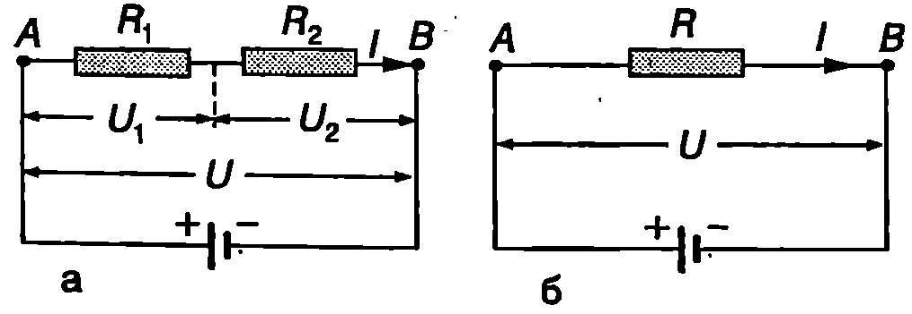
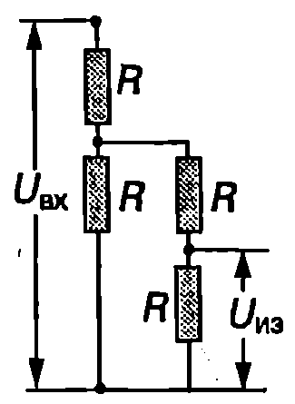

Последователно и успоредно свързване на резистори

На Фиг. \ref{fig:58.1}а са показани два проводника (резистора) със съпротивление $R_1$ и $R_2$ за които е в сила законът на Ом. Резисторите са свързани последователно. При такова свързване токът $I$ през тях е еднакъв, а напрежението и между точките А и B равно на сумата от напреженията върху отделните резистори:
$$U = U_1 + U_2 = IR_1 + IR_2.
$$

Двата резистора могат да се заменят с еквивалентен резистор със съпротивление $R$ (Фиг. \ref{fig:58.1}б), през който тече същият ток $I$. От закона на Ом следва равенството
$$U = RI.
$$

Като се приравнят десните страни на уравнения \eqref{eq:58.1} и \eqref{eq:58.2}, за еквивалентното съпротивление на двата последователно свързани резистора се получава
$$R = R_1 + R_2.
$$

Получената формула се обобщава за по-голям брой последователно свързани резистори:
$$R = R_1 + R_2 + R_3 + \dots
$$

Когато резисторите са свързани успоредно (Фиг. \ref{fig:58.2}а), напрежението и върху тях е еднакво. Сумата от токовете $I_1$ и $I_2$, които текат през двата резистора, е равна на тока $I$ в останалата част от веригата: \eqref{eq:58.5}
$$I = I_1 + I_2.
$$

От закона на Ом следват равенствата
$$I_1 = \frac{U}{R_1};\quad I_2 = \frac{U}{R_2}.
$$



```

```
	`Фиг. 58.1`


```

```
	`Фиг. 58.2`


Двата резистора са еквивалентни на един резистор, чието съпротивление е такова, че при включването му между точките А и В (Фиг. \ref{fig:58.2}б) във веригата да тече същият ток $I$. Токът $I$ от закона на Ом е
$$I = \frac{U}{R}
$$
Заместваме токовете $I$, $I_1$ и $I_2$ в уравнение \eqref{eq:58.5} и получаваме
$$\frac{1}{R} = \frac{1}{R_1} + \frac{1}{R_2}
$$
Еквивалентното съпротивление на по-голям брой успоредно свързани резистори се изразява с формулата
$$\frac{1}{R} = \frac{1}{R_1} + \frac{1}{R_2} + \frac{1}{R_3} + \dots
$$
> [!question] Пример 58.1
Намерете еквивалентното съпротивление между точките А и В на веригата от Фиг. \ref{fig:58.3}a.
\end{psexample}
> [!note]- Решение
 Ще решим задачата ``стъпка по стъпка''. Най-напред ще определим еквивалентното съпротивление $R_1$ на трите успоредно свързани резистора:
$$1/R_1 = 1/(2\Omega) + 1/(3\Omega) + 1/(6\Omega) = 6/(6\Omega) \text{ или } R_1 = 1\Omega.$$
Следващата стъпка е да начертаем нова схема, в която трите успоредно свързани резистора са заменени с един резистор с еквивалентно съпротивление 1 2. Тази схема съдържа три последователно свързани резистора (Фиг. \ref{fig:58.3}б). Тяхното еквивалентно съпротивление е


```

```
	`Фиг. 58.3`

$$R = 1\Omega + 2\Omega + 1\Omega = 4\Omega.$$

**Работа на електричния ток**

За да се поддържа насоченото движение на свободните заряди, т.е. протичането на електричен ток, вътре в проводника трябва да съществува електрично поле. Такова поле се създава след като проводникът се свърже към двата полюса на източник на ток батерия, акумулатор и т.н. Силовите линии на полето са насочени от положителния към отрицателния полюс на източника. Потенциалът на електричното поле намалява по посока на силовите линии. Затова левият край на проводника от Фиг. \ref{fig:58.4} (точка $M$) има по-висок потенциал от десния край (точка $N$): $\varphi_M > \varphi_N$. Напрежението между двата края на проводника е равно на потенциалната разлика между точките М и N: $U = \varphi_M - \varphi_N$. За да се опростят разглежданията може да се приеме, че електричният ток се обуславя от движението на положителни заряди. Нека за време $dt$ от точка $M$ до точка $N$ по проводника се пренася електричен заряд $dq$. При това електричните сили на полето извършват положителна работа $dA = dqU$. Ако се изрази зарядът чрез тока, $dq = ldt$, за работата на полето се получава
$$dA = UIdt
$$
Работата на електричните сили при протичане на ток се нарича работа на тока. Работата на тока в даден участък от веригата (например в участъка между точките $M$ и $N$ от електрическата верига на Фиг. \ref{fig:58.4}) е равна на произведението от напрежението $U$ върху този участък, тока $I$ и интервала от времето $dt$.

В резултат на работата на тока електричната потенциална енергия (електроенергията) намалява тя се преобразува в друг вид енергия. Действително, в точка $M$ (Фиг. \ref{fig:58.4}) зарядът $dq$ има електрична потенциална енергия $W_M = dq\varphi_M$. Когато той премине в точка $N$ потенциалната му енергия намалява и става $W_N = dq\varphi_N$. Намалението на електричната потенциална енергия на заряда е равно на работата на тока:


```

```
	`Фиг. 58.4`


$$W_M-W_N=dq(\varphi_M - \varphi_N) = dqU = dA.$$

**Закон на Джаул-Ленц**

Как електронната теория обяснява нагряването на проводниците? Електричното поле ускорява електроните и тяхната електрична потенциална енергия се превръща в кинетична енергия на насоченото движение. Електроните обаче не се движат безпрепятствено в метала. Те се удрят в положителните йони и след всеки удар скоростта на насоченото им движение става нула: електроните предават кинетичната си енергия на йоните. След това те отново се ускоряват от полето, пак се удрят в йоните и т.н. В резултат на големия брой удари енергията на хаотичното топлинно движение на йоните около равновесните им положения (трептене) нараства. По този начин електричната енергия се превръща във вътрешна енергия. Температурата на проводника се повишава и той започва да отдава топлина на околната среда. (Например нагревателят на бойлера загрява водата, а електрическата печка въздуха в стаята.) От закона за запазване на енергията следва, че количество топлина $\delta Q$, което се отделя в проводника, е равно на работата $dA$ на тока:
$$\delta Q = dA = UIdt.
$$
От закона на Ом се изразява напрежението чрез тока $I$ и съпротивлението $R$ на проводника, $U = RI$, и за отделеното количество топлина се получава
$$\delta Q = I^2 Rdt.
$$
Тази формула изразява математически закона на Джаул-Ленц:

**Количеството топлина, отделено в проводник, по който тече ток, е равно на произведението от квадрата на тока, съпротивлението на проводника и времето за протичане на тока.**

**Мощност на тока**

Работата на тока за единица време се нарича мощност на тока. От формула \eqref{eq:58.10} за мощността на тока се получава
$$P = \frac{dA}{dt} = UI.
$$
С помощта на закона на Ом $U = RI$ формулата за мощността на тока може да се запише още по два начина:
$$P = I^2 R;
$$
$$P = \frac{U^2}{R}.
$$
Формулата $P = I^2 R$ е удобно да се използва при последователно свързани проводници (консуматори), тъй като тогава през всички консуматори тече един и същ ток 1. Когато консуматорите са свързани успоредно, по-удобна за пресмятане на мощността на тока е формулата $P = U^2/R$ защото напрежението $U$ върху всички консуматори е еднакво.

> [!question] Пример 58.2
Електрическа лампа с мощност $P = 100\,\text{W}$ работи при напрежение $U = 220\,\text{V}$. Определете: а) съпротивлението $R$ на лампата; б) електроенергията, която лампата консумира за 24 часа.
\end{psexample}
> [!note]- Решение
 а) $R = {U^2}/{P} = 484\,\Omega$.

б) Консумираната електроенергия е равна на работата на тока:
$$A = Pt = (100\,\text{W})(86400\,\text{s}) = 8,\!64 \cdot 10^6\,\text{J}$$
или
$$A = Pt = (0,\!1\,\text{kW})(24\,\text{h}) = 2,\!4\,\text{kWh}$$
В бита електроенергията се измерва в киловатчаса ($\text{kWh}$). Един киловатчас е електроенергията, която консумира потребител с мощност $1\,\text{kW}$ за време $1\,\text{час}$:
$$1\,\text{kWh} = (1000\,\text{W})(3600\,\text{s}) = 3,\!6 \cdot 10^6\,\text{J}$$

> [!question] Пример 58.3
Токът през нагревател с постоянно съпротивление $R = 30\,\Omega$ се изменя с течението на времето по закона $I = ct$, където $c = 0,\!3\,\text{A/s}$. Определете количеството топлина, което ще се отдели в проводника за интервала време от $t_1 = 1\,\text{s}$ до $t_2 = 3\,\text{s}$.
\end{psexample}
> [!note]- Решение
 Отделеното за безкрайно малък интервал от време $dt$ количество топлина се изразява от закона на Джаул-Ленц $\delta Q = I^2 R\,dt$. Тъй като токът не е постоянен, количеството топлина $Q$ се определя чрез интегриране:
$$Q = \int_{t_1}^{t_2} I^2 R\,dt = \int_{t_1}^{t_2} c^2 t^2 R\,dt = \frac{c^2 R}{3} (t_2^3 - t_1^3) = 23,\!4\,\text{J}.$$

Задачи

1. Два резистора, свързани последователно, имат общо съпротивление $20\,\Omega$. При успоредно свързване съпротивлението е $3,\!2\,\Omega$. Определете съпротивлението на всеки резистор.

2. На колко равни части трябва да се разреже проводник със съпротивление $36\,\Omega$, така че при успоредното им свързване да се получи проводник със съпротивление $1\,\Omega$?

3. Схемата от Фиг. \ref{fig:58.5} се нарича делител на напрежение. Определете колко пъти изходното напрежение $U_{\text{изх}}$ е по-малко от входното напрежение $U_{\text{вх}}$.



```

```
	`Фиг. 58.5`


4. Колко електроенергия консумира радиатор с мощност $2\,\text{kW}$ за $\frac{1}{2}$ часа?

5. Цветен телевизор консумира мощност $105\,\text{W}$. Колко електроенергия ще платите, ако в продължение на 1 месец гледате всеки ден средно по 4 часа телевизия? Цената на електроенергията вземете от последната сметка, която е платило семейството ви.

6. Компактдисково устройство черпи ток $300\,\text{mA}$ при напрежение $9\,\text{V}$. Колко е консумираната от устройството мощност?

7. Лампа с мощност $40\,\text{W}$ е предназначена за работа при напрежение $12\,\text{V}$. Две такива лампи се свързват последователно към акумулатор с напрежение $12\,\text{V}$. Колко е мощността на всяка лампа? Приемете, че съпротивлението на лампата е постоянно.

8. Бързовар със съпротивление $110\,\Omega$, по който тече ток $2\,\text{A}$, е потопен в съд с $1\,\text{kg}$ вода. С колко градуса ще се повиши температурата на водата за $7\,\text{min}$? Топлообменът със стените на съда и с околния въздух се пренебрегва. Специфичният топлинен капацитет на водата е $4,\!2 \cdot 10^3\,\mathrm{J/(kg\cdot K)}$.

9. Сноп от неутрони с енергия $16\,\text{MeV}$ попада върху метална пластинка. Определете количеството топлина, което се отделя в пластинката, ако снопът е еквивалентен на токов импулс $I = 20\,\text{A}$ с продължителност $\tau = 1,\!0\,\text{ms}$.
