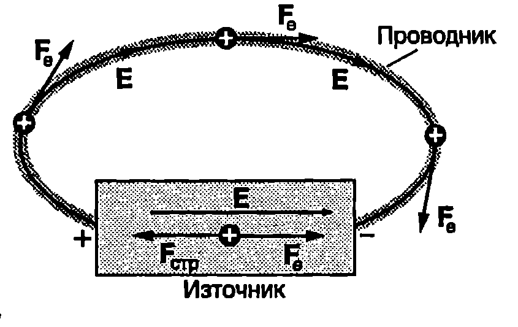
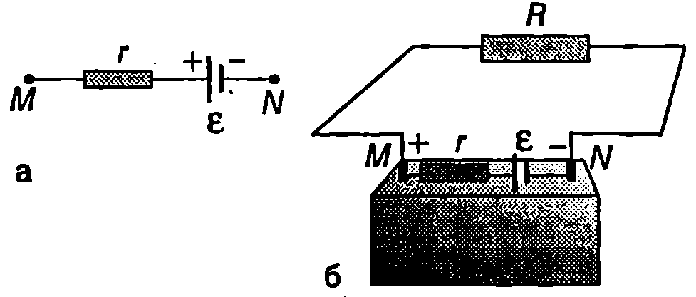
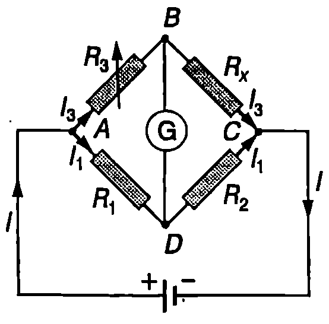
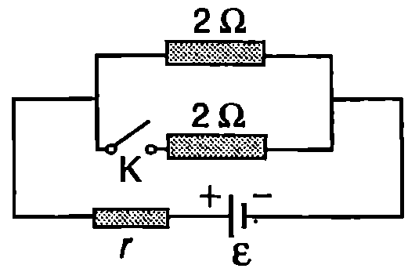

За поддържането на тока в затворена електрическа верига е необходим източник, който да преобразува някакъв друг вид енергия в електрична енергия. Сухите елементи (батерии) и акумулаторите преобразуват химичната енергия, генераторите механичната енергия, а слънчевите батерии светлинната енергия. Ще се спрем по-подробно на основните характеристики на източниците на електричен ток и ще обобщим закона на Ом за затворена електрическа верига.

**Електродвижещо напрежение**

На Фиг. \ref{fig:59.1} схематично е показана електрическа верига, съставена от източник и еднороден проводник. Когато положителен заряд $dq$ премине от положителния до отрицателния полюс на източника по външната част на веригата, електричните сили $\vec F_e$ на полето са насочени по посока на движението и извършват положителна работа, при което електричната потенциална енергия се превръща във вътрешна енергия: проводникът се загрява. За да се поддържа токът във веригата, след като достигне до отрицателния полюс на източника, зарядът $dq$ трябва да се прехвърли отново на положителния полюс. Вътре в източника обаче електричните сили имат противоположна посока те се противопоставят на преминаването на заряда през източника. Затова поддържането на тока във веригата е възможно само ако вътре в източника на електричните заряди действат допълнителни сили $\vec F_\text{стр}$, чиято посока е противоположна на посоката на електричните сили (Фиг. \ref{fig:59.1}). Прието е тези сили да се наричат странични сили.



```

```
	`Фиг. 59.1`


Природата на страничните сили може да е различна. Например в батериите и акумулаторите това са сили, възникващи при химични реакции.

При пренасянето на електричния заряд $dq$ вътре в източника страничните сили извършват положителна работа $dA_\text{стр}$ и възстановяват електричната потенциална енергия, която е имал зарядът $dq$ преди да премине през проводника (Фиг. \ref{fig:59.1}).

Отношението на работата на страничните сили $dA_\text{стр}$ за пренасяне на положителен заряд $dq$ от отрицателния до положителния полюс вътре в източника към големината $dq$ на този заряд се нарича *електродвижещо напрежение* (ЕДН) на източника:
$$\varepsilon = \frac{dA_\text{стр}}{dq}.
$$
Единицата за ЕДН е волт (V). Електродвижещото напрежение е $\mathcal{E} = 1\mathrm{V}$ ако при пренасяне през източника на заряд 1C страничните сили извършват работа 1 J.

**Вътрешно съпротивление на източник**

Ако свържем лампа за джобно фенерче към батерия, ще установим, че се нагрява не само лампата, но и батерията. При протичане на електричен ток в затворена верига количество топлина се отделя както в консуматорите, така и в самите източници. Това показва, че източниците също имат електрично съпротивление, което се нарича *вътрешно съпротивление* на източника и се бележи с $r$. За генератора $r$ е съпротивлението на неговата намотка, а за батериите и акумулаторите съпротивлението на химичните смеси или на електролитите, запълващи пространството между двата електрода. На електрическите схеми вътрешното съпротивление се представя като допълнителен резистор $r$, свързан последователно на източника (Фиг. \ref{fig:59.2}а).



```

```
	`Фиг. 59.2`


Свежите батерии, с които се захранва транзисторният радиоприемник или дистанционното управление на телевизора, имат малко вътрешно съпротивление (части от ома). Когато батерията старее и се изтощава, вътрешното и съпротивление нараства до няколко ома. Акумулаторите имат по-малко вътрешно съпротивление от батериите (0,001 $\Omega$ -- 0,1 $\Omega$).

**Закон на Ом за цялата верига**

На Фиг. \ref{fig:59.2}б е показана затворена електрическа верига, съставена от източник с ЕДН $\mathcal E$ и вътрешно съпротивление $r$ и от резистор със съпротивление $R$. Съпротивлението на проводниците, свързващи резистора с полюсите на източника, е много малко и може да се пренебрегне. Веригата се разделя на две части: външна част - в случая това са резисторът и съединителните проводници, и вътрешна част източникът с неговото електродвижещо напрежение и вътрешно съпротивление. На Фиг. \ref{fig:59.2}б точките М и N (двата полюса на източника) свързват външната и вътрешната част от веригата. Ако за време $dt$ през напречното сечение на проводниците преминава заряд $dq$, същият заряд преминава и през източника, при което страничните сили извършват работа
$$dA_\text{стр} = \varepsilon dq = \varepsilon Idt
$$
където зарядът $dq$ е представен чрез тока $I$ във веригата: $dq = Idt$.

При протичането на тока във външната и вътрешната част на веригата се отделя количество топлина, което се определя от закона на Джаул-Ленц
$$\delta Q = I^2Rdt + I^2rdt
$$
Съгласно със закона за запазване на енергията $\delta Q = dA_\text{стр}$. Приравняват се десните страни на равенства \eqref{eq:59.2} и \eqref{eq:59.3}, съкращава се на $Idt$ и се получава
$$\varepsilon = IR + Ir.
$$
Произведението от големината на тока и съпротивлението на определена част от веригата се нарича *пад на напрежението* върху тази част от веригата. Уравнение \eqref{eq:59.4} показва, че сумата от падовете на напрежението върху външната част ($RI$) и вътрешната част ($rI$) от затворена електрическа верига е равна на ЕДН $\mathcal E$ на източника, свързан във веригата.

Уравнение \eqref{eq:59.4} може да се запише във вида
$$I = \frac{\varepsilon}{R+r}.
$$
Тази зависимост се нарича закон на Ом за цялата верига: *Токът $I$ в една електрическа верига е равен на отношението на електродвижещото напрежение $\mathcal E$ на източника към пълното съпротивление $R + r$ на веригата.*

> [!question] Пример 59.1
Колко е максималният ток, който може да се черпи от акумулатор с ЕДН $\mathcal{E} = 12\ \mathrm{V}$ и вътрешно съпротивление $r = 0,\!01 \, \Omega$?
\end{psexample}
> [!note]- Решение
 От закона на Ом за цялата верига $I = \frac{\mathcal{E}}{R + r}$ следва, че токът е максимален при $R = 0$, т.е. когато двата полюса на акумулатора се свържат с проводник с пренебрежимо малко съпротивление. Казваме, че във веригата е станало късо съединение. Токът при късо съединение се определя от вътрешното съпротивление на източника:
$$I_{\text{к.с.}} = \frac{\mathcal{E}}{r} = \frac{12\ \mathrm{V}}{0,\!01 \, \Omega} = 1200\ \mathrm{A}.$$
При късо съединение източникът може да се повреди, а съединителните проводници да се разтопят.

> [!question] Пример 59.2
Консуматор със съпротивление $R$ е свързан към източник с ЕДН $\mathcal{E}$ и вътрешно съпротивление $r$ (Фиг. \ref{fig:59.2}б). Докажете, че мощността $P$ на тока през консуматора е максимална при $R = r$.
\end{psexample}
> [!note]- Решение
 Мощността на тока през консуматора е $P = I^2 R$. Изразяваме тока от закона на Ом за цялата верига $I = \frac{\mathcal{E}}{R + r}$ и получаваме
$$P = \frac{\mathcal{E}^2 R}{(R + r)^2}.$$
За да определим максимума на функцията $P(R)$, намираме нейната първа производна и я приравняваме на нула:
$$\frac{dP}{dR} = \frac{\mathcal{E}^2(r - R)}{(R + r)^3} = 0,$$
откъдето получаваме, че мощността е максимална при $R = r$.

**Електроизмервателни уреди**

Електричният ток се измерва с *амперметър*, напрежението с *волтметър*, а съпротивлението с *омметър*. Амперметърът винаги се свързва последователно в електрическата верига, а волтметърът се свързва успоредно към тази част от веригата, чието напрежение ще се измерва. Амперметрите имат малко съпротивление, а волтметрите голямо. В редица случаи съпротивлението на амперметъра е много по-малко от съпротивлението на резисторите, към които той е свързан последователно (Фиг. \ref{fig:59.3}а). Тогава то може да се пренебрегне. Амперметър с пренебрежимо малко съпротивление, чието свързване в дадена електрическа верига не оказва влияние на токовете, които текат във веригата, се нарича идеален амперметър. Съпротивлението на идеалния Волтметър е много по-голямо от съпротивлението на участъка от веригата, успоредно на който е свързан волтметърът (Фиг. \ref{fig:59.3}б). Идеалният волтметър не променя напрежението върху дадения участък от веригата. Бихме могли още да кажем, че идеалният амперметър има нулево съпротивление, а съпротивлението на идеалния волтметър е безкрайно голямо. При решаване на задачи, в зависимост от конкретните данни, трябва да преценим дали може да разглеждаме амперметрите и волтметрите като идеални, или трябва да отчетем тяхното съпротивление.


```

```
	`Фиг. 59.3`


> [!question] Пример 59.3
Колко е напрежението, което измерва волтметърът в електрическата верига, показана на Фиг. \ref{fig:59.4}? Разгледайте три случая:

а) волтметърът е идеален;

б) съпротивлението на волтметъра е $R_V = 4\,\text{к}\Omega$;

в) $R_V = 10\,\text{М}\Omega$.

Вътрешното съпротивление на източника се пренебрегва.
\end{psexample}
> [!note]- Решение
 а) Идеалният волтметър има безкрайно голямо съпротивление, поради което включването му успоредно на резистора $R_1$ не променя съпротивлението между точките $A$ и $B$ от веригата.


```

```
	`Фиг. 59.4`


Тъй като двата последователно свързани резистора имат еднакво съпротивление, напрежението върху тях също в еднакво:
$$U_1 = U_2 = \frac{\mathcal{E}}{2} = 3\,\text{V}.$$
Следователно, идеалният волтметър ще измерва напрежение $U_V = 3\,\text{V}$.

б) Разглеждаме волтметъра като резистор със съпротивление $R_V = 4\,\text{к}\Omega$, който е свързан успоредно на $R_1$. Еквивалентното съпротивление на двата резистора е:
$$R_1' = \frac{R_1 \cdot R_V}{R_1 + R_V} = \frac{4\,\text{к}\Omega \cdot 4\,\text{к}\Omega}{4\,\text{к}\Omega + 4\,\text{к}\Omega} = 2\,\text{к}\Omega.$$
Общото съпротивление на веригата е:
$$R = R_1' + R_2 = 2\,\text{к}\Omega + 4\,\text{к}\Omega = 6\,\text{к}\Omega.$$
Токът във веригата е:
$$I = \frac{\mathcal{E}}{R} = \frac{6\,\text{V}}{6 \times 10^3\,\Omega} = 1 \times 10^{-3}\,\text{A} = 1\ \mathrm{mA}.$$
Напрежението между точките $A$ и $B$, т.е. напрежението, което показва волтметърът, определяме от закона на Ом:
$$U_1 = R_1' \cdot I = (2 \times 10^3\,\Omega)(1 \times 10^{-3}\,\text{A}) = 2\,\text{V}.$$
в) По същия начин пресмятаме еквивалентното съпротивление $R_1' = 3\ 998\Omega$ между точките $A$ и $B$. За показанието на волтметъра получаваме:
$$U_1 = 2,\!9994\,\text{V} \approx 3\,\text{V}.$$
Следователно волтметърът със съпротивление $10\ \mathrm{M\Omega}$ може да се смята за идеален, докато включването на другия волтметър води до съществени изменения на напреженията и тока в дадената верига. Съвременните цифрови волтметри имат съпротивление около $10\ \mathrm{M\Omega}$ и в повечето случаи могат да се смятат за идеални. Стрелковите волтметри имат съпротивление от порядъка на няколко хиляди или няколко десетки хиляди ома (съпротивлението намалява при превключване на волтметъра на по-малък обхват). Това трябва да се има предвид при работа с такива уреди.

\begin{psexample}[label=ex:59.4]{Уитстънов мост}{} Една от най-разпространените схеми за измерване на неизвестно съпротивление е Уитстъновият мост (Фиг. \ref{fig:59.5}). Съпротивленията $R_1$ и $R_2$ са известни с голяма точност. Съпротивлението $R_3$ може да се изменя, и големината му се подбира така, че токът през галванометъра $G$ (чувствителен амперметър) да стане равен на нула. Определете неизвестното съпротивление $R_x$, ако $R_1 = 1035 \, \Omega$ и $R_2 = 997 \, \Omega$. Токът през галванометъра става равен на нула при $R_3 = 958 \, \Omega$.
\end{psexample}



```

```
	`Фиг. 59.5`

> [!note]- Решение
 Падовете на напреженията върху резисторите $R_1$ и $R_2$ са равни на разликата в потенциалите съответно на точки $A$ и $B$ и на точки $A$ и $D$:
$$U_{AB} = \varphi_A - \varphi_B \quad \text{и} \quad U_{AD} = \varphi_A - \varphi_D.$$
Когато мостът е уравновесен, т.е. когато през галванометъра не тече ток, потенциалите на точки $B$ и $D$ са равни: $\varphi_B = \varphi_D$. Следователно тогава $U_{AB} = U_{AD}$. По аналогичен начин установяваме, че $U_{BC} = U_{DC}$. При уравновесен мост през резисторите $R_1$ и $R_2$ тече един и същ ток $I_1$, а през резисторите $R_3$ и $R_x$ тече ток $I_3$. От закона на Ом и от горните две равенства между напреженията следват съотношенията:
$$I_1 R_1 = I_3 R_3 \quad \text{и} \quad I_1 R_2 = I_3 R_x.$$
Разделяме почленно левите и десните страни на двете уравнения, съкращаваме токовете $I_1$ и $I_3$, и определяме неизвестното съпротивление $R_x$:
$$R_x = \frac{R_2 \cdot R_3}{R_1} = 9,\!23\ \mathrm{k\Omega}.$$
Задачи

1. Слънчева батерия има ЕДН $2,\!2$ V. Колко е вътрешното съпротивление на батерията, ако при късо съединение през нея протича ток $1,\!1$ A?

2. Към батерия с ЕДН $120$ V е свързан резистор със съпротивление $1100\,\Omega$. Колко е вътрешното съпротивление на батерията, ако токът през резистора е $0,\!1$ A?

3. При включване на стартера от автомобилен акумулатор с ЕДН $\varepsilon = 12$ V се черпи ток $I = 200$ A и напрежението във външната част на веригата пада до $U = 10$ V. Колко е вътрешното съпротивление на акумулатора?

4. Към батерия с ЕДН $6$ V е включена крушка със съпротивление $5\,\Omega$, която консумира мощност $5$ W. Начертайте схема на електрическата верига и определете: а) тока във веригата; б) вътрешното съпротивление на батерията.

5. Два консуматора със съпротивление $R_1 = 4\,\Omega$ и $R_2 = 5\,\Omega$ са свързани последователно към източник с ЕДН $6$ V и вътрешно съпротивление $r = 1\,\Omega$. Начертайте схема на електрическата верига и определете мощността на тока през всеки консуматор.

6. При отворен ключ $K$ (Фиг. \ref{fig:59.6}) от източника се черпи ток $1$ A. След затваряне на ключа токът през източника става $1,\!5$ A. Определете вътрешното съпротивление и ЕДН на източника.



```

```
	`Фиг. 59.6`


7. Капацитет на акумулатор се нарича зарядът $q$, който преминава през веригата при разреждането на акумулатора. Ако времето на разреждане е $t$, а токът е $I$, то капацитетът на акумулатора е $q = It$ и се измерва в амперчасове ($\mathrm{A \cdot h}$). Автомобилен акумулатор с $\varepsilon = 12\,\mathrm{V}$ има капацитет $q = 200\,\mathrm{A \cdot h}$. Колко часа акумулаторът може да захранва двете лампи на фаровете на автомобила, всяка от които има мощност $P = 40\,\mathrm{W}$?

8. Определете ЕДН $\varepsilon$ и вътрешното съпротивление $r$ на акумулатор, ако при ток $I = 5\,\mathrm{A}$ мощността на тока във външната част от веригата е $P_1 = 57,\!5\,\mathrm{W}$, а при съпротивление на външната част от веригата $R = 1,\!4\,\Omega$ мощността на тока в нея е $P_2 = 89,\!6\,\mathrm{W}$.

9. Определете вътрешното съпротивление на автомобилен акумулатор с ЕДН $\varepsilon = 12\,\mathrm{V}$. Известно е, че при включване на стартера от акумулатора се черпи ток $I = 70\,\mathrm{A}$ и напрежението във външната част от веригата (между клемите на акумулатора) става $U = 7,\!8\,\mathrm{V}$.

10. Определете максималната мощност, която може да се черпи от батерия с ЕДН $\varepsilon = 1,\!5\,\mathrm{V}$ и вътрешно съпротивление $r = 0,\!5\,\Omega$.
