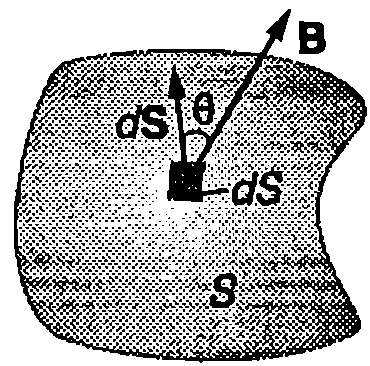
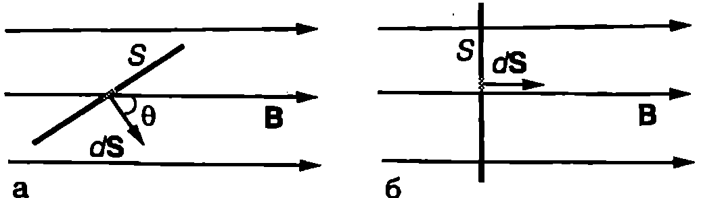
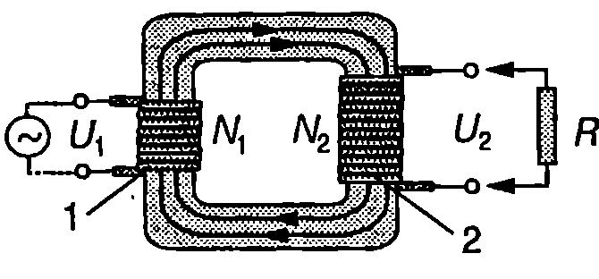
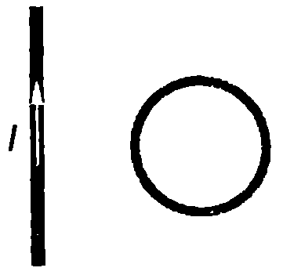

Опитът на Оерстед и изследванията на Био, Савар и Ампер показват, че електричният ток създава магнитно поле. Фарадей, който е убеден в "единството на природните сили", стига до извода, че трябва да съществува и обратното явление магнитно поле да предизвика протичане на електричен ток по проводник. ``Да се превърне магнетизмът в електричество'', така Фарадей формулира в своя дневник задачата, над която работи в продължение на десет години. През 1831 г. той открива принципно ново явление явлението електромагнитна индукция, което показва неразривната връзка между електричеството и магнетизма. Откритието на Фарадей има огромно значение за науката и техниката. На електромагнитната индукция се основава действието на много уреди на електрическите генератори в съвременните електроцентрали, на трансформаторите и др.

**Опити на Фарадей**

Фарадей провежда многобройни опити с цел да получи електричен ток с помощта на магнитно поле. Първият от тях е показан на Фиг. \ref{fig:66.1}. Намотката 1 е свързана към източник на ток, а намотката 2 към галванометър. Нулата на галванометъра е разположена по средата на скалата, така че в зависимост от посоката на тока стрелката се отклонява наляво или надясно. Отначало Фарадей навива намотките около дървено колело, което впоследствие заменя с желязна сърцевина. Сърцевината усилва магнитното поле, създадено от първата намотка, и концентрира индукционните му линии, при което те преминават и през втората намотка. Независимо, че втората намотка се намира в силно магнитно поле, по нея не тече ток и стрелката на галванометъра е на нулата. Фарадей обаче забелязва, че стрелката за кратко време рязко се отклонява в едната посока при затварянето на ключа К, т.е. в момента на пускане на тока през първата намотка. Същото отклонение, само че в противоположната посока, се наблюдава при прекъсване на електрическата верига (Фиг. \ref{fig:66.1}). Фарадей стига до извода, че постоянното магнитно поле не предизвиква протичане на ток през втората намотка. Ток протича само когато полето се променя нараства в момента на включване на тока или намалява при прекъсване на веригата.


```

```
	`Фиг. 66.1`


```

```
	`Фиг. 66.2`


Друг опит е показан на Фиг. \ref{fig:66.2}. Когато постоянният магнит се вкарва бързо в намотката, по нея протича ток и стрелката на галванометъра се отклонява (Фиг. \ref{fig:66.2}а). При изваждане на магнита от намотката също протича ток, само че в противоположната посока (Фиг. \ref{fig:66.2}б). Ток не тече, ако магнитът е неподвижен. Този опит също показва, че ток протича, само когато намотката се намира в променливо магнитно поле: при приближаване на магнита полето нараства, а при отдалечаването му намалява.

Явлението, при което поради промяна на магнитното поле в един затворен проводников контур (намотка) протича ток, се нарича електромагнитна индукция, а самият ток индуциран ток. Електродвижещото напрежение, което поражда *индуцирания ток*, се нарича *индуцирано* ЕДН.

**Магнитен поток**

Индуцираното ЕДН се определя от изменението на една от характеристиките на магнитното поле, наречена *магнитен поток*. Магнитният поток се дефинира по аналогичен начин (вж. \ref{sec:45}), както потокът на интензитета на електричното поле (електричен поток). На Фиг. \ref{fig:66.3} в показан малък елемент с площ $dS$ от повърхност 5 с произволна форма. Индукцията на магнитното поле на повърхността на елемента $dS$ е $\vec B$. По определение магнитният поток през елемента $dS$ e

$$d\Phi_B = \vec B \cdot d\vec S = BdS\cos\theta,$$

където $d\vec S$ е перпендикулярен на повърхността вектор, чиято големина е равна на площта $dS$ на елемента. Страната, от която излиза векторът $d\vec S$, се приема за лицева страна на повърхността. Магнитният поток е положителен $(d\Phi_B > 0)$ при $\theta < 90^\circ$ т.е. когато индукционните линии пробождат повърхността от опаката към лицевата страна. Магнитният поток е отрицателен $(d\Phi_B < 0)$ , когато индукционните линии са насочени от лицевата към опаката страна. Магнитнитният поток $\Phi_B$ през цялата повърхност $S$ е



```

```
	`Фиг. 66.3`

$$\Phi_B = \int_S \vec B \cdot d\vec S.
$$
В частния случай, когато повърхност та е част от равнина, а магнитното поле е еднородно, магнитният поток през площ $S$ от равнината е (Фиг. \ref{fig:66.4}а)
$$\Phi_B = BS\cos\theta.
$$
Магнитният поток е максимален при $\theta = 0$ т.е. когато повърхността е перпендикулярна на индукционните линии (Фиг. \ref{fig:66.4}б). Тогава
$$\Phi_B = BS.
$$
Единицата за магнитен поток се нарича вебер (Wb). От уравнение \eqref{eq:66.3} следва, че $1\ \mathrm{Wb} = 1\ \mathrm{T\cdot m^2}$.

**Закон на Фарадей**

Когато в опита, показан на Фиг. \ref{fig:66.2}а, магнитът се приближава към намотката, броят на индукционните линии, които я пробождат, нараства. Следователно нараства магнитният поток през напречното сечение на намотката. Когато магнитът се отдалечава (Фиг. \ref{fig:66.2}б), магнитният поток през намотката намалява. Опитът показва, че индуцираният ток и индуцираното ЕДН нарастват, ако магнитът се движи с по-голяма скорост $\vec v$, т.е. когато магнитният поток през намотката се променя по-бързо. Изменението на магнитния поток през намотката за време $dt$ e $d\Phi_B$. Отношението $d\Phi_B/dt$ т.е. първата производна на магнитния поток по времето, се нарича *скорост на изменение на магнитния поток*.

Фарадей обобщава резултатите от различните опити и формулира следния закон, наречен в негова чест закон на Фарадей:

**Големината на индуцираното в проводников контур ЕДН е равно на скоростта, с която се изменя магнитният поток през повърхността, заградена от контура.**

Законът на Фарадей се изразява с уравнението
$$\varepsilon = -\frac{d\Phi_B}{dt}.
$$
където знакът минус е следствие от правилото на Ленц, което ще разгледаме по-нататък. Когато ЕДН се индуцира в намотка с $N$ на брой еднакви навивки, през всяка от които преминава един и същ магнитен поток, законът на Фарадей се изразява с уравнението
$$\varepsilon = -N\frac{d\Phi_B}{dt}.
$$



```

```
	`Фиг. 66.4`


> [!question] Пример 66.1
Цилиндрична намотка с радиус $R$ има $N$ навивки. Оста на намотката е успоредна на индукционните линии на еднородно магнитно поле с индукция $B_0$. В момента $t = 0$ полето започва да намалява по експоненциалния закон $B = B_0 e^{-ct}$, където $c$ е константа. Определете индуцираното в намотката ЕДН като функция на времето $t$.
\end{psexample}
> [!note]- Решение
 Магнитният поток през напречното сечение на намотката е
$$\Phi_B = BS = B_0 e^{-ct} \pi R^2.$$

Индуцираното ЕДН определяме от закона на Фарадей \eqref{eq:66.5}
$$\mathcal E = -N\frac{d\Phi_B}{dt} = N\pi R^2cB_0e^{-ct}.$$

Следователно индуцираното ЕДН е максимално, $\mathcal E_{\max} = N\pi R^2cB_0$, в началния момент $t= 0$, в който започва да се изменя магнитното поле, а след това намалява по същия експоненциален закон, както магнитната индукция $B$.

**Правило на Ленц**

Руският физик от германски произход Емил Ленц (1804-1865) установява общо правило, което позволява да се определи посоката на индуцирания ток:

**Посоката на индуцирания ток в затворен проводников контур е такава, че магнитното поле на тока се противопоставя на изменението на магнитния поток, което поражда този ток. Индуцираният ток винаги се стреми да запази първоначалния магнитен поток през контура.**

Ще поясним правилото на Ленц с два примера. Когато магнитът от Фиг. \ref{fig:66.5}а се приближава към металния пръстен, магнитният поток през пръстена нараства. В пръстена се индуцира ток, чиято посока съгласно с правилото на Ленц е такава, че магнитното поле на тока да се противопостави на това нарастване. Следователно индукционните линии на магнитното поле на тока трябва да са насочени срещу индукционните линии на полето на постоянния магнит. На Фиг. \ref{fig:66.5} индукционните линии на магнитното поле на тока са представени с пунктир. Посоката на тока $I$, която отговаря на това изискване, се определя по правилото на дясната ръка (вж. Фиг. \ref{fig:65.7} и Фиг. \ref{fig:65.8} на стр.94). При отдалечаване на магнита (Фиг. \ref{fig:66.5}б) магнитният поток през пръстена намалява. Съгласно с правилото на Ленц индуцираният ток се стреми да поддържа постоянен първоначалния магнитен поток, т.е. противопоставя се на намаляването му. Затова индукционните линии на полето на тока имат същата посока както индукционните линии на полето на магнита. Следователно сега посоката на тока е противоположна на посоката на тока от първия случай.


```

```
	`Фиг. 66.5`


Има и други формулировки на правилото на Ленц. По-общо бихме могли да кажем, че съгласно с правилото на Ленц резултатът от електромагнитната индукция противодейства на промените, които я предизвикват.

**Трансформатор**

Трансформаторът е устройство, с помощта на което се увеличава или се намалява амплитудата на променливо напрежение. Той се състои от затворена желязна сърцевина, на която са надянати две намотки с различен брой навивки (Фиг. \ref{fig:66.6}). Едната намотка се нарича *първична*, а другата *вторична*. Първичната намотка се свързва към източника на променливо напрежение, а към вторичната намотка се включва потребителят. Действието на трансформатора се основава на явлението електромагнитна индукция. При протичане на променлив ток в първичната намотка възниква променливо магнитно поле, което индуцира напрежение във вторичната намотка. Трансформаторите се конструират така, че почти всички индукционни линии на магнитното поле да се затварят вътре в желязната сърцевина, т.е. да пресичат вторичната намотка. Тогава магнитният поток $\Phi_B$ през напречните сечения на двете намотки е еднакъв. Индуцираните в двете намотки електродвижещи напрежения се изразяват от закона на Фарадей \eqref{eq:66.5}:
$$\mathcal E_1 = -N_1 \frac{d\Phi_B}{dt};\mathcal E_2 = -N_2 \frac{d\Phi_B}{dt},$$
където $N_1$ и $N_2$ е броят на навивките съответно в първичната (1) и вторичната (2) намотки. От правилото на Кирхоф за токовия контур следват равенствата



```

```
	`Фиг. 66.6`


$$\varepsilon_1 = U_1 + r_1 I_1;\ \varepsilon_2 = U_2 + r_2 I_2,
$$
където $U_1$ е напрежението на входа на трансформатора, $U_2$ напрежението на изхода, $r_1$ е съпротивлението на първичната намотка, $r_2$ -- на вторичната намотка, а $I_1$ и $I_2$ са съответно токовете през двете намотки. За повечето технически трансформатори е в сила неравенството $r_1 I_1 \ll \mathcal E_1$ и падът на напрежението може да се пренебрегне. Ще се ограничим с разглеждане на частния случай, когато към вторичната намотка не е включен консуматор (трансформаторът работи на празен ход). Тогава $I_2 = 0$ и уравнения \eqref{eq:66.6} получават вида
$$\mathcal E_1 = -N_1 \frac{d\Phi_B}{dt} = U_1;\ \mathcal E_2 = -N_2 \frac{d\Phi_B}{dt} = U_2.$$
Делим почленно двете уравнения и получаваме
$$\frac{U_2}{U_1} = \frac{N_2}{N_1}.
$$
Когато $N_2>N_1$ изходното напрежение $U_2$ е по-голямо от входното напрежение $U_1$. Такъв трансформатор се използва за повишаване на напрежението. Обратно, понижаващите трансформатори имат вторични намотки с по-малък брой навивки ($N_2<N_1$) и при тях $U_2 <U_1$.

Трансформаторите намират широко приложение в енергетиката и в техниката. В електроснабдяването се използват силови трансформатори, предназначени за големи мощности десетки и стотици MW. Трансформаторите, които захранват радиоелектронната апаратура с енергия от градската мрежа, се наричат мрежови трансформатори. В различни радиотехнически устройства се използват високочестотни трансформатори, които преобразуват напрежения с честоти над 50 Hz.

**Задачи**

1. Пръстен с радиус 0,01 m е поставен перпендикулярно на индукционните линии на еднородно магнитно поле с индукция 0,1 T. Колко е големината на магнитния поток през пръстена?

2. Магнитният поток през проводников контур се изменя с постоянна скорост от $\Phi_1 = -0,\!1$ Wb до $\Phi_2 = 0,\!3$ Wb за време $\tau = 0$ s. Колко е индуцираното ЕДН?

3. Проводников контур и дълъг праволинеен проводник, по който тече ток, лежат в една равнина (Фиг. \ref{fig:66.7}). Определете посоката на индуцирания в контура ток, ако контурът: а) се отдалечава от проводника; б) се приближава към проводника.



```

```
	`Фиг. 66.7`


4. Пръстен с диаметъра $d = 2$ cm и съпротивление $R = 0,\!01\ \Omega$ е поставен перпендикулярно на индукционните линии на еднородно магнитно поле. За време $\tau = 0,\!02$ s индукцията на полето равномерно намалява от $B = 0,\!2$ T до нула. Определете: а) индуцираното пръстена ЕДН; б) индуцирания ток.

5. Намотка с $N = 200$ навивки и напречно сечение S = 10 cm$^2$ е поставена в еднородно магнитно поле, чиято индукция се изменя със скорост $dB/dt = 0, 2$ T/s Индукционните линии са перпендикулярни на напречното сечение на намотката. Колко е индуцираното в намотката ЕДН?

6. Магнитният поток през напречното сечение на намотка с 10 еднакви навивки се изменя с постоянна скорост 0,5 Wb/s. Определете индуцирания ток, ако съпротивлението на намотката е $2\ \Omega$.

7. Тънък кръгов проводник с радиуса $a = 10$ cm и съпротивление $R = 3,\!14\ \Omega$ е поставен перпендикулярно на индукционните линии на еднородно магнитно поле с индукция $B = 0,\!1$ T Пресметнете електричния заряд, който ще премине през напречното сечение на проводника, ако индукцията на магнитното поле намалява до нула.

8. На входа на трансформатор е подадено напрежение 220 V от електрическата мрежа. Колко е напрежението на изхода на трансформатора, ако вторичната му намотка има 10 пъти по-малко навивки, отколкото първичната намотка? 
