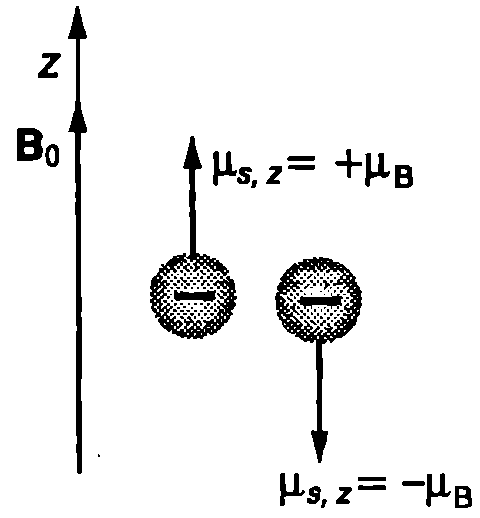
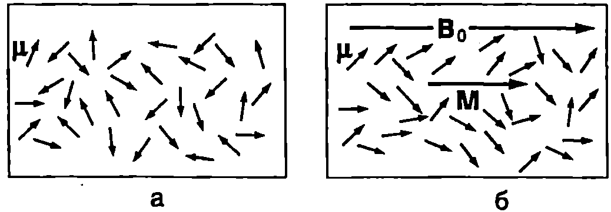
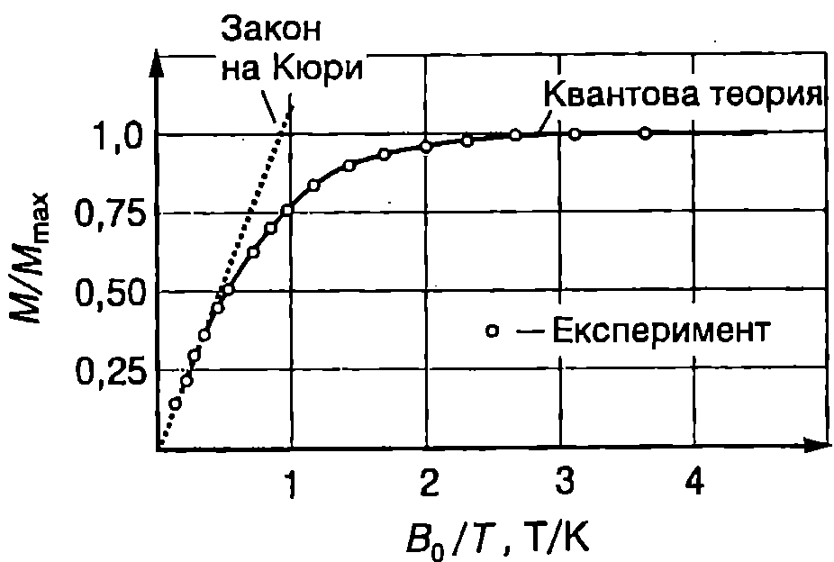
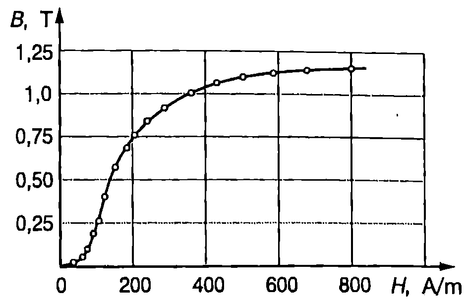
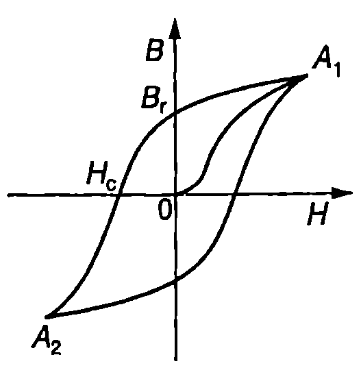
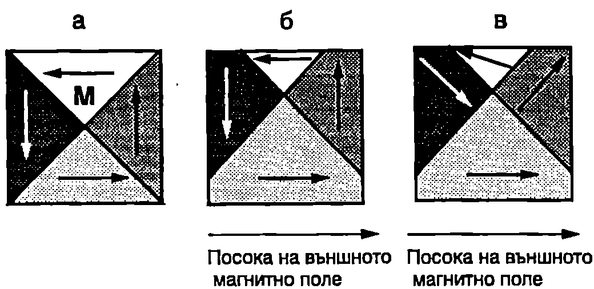

**Магнитен диполен момент на атома**

Ще започнем изучаването на магнетизма на атомите с опростен класически модел, съгласно с който електроните извършват кръгово движение около неподвижното атомно ядро. На Фиг. \ref{fig:69.1} схематично е показан електрон, който се движи със скорост $v$ по окръжност с радиус $r$. Времето за една обиколка (период на въртене) е $T = 2\pi/v$. Ефективният ток, свързан с орбиталното движение на електрона, е равен на заряда на електрона $e$, разделен на периода на въртене $T$:
$$I = \frac{e}{T} = \frac{ev}{2\pi r}$$
Магнитният диполен момент на този ефективен кръгов ток (вж. стр.90) е
$$\vec p_m = \vec\mu = IS\vec n = \frac{ev}{2\pi r}\pi r^2 \vec n = \frac{1}{2}evr\vec n.
$$
От друга страна, моментът на импулса на електрона спрямо точка $O$ (атомното ядро) е
$$\vec L = \vec r\times m\vec v= mvr\vec n,
$$
където те масата на електрона. От уравнения \eqref{eq:69.1} и \eqref{eq:69.2} получаваме
$$\vec\mu = -\frac{e}{2m}.
$$
Знакът минус показва, че векторите $\vec\mu$ и $\vec L$ имат противоположни посоки (Фиг. \ref{fig:69.1}). Двата вектора са перпендикулярни на равнината на орбитата.

Разгледаният модел обаче има сериозни недостатъци. Класическата физика, преди да бъдат въведени квантовите представи, не е в състояние да обясни нито орбиталното движение на електроните,


```

```
	`Фиг. 69.1`

нито самото съществуване на атомите. От нейните закони например следва, че електроните трябва непрекъснато да излъчват електромагнитни вълни, в резултат на което да загубят своята енергия и след кратък интервал от време да паднат върху атомното ядро. Разбирането на природата на магнетизма става възможно едва след създаването на квантовата механика. Оказва се, че магнетизмът, както и самото съществуване на атомите и молекулите, е *квантов ефект*. Съгласно с квантовата механика състоянието на електрона в атома също се характеризира с орбитален момент на импулса $\vec L$ и орбитален магнитен момент $\vec\mu$. В квантовата теория обаче терминът ``орбитален'' не изразява характера на движението на електроните -- те не обикалят около ядрото подобно на планетите около Слънцето. Връзката между $\vec L$ и $\vec\mu$ също се изразява с уравнение \eqref{eq:69.3}, само че между квантовомеханичните величини и техните класически аналози има две принципно важни различия:

1. Самите вектори $\vec L$ и $\vec\mu$ не могат да бъдат измерени. Възможно е да се измерят само техните проекции върху дадена ос, която е прието да се означава със $z$. Оста $z$ може да се избере произволно. Когато атомът е във външно магнитно поле, обикновено се приема оста и да е насочена по посока на неговата магнитна индукция $\vec B_0$

2. Проекциите $L_z$ и $\mu_z$ на орбиталния момент на импулса и на орбиталния магнитен момент на електрона се квантуват. Стойностите на $L_z$ са целочислено кратни на $\displaystyle \hbar = \frac{h}{2\pi} = 1,\!06.10^{-34}~\mathrm{J\cdot s}$, където $h$ е константата на Планк:
$$L_z = m_l \hbar,\quad m_l = 0,\pm 1, \pm 2 \dots, \pm l,
$$
където $m_l$ е магнитното квантово число, а $l$ - орбиталното квантово число (вж.~\ref{sec:55}).

Записваме проекцията на векторното уравнение \eqref{eq:69.3} върху оста $z$ и като отчетем квантуването на $L_z$ получаваме
$$\mu_z = -\frac{e}{2m} m_l\hbar = -m_l \mu_B.
$$
Величината
$$\mu_B = \frac{e\hbar}{2m} = 9,\!27.10^{-24}~\mathrm{J/T}.
$$
се нарича магнетон на Бор.

Освен орбитален момент на импулса и орбитален магнитен диполен момент електроните имат също така *собствен (спинов) момент на импулса* $\vec S$ (или за по-кратко *спин*) и свързан с него *спинов магнитен диполен момент* $\vec\mu_s$. Спинът е една от фундаменталните вътрешни характеристики на електрона, подобно на масата и електричния заряд. Съгласно с квантовата теория $\vec S$ и $\vec\mu_s$ са свързани с уравнението
$$\vec\mu_s = -\frac{e}{2m} \vec S,
$$
където $e$ и $m$ са съответно зарядът и масата на електрона. Подобно на орбиталните моменти спиновите моменти също се квантуват. Проекцията на спина $\vec S$ върху произволна ос $z$ може да има само две стойности:
$$S_z = \pm \frac{\hbar}{2}.
$$
Съответните стойности на $z$-компонентата на спиновия диполен магнитен момент на електрона са
$$\mu_{s,z} = -\frac{e}{m} S_z = \mp \frac{e\hbar}{2m} = \mp \mu_B.
$$
На Фиг. \ref{fig:69.2} схематично са показани два електрона, които се намират във външно магнитно поле. Спиновият магнитен момент на единия електрон е $+\mu_B$, което означава, че $z$-компонентата на вектора и е насочена в положителната посока на оста $z$. За втория електрон $\mu_{s,z} = -\mu_B$: неговата $z$-компонента на спиновия магнитен диполен момент е насочена в отрицателната посока на оста $z$. Условно се казва, че спиновият магнитен диполен момент на единия електрон е насочен ``нагоре'', а на другия ``надолу''. В многоелектронните атоми електроните образуват двойки с противоположни спинове. По този начин техните собствените магнитни моменти взаимно се компенсират. Редица атоми обаче съдържат и ``несдвоени'' електрони. Например атомите с нечетен брой електрони имат поне един некомпенсиран спинов магнитен диполен момент. Пълният магнитен момент на атома е векторна сума от орбиталните и от спиновите магнитни диполни моменти на всичките му електрони.



```

```
	`Фиг. 69.2`


Протоните и неутроните също имат магнитни диполни моменти, но те са много по-малки от магнитния момент на електрона. Затова в повечето случаи магнитният диполен момент на атомните ядра може да се пренебрегне: магнетизмът на атомите се дължи почти изцяло на техните електрони.

**Намагнитеност на веществата**

Всяко вещество, поставено във външно магнитно поле, се намагнитва в една или в друга степен, т.е. създава свое собствено магнитно поле, което се наслагва към външното магнитно поле. Магнитното състояние на веществата се описва с векторната физична величина *намагнитеност* $\vec M$. По определение намагнитеността на малък от макроскопична гледна точка обем $\Delta V$ от веществото (в обема $\Delta V$ се съдържат много голям брой атоми) е равна на отношението на общия магнитен момент на всички атоми от този обем към самия обем $\Delta V$:
$$\vec M = \frac{1}{\Delta V} \sum_{i=1}^n \vec\mu_i,
$$
където $\mu_i$, е магнитният момент на $i$-тия атом, а $n$ е броят на атомите в обема $\Delta V$.

Ще разгледаме като пример соленоид с дължина $L$ и $N$ на брой навивки, по които тече ток $I$. Когато соленоидът е разположен във вакуум, индукцията на магнитното поле на тока в соленоида е (вж. пример 65.3 на стр.95): $\displaystyle B_0 = \mu_0 \frac{N}{L} I$. Ако пространството вътре в соленоида се запълни с магнитно вещество, то създава собствено магнитно поле, чиято магнитна индукция $\vec B_1$ може да се изрази чрез намагнитеността на веществото: $\vec B_1 = \mu_0 \vec M$. Резултантното магнитно поле вътре в соленоида е
$$\vec B = \vec B_0 + \vec B_1 = \vec B_0 + \mu_0 \vec M.
$$
Освен с магнитната индукция $\vec B$, магнитното поле се характеризира с още една векторна физична величина, наречена *интензитет на магнитното поле* $\vec H$. По определение величините $\vec B$, $\vec M$ и $\vec H$ са свързани със съотношението
$$\vec B = \mu_0 (\vec H + \vec M).
$$
В SI намагнитеността $M$ и интензитетът на магнитното поле $H$, които имат еднаква размерност, се измерват в единици *ампер на метър* (A/m).

Във вакуум $\vec M = 0$ и $\vec B = \vec B_0 = \mu \vec H$. Тогава големината на интензитета на магнитното поле в соленоида е $H = B_0/\mu_0 = IN/L$. Следователно интензитетът на магнитното поле зависи от плътността на навивките $N/L$ на соленоида и от тока $I$, но не зависи от това дали соленоидът е във вакуум или е запълнен с магнитно вещество, т.е. $\vec H$ характеризира единствено магнитното поле на тока през соленоида. Магнитната индукция В на полето обаче се променя при внасяне на магнитно вещество в соленоида. Както се вижда от уравнение \eqref{eq:69.12}, $\vec B$ се състои от две части: $\mu_0 \vec H$ отчитаща приноса на магнитното поле на тока (външно магнитно поле), и $\mu_0 \vec M$ -- дължаща се на намагнитването на веществото.

**Магнитна възприемчивост**

За редица вещества намагнитеността $\vec M$ е правопропорционална на интензитета на магнитното поле $H$:
$$\vec M = \chi \vec H.
$$
Коефициентът на пропорционалност $\chi$ (хи) е безразмерна величина, наречена магнитна възприемчивост, която характеризира магнитните свойства на веществото. В парамагнитните вещества векторите $\vec M$ и $\vec H$ имат еднакви посоки, т.е. собственото магнитно поле на веществото усилва външното магнитно поле. Затова тяхната магнитна възприемчивост е положителна ($\chi > 0$) Диамагнитните вещества са с отрицателна магнитна възприемчивост ($\chi < 0$) тяхното собствено магнитно поле отслабва външното поле. Стойностите на магнитната възприемчивост за някои вещества са дадени в табл. 69.1.

Заместваме М от уравнение \eqref{eq:69.13} в
\eqref{eq:69.12} и получаваме
$$\vec B = \mu_0 (1+ \chi) \vec H.
$$
Безразмерната величина
$$\mu_r = 1 + \chi
$$
се нарича относителна магнитна проницаемост на веществото. За парамагнитните вещества $\mu_r > 1$, а за диамагнитните вещества $\mu_r < 1$ Произведението от относителната магнитна проницаемост $\mu_r$ и магнитната константа (магнитната проницаемост на вакуума) $\mu_0$ се нарича *магнитна проницаемост* и на веществото
$$\mu_m = \mu_r \mu_0.
$$
Чрез магнитната проницаемост уравнение \eqref{eq:69.14} се записва във вида
$$\vec B = \mu_r \mu_0 \vec H = \mu_m \vec H
$$

\begin{table}

	\begin{tabular}{cc}
	Парамагнитни вещества & $\chi$\\
	Хром & 2,7.$10^{-4}$ \\
	Калций & 1.9.$10^{-5}$ \\
	Алуминий & 2,3.$10^{-5}$ \\
	Волфрам & 6.8.$10^{-5}$ \\
	Диамагнитни вещества & $\chi$\\
	Мед & -9,8.$10^{-6}$ \\
	Бисмут & -1,66.$10^{-5}$ \\
	Диамант & -2,2.$10^{-5}$ \\
	Злато & -3,6.$10^{-5}$ \\
	\end{tabular}
```
Магнитна възприемчивост на някои вещества при температура 300 К.
```
	\label{table:69.1}
\end{table}
**Диамагнетизъм**

Атомите на диамагнитните вещества нямат постоянен магнитен момент. Когато обаче образец от диамагнитно вещество се постави в магнитно поле, неговите атоми получават индуциран магнитен диполен момент, насочен срещу полето. Магнитното поле на тези индуцирани магнитни диполи е много слабо и води само до незначително намаляване на резултантното магнитно поле във веществото. Диамагнетизмът се обяснява от квантовата теория. На качествено равнище идея за това как възникват индуцираните атомни диполни моменти може да се получи с помощта на класическия модел на кръговите атомни токове. На Фиг. \ref{fig:69.3}а схематично са показани два електрона, принадлежащи на един и същ атом, които се движат по кръгови орбити. В отсъствие на външно магнитно поле ефективните токове, свързани с орбиталното движение на електроните, са


```

```
	`Фиг. 69.3`


еднакви, но имат противоположни посоки. Орбиталните магнитни диполни моменти на двата електрона също са равни по големина и с противоположни посоки, поради което взаимно се компенсират: магнитният диполен момент на атома е нула. При включване на магнитното поле, в резултат на явлението електромагнитна индукция, двата кръгови тока се променят (Фиг. \ref{fig:69.3}б). Съгласно с правилото на Ленц токът $I_1$ чието собствено магнитно поле е насочено срещу външното магнитно поле, нараства, а токът $I_2$ - намалява: двата тока чрез своите магнитни полета се противопоставят на нарастването на външното магнитно поле от нула до $B_0$ Магнитният диполен момент $\mu_1$ на тока $I_1$ също нараства, докато магнитният диполен момент $\mu_2$ на тока $I_2$ намалява. Атомът получава индуциран магнитен момент $\mu_\text{инд} = \mu_1 + \mu_2$ , чиято посока е противоположна на посоката на външното магнитно поле.

**Парамагнетизъм**

В атомите на парамагнитните вещества спиновите и орбиталните магнитни моменти на електроните не се компенсират напълно, а събрани векторно дават резултантен магнитен диполен момент $\vec\mu$, чиято големина не се изменя с течение на времето и не зависи от външното магнитно поле. Постоянният магнитен диполен момент и на атомите (молекулите или йони те) може да се дължи на орбиталното движение на електроните (орбитален парамагнетизъм), на собствените магнитни моменти на електроните (спинов парамагнетизъм) или на магнитните моменти на атомните ядра (ядрен парамагнетизъм). Атомните магнитни диполи на парамагнитните вещества взаимодействат много слабо помежду си и в отсъствие на външно магнитно поле са ориентирани напълно хаотично (Фиг. \ref{fig:69.4}а). Тяхното резултантно магнитно поле е нула, т.е. в отсъствие на външно поле парамагнитните материали не са намагнитени. Когато парамагнитно вещество се постави в магнитно поле с индукция $\vec B_0$ магнитните сили завъртат атомните магнитни диполи и ги ориентират по посока на полето. На ориентиращото действие на магнитното поле се противопоставя ефектът от хаотичното топлинно движение на атомите, което предизвиква разориентиране на диполите. Затова атомните магнитни диполни моменти $\vec\mu$ само частично се ориентират по посока на $\vec B_0$ Фиг. \ref{fig:69.4}б).



```
а) В отсъствие на магнитно поле атомните диполни моменти и на парамагнитните вещества са насочени хаотично. б) Атомните диполи се ориентират преимуществено по посока на външното магнитно поле.
```
	`Фиг. 69.4`


През 1895 година френският физик Пиер Кюри (1859-1906) експериментално установява, че намагнитеността $M$ на парамагнитните вещества е правопропорционална на индукцията на външното магнитно поле $B_0$ и е обратно пропорционална на абсолютната температура $T$ на изследваното вещество:
$$M = C\frac{B_0}{T}
$$
Това уравнение е известно като закон на Кюри. Константата $C$ се нарича *константа на Кюри*. При много ниски температури или при много силни полета, т.е. когато отношението $B_0/T$ е голямо, законът на Кюри престава да сила. При такива условия разориентиращото действие на топлинното движение е много слабо и практически всички атомни магнитни моменти се ориентират по посока на външното магнитно поле: намагнитеността на парамагнитното вещество достига определена максимална стойност $M_{\max} =n \mu$, където $n$ е концентрацията на магнитните атоми, а $\mu$ е магнитният диполен момент на един атом. Казва се, че веществото е намагнитено до *насищане*. Типична зависимост на $M$ от $B_0/T$ за парамагнитна сол, чиито магнитни свойства се определят от съдържащите се в нея йони на хрома, е показана на Фиг. \ref{fig:69.5}. Вижда се, че законът на Кюри е в сила само при малки стойности на отношението $B_0/T$. Кривата, която правилно описва намагнитването на парамагнитната сол при всички стойности на $B_0/T$, се получава от квантовата теория на парамагнетизма.



```
Крива на намагнитване на парамагнитната сол калиевохромов сулфат.
```
	`Фиг. 69.5`


**Феромагнетизъм**

При стайна температура и относително слаби външни полета намагнитването на парамагнитните и диамагнитните вещества е малко и те оказват незначително влияние на магнитното поле, в което се намират. При същите условия желязото, кобалтът, никелът и някои други вещества се намагнитват много по-силно. Тези вещества се наричат *феромагнитни* (от лат. *ferrum* - желязо). Характерно за феромагнитните вещества е, че след премахване на външното поле те остават намагнитени превръщат се в постоянни магнити.
Свойствата на феромагнитните вещества могат да се изследват, ако пръстен от такова вещество (например желязо) се постави в намотка, по която тече ток. Чрез промяна на тока $I$ се изменя интензитетът $H$ на магнитното поле ($H \propto I$) и се измерва индукцията $B$ на полето във феромагнитното вещество. Подобни експериментални данни са представени на Фиг. \ref{fig:69.6}. От графиката се вижда, че зависимостта на $B$ от $H$ е нелинейна: при големи стойности на $H$ магнитната индукция $B$ във феромагнитното вещество нараства все по-бавно - намагнитването на веществото постепенно достига насищане. Тъй като съгласно с уравнение \eqref{eq:69.17} $B = \mu_r \mu_0 H$ може да се направи изводът, че относителната магнитна проницаемост $\mu_r$ на феромагнитните вещества не е константа, а зависи от магнитното поле. Максималните стойности на $\mu_r$ за феромагнитните вещества са много големи: $\mu_{r, \max} =10^3 -10^6$.



```
Крива на намагнитване на феромагнитно вещество (желязо).
```
	`Фиг. 69.6`


След като пръстенът от феромагнитно вещество се намагнити до насищане (крива $OA_1$ на Фиг. \ref{fig:69.7}), да започнем да намаляваме тока $I$ през намотката (интензитетът $H$ на магнитното поле). Опитът показва, че $B$ се изменя по друга крива: наблюдава се характерно за феромагнитните вещества изоставане в изменението на $B$ и при премахване на външното поле веществото остава намагнитено. Това явление се нарича хистерезис (от гр. *хистерезис* запазване, оставане). Стойността $B = B_r$ на магнитната индукция на полето във феромагнитното вещество след премахване на външното поле (при $H = 0$) се нарича *остатъчна магнитна индукция*. За да продължи да намалява $B$, трябва да се промени посоката на тока, т.е. да се приложи магнитно поле, чийто интензитет $\vec H$ има противоположна посока. Стойността на $H$, при която $B$ намалява до нула, се нарича коерцитивна сила $H_c$ След това веществото започва да се пренамагнитва, т.е. да се намагнитва в обратна посока (посоката на $\vec B$ е противоположна на първоначалната), докато достигне насищане (точка $A_2$). След намаляване на тока (на $H$) и промяна на посоката му пръстенът отново се намагнитва в първоначалната посока до насищане (точка $A_1$), но това става по друга крива. Затворената крива от Фиг. \ref{fig:69.7} характеризира феромагнитното вещество и се нарича *хистерезисна крива*.



```
Хистерезисна крива.
```
	`Фиг. 69.7`


В зависимост от стойността на коерцитивната сила феромагнитните материали се разделят на две групи. Материалите с малка коерцитивна сила се наричат *магнитно меки*. Те лесно се пренамагнитват и затова намират приложение в трансформаторите и в други електротехнически устройства, използващи променливи магнитни полета. Материалите с голяма коерцитивна сила и голяма остатъчна индукция се наричат *магнитно твърди*. От тях се правят постоянни магнити.

При повишаване на температурата способността на феромагнитните вещества да се намагнитват постепенно намалява. Намалява тяхната магнитна проницаемост и хистерезисът. При определена температура $T_\text{к}$, наречена *температура на Кюри*, феромагнитните свойства напълно изчезват. Ако се нагрее до температура, по-висока от температурата на Кюри, феромагнитното вещество се превръща в парамагнитно. Различните феромагнитни вещества имат различна температура на Кюри: например за желязото $T_\text{к} = 770^\circ \mathrm{C}$, а за никела $T_\text{к} = 360^\circ \mathrm{C}$.

**Магнитни домени**

Ще се спрем накратко на обяснението на феромагнетизма. Атомите на желязото и на другите елементи с феромагнитни свойства имат постоянен магнитен диполен момент (спинов, орбитален или едновременно спинов и орбитален). Причината за феромагнетизма е специфичен квантов ефект, наречен *обменно взаимодействие*. Обменното взаимодействие се дължи на спина на електрона. Във феромагнитните материали обменното взаимодействие между електрони от съседни магнитни атоми води до подреждане на техните магнитните моменти: магнитните диполни моменти на големи групи от атоми, наречени *магнитни домени*, се ориентират в една и съща посока.



```
Магнитни домени.
```
	`Фиг. 69.8`


Обикновено магнитните домени имат обем между $10^{-12}~\mathrm{m^3}$ и $10^{-18}~\mathrm{m^3}$ и съдържат от $10^{17}$ до $10^{21}$ атома. Всеки домен се характеризира със свой вектор на намагнитеността $\vec M$. Посоката на $\vec M$ определя магнитната ориентация на домена. Когато веществото не е намагнитено, отделните домени са ориентирани хаотично (Фиг. \ref{fig:69.8}а). Да поставим ненамагнитен образец във външно поле (например в намотка, по която тече ток). Експериментално и теоретично е доказано, че при увеличаване на интензитета $H$ на полето се извършват два процеса:

1. В слаби полета (малки стойности на $H$) нарастват размерите на домените, които са ориентирани по посока на външното поле за сметка на домените с противоположна ориентация (Фиг. \ref{fig:69.8}б).

2. В силни полета (големи стойности на $H$) цели домени се завъртат и постепенно се насочват по посока на външното магнитно поле (Фиг. \ref{fig:69.8}в).

Когато всички домени се ориентират по посока на външното магнитно поле, образецът е намагнитен до насищане. При премахване на външното поле отново възникват отделни домени, но повечето от тях запазват ориентацията си и образецът остава намагнитен магнитното поле в образеца се характеризира с остатъчната индукция $B_r$. (Фиг. \ref{fig:69.7}).

При повишаване на температурата на феромагнитно вещество настъпва момент (при температурата на Кюри $T_k$), когато топлинното движение разрушава подреждането на атомните диполни моменти магнитните домени изчезват и веществото преминава от феромагнитно в парамагнитно състояние.
