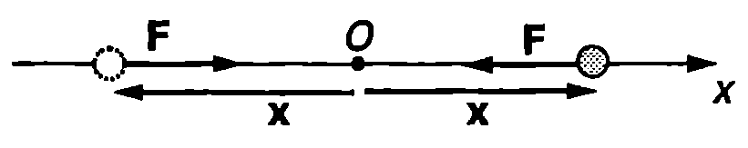
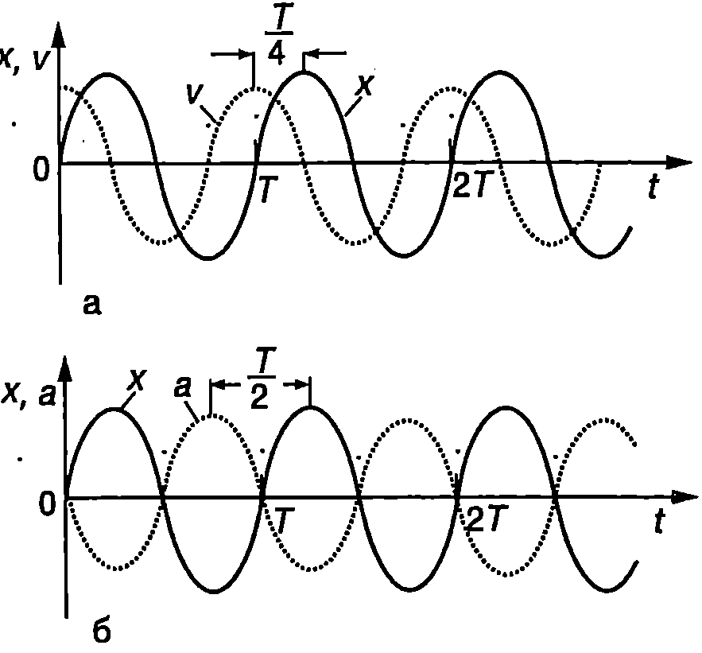
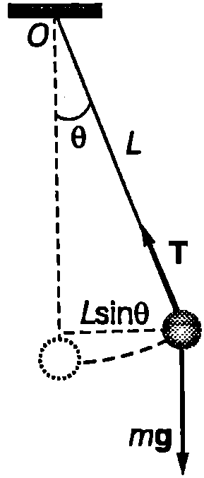
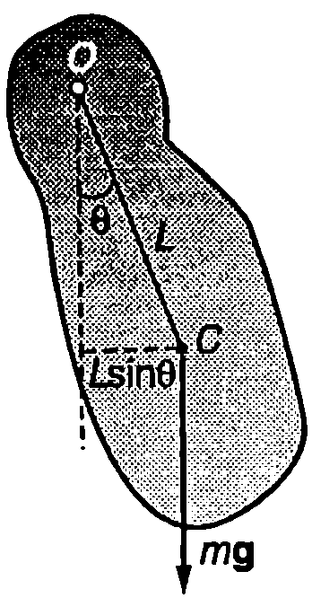

Да разгледаме материална точка (частица) с маса $m$, която може да се движи само по оста $x$. В началото $O$ на оста тя се намира в положение на устойчиво равновесие, а при отклонение от него възниква сила $\vec F$, която е правопропорционална на отклонението $\vec x$ и е насочена към равновесното положение (Фиг. \ref{fig:70.1}):
$$\vec F=-k\vec x \text{ или } F = -kx,
$$



```

```
	`Фиг. 70.1`

където $k$ е положителна константа ($k > 0$) , а $F$ и $x$ са $x$-компонентите на векторите $\vec F$ и $\vec x$. Тъй като движението се извършва само по оста $x$ и векторните величини, които го характеризират (силата $\vec F$, отклонението $\vec x$, скоростта $\vec v$ и ускорението $\vec a$), също са насочени по тази ос, по-нататък под сила $F$, отклонение $x$, скорост $v$ и ускорение $a$ ще разбираме проекциите ($x$-компонентите) на съответните векторни величини.

Силата $F$ се стреми да върне материалната точка в равновесното положение, поради което ще я наричаме *връщаща сила*. За $F$ се използва също терминът квазиеластична сила, тъй като големината и се изменя по същия закон, както на силите, възникващи при еластични деформации на твърдите тела. Представката ``квази'' показва, че по своята природа силата $F$ може и да не е свързана с еластичните свойства на телата.

Записваме уравнението на втория принцип на механиката за движението на материалната точка
$$m \frac{d^2 x}{d t^2} = -kx \text{ или } \frac{d^2 x}{d t^2} + \frac{k}{m} x = 0
$$
Полагаме $\displaystyle \frac{k}{m} = \omega_0^2$ и получаваме
$$\frac{d^2 x}{d t^2} + \omega_0^2 x = 0
$$
Уравнение \eqref{eq:70.3} е линейно диференциално уравнение от втори ред с постоянни коефициенти (вж. стр.287). Неговото решение е
$$x = A \sin(\omega_0t + \varphi_0),
$$
където $A > 0$ и $\varphi_0$ са константи, чиито стойности се определят от началните условия.

Следователно отклонението $x$ на материалната точка от равновесното и положение се изменя с времето по хармоничен (синусов) закон. Такова движение се нарича *хармонично трептене*.

Уравнение \eqref{eq:70.3} се нарича уравнение на *хармоничен осцилатор* и описва движението на механична система, извършваща хармонично трептене.

Аргументът $\varphi = \omega_0 t + \varphi_0$ на синусовата функция в уравнение \eqref{eq:70.4} се нарича *фаза на трептене*, а константата $\varphi_0$ -- начална фаза: $\varphi_0$ е фазата на трептене в момента $t = 0$, избран за начален (от който започва отчитането на времето). Уравнение \eqref{eq:70.4} се записва също така във вида
$$x = A \sin\varphi.
$$
От уравнение \eqref{eq:70.5} следва, че по абсолютна стойност отклонението е максимално при $|\sin \varphi| = 1$ Тогава ($|x|_{\max} = A$. Следователно константата А е равна на големината на максималното отклонение от равновесното положение и се нарича амплитуда на трептене.

Хармоничното трептене е периодично движение. Нека в началния момент $t = 0$ частицата се намира в равновесното си положение $x = 0$ След това тя се отклонява и достига точка $x = A$, променя посоката на движението си, преминава през точка $x = 0$ достига максималното си отклонение $x = A$ вляво (Фиг. \ref{fig:70.1}) и отново се връща в равновесното си положение. Така частицата извършва един пълен цикъл на трептене, след което движението се повтаря. Времето $T$ за извършване на един цикъл се нарича *период на трептене*. За време $T$ фазата на трептене нараства с $2\pi$ (синусът е периодична функция с период $2\pi$), т.е.
$$\omega_0(t + T) + \varphi_0 = \omega_0 t + \varphi_0 + 2\pi$$
откъдето изразяваме периода $T$:
$$T = \frac{2\pi}{\omega_0}.
$$
Величината $\omega_0$, която е свързана с периода на трептене чрез равенство \eqref{eq:70.6}, се нарича *кръгова честота на трептене*. Реципрочната стойност на периода $T$ се нарича *честота на трептене*:
$$\nu_0 = \frac{1}{T}.
$$
Честотата $\nu_0$ е равна на броя на трептенията, които се извършват за единица време, т.е. тя показва колко пъти се повтаря цикълът на трептене за една секунда. Измерва се в единици s$^{-1}$ или Hz (херц). (1 s$^{-1}$ = 1 Hz). Например честота $\nu_0 = 100$ Hz означава, че за време $t = 1$ s се извършват 100 трептения. От уравнения \eqref{eq:70.6} и \eqref{eq:70.7} определяме връзката между честотата $\nu_0$ и кръговата честота $\omega_0$
$$\omega_0 = 2\pi\nu_0.
$$

**Скорост и ускорение**

Скоростта $v$ и ускорението, а при хармоничното трептене се определят като се пресметнат първата и втората производна на отклонението $x$ по времето $t$:
$$v = \frac{dx}{dt} = \omega_0A \cos(\omega_0t + \varphi_0) = \omega_0A \sin(\omega_0t + \varphi_0 + \pi/2) ;
$$
$$a = \frac{d^2x}{dt^2} = \frac{dv}{dt} = -\omega_0^2 \sin (\omega_0 t + \varphi_0) = \omega_0^2 A \sin(\omega_0t + \varphi_0 + \pi).
$$

От уравнения \eqref{eq:70.9} и \eqref{eq:70.10} се вижда, че при хармонично трептене скоростта $v$ и ускорението $a$ се изменят по хармоничен закон със същата кръгова честота $\omega_0$ както отклонението $x$. Максималните стойности на скоростта и ускорението са
$$v_{\max} = \omega_0 A;
$$
$$a_{\max} = \omega_0^2 A.
$$



```

```
	`Фиг. 70.2`


Графично функциите $x(t)$, $v(t)$ и $a(t)$ се представят със синусоиди. Сравняването на уравнения \eqref{eq:70.4} и \eqref{eq:70.9} показва, че скоростта изпреварва по фаза отклонението с $\pi/2$. Това означава, че максимумите на скоростта настъпват с една четвърт от периода ($T/4$) по-рано от максимумите на отклонението (Фиг. \ref{fig:70.2}а). Скоростта е максимална ($v_{\max} = \omega_0 A$), когато частицата преминава през равновесното си положение ($x = 0$) и става нула ($v = 0$) при максималното отклонение ($x = \pm A$), където се променя посоката на движение.

Между ускорението $a$ и отклонението $x$ има фазова разлика $\pi$, т.е. те са в *противофаза*. Това означава, че $a$ и $x$ едновременно стават нула и едновременно достигат максималните си стойности, но винаги, когато отклонението е положителна ($x > 0$) ускорението е отрицателно ($a < 0$) и обратно (Фиг. \ref{fig:70.2}б). Следователно ускорението, подобно на връщащата сила, винаги е насочено към равновесното положение (векторите $\vec x$ и $\vec a$ имат противоположни посоки). Този извод следва непосредствено и от уравнението на втория принцип на механиката \eqref{eq:70.2}.

> [!question] Пример 70.1
Материална точка извършва хармонично трептене по закона $x = A \sin(\omega_0 t + \varphi_0)$. Определете амплитудата $A$ и $\varphi_0$ на трептене, ако в началния момент $t = 0$ отклонението е $x = x_0$, а скоростта е $v = v_0$.
\end{psexample}
> [!note]- Решение
 В уравненията за отклонението $x = A \sin(\omega_0 t + \varphi_0)$ и за скоростта $v = \omega_0 A \cos(\omega_0 t + \varphi_0)$ полагаме $t = 0$, $x = x_0$, $v = v_0$ и получаваме
$$x_0 = A \sin \varphi_0;\ v_0 = \omega_0 A \cos \varphi_0.$$
Делим почленно двете страни на тези равенства и определяме началната фаза $\varphi_0$:
$$\tan \varphi_0 =\frac{\sin \varphi_0}{\cos \varphi_0} = \frac{\omega_0 x_0}{v_0}.$$

За да определим амплитудата, представяме двете равенства във вида
$$\sin \varphi_0 = \frac{x_0}{A};\ \cos \varphi_0 = \frac{v_0}{\omega_0 A},$$
вдигаме ги на квадрат и ги събираме:
$$\sin^{2} \varphi_0 + \cos^{2} \varphi_0 = \frac{x_0^{2}}{A^{2}} + \frac{v_0^{2}}{\omega_0^{2} A^{2}} = 1,$$
откъдето определяме амплитудата
$$A = \sqrt{x_0^{2} + \frac{v_0^{2}}{\omega_0^{2}}}.$$

И така, амплитудата $A$ и началната фаза $\varphi_0$ на трептене се определят от началните условия: от положението и скоростта на материалната точка в даден момент, условно избран за начален. Освен от началните условия, техните стойности зависят и от кръговата честота $\omega_0$, т.е. от физичните свойства на трептящата система.

**Пружинно махало**

При отклонение на редица механични системи от равновесното им положение възникват връщащи сили и те извършват трептения. В най-простите случаи движението на системата е с една степен на свободаописва се само с една координата, например отклонението $x$. Обикновено само при малки отклонения трептенията са хармонични. При големи отклонения връщащите сили престават да се изменят по линеен закон и движението не се описва с уравнението \eqref{eq:70.3} на хармоничния осцилатор. Такива трептения се наричат *анхармонични*.


```

```
	`Фиг. 70.3`

Ще разгледаме някои от най-често срещаните механични системи, в които възникват хармонични трептения. Най-простият пример за такава система е *пружинното махало*: теглилка с маса $m$, закачена на вертикална пружина, чиято маса може да се пренебрегне. При деформация $x$ (разтягане или свиване) на пружината възниква сила на еластичност, която се описва от закона на Хук $F = -kx$, където $k$ е коефициентът на еластичност на пружината. Условието за равновесие на теглилката е (Фиг. \ref{fig:70.3}а): $mg = kx_0$, където $x_0$ е деформацията на пружината в равновесното положение (началото на координатната ос е поставено в центъра на теглилката при недеформирана пружина). Ако отклоним теглилката на разстояние $x$ от равновесното положение (Фиг. \ref{fig:70.3}б), пружината се разтяга още с $x$ и възниква допълнителна сила $F = -kx$, която се стреми да върне теглилката в равновесното и положение. Преместваме началото на координатната ос в равновесното положение и изключваме от разглеждане двете постоянни сили $mg$ и $-kx_0$, които се уравновесяват. Тогава уравнението за движение на теглилката получава вида
$$m \frac{d^2x}{dt^2} = -kx\text{ или }\frac{d^2x}{dt^2}+\omega_0^2x = 0,$$
където сме положили $k/m = \omega_0^2$. Отклонението $x$ на пружинното махало удовлетворява уравнението на хармоничния осцилатор \eqref{eq:70.3}, което означава, че движението на махалото е хармонично трептене с кръгова честота
$$\omega_0 = \sqrt{\frac{k}{m}}.
$$
Следователно при вертикално отклонение на теглилката от равновесното и положение възникнат хармонични трептения, чиято кръгова честота се определя от масата $m$ на теглилката и от коефициента на еластичност $k$ на пружината. В случая връщащата сила се поражда от взаимодействието на теглилката и пружината. Тя е вътрешна сила за системата теглилка пружина и по своята природа е сила на еластичност.

**Математично махало**

Топче с маса $m$ е окачено на неразтеглива нишка с дължина $L$. В случаите, когато размерите на топчето и масата на нишката могат да се пренебрегнат, системата се нарича *математично махало*. Да отклоним махалото на ъгъл $\theta$ от равновесното му положение (Фиг. \ref{fig:70.4}). На топчето действат две сили: силата на тежестта $m\vec g$ и силата на опъване на нишката $\vec T$. Записваме уравнението за въртене на топчето около ос, минаваща през точката на окачване $O$ и перпендикулярна на равнината на чертежа (вж.\ \ref{sec:15})
$$I\frac{d^2\theta}{dt^2} = -M,
$$



```

```
	`Фиг. 70.4`

където $I = mL^2$ е инерчният момент на топчето спрямо оста на въртене, а $M = mgL\sin\theta$ е въртящият момент на силата на тежестта. Силата на опъване на нишката не създава въртящ момент, защото нейното рамо е нула. Знакът минус в уравнение \eqref{eq:70.14} показва, че въртящият момент се стреми да върне махалото в равновесното му положение, т.е. когато махалото е отклонено в посока, обратна на посоката на движение на часовата стрелка, въртящият момент е по посока на часовата стрелка и обратно. След заместване на $I$ и $M$ в уравнение \eqref{eq:70.14} се получава
$$\frac{d^2\theta}{dt^2}+\frac{g}{L}\sin\theta = 0.
$$
Уравнение \eqref{eq:70.15} се различава от уравнението на хармоничния осцилатор \eqref{eq:70.3}. Ако обаче ъглите на отклонение са малки, тогава с приближение може да се запише $\sin\theta \approx 0$ (ъгълът $\theta$ се измерва в радиани!) и горното уравнение получава вида
$$\frac{d^2\theta}{dt^2}+\frac{g}{L}\theta = 0.
$$
което вече е уравнение на хармоничен осцилатор. Положителният коефициент $g/L$ пред променливата 0 (ъгъл на отклонение от равновесното положение на махалото) е равен на квадрата на кръговата честота на трептене (люлеене) на махалото: $\omega_0^2 = g/L$ или $\displaystyle \omega_0 = \sqrt{\frac{g}{L}}$. Периодът на люлеене на махалото е
$$T = \frac{2\pi}{\omega_0} = 2\pi\sqrt{\frac{L}{g}}.
$$
Следователно при малки отклонения от равновесното си положение математичното махало извършва хармонично трептене, като периодът на трептенията зависи само от дължината $L$ на махалото и от земното ускорение $g$. До този резултат пръв стига Галилей, когато е бил само на 17 години. Той измерва периода на махало като функция на дължината му $L$. Любопитно е да се отбележи, че Галилей използва пулса си, за да измери времето.

При големи амплитуди периодът на махалото е по-голям от пресметнатия по формула \eqref{eq:70.17}. Но дори при ъглова амплитуда от 30° това нарастване на периода е само около 2\%.

Периодът не зависи от масата $m$ на махалото. Например, ако наблюдаваме възрастен човек и дете, които се люлеят на еднакви люлки, ще установим, че периодите на люлеене са приблизително еднакви, независимо от голямата разлика в масите

**Физично махало**

Физично махало в всяко твърдо тяло, което може да се люлее свободно (без триене) около неподвижна ос. На Фиг. \ref{fig:70.5} оста минава през точка $O$ от тялото и е перпендикулярна на равнината на чертежа. Да означим с $I$ инерчния момент на махалото спрямо оста на въртене, с $L$- разстоянието от оста на въртене до центъра на масите $C$ и с $m$ -- масата на махалото. Аналогично на случая с математичното махало, уравнението за въртене на тялото около оста О се записва във вида
$$I \frac{d^2\theta}{dt^2} = -mgL\sin\theta.$$

При малки ъгли на отклонение $\sin\theta\approx\theta$ и се получава уравнение на хармоничен осцилатор:



```

```
	`Фиг. 70.5`

$$\frac{d^2\theta}{dt^2}+ \frac{mgL}{I} \theta = 0\text{ или }\frac{d^2\theta}{dt^2} \omega_0^2 \theta=0,$$
където $\omega_0 = \sqrt{\frac{mgL}{I}}$ е кръговата честота на трептене. Периодът на физичното махало е
$$T = \frac{2\pi}{\omega_0} = 2\pi\sqrt{\frac{I}{mgL}}.
$$
Полагаме $\displaystyle \frac{I}{mL} = L'$. Тогава периодът на физичното махало се записва по същия начин, както при математичното махало:
$$T = 2\pi\sqrt{\frac{L'}{g}}.
$$
Величината $L'$ се нарича приведена дължина на физичното махало. Тя е равна на дължината на математично махало, което има същия период, както даденото физично махало.

Зависимостта на периода на махалото от дължината му играе съществена роля при движението на хората и животните. Например човек ходи почти с опънати крака, които при движението извършват люлеене. Усилието е минимално, когато скоростта приблизително съответства на свободните люлеения на краката, разглеждани като физични махала времето за една крачка е от порядъка на полупериода на махалото. Когато искаме да увеличим скоростта, удължаваме крачката (амплитудата на люлеене), при което периодът почти не се изменя. Увеличаването на честотата на крачките изисква значителни усилия. Затова при бягане се свиват краката, което води до намаляване на приведената им дължина. Намалява и периодът на свободните люлеения на краката, което улеснява движението с по-голяма скорост (честота на крачките). Същото се отнася за ръцете, които при бягане са свити и се движат в противофаза спрямо краката.

Задачи

1. Периодите на две математични махала се отнасят както 1:3. Как се отнасят дължините им?

2. Маймунка играчка виси на ластик с коефициент на еластичност 4 N/m и трепти с период 1 s. Колко е масата на маймунката?

3. Космонавти кацат на неизвестна планета и установяват, че периодът на математично махало е два пъти по-малък, отколкото на Земята. Сравнете ускорението $g_\text{п}$ на свободно падане на повърхността на планетата със земното ускорение $g$.

4. Пружинно махало трепти с период $T$ и амплитуда $A$. Определете: а) максималното ускорение $a_m$; б) максималната скорост $v_m$ на махалото.

5. Да приемем, че движението на човешкото сърце е хармонично трептене с амплитуда $A = 3$ mm. Колко са максималната скорост и ускорение на сърцето при пулс 80 (сърцето извършва 80 трептения за една минута)?

6. Тяло в закачено на идеална пружина (пренебрегва се масата на пружината, законът на Хук в в сила при произволна деформация на пружината) и извършва хармонично трептене с период $T$. Отрязват половината от пружината, т.е. намаляват дължината и 2 пъти, и закачат към нея същото тяло. Колко е периодът на това махало?

7. Еднородна пръчка с маса $m$ и дължина $L$ може да се люлее около хоризонтална ос, минаваща през единия й край. Определете периода на това физично махало.

8. Еднороден диск с маса $m$ и радиус $R$ може да се люлее като физично махало около хоризонтална ос, която е перпендикулярна на равнината на диска и го пробожда на разстояние $L = R/2$ от центъра му. Определете периода $T$ на махалото.
