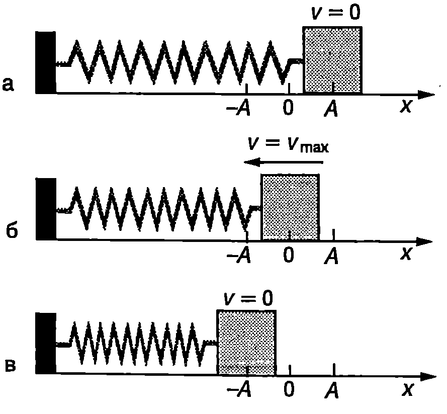
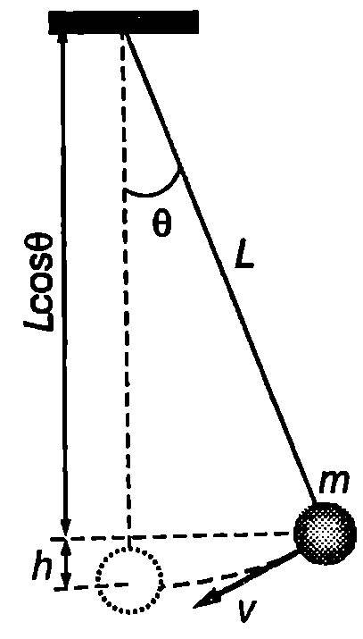

Ще разгледаме проста трептяща система, подобна на пружинното махало, съставена от тяло (трупче) с маса $m$ и лека пружина с коефициент на еластичност к (Фиг. \ref{fig:71.1}). Тялото е поставено върху гладка хоризонтална равнина, по която може да се хлъзга без триене. Тази система е проста за анализ от пружинното махало, защото: 1. в равновесното положение пружината не е деформирана; 2. гравитационната потенциална енергия не се изменя по време на движението. Ако отклоним тялото на разстояние $x_{\max} = A$ от равновесното му положение и го освободим, то ще извършва хармонично трептене с кръгова честота $\displaystyle \omega_0 = \sqrt{\frac{k}{m}}$ и амплитуда $A$.

Енергията $E$ на трептящата система тяло-пружина в произволен момент от време $t$ е сума от кинетичната енергия $E_k = m v^2/2$ на тялото и потенциалната енергия $W = kx^2/2$ на деформираната пружина (вж. пример 71.1):
$$E = \frac{mv^2}{2} + \frac{kx^2}{2},
$$
където $v$ и $x$ са скоростта и отклонението в момента 1. Когато тялото преминава през равновесното си положение ($x = 0$) пружината не е деформирана, потенциалната енергия е равна на нула, а скоростта е



```

```
	`Фиг. 71.1`


максимална: $v = v_{\max} = A\omega_0$ (Фиг. \ref{fig:71.1}б). Следователно в този момент системата има само кинетична енергия:
$$E=E_k= \frac{mv^2_{\max}}2 = \frac{1}{2} mA^2\omega_0^2$$

При максималното отклонение $|x_{\max}| = A$ (Фиг. \ref{fig:71.1}а,в), тялото е в покой -- кинетичната енергия е нула, а потенциалната енергия е максимална:
$$E = W = \frac{k A^2}2 = \frac{1}{2} m A^2 \omega_0^2,$$
където е отчетено, че $\displaystyle\omega_0^2 = \frac{k}{m}$.
Следователно в процеса на трептене става непрекъснато превръщане на кинетичната енергия в потенциална енергия и обратно, при което механичната енергия
$$E = \frac{mv^2}{2} + \frac{kx^2}{2} = \frac{1}{2}mA^2 \omega_0^2
$$
на трептящата система се запазва.

> [!question] Пример 71.1
Потенциална енергия на деформирана пружина. Определете потенциалната енергия на деформирана пружина, за която е в сила законът на Хук $F_e = kx$, където $F$ е силата на еластичност, възникваща при деформация $x$ на пружината, а $k$ е коефициентът на еластичност на пружината.
\end{psexample}
> [!note]- Решение
 Да започнем бавно да разтягаме пружината. За да се движи свободният й край без ускорение, приложената към него сила $F$ трябва да е равна по големина и противоположна по посока на силата на еластичност $F_e$ с която пружината се противопоставя на деформацията: $F = -F_e = kx$.

Елементарната работа на силата $F$ e $dA = Fdx = kxdx$. Работата на външната сила за разтягане на пружината от $x = 0$ до $x$ е
$$A= \int_0^x kxdx= \frac{kx^2}{2}$$

Потенциалната енергия на пружината е равна на работата, която извършва външната сила за деформирането на пружината:
$$W = A = \frac{k x^2}2.$$

> [!question] Пример 71.2
Проследете изменението на енергията на математично махало. Получете уравнение за пълната механична енергия на махалото при малки амплитуди на люлеене, подобно на уравнение \eqref{eq:71.1}. Използвайте аналогията между двете уравнения, за да определите кръговата честота на математичното махало.
\end{psexample}
> [!note]- Решение
 Ще отчитаме гравитационната потенциална енергия на махалото от неговото равновесно положение. Когато махалото се намира в крайно ляво (дясно) положение, кинетичната му енергия е нула ($v = 0$) а потенциалната енергия е максимална. При спускане към равновесното положение скоростта нараства расте и кинетичната енергия, а потенциалната енергия намалява. През равновесното си положение махалото преминава с максимална скорост и кинетична енергия. Нека в даден момент махалото се намира на височина $h$ над равновесното си положение и се движи със скорост $v$ (Фиг. \ref{fig:71.2}). Механичната енергия на махалото е



```

```
	`Фиг. 71.2`


$$E = \frac{m v^2}2 + mgh.$$
Изразяваме височината $h$ чрез ъгъла на отклонение е на махалото от равновесното му положение (Фиг. \ref{fig:71.2}):
$$h = L - L \cos \theta = 2L \sin^2 \left(\frac{\theta}{2}\right),$$
където сме използвали тригонометричното тъждество $1 - \cos \theta = 2\sin^2 (\theta/2)$ При малки ъгли на отклонение Тогава за гравитационната потенциална енергия се получава
$$W = mgh = \frac{1}{2} mgl \theta^2$$

Представяме скоростта $v$ чрез ъгловата скорост $\omega = d\theta/dt $
$$v = \omega L = \frac{d\theta}{dt} L.$$
След заместване на $v$ и $mgh$ за механичната енергия на махалото се получава
$$E = \frac{1}{2} m L^2 \left(\frac{d\theta}{dt}\right)^2 + \frac{1}{2} mgL \theta^2.
$$
Сравняването на уравнения \eqref{eq:71.1} и \eqref{eq:71.3} показва, че и в двата случая потенциалната енергия е правопропорционална на квадрата на координатата, с която се описва движението на системата (отклонението $x$ или ъгъла на завъртане $\theta$). Кинетичната енергия е правопропорционална на квадрата на първата производна на тази координата. Квадратът на кръговата честота е равен на отношението на двата коефициента на пропорционалност. За пружинно махало $\displaystyle\omega_0^2 = \frac{k}{m}$, а за математично махало $\displaystyle\omega_0^2 = \frac{mgL}{m L^2} = \frac{g}{L}$.

Този резултат се обобщава за всяка трептяща система с една степен на свобода. За определяне на кръговата честота се използват два метода:

1. **Динамичен метод.** Отклонява се системата от равновесие и се записва уравнението на движение. Ако то има вида \eqref{eq:70.3}, движението е хармонично трептене, квадратът на кръгова честота на което е равен на положителния коефициент пред функцията $x(t)$ (или $\theta(t)$) в уравнението на хармоничния осцилатор.

2. **Енергетичен метод.** Определят се кинетичната енергия и потенциалната енергия в произволен момент от времето. Ако потенциалната енергия е правопропорционална на квадрата на координатата, описваща движението, а кинетичната енергия на квадрата на нейната първа производна по времето, тогава движението е хармонично трептене. Квадратът на кръговата честота е равен на отношението на коефициента в израза за потенциалната енергия към коефициента в израза за кинетичната енергия.

**Задачи**

1. Трупчето от Фиг. \ref{fig:71.1} извършва хармонично трептене с амплитуда $A = 0,\!05$ m. Масата на трупчето е $m = 0,\!02$ kg, а коефициентът на еластичност на пружината е $k = 200$ N/m.

a) Изразете скоростта $v$ на трупчето като функция на отклонението $x$.

б) Определете максималната скорост на трупчето и скоростта му при $x = 3$ cm.

2. Трупчето от Фиг. \ref{fig:71.1} извършва хармонично трептене с механична енергия 1 J. Колко е кинетичната енергия на трупчето при отклонение $x = A/2$ ($A$ - амплитуда на трептенето)?

3. Като използвате енергетичния метод, определете кръговата честота на физично махало (Фиг. \ref{fig:70.5}).
