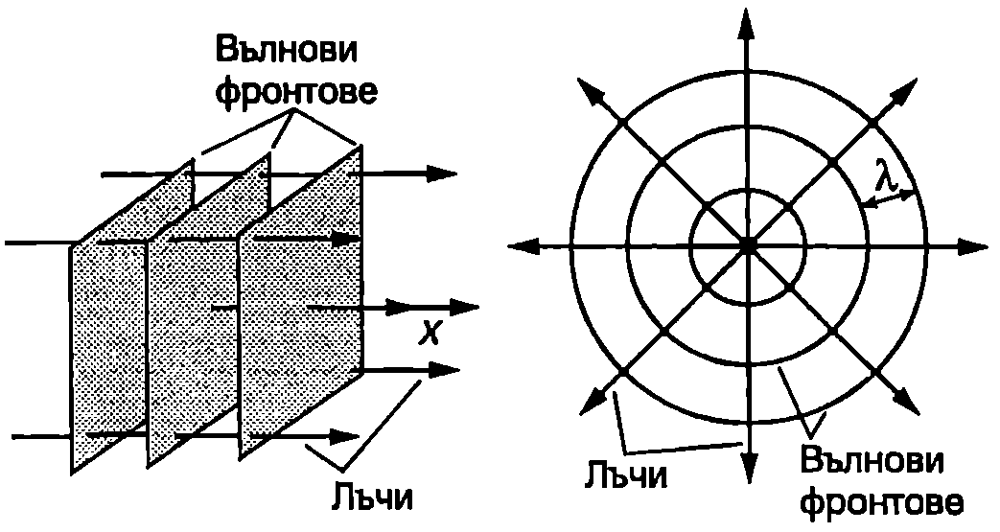
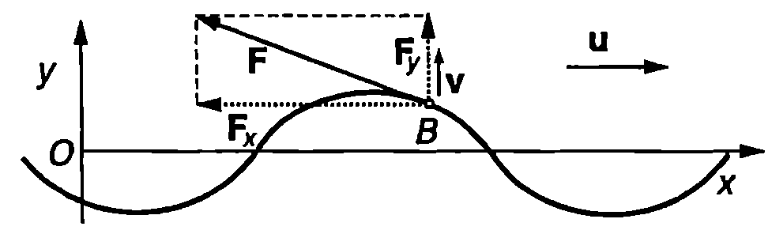

**Плоски вълни и сферични вълни**

При разпространение на хармонична вълна по опъната струна всички точки от струната трептят с различни фази. Такава вълна се нарича *едномерна вълна*. Тя се разпространява по оста $x$ и частиците, до които достига, започват да трептят последователно една след друга. Когато вълните се разпространяват в пространството (тримерни вълни), във всеки момент голям брой точки трептят с еднакви фази. Геометричното място на точките, трептящи с еднакви фази, е повърхност, която се нарича *вълнова повърхност* или *вълнов фронт*. Прието е графично да се представят вълновите фронтове, които показват положението на гребените на вълната в даден момент. Разстоянието между два такива съседни вълнови фронта е равно на дължината на вълната 2. Вълновите фронтове се преместват в средата със скоростта на вълната $u$, която се нарича *фазова скорост*. Линиите, перпендикулярни на вълновите фронтове, се наричат *лъчи*. Те показват посоката, в която се пренася енергия от вълните. В еднородна среда лъчите са прави линии.

Вълновите фронтове на *плоските вълни* са успоредни равнини. Техните лъчи са успоредни прави (Фиг. \ref{fig:76.1}а). Избираме ос $x$, насочена по посоката на разпространение на плоската вълна. Уравнението на хармонична плоска вълна има същия вид, както уравнението на хармонична вълна по опъната струна \eqref{eq:75.7}:
$$y(x, t) = A \sin(\omega t - kx).
$$



```
а) Плоска вълна; б) сферична вълна.
```
	`Фиг. 76.1`


С уравнение \eqref{eq:76.1} могат да се представят както надлъжните, така и напречните плоски хармонични вълни. За надлъжните вълни отклонението $y$ е в направление на оста $x$. При напречните вълни частиците трептят в равнина, перпендикулярна на оста $x$. Когато трептенето се извършва в точно определено направление, което не се изменя с течение на времето, вълната се нарича *линейно поляризирана*. Тогава това направление се избира за ос $y$ на правоъгълна координатна система и линейно поляризираната вълна се изразява с уравнение \eqref{eq:76.1}. В общия случай направлението, в което трептят частиците, може да се изменя с течение на времето, оставайки винаги перпендикулярно на посоката на разпространение на вълната. Доказва се, че такива напречни вълни могат да се представят като суперпозиция от две линейно поляризирани във взаимно перпендикулярни направления вълни. В този параграф ще се ограничим с разглеждането само на надлъжни вълни и линейно поляризирани напречни плоски хармонични вълни, които се описват с уравнението \eqref{eq:76.1}.

Вълните, чиито вълнови фронтове са сфери, се наричат *сферични вълни*. Лъчите на разходящите сферични вълни излизат радиално от общия център на концентричните сферични вълнови фронтове, където е разположен източникът на вълните (Фиг. \ref{fig:76.1}б).

**Плътност на енергията**

При разпространение на вълна еластичната среда се деформира и притежава потенциална енергия на еластичните деформации $W_n$ Освен това частиците на средата извършват движение (трептене), на което съответства кинетична енергия $W_k$ Величините обемна плътност на кинетичната енергия $w_k$ и обемна плътност на потенциалната енергия $w_n$ на механичната вълна в произволна точка $M$ от средата се дефинират чрез уравненията
$$w_k = \frac{dW_k}{dV};\quad w_n = \frac{dW_n}{dV},
$$
където $d'W$ и $d'W$, са съответно кинетичната и потенциалната енергия в безкрайно малък обем $dV$ на средата, в който се намира точка $M$. Величината
$$w = w_k+w_n,
$$
се нарича *обемна плътност на енергията* на механичната вълна.

Ако в даден момент частиците се движат със скорост $v$, обемната плътност на кинетичната енергия е
$$w_k = \frac{1}{2}\rho v^2,
$$
където $\rho$ е механичната плътност на средата. Доказва се, че за плоска хармонична вълна $w_n = w_k$. Скоростта на частиците е равна на първата производна на отклонението $y$ по времето. От уравнение \eqref{eq:76.1} получаваме
$$v(x,t) =\frac{\partial y (x,t)}{\partial t} = \omega A \cos(\omega t-kx).
$$
Заместваме ги и от уравнения \eqref{eq:76.5} и \eqref{eq:76.4} в \eqref{eq:76.3} и като отчетем, че $w_n = w_k$, определяме обемната плътност на енергията на плоска хармонична вълна
$$\omega=2\omega_k = \rho v^2 = \rho\omega^2 A^2\cos^2(\omega t-kx).
$$
Следователно обемната плътност на енергията на вълната $w$ се изменя периодично от $w_{\min} = 0$ до $w_{\max} = \rho\omega^2A^2$. Нейната средна стойност е
$$\bar w = \frac{1}{2}\rho \omega^2 A^2.
$$
Уравнение \eqref{eq:76.7} изразява средната плътност на енергията на плоска хармонична вълна. При разпространение на вълните става непрекъснато предаване на енергия от източника на заобикалящи те го части от средата, които от своя страна предават енергия на по-отдалечените области и т.н. Скоростта, с която се преместват в пространството повърхностите, съответстващи на максимална плътност на енергията, се нарича скорост на пренасяне на енергията или *групова скорост на вълната*. За хармоничните вълни груповата скорост съвпада с фазовата скорост, поради което ще използваме само термина скорост на вълната. При по-сложни вълнови образования обаче, които могат да се разглеждат като суперпозиция от хармонични вълни с различни честоти, в зависимост от честотата вълните може да имат различна фазова скорост. Тогава груповата скорост на резултантната вълна е различна от фазовите скорости на съставящите я хармонични вълни.

**Интензитет на вълните**

Да разгледаме малък плосък елемент с площ $dS$, разположен перпендикулярно на посоката на разпространение на плоска хармонична вълна със скорост $u$ (Фиг. \ref{fig:76.2}). За интервал от време от вълната пренася през елемента $dS$ енергия $dW$, равна на енергията на вълната в паралелепипед с обем $(udt)dS$:
$$dW = wudtdS.$$

Енергията, пренесена от вълната за единица време, е
$$d\Phi = \frac{dW}{dt} = wudS
$$
Величината $d\Phi$ се нарича поток на енергията през елемента $dS$. Потокът на енергията $d\Phi$ се изменя с времето по същия периодичен закон \eqref{eq:76.6}, както обемната плътност на енергията $w$. Неговата средна стойност
$$d\bar \Phi = \bar wudS
$$
се нарича среден поток на енергията през елемента $dS$. Величината
$$I = \frac{d\bar \Phi}{dS} = \bar wu
$$
се нарича *интензитет на вълната*. Интензитетът на вълната е равен на средната енергия, която се пренася от вълната за единица време (15) през плоска повърхност с площ 1 m$^2$, разположена перпендикулярно на посоката на разпространение на вълната. Измерва се в единици


```

```
	`Фиг. 76.2`

$$\mathrm{\frac{J}{m^2\cdot s} = \frac{W}{m^2}}$$
(ват на квадратен метър). За плоска хармонична вълна от уравнения \eqref{eq:76.7} и \eqref{eq:76.10} се получава
\eqref{eq:76.11}
$$I = \frac{1}{2} \rho u \omega^2 A^2.
$$
Следователно интензитетът е правопропорционален на квадрата на амплитудата на вълната ($I\propto A^2$).

> [!question] Пример 76.1
По дълга опъната струна се разпространява бягаща хармонична вълна $y = A \sin(\omega t - kx)$. Силата на опъване на струната е $T_0$, масата на единица дължина от струната е $\delta_0$. Определете механичната мощност $P$, пренасяна от вълната.
\end{psexample}
> [!note]- Решение
 Разглеждаме движението на произволна точка $B$ от струната с координата $x$. Да означим с $\vec v$ скоростта на точка $B$, а с $\vec F$ -- силата, с която частта от струната, разположена вляво от точка $B$, действа на частта от струната, намираща се вдясно от точка $B$ (Фиг. \ref{fig:76.3}). Мощността $P$, която лявата част от струната предава на дясната част, е $P = \vec F \cdot \vec v = F_y v.$ Изразяваме компонентата $F_y$ на силата чрез полученото в пример 75.1 (на стр. 139) съотношение $\displaystyle F_y = \frac{v}{u}T_0$ и получаваме
$$P = \frac{T_0}{u} v^2 = \frac{T_0}{\delta_0}\frac{\delta_0}{u} v^2 = u \delta_0 v^2,$$



```

```
	`Фиг. 76.3`


където сме използвали формулата $\displaystyle u = \sqrt{T_0/\delta_0}$ за скоростта на вълната. Скоростта на точка $B$ е
$$v = \frac{\partial y}{\partial t} = \omega A \cos(\omega t - kx).$$

Заместваме скоростта във формулата за мощността:
$$P = u\delta_0 \omega^2 A^2 \cos^2(\omega t - kx).$$

Средната мощност, която се пренася от вълната, е
$$\overline{P} = \frac{1}{2} u\delta_0 \omega^2 A^2.$$

**Интензитет и амплитуда на сферична вълна**

При плоските вълни за еднакви интервали от време във вълновото движение се въвличат равни по големина обеми от средата. Затова амплитудата и интензитетът на плоските вълни навсякъде са еднакви. За сферичните вълни обемът на средата, обхванат за единица време от вълната, непрекъснато нараства, когато вълната се отдалечава от източника. Тъй като източникът има постоянна мощност, т.е. за единица време предава постоянна по големина енергия на средата, от закона за запазване на енергията следва, че интензитетът и амплитудата на вълната намаляват при отдалечаване от източника на сферични вълни. Да разгледаме две концентрични сферични повърхности с радиуси $r_0$ и $r$, в центъра на които се намира точковият източник $S$. Поради сферичната симетрия интензитетът $I(r)$ може да зависи само от разстоянието $r$ до източника. Средният поток на енергията през двете повърхности е равен на произведението от площта на сферите и интензитета $I$ на вълната:
$$\Phi_0 = 4\pi r_0^2 I(r_0); \Phi = 4\pi r^2 I(r)$$
Когато вълните не се поглъщат от среда та, от закона за запазване на енергията следва, че двата потока са равни, откъдето
$$I(r) =\frac{r_0^2 I(r_0)}{r^2} = \frac{C}{r^2}.
$$
Следователно интензитетът на сферичната вълна намалява обратно пропорционално на квадрата на разстоянието $r$ до източника. Константата $C = r_0^2 I(r_0)$ може да се определи, като се измери интензитетът на вълната на някакво разстояние $r_0$ (например 1 m) от източника. Тъй като $I\propto A^2$, амплитудата $A$ на сферичната вълна намалява обратно пропорционално на разстоянието $r$ до източника:
$$A(r) =\frac{C_1}{r},
$$
където константата $C_1 = r_0 A(r_0)$ може да се определи, ако е известна амплитудата на вълната на някакво разстояние $r_0$ от източника.
