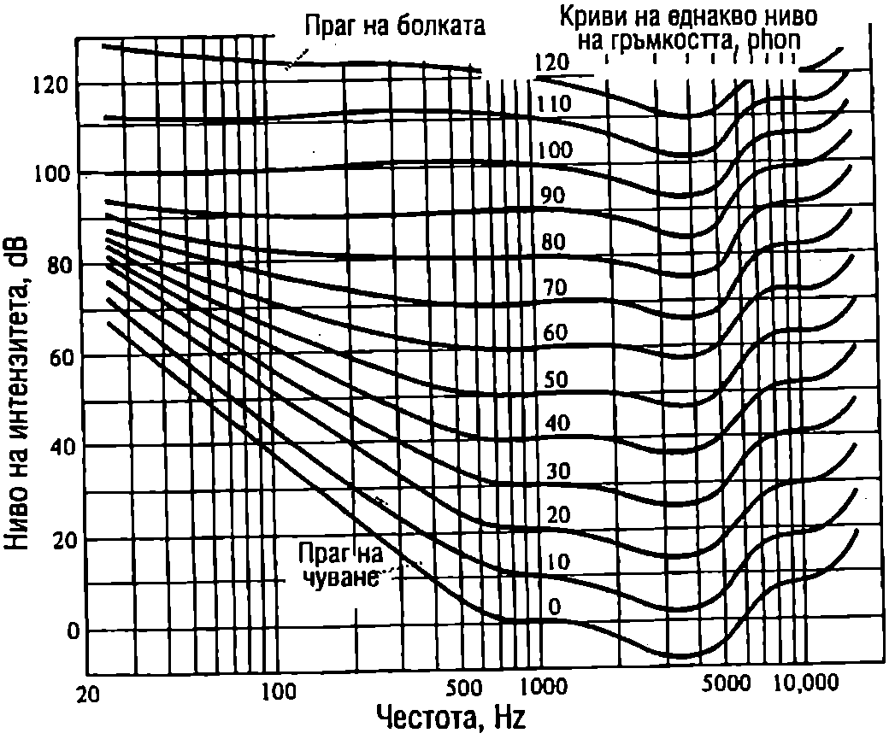

Човешкото ухо възприема като звук механичните вълни, чиято честота лежи в интервала от 16 Hz до 20 000 Hz, наречен *диапазон на чуване*. В зависимост от индивидуалните особености на човека се наблюдават различни отклонения от диапазона на чуване, който е определен за едно средностатистическо или стандартно ухо. Обща тенденция е с напредване на възрастта хората все по-трудно да чуват високите честоти.

Звукови вълни се разпространяват в газове, течности и твърди тела. В този и в следващия параграф обаче ще се ограничим с разглеждането само на звукови вълни в газове, тъй като те се използват от хората и повечето животни на сушата за обмен на информация. Освен това чрез възприемането на звуковите сигнали, разпространяващи се във въздуха, животните и хората реагират на източника на звука, могат да определят неговото положение и да вземат предпазни мерки, ако той представлява заплаха за тях.

**Скорост на звука в газове**

При разпространение на звукова вълна в газ се извършват еластични деформации на свиване и разширяване на газа, които се характеризират с модула на обемна еластичност $K$ (вж. част 1, стр.116,~\ref{sec:21}):
$$dp=-K\frac{dV}{V},
$$
където $dp$ е изменението на налягането, породено от изменението $dV$ на обема, $dV/V$ е относителното изменение на обема. Знакът минус показва, че когато обемът намалява ($dV < 0$), налягането нараства ($dp > 0$) и обратно. Еластичният модул $K$ зависи от вида на термодинамичния процес, който протича при свиване и разширяване на газа. Възможни са два гранични случая. Първият е, когато налягането се изменя много бавно. Тогава областите от газа, които се свиват, предават топлина на съседните области, които се разширяват. Така в резултат на топлообмена температурата на газа се поддържа постоянна и процесите са изотермни. Поради ниската топлопроводност на газовете обаче, топлообменът при тях се извършва бавно. Скоростта, с която се изменя налягането за механичните вълни от диапазона на чуване, е много по-голяма от скоростта на топлообмен. Затова между съседните области на свиване и разширяване на газа практически няма топлообмен и се реализира вторият граничен случай, когато процесите са адиабатни. При разпространение на звукова вълна се извършва адиабатно свиване и разширяване на газа. От уравнението на адиабатния процес с идеален газ (вж. част 1, уравнение \eqref{eq:31.13} на стр.172)
$$\gamma pdV + Vdp = 0$$
и уравнение \eqref{eq:78.1} определяме модула на обемна еластичност $K$:
$$K = \gamma p
$$
където $\gamma$ е коефициентът на Поасон, а $p$-налягането на газа.

Скоростта $u$ на звука се изразява с формула \eqref{eq:75.8} от стр.138, където за механични вълни в газ еластичните свойства на средата се характеризират с модула на обемна еластичност $K$, а инертността -- с плътността $\rho$ на газа:
$$u = \sqrt{\frac{K}{\rho}} = \sqrt{\frac{\gamma p}{\rho}}
$$
Това уравнение е получено за пръв път от Лаплас и е известно като формула на Лаплас за скоростта на звука в газове.

> [!question] Пример 78.1
Пресметнете скоростта на звука във въздуха при температура 27 °C. Въздухът да се разглежда като идеален газ с моларна маса $M = 0,\!029$ kg/mol и коефициент на Поасон $\gamma = 1,\!4$.
\end{psexample}
> [!note]- Решение
 От уравнението за състоянието на
идеалния газ $pV = \frac{m}{M}RT$ изразяваме налягането $p = \frac{\rho}{M} RT$, където $\rho = m/V$ е плътността на въздуха, и го заместваме в уравнение \eqref{eq:78.3}:
$$u = \frac{\gamma RT}{M} = \frac{1,\!4(8,\!3~\mathrm{J/(mol\cdot K})) (300~\mathrm{K})}{0,\!029~\mathrm{kg/mol}} = 347~\mathrm{\frac{m}{s}}$$
Полученият резултат показва, че скоростта на звука нараства при повишаване на температурата $T$ на въздуха.

**Звуково налягане**

Газовете винаги се намират при определено налягане. Например за въздуха това е атмосферното налягане $p_0 \approx 10^5$ Pa. *Звуково налягане* $p_\text{зв}$ се нарича само допълнителното налягане, което възниква при разпространение на звукова вълна, т.е. звуковото налягане е равно на изменението $dp$ на налягането на газа, предизвикано от звуковата вълна. Във формула \eqref{eq:78.1} полагаме $dp = p_\text{зв}$ и получаваме
$$p_\text{зв} = -K\frac{dV}{V} = -\rho u^2\frac{dV}{V},
$$
където сме заместили еластичния модул $K$ от формула \eqref{eq:78.3} за скоростта на звука.

За да определим отношението $dV/V$, ще разгледаме следния модел: газ запълва обема на дълъг цилиндър с подвижно бутало с площ 5 (Фиг. \ref{fig:78.1}). В даден момент буталото започва да се движи със скорост $v$. За малък интервал от време $dt$ то се придвижва на разстояние $vdtu$ обемът на газа се изменя с $dV = -Svdt$. Знакът минус показва, че обемът на газа намалява. Деформацията на свиване на газа се разпространява със скоростта на звука $u$ и за време $dt$ обхваща обем $V = Sudt$. Относителното изменение на този обем в резултат на свиването е
$$\frac{dV}{V}=-\frac{Svdt}{Sudt}=-\frac{v}{u}.
$$
Съотношението \eqref{eq:78.5} остава в сила и в общия случай на разпространение на звукови вълни. То изразява връзката между скоростта $v$ на частиците от дадена област, скоростта $u$ на звука и относителното изменение на обема ($dV/V$ на тази област. Заместваме $dV/V$ от уравнение \eqref{eq:78.5} в \eqref{eq:78.4} и за звуковото налягане получаваме
$$p_\text{зв} =\rho uv.
$$


```

```
	`Фиг. 78.1`


За плоска хармонична звукова вълна скоростта $v$ на частиците е
$$v = \frac{\partial y(x,t)}{\partial t} = \omega A \cos(\omega t - kx) = \omega A \sin(\omega t - kx + \frac{\pi}{2}).$$
Налягането на звука е
$$p_\text{зв} =\rho uv = \rho u\omega A\sin(\omega t-kx+\frac{\pi}{2}).
$$
Най-често звуковите вълни се описват чрез отклонението на частиците от равновесните им положения (вълна на отклонението) или чрез звуковото налягане (вълна на налягането). За плоска хармонична звукова вълна отклонението $y(x,t)$ и звуковото налягане $p_\text{зв}(x,t)$ се изменят по синусовите закони \eqref{eq:76.1} и \eqref{eq:78.7}. Както при хармоничното трептене, където скоростта изпреварва по фаза отклонението с $\pi/2$, звуковото налягане също изпреварва по фаза отклонението с $\pi/2$. Това означава, че във всяка точка максимумите на звуковото налягане настъпват с 1/4 от периода по-рано от максимумите на отклонението.

От уравнение \eqref{eq:78.7} следва, че максималната стойност (амплитудата) на звуковото налягане е
$$p_{\text{зв}}^{\max} =\rho u\omega A.
$$
За да получим връзката между амплитудата на звуковото налягане и интензитета $I = \frac{1}{2} \rho u \omega^2 A^2$ на звука (вж. формула \eqref{eq:76.11}), вдигаме на квадрат двете страни на уравнение \eqref{eq:78.8}:
$$(p_{\text{зв}}^{\max})^2 = 2\rho u\left(\frac{\rho u \omega^2 A^2}{2}\right) = 2\rho ul.
$$
Следователно интензитетът на звука е правопропорционален на квадрата на амплитудата на звуковото налягане:
$$I = \frac{1}{2\rho u}(p_{\text{зв}}^{\max})^2.
$$
> [!question] Пример 78.2
Звук с честота 1000 Hz и интензитет 1 W/m$^2$ предизвиква болезнено усещане в човешкото ухо. Пресметнете максималното налягане на звука и го сравнете с хидростатичното налягане на дълбочина $h = 5$ m под водата. При гмуркане на такава дълбочина също се появяват болки в ушите. Имат ли двете усещания за болка една и съща природа?

Плътността на въздуха е $\rho = 1, 2~\mathrm{kg/(m^3)}$ плътността на водата е $\rho_\text{в} = 1000~\mathrm{kg/(m^3)}$ скоростта на звука във въздуха e $u = 340~\mathrm{m/s}$.
\end{psexample}
> [!note]- Решение
 От уравнение \eqref{eq:78.9} определяме максималното звуково налягане
$$p_\text{зв}^{\max} = \sqrt{2\rho ul} = 30~\mathrm{Pa}$$
Хидростатичното налягане е
$$p_x = \rho gh = 50\ 000~\mathrm{Pa} = p_0/2,$$
където $p_0$ е атмосферното налягане. Полученият резултат показва, че амплитудата на звуковото налягане е повече от 1000 пъти по-малка от хидростатичното налягане. Следователно двете усещания за болка имат различна природа. Тъпанчето на ухо е в състояние да понесе значително постоянно допълнително налягане, докато променливо налягане със сравнително малка амплитуда води до болезнени усещания и може да предизвика увреждане на слуха.

**Ниво на интензитета и ниво на гръмкостта**

Човешкото ухо е чувствително към звукови вълни, чийто интензитет може да се изменя в много широки граници. Например хармонична звукова вълна с честота 1000 Hz се възприема от стандартното ухо като звук, ако интензитетът й е в интервала от $I_0 = 10^{- 12}~\mathrm{W/m^2}$ до $I_{\max} = 1~\mathrm{W/m^2}$. Интензитетът $I_0$ определя долния праг на чуване. Ухото не е чувствително към звукове с по-малък интензитет. Горната граница $I_{\max}$ се нарича праг на болката или горен праг на чуване. Ако интензитетът на вълната е по-голям от $I_{\max}$, усещането за звук преминава в усещане за болка. Величината
$$\beta = 10\lg \frac{I}{I_0}
$$
се нарича ниво на интензитета. Измерва се в децибели (dB). Звук с интензитет $I = 10I_0$ има ниво на интензитета $\beta = 10$ dB. Ако интензитетът на звука нарасне 10 пъти, нивото на интензитета се увеличава с 10 dB. Когато $I$ нарасне 100 пъти, в се увеличава с 20 dB, при нарастване на $I$ 1000 пъти, $\beta$ се увеличава с 30 dB и т.н. На
прага на болката $I_{\max} = 10^{12} I_0$ съответства ниво на интензитета $\beta_{\max} = 120$ dB.

Ще отбележим, че една от причините да се използва логаритмична скала за сравняване интензитетите на звуковете е огромният обхват на ухото то долавя звукове, чиито, интензитети могат да се различават $10^{12}$ пъти. Другата причина е свързана с начина на възприемане на звука. Ако интензитетът на звука при дадена честота (за стандартна се приема честотата 1000 Hz) расте в геометрична прогресия, усещането за сила на звука расте в аритметична прогресия. Такава връзка между силата на усещането и силата на дразненето съществува и при други сетивни органи. Във физиологията тя е известна като психофизичен закон на Вебер Фехнер и се изразява със зависимости, подобни на уравнение \eqref{eq:78.11}.

В табл. 78.1. са представени стойности за нивото на интензитета на някои характерни звукове от всекидневието.

Ще подчертаем, че величината ниво на интензитета е еднозначно свързана с интензитета на звука чрез уравнение \eqref{eq:78.11} и не зависи от това как ухото възприема звука. Единствената връзка с възприемането на звука е константата, която е подбрана да съответства на прага на чуване за стандартното ухо при честота 1000 Hz. Същата стойност на $I_0$ обаче се използва и при пресмятане нивото на интензитета за произволна честота на звука, за която постоянният интензитет $I_0$ вече не съответства на прага на чуване.


\begin{table}

	\begin{tabular}{cc}
	Източник& Ниво на интензитета (dB) \\
	Голям оркестър (максимум) & 100\\
	Тъпан (максимум) & 95\\
	Тромпет (максимум) & 75\\
	Оживена улица & 70\\
	Кларнет (максимум) & 67\\
	Обикновен разговор & 65\\
	Тиха музика & 40\\
	Шепот & 20\\
	\end{tabular}
```
Ниво на интензитета на звука от някои характерни източници.
```
	\label{tab:78.1}
\end{table}

Субективната преценка на ухото за сила на звука, т.е. способността му да различава и сравнява звуковете по това колко тихи или гръмки са те, се характеризира с величината *ниво на гръмкостта*. За хармоничните звукови вълни нивото на гръмкостта зависи не само от интензитета, но и от честотата на звука. Единицата за ниво на гръмкостта се нарича *фон* (phon). По определение нивото на гръмкостта на звук с честота 1000 Hz, измерено във фонове, е числено равно на нивото на интензитета на същия звук, измерено в децибели. Например на ниво на интензитета 10 dB при честота 1000 Hz съответства ниво на гръмкостта 10 phon. За звук с честота, към която ухото е по-чувствително, отколкото към 1000 Hz, нивото на гръмкостта във фонове е по-високо от нивото на интензитета в децибели. Обратно, за честоти, към които ухото е по-слабо чувствително, нивото на гръмкостта е по-ниско от нивото на интензитета.

На Фиг. \ref{fig:78.2} са показани приетите като международен стандарт криви на еднакво ниво на гръмкостта за хармонични звукове. С тяхна помощ се определя нивото на гръмкостта, ако са известни честотата и нивото на интензитета. Най-долната крива, съответстваща на ниво на гръмкостта 0 phon, изразява зависимостта на долния праг на чуване от честотата. Прави впечатление, че зависимостта на чувствителността на ухото от честотата е най-силно изразена при слабите звукове. За звукове с ниво на интензитета, близко до прага на болката, честотната зависимост на усещането за сила на звука е значително по-слаба.



```

```
	`Фиг. 78.2`


> [!question] Пример 78.3
Честотата на хармонична звукова вълна се изменя от 20 Hz до 10 000 Hz при постоянно ниво на интензитета 40 dB. Като използвате кривите на еднакво ниво на гръмкост та от Фиг. \ref{fig:78.2}, определете кои честоти ще чува едно стандартно ухо. Как ще се изменя нивото на гръмкостта?
\end{psexample}
> [!note]- Решение
 От Фиг. \ref{fig:78.2} определяме, че звук с честота 90 Hz и ниво на интензитета 40 dB се намира на прага на чуване, т.е. неговото ниво на гръмкостта е 0 phon. Звуковете с честоти от 20 Hz до 90 Hz се намират под прага на чуване и не се долавят от ухото. При увеличаване на честотата над 90 Hz нивото на гръмкостта расте. То е 10 phon при $\nu = 110$ Hz и 20 phon при $\nu = 200$ Hz. При честота 1000 Hz по определение нивото на гръмкостта във фонове съвпада с нивото на интензитета в децибели, т.е. в случая то е 40 phon. В областта от 1000 Hz до 5000 Hz, където ухото е най-чувствително, нивото на гръмкостта е максимално, малко по-високо от 40 phon. След това нивото на гръмкостта започва да намалява и при 10 000 Hz е около 30 phon.

**Задачи**

1. Пресметнете скоростта на звука в хелий при стайна температура ($T = 300$ K) Хелият е едноатомен газ с моларна 0,004 kg/mol.

*В задачи 2, 3 и 4 използвайте следните данни*: скорост на звука във въздуха $u = 340$ m/s плътност на въздуха $\rho = 1, 2~\mathrm{kg/(m^3)}$

2. Максималното звуково налягане на плоска хармонична звукова вълна с честота $\nu = 1000$ Hz е 10 Pa. В дадена точка $M$ звуковото налягане е максимално в момента $t = 0$.

а) Колко е отклонението на частиците в тази точка в момента $t = 0$?

б) Колко е амплитудата на отклонението на частиците от равновесните им положения за тази вълна?

3. Амплитудата на отклонението на звукова вълна с честота 300 Hz e $5.10^{-7}$ m. Колко е амплитудата на звуковото налягане на тази вълна?

4. Определете амплитудата на звукова вълна с интензитет $I_0 = 1.10^{- 12} ~\mathrm{W/(m^2)}$ (долен праг на чуване) и честота $\nu = 1000$ Hz.

5. Определете нивото на интензитета на звук с интензитет: а) $1.10^{-8}$ W/m$^2$; 6) 100 W/m$^2$.

6. Колко пъти ще се намали акустичната мощност (интензитетът) на шума в цех за производство на ламарина, ако нивото на интензитета на шума се намали от 90 dB на 70 dB?
