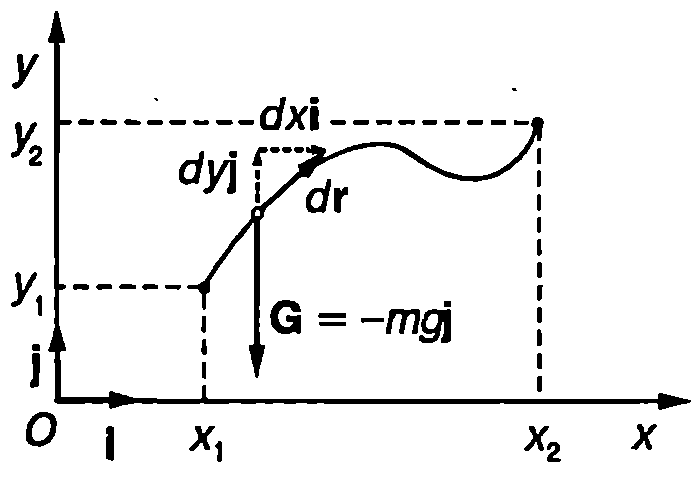
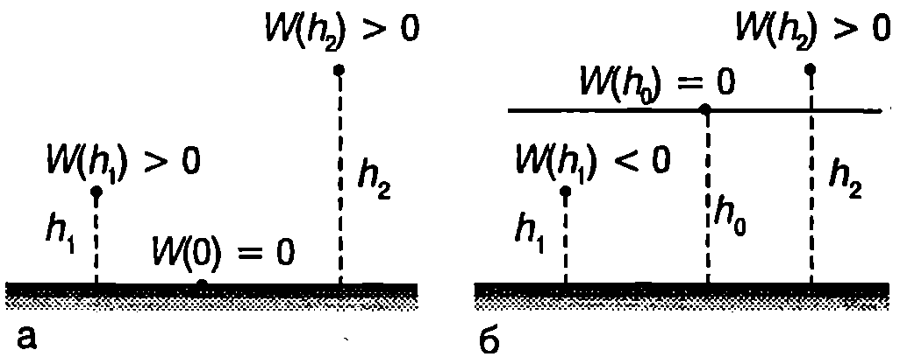

**Работа на силата на тежестта**

Да разгледаме материална точка с маса $m$, която се движи близо до земната повърхност (Фиг. \ref{fig:9.1}). Ще пресметнем работата, която извършва силата на тежестта $\vec G = m\vec g$ при преместване на материалната точка от началното положение 1 с координати ($x_1, y_1$) в положение 2 с координати ($x_2, y_2$). За да изразим елементарната работа $dA$, ще представим вектора на силата на тежестта и вектора на елементарното преместване $d\vec r$ чрез техните компоненти спрямо кординатната система $xOy$: $\vec G = -mg\vec j$ и $d\vec r = dx\vec i + dy\vec j$.

***Забележка.*** Ще обърнем внимание, че $mg > 0$ е модулът на силата на тежестта, а знакът минус показва, че векторите $\vec G$ и $\vec j$ имат противоположни посоки. Стойностите на скаларните компоненти $dx$ и $dy$ на елементарното преместване $d\vec r$ обаче може да са както положителни, така и отрицателни.

Елементарната работа е

$$dA = \vec G.d\vec r = -mg\vec j.(dx\vec i + dy\vec j) = -mgdy,$$
където сме отчели, че $\vec j\cdot\vec i = 0$ и $\vec j\cdot \vec j = 1$. Интегрираме в граници от $y = y_1$ до $y = y_2$ и определяме работата на силата на тежестта
$$A = -\int_{y_1}^{y_2} mg dy =- mg (y_2 - y_1) = -mgh
$$
където $h = y_2 - y_1$ е изменението на височината на материалната точка над земната повърхност. Тъй като траекторията беше избрана произволно, от получения резултат следва изводът, че *работата на силата на тежестта не зависи от траекторията*, по която се извършва преместването, а се определя единствено от разликата във височините на началното и крайното положение. Силата на тежестта върши отрицателна работа при издигане на материалната точка (при $h> 0$) и положителна работа при спускане (при $h < 0$).



```

```
	`Фиг. 9.1`


**Консервативни сили**

Сили, чиято работа не зависи от траекторията, по която се движи материалната точка, а само от началното и крайното положение, се наричат *консервативни сили*. На Фиг. \ref{fig:9.2} са показани три произволно избрани траектории, по които материална точка, на която действа сила $\vec F$, се премества от положение 1 в положение 2. Да означим с $A_a$, $A_b$ и $A_c$, работата на силата $\vec F$ в трите случая. Силата $\vec F$ е консервативна, ако $A_a = A_b= A_c = A_{12} = const$.

От определението за консервативна сила следва, че нейната работа по затворен контур е равна на нула. Действително, ако например материалната точка от Фиг. \ref{fig:9.2} отначало премине от положение 1 в положение 2 по траекторията а, консервативната сила $\vec F$ извършва работа $A_a = A_{12}$. След това материалната точка се връща обратно в началното положение 1, например по траекторията $c$, при което силата $\vec F$ извършва работа $A_c'$. От третия принцип на механиката следва, че $A_c' = -A_c$. От друга страна, тъй като силата е консервативна: $A_c = -A_{12}$. Следователно $A_c' = -A_{12}$. Общата работа по затворената траектория $ac$ е
$$A=A_a+A_c'=A_{12}- A_{12} = 0.$$
Понеже точките 1 и 2 и траекториите $a$ и $c$ са избрани произволно, полученият резултат е в сила за работата на консервативна сила по произволен затворен контур $L$. Математически той се изразява с уравнението
$$\oint_L \vec F \cdot d\vec r = 0
$$


```

```
	`Фиг. 9.2`


Кръгчето върху знака на интеграла показва, че интегрирането (пресмятане на работата на силата $\vec F$) се извършва по затворения контур $L$.

Както видяхме в началото на този параграф, работата на силата на тежестта зависи само от началното и от крайното положение на материалната точка, т.е. тя е консервативна сила. Консервативни са също така всички гравитационни сили, силите на еластичност, електростатичните сили и др.

Не всички сили обаче са консервативни. Например работата на силите на триене и съпротивление $\vec f_k$, по затворен контур винаги е отрицателна: $\displaystyle \oint_L \vec f_k \cdot d\vec r < 0$. Такива сили се наричат *дисипативни сили*. В резултат на тяхната работа механичната енергия се превръща във вътрешна енергия (отделя се количество топлина). Сили, които винаги са насочени перпендикулярно на скоростта на материалната точка, се наричат *жироскопични сили*. Примери за жироскопични сили са кориолисовата сила и магнитната сила, която действа на заредена частица, движеща се в магнитно поле. Тъй като са перпендикулярни на преместването (скоростта), работата на жироскопичните сили винаги е нула - както по затворен контур, така и при произволно преместване. За разлика от консервативните сили, чиято големина и посока зависи единствено от положението на материалната точка, жироскопичните сили зависят и от нейната скорост.

**Потенциална енергия**

Материална точка, на която действа консервативна сила $\vec F$, се премества от положение 1 с радиус-вектор $\vec r_1$ в положение 2 с радиус-вектор $\vec r_2$. Тъй като работата $A_{12}$ на консервативната сила зависи единствено от началното и от крайното положение, тя може да се представи като изменение на една функция на положението на материалната точка $W(\vec r)$
$$A_{12} = W(\vec r_1) - W(\vec r_2) = -\Delta W
$$
или
$$\Delta W = -A_{12}
$$
Величината $W$, която е функция единствено на координатите на материалната точка и не зависи от нейната скорост, се нарича *потенциална енергия* на материалната точка в полето на консервативната сила $\vec F$. По определение (вж. уравнение \eqref{eq:9.4}) изменението на потенциалната енергия $\Delta W$ е равно на взетата с обратен знак работа на консервативната сила. Когато точките 1 и 2 са безкрайно близо една до друга, уравнение \eqref{eq:9.4} приема вида
$$d W = -dA = -\vec F \cdot d\vec r,
$$
където $dA$ е елементарната работа на консервативната сила $\vec F$ при преместване $d\vec r$. От уравнение \eqref{eq:9.4} или \eqref{eq:9.5} потенциалната енергия може да се определи с точност до константа. За еднозначното и определяне трябва да се приеме, че в дадено положение на материалната точка потенциалната и енергия е равна на нула. Изборът на точката (или точките), в която потенциалната енергия е нула, може да стане по различен начин. Например от уравнения \eqref{eq:9.1} и \eqref{eq:9.4} за потенциалната енергия на материална точка в полето на силата на тежестта получаваме

$$A_{12} = -mg(y_2-y_1) = W(y_1) W(y_2).$$

Ако приемем, че потенциалната енергия е нула, когато материалната точка се намира на земната повърхност, т.е. при $y_1 = 0$, тогава потенциалната енергия на височина $h = y_2 - 0 = y_2$ е
$$W(y_2) = mgy_2
$$
или
$$W = mgh.
$$



```
Нулевото равнище на потенциалната енергия може да се избира по различен начин. Телата, които са разположени над нулевото равнище, имат положителна потенциална енергия, а телата, разположени под нулевото равнище, имат отрицателна потенциална енергия.
```
	`Фиг. 9.3`


При такъв избор на нулевото равнище всички тела, които са издигнати над земната повърхност, имат положителна потенциална енергия (Фиг. \ref{fig:9.3}а). Нулевото равнище можем да изберем и по друг начин. Например да приемем, че потенциалната енергия е нула на някаква височина $h_0$ над земната повърхност. Тогава телата, които се намират на по-голяма височина от $h_0$ имат положителна потенциална енергия, а тези, за които $h < h_0$, потенциалната енергия е отрицателна (Фиг. \ref{fig:9.3}б).

Ако разглеждаме Земята като инерциална отправна система, силата на тежест та съвпада с гравитационната сила, с която Земята привлича телата (вж. 57). Когато телата са далеч от земната повърхност, гравитационната сила вече не може да се смята за постоянна. Например големината на силата, с която Земята привлича спътник, е обратнопропорционална на квадрата на разстоянието от спътника до центъра на Земята и се определя от закона на Нютон за гравитацията. Доказва се (вж. Пример\ \ref{ex:9.1}), че гравитационната потенциална енергия $W$ на спътник (материална точка) с маса $m$, който се намира на разстояние $r$ от центъра на Земята, е
$$W(r) = -\frac{\gamma M_3 m}{r}.
$$
В общия случай уравнение \eqref{eq:9.8} изразява потенциалната енергия на система от две материални точки, които си взаимодействат с гравитационни сили (можем също така да смятаме, че $W$ е потенциалната енергия на едната материална точка в гравитационното поле на другата, т.е. в полето на гравитационната сила, с която й действа втората точка). Потенциалната енергия е приета за равна на нула, когато материалните точки са безкрайно отдалечени една от друга. При такъв избор на нулевото равнище гравитационната потенциална енергия винаги е отрицателна. Действително, съгласно с определението за потенциална енергия \eqref{eq:9.4} в случая тя е равна на работата, която извършват гравитационните сили при отдалечаване на материалните точки на безкрайно разстояние една от друга. Тъй като гравитационните сили са сили на привличане, те се противопоставят на раздалечаването и извършват отрицателна работа.

> [!question] Пример 9.1
а) Докажете, че гравитационната сила на взаимодействие между две материални точки е консервативна.

б) Определете гравитационната потенциална енергия на спътник с маса $m$, който се намира на разстояние $r$ от центъра на Земята. Масата на Земята е $M_\text{З}$.
\end{psexample}
> [!note]- Решение
 а) Гравитационната сила $\vec F$, с която материална точка с маса $M$ действа на материална точка с маса $m$, се определя от закона на Нютон за всеобщото привличане, който може да се запише във векторен вид (Фиг. \ref{fig:9.4}):


```

```
	`Фиг. 9.4`


$$\vec F = -\frac{\gamma Mm}{r^3} \vec r.$$

Работата на силата $F$ при произволно преместване $d\vec r$ e:

$$dA= \vec F.d\vec r = -\frac{\gamma Mm}{r^3} \vec r\cdot d\vec r.$$

Като използваме правилото за диференциране на произведение, представяме скаларното произведение $\vec r.d\vec r$ във вида

$$\vec r.d\vec r = d(\vec r.\vec r)/2 = d(r^2)/2 = rdr,$$

където $r$ е модулът на радиус-вектора, a $dr$ е неговото изменение ($dr > 0$, когато нараства и $dr < 0$, когато намалява). Следователно

$$dA=- \frac{\gamma Mm}{r^3} r d r = -\frac{\gamma Mm}{r^2} d r.$$

Работата на гравитационната сила при преместване на материалната точка с маса $m$ между две произволни точки с радиус-вектори $\vec r_1$ и $\vec r_2$ е:

$$A_{12} =\int_{r_1}^{r_2} -\frac{\gamma Mm}{r^2}dr = \frac{\gamma Mm}{r_2} -\frac{\gamma Mm}{r_1}$$

Виждаме, че работата на гравитационната сила зависи единствено от началното и крайното положение (от разстоянието $r$ до силовия център). Следователно гравитационните сили са консервативни.

б) Ще разглеждаме Земята и спътника като материални точки с маси $M_\text{З}$ и $m$. За да определим потенциалната енергия на спътника в полето на гравитационната сила, с която му действа Земята (потенциалната енергия на системата спътник Земя), ще използваме определението за потенциална енергия (уравнение \eqref{eq:9.4}) и получения в точка а) резултат за работата на гравитационната сила

$$W(\vec r)-W(\vec r_2) = A = \frac{\gamma M_\text{З}m}{r_2} - \frac{\gamma M_\text{З}m}{r}.$$

Нека спътникът се отдалечава безкрайно много от Земята ($r_2\to\infty$). Тогава

$$W(\vec r)-W(\infty)= -\frac{\gamma M_\text{З}m}{r}.$$

Тъй като модулът на члена в дясната страна на полученото уравнение намалява при увеличаване на разстоянието $r$ между спътника и Земята, най-удобно е да приемем, че потенциалната енергия на спътника е равна на нула, когато той в безкрайно отдалечен, т.е. $W(\infty) = 0$. Тогава

$$W(r) = -\frac{\gamma M_\text{З}m}{r}.$$

**Механична енергия**

Сумата от кинетичната и потенциалната енергия на едно тяло (материална точка) се нарича *механична енергия* $E$ на тялото
$$E = E_k + W.
$$
Нека на материална точка действат както консервативни, така и неконсервативни сили. Тогава съгласно със закона за изменение на кинетичната енергия $A_\text{конс.} + A_\text{неконс.} = \Delta E_k$, където $A_\text{конс.}$ е работата на консервативните сили, а $A_\text{неконс.}$ на неконсервативните сили. Тъй като по определение $A_\text{неконс.} = -\Delta W$, горното уравнение може да се запише във вида
$$A_\text{неконс.} = \Delta E_k + \Delta W = \Delta E.
$$
Уравнение \eqref{eq:9.10} изразява закона за изменение на механична енергия на едно тяло (материална точка); *изменението на механична енергия $\Delta E$ е равно на работата на неконсервативните сили, които действат на тялото*.

С въвеждането на потенциалната енергия отпада необходимостта да се пресмята непосредствено работата на консервативните сили това става чрез отчитане изменението на потенциалната енергия,

> [!question] Пример 9.2
Скиор с маса $m = 100$ kg се спуска по склон от височина $h = 100$ m. Определете работата на силите на триене и съпротивление, ако скоростта на скиора в подножието на склона е $v = 15$ m/s.
\end{psexample}
> [!note]- Решение
 На скиора действа силата на тежестта, която е консервативна, и резултантната на всички сили на триене и съпротивление (триене между ските и снега, съпротивление на въздуха), която не е консервативна. Работата на силата на тежестта ще отчитаме чрез изменението на потенциалната енергия на скиора. Отначало скиорът има само потенциална енергия $mgh$, а в подножието на склона, което избираме за нулево равнище на потенциалната енергия, енергията е само кинетична. Съгласно със закона за изменение на механичната енергия, работата на силите на триене и съпротивление е:

$$A_\text{некон.} = \Delta E_k + \Delta W = (\frac{mv^2}{2} -0)+(0-mgh) = -(mgh-\frac{mv^2}{2}) = -89\ \mathrm{kJ}.$$

**Задачи**

1. Топка с маса $m = 60$ g, която е хвърлена вертикално нагоре с начална скорост $v_0 = 20$ m/s, достига максимална височина $h = 15$ m. Определете работата на силата на съпротивление на въздуха при издигането на топката. Приемете земното ускорение $g = 10\ \mathrm{m/s^2}$,

2. От вертолет, който лети хоризонтално на височина $h = 20$ m със скорост $v_0 = 10$ m/s, е пуснат контейнер с маса $m = 50$ kg. Определете работата на силата на съпротивление на въздуха, ако контейнерът достига земната повърхност със скорост $v = 20$ m/s.

3. На частица с маса $m = 1$ g, която може да се движи само по оста $x$, действа консервативна сила $F = -c_1x - c_2x^2$, където $c_1 = 0,\!02$ N/m и $c_2 = 0,\!01$ N/m$^2$ са положителни константи.

а) Изразете потенциалната енергия на частицата като функция на координатата $x$.

6) Частицата преминава през началото О на оста $x$ ($x = 0$) със скорост $v = 50$ m/s, насочена в положителната посока на оста $x$. На какво максимално разстояние от точка $O$ ще се отдалечи частицата?

4. Частица с маса $m$ се движи в равнината $xy$ под действие на сила $F = c_1 x \vec i+ c_2 y \vec j$, където $c_1$ и $c_2$ са положителни константи.

а) Докажете, че силата $\vec F$ е консервативна.

6) Определете потенциалната енергия $W$ на частицата в точка с координати $(x, y)$. Приемете, че в началото О на координатната система $(x = 0; y = 0)$ потенциалната енергия е $W = 0$.

62
