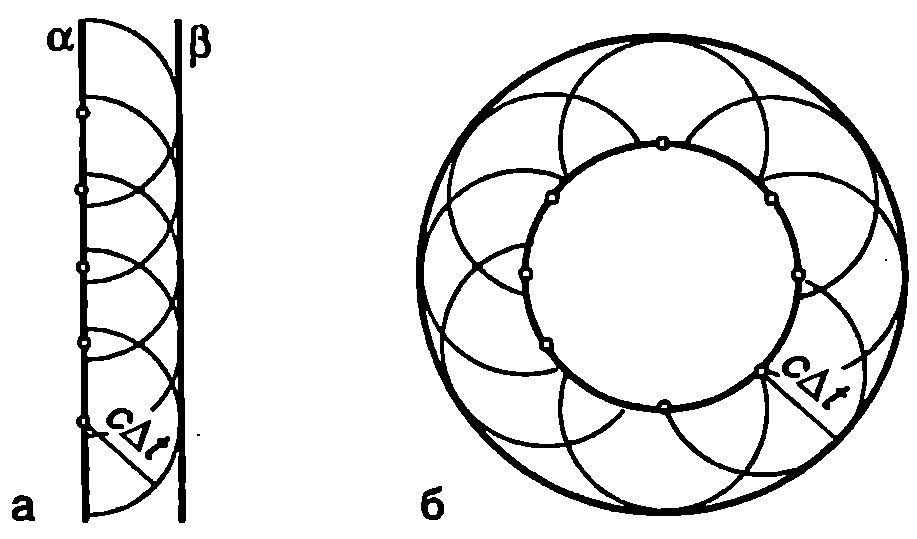
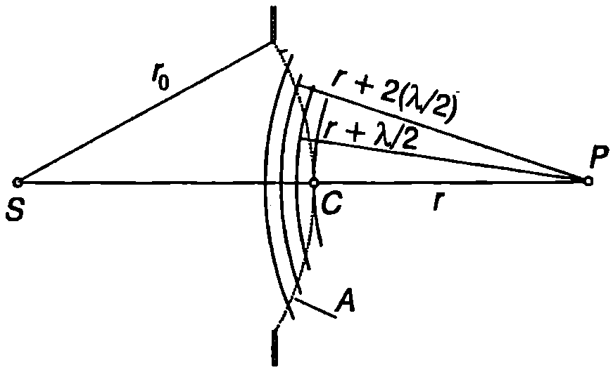
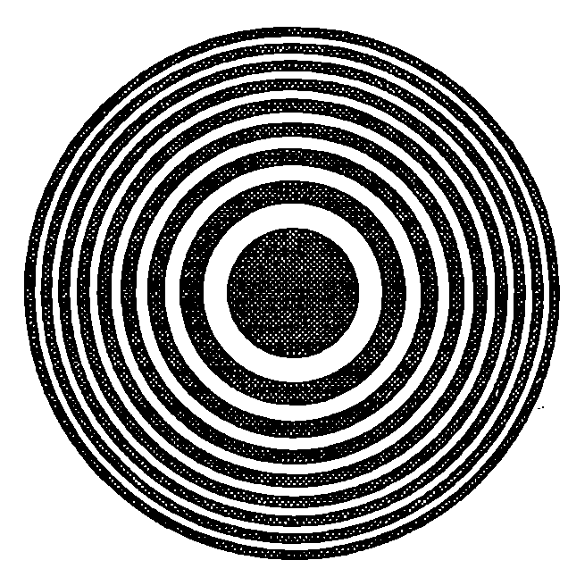

Под дифракция обикновено се разбират отклоненията от закона за праволинейното разпространение на светлината в еднородна среда. Дифракция се наблюдава, например, когато на пътя на светлината се постави непрозрачно тяло или когато светлината преминава през отвор в непрозрачен екран. Съгласно със закона за праволинейното разпространение зад непрозрачните тела трябва да се образува сянка, т.е. област с ясно очертани граници, в която светлината не прониква. Опитът обаче показва, че вместо рязка граница между светлото и тъмното, се наблюдава сложно разпределение на интензитета на светлината: редуват се светли и тъмни участъци, наречени *дифракционни ивици*. Най-силно изразени са дифракционните ефекти, когато размерите на преградите (или отворите) са сравними с дължината на вълната на светлината (на пример когато са от порядъка на микрони или десетки микрони).

**Принцип на Хюйгенс**

Явлението дифракция се описва количествено от електромагнитната теория на светлината. Решаването на уравненията на Максуел при съответните гранични условия обаче е много сложна задача. За да се намери разпределението на интензитета на дифрактиралата, т.е. отклонилата се от праволинейното си разпространение светлина, в редица важни за практиката случаи е достатъчно да се използва приближен метод, предложен за пръв път през 1678 година от холандския физик Християн Хюйгенс (1629-1695) и наречен в негова чест принцип на Хюйгенс. Съгласно с принципа на Хюйгенс всички точки от даден вълнов фронт се разглеждат като точкови източници на вторични (елементарни) сферични вълни. Вълновият фронт след време $\Delta t$ представлява повърхност, която е допирателна към фронтовете на вторичните вълни (обвиваща повърхност). Принципът на Хюйгенс се прилага не само за светлината, но и за всички вълнови процеси. Фиг. \ref{fig:92.1} илюстрира как с помощта на принципа на Хюйгенс се построяват вълновите фронтове на плоска и на сферична вълна. Нека в момента $t$ вълновият фронт на плоска вълна е равнината $\alpha$ (Фиг. \ref{fig:92.1}а). Всяка точка от равнината $\alpha$ е източник на вторични сферични вълни. В момента $t+\Delta t$ фронтовете на вторичните вълни са полусфери с радиуси $c\Delta t$, където $c$ е скоростта на вълните (за нагледност на чертежа са построени фронтовете само на няколко вторични вълни). Повърхността, която е допирателна към вълновите фронтове на вторичните вълни, в случая е равнината $\beta$. По аналогичен начин се построява фронтът на сферична вълна (Фиг. \ref{fig:92.1}б).

За да обясни защо вторични вълни не се разпространяват в обратна посока, Хюйгенс предполага, че вторичните вълни са много слаби и оказват доловимо ``светлинно действие'' само в точките от обвиващата повърхност. Това предположение лишава елементарните вълни от физично съдържание и ги превръща единствено в геометричен модел, чрез който може да се построи вълновият фронт. Френел допълва принципа на Хюйгенс. Той разглежда точките от вълновия фронт като източници на вторични кохерентни вълни, които интерферират помежду си. В точките от обвиващата повърхност всички вторични вълни пристигат с еднакви фази, взаимно се усилват и формират фронта на разпространяващата се вълна. Вторичните вълни, които се разпространяват назад, интерферират не само помежду си, но и с идваща та (първична) вълна. При интерференцията те гасят първичната вълна, така че след преминаване на вълната вълновият процес в пространството зад нея се прекратява.



```
Построяване на вълнови фронтове на: а) плоска вълна; б) сферична вълна.
```
	`Фиг. 92.1`


**Зони на Френел**

Точков източник $S$ излъчва монохроматична светлина с дължина $\lambda$. Да означим с $E = E_0$ интензитета на електричното поле в точка $P$. Как ще се измени $E$, ако между точките $S$ и $P$ поставим непрозрачен екран с малък кръгъл отвор, така че правата $SP$ да минава през центъра на отвора и да е перпендикулярна на екрана (Фиг. \ref{fig:92.2})? Ще решим задачата с помощта на принципа на Хюйгенс. Всеки малък елемент от частта на вълновия фронт А, която покрива отвора, се разглежда като източник на вторични вълни. Електричното поле в точка $P$ е суперпозиция от полетата на вторичните вълни. Повърхността $A$ е сегмент от сфера с радиус $r_0$ и център в точка $S$ (Фиг. \ref{fig:92.2}). Построяваме сфери с център в точка $P$ и радиуси $r(r = PC)$ , $r + \lambda/2$, $r+ 2(\lambda/2)$, $\dots$, $r +n (\lambda/2)$. Те разделят сегмента $A$ на пръстени, наречени *зони на Френел*. От построението следва, че вторичните вълни, излъчени от двете граници на една зона, пристигат в точката на наблюдение $P$ в противофаза. Доказва се (вж. пример 92.1), че радиусът на окръжността, разделяща $n$-тата от $n + 1$-вата зона на Френел, е
$$R_n = \sqrt{\frac{n\lambda rr_0}{r + r_0}}
$$
Всички зони имат приблизително еднаква площ
$$A_n = \frac{\pi\lambda rr_0}{r + r_0}
$$



```
Зони на Френел.
```
	`Фиг. 92.2`


Нека диаметърът на отвора е такъв, че да се разкрива само първата зона на Френел. Разделяме я на много голям брой $N$ тънки пръстени с еднаква площ. До точката на наблюдение $P$ вторичната вълна от всеки следващ по-външен пръстен изминава по-голям оптичен път и изостава по фаза спрямо вълната от предния пръстен. Ще приемем, че вторичните вълни имат еднакви амплитуди и ще използваме метода на векторните диаграми, за да определим интензитета на резултантното електрично поле в точка $P$. На векторната диаграма вторичните вълни се представят с вектори $d\vec E_i$ ($i = 1, 2 ,\dots,N$) които са завъртени един спрямо друг на ъгъл, равен на фазовата разлика $d\varphi$ между вторичните вълни от два съседни пръстена (Фиг. \ref{fig:92.3}а). Двата крайни вектора $d\vec E_1$ и $d\vec E_N$ са насочени в противоположни посоки, защото вторичните вълни от двата края на зоната пристигат в точка $P$ в противофаза. Амплитудата на резултантното електрично поле в точка $P$ е равна на модула на вектора $\vec E_1$ който затваря тази начупена линия (Фиг. \ref{fig:92.3}а). В граничния случай, когато $N \to\infty$ начупената линия преминава в полуокръжност (Фиг. \ref{fig:92.3}б).

Да увеличим радиуса на отвора, така че в него да се вместват изцяло първите две зони на Френел. Ако вълните от всички елементарни участъци пристигаха в точка $P$ с еднакви амплитуди, резултантното поле при открити първа и втора зона на Френел щеше да е нула (вълната от втората зона гаси изцяло вълната от първата зона). Различните елементарни участъци обаче сключват различни ъгли с оста $SP$, поради което амплитудата на вторичните вълни намалява при отдалечаване от центъра на отвора. Затова модулът на интензитета $\vec E_2$ на електричното поле, създадено от втората зона на Френел, е по-малък, отколкото този на първата зона, и интензитетът на резултантното поле $E = E_1 + E_2$ има много малка, но различна от нула стойност (Фиг. \ref{fig:92.3}в).


```

```
	`Фиг. 92.3`

Ако продължим да увеличаваме радиуса на отвора (или да приближаваме точката на наблюдение $P$), амплитудата на интензитета на електричното поле в точка $P$ периодично ще се изменя: тя в голяма, когато се разкриват нечетен брой зони на Френел, и малка, когато техният брой е четно число. Граничният случай, когато радиусът на отвора става безкрайно голям, съответства на свободно разпространение на сферичната вълна от източника $S$. Векторната диаграма в този случай представлява спирала, която се свива към центъра на окръжност с диаметър $E_1$ (Фиг. \ref{fig:92.3}г). От чертежа се вижда, че $\vec E_1 = 2\vec E_0$ т.е. при наличие на екран, който открива само първата зона на Френел, амплитудата на интензитета $E_1$ на електричното поле в точката на наблюдение $P$ е два пъти по-голям от амплитудата $E_0$ при свободно разпространение на вълната. Това означава, че при наличие на екран с отвор, разкриващ само първата зона на Френел, интензитетът на светлината $I_1 \propto E_1^2$ в точка $P$ е 4 пъти по-голям от интензитета $I_0 \propto E_0^2$ при свободно разпространение на вълната.

> [!question] Пример 92.1
Определете радиуса $R_n$ на окръжността, която разделя $n$-тата от $n + 1$-вата зона на Френел. Известни са (вж. Фиг. \ref{fig:92.2}) разстоянията $r$ и $r_0$ и дължината на вълната $\lambda$. В сила са неравенствата: $r \gg \lambda$; $r_0 \gg \lambda$; $R_n/{r} \ll 1$; ${R_n}/{r_0} \ll 1$. Докажете, че всички зони имат приблизително еднаква площ.
\end{psexample}
> [!note]- Решение
 От правоъгълните триъгълници на Фиг. \ref{fig:92.4} с помощта на питагоровата теорема получаваме:
$$r_0 + r = \sqrt{r_0^2 - R_n^2} + \sqrt{\left(r + n \frac{\lambda}{2}\right)^2 - R_n^2}$$
$$\approx \sqrt{r_0^2 - R_n^2} + \sqrt{r^2 + r n \lambda - R_n^2},$$


```

```
	`Фиг. 92.4`


където сме пренебрегнали члена ${n^2 \lambda^2}/{4}$.

Като отчетем, че ${R_n}/{r} \ll 1$ и ${R_n}/{r_0} \ll 1$ и използваме приближението $(1 + x)^n \approx 1 + n x$ при $x \ll 1$, получаваме:
$$r_0 + r = r_0 \left(1 - \frac{R_n^2}{r_0^2}\right)^{1/2} + r \left(1 + \frac{r n \lambda - R_n^2}{r^2}\right)^{1/2}.$$
$$\approx r_0 \left(1 - \frac{R_n^2}{2 r_0^2}\right) + r \left(1 + \frac{r n \lambda - R_n^2}{2 r^2}\right).$$
Откъдето изразяваме $R_n$:
$$R_n \approx \sqrt{\frac{n \lambda r_0 r}{r_0 + r}}.$$
Площта на $n$-тата зона на Френел е приблизително равна на:
$$A_n = \pi (R_{n+1}^2 - R_n^2) = \pi \lambda \frac{r_0 r}{r_0 + r}.$$
Следователно, в рамките на направените приближения, всички зони на Френел имат еднаква площ.

> [!question] Пример 92.2
Екранът с отвор от Фиг. \ref{fig:92.2} се заменя с непрозрачен диск, който покрива само първата зона на Френел (Фиг. \ref{fig:92.5}а). Определете интензитета $I$ на светлината в точка $P$. Как ще се изменя интензитетът, ако се увеличава радиусът на диска? Интензитетът на светлината в точка $P$ при свободното разпространение е $I_0$.
\end{psexample}


```

```
	`Фиг. 92.5`

> [!note]- Решение
 Интензитетът на електричното поле $\vec E$ в точка $P$ може да се получи, ако от интензитета $\vec E_0$, съответстващ на свободно разпространение на вълната, се извади интензитетът $\vec E_1 = 2 \vec E_0$ на полето от първата зона на Френел, която е покрита от непрозрачния диск и не дава принос в резултантното поле (Фиг. \ref{fig:92.5}б): $\vec E =\vec E_0 -\vec E_1 = -\vec E_0.$ Интензитетът на светлината е $I \propto E^2 = E_0^2, \ \text{т.е.} \ I = I_0.$

Следователно, в центъра на геометричната сянка на диска (точка $P$) се наблюдава светло петно. Ако се увеличава радиусът на диска, той ще покрива все повече зони на Френел, поради което интензитетът на светлината ще намалява, но петното ще остава светло.

Този извод за пръв път е бил направен през 1818 г. от Поасон, след което е бил експериментално потвърден от Араго. Наблюдаваните светли петна в центъра на геометричната сянка на диск били наречени петна на Араго-Поасон. Те послужили като още едно доказателство в подкрепа на вълновата теория на светлината.

**Зонна пластинка**

Интензитетът на светлината в точка $P$ може многократно да се увеличи, ако се направи специален екран с отвори във вид на концентрични пръстени, които да разкриват първите $N$ на брой нечетни (или само четни) зони на Френел. Тогава вторичните вълни от всички открити зони ще пристигат в точката на наблюдение $P$ във фаза и взаимно ще се усилват. Такъв екран се нарича *зонна пластинка* (Фиг. \ref{fig:92.6}).



```
Зонна пластинка
```
	`Фиг. 92.6`


Интензитетът на светлината, получен от зонна пластинка с $N$ открити зони, е приблизително $4N^2$ пъти по-голям, отколкото при свободно разпространение на светлината ($E = 2N E_0$) Увеличаването на интензитета от зонна пластинка е аналогично на фокусиращото действие на събирателна леща.

> [!question] Пример 92.3
Върху зонна пластинка, която разкрива само четните зони на Френел, пада успореден сноп монохроматична светлина с дължина на вълната $\lambda = 500$ nm. На какво разстояние $r$ от пластинката ще се фокусират лъчите (Фиг. \ref{fig:92.7})? Радиусът на централния непрозрачен кръг на пластинката е $R_1 = 0,\!5$ mm.
\end{psexample}


```

```
	`Фиг. 92.7`

> [!note]- Решение
 Повдигаме на квадрат двете страни на уравнение (92-1) и го записваме във вида
$$\frac{1}{r_0} + \frac{1}{r} = \frac{n \lambda}{A_n^2} = \frac{\lambda}{R_1^2}$$
където $R_1$ е радиусът на първата ($n = 1$) зона на Френел, т.е. на централния непрозрачен кръг на разглежданата зонна пластинка. Сравняваме получения резултат с формулата на събирателна леща (вж.~\ref{sec:89}), $1/a + 1/b = 1/f$, където $a$ е положението на предмета $b$ - положението на образа, а $f$ е фокусното разстояние на лещата. Сравнението показва, че зонната пластинка може да се разглежда като събирателна леща с фокусно разстояние $\displaystyle\frac{1}{t} = \frac{\lambda}{R_1^2} $

Успоредният сноп светлина, който пада върху зонната пластинка, може да се приеме за излъчен от точков източник, разположен на безкрайно голямо разстояние $r_0$ от пластинката. Тогава $1/r = 1/f$ или $\displaystyle r = f = \frac{R_1^2}\lambda = 0,\!5$ m.

Следователно успореден сноп светлина се събира във фокуса на зонната пластинка, където се наблюдава ярко петно.

**Задачи**

1. Радиусът $R$ на отвора от Фиг. \ref{fig:92.2} може да се изменя. Определете дължината на вълната $\lambda$ на монохроматичния точков източник $S$, ако вторият максимум на интензитета на светлината в точка $P$ се получава при $A = 0, 8$ mm.

Дадени са разстоянията $r_c = 800$ mm и $f = 1200$ mm.

2. Покажете, че за разлика от лещата, зонната пластинка има много фокуси. Определете съответните фокусни разстояния.

3. Източник на монохроматична светлина е разположен на разстояние $r_0 = 2,\!50$ m от зонна пластинка, а неговият образ получава на разстояние $r = 1,\!80$ m от пластинката. Определете мястото на образа, ако цялата опитна постановка се потопи в течност с показател на пречупване $n = 1,\!4$.
