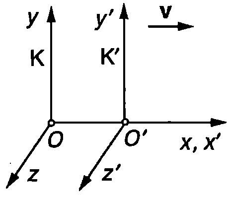
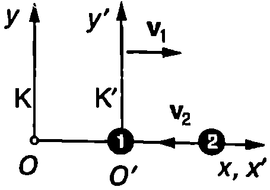

Едновременност

Да разгледаме две инерциални отправни системи К и К'. Отправната система К' се движи със скорост $\vec v$ спрямо К. В нейното начало О' е разположен точков източник на светлина, който е неподвижен спрямо К'. В момента $t = 0$, когато началото О' на К' съвпада с началото О на К, източникът излъчва светлинен импулс. Тъй като, съгласно с принципа за постоянството на скоростта на светлината, светлината се разпространява с еднаква скорост $c$ във всички инерциални отправни системи, в момента $t'$ вълновият фронт на импулса в системата К' е сфера $S'$ с радиус $r' = ct'$ и център О' (Фиг. \ref{fig:97.1}). От принципа на относителността на Айнщайн следва, че вълновият фронт, наблюдаван от отправната система К, е сфера с радиус $r = ct$, чийто център е точката О, в която се е намирал източникът в момента на излъчване $t = 0$. В противен случай по формата на вълновия фронт бихме могли да установим коя отправна система е в покой и коя се движи. Така стигаме до парадоксалния извод, че вълновият фронт трябва едновременно да съвпада както със сферата $S$, така и със сферата $S'$.


```

```
	`Фиг. 97.1`


Направеният извод е неправилен, защото той се базира на нашата интуитивна представа за едновременност. За разлика от класическата физика, в теорията на относителността понятието едновременност има относителен характер. Две събития, станали в различни точки от пространството, могат да са едновременни в една отправна система и да не бъдат такива в друга отправна система. С относителността на едновременността се обяснява привидният парадокс в разгледания пример. За наблюдател от отправната система К' вълновият фронт едновременно достига до всички точки от сферата $S'$, докато за наблюдател от системата К това не е така. За него светлината преминава в различни моменти от времето през различните точки от сферата $S'$. Обратно, за наблюдател от К светлината едновременно преминава през всички точки от сферата $S$, докато за наблюдателя от К' това става в различни моменти от времето. Следователно $S'$ е вълнов фронт само за наблюдател от К', а $S$ само за наблюдател от К.

**Правило на Айнщайн за синхронизиране на часовниците**

Как да се установи дали в дадена отправна система две събития са едновременни? Ако те са станали в една и съща точка, достатъчно е наблюдателят да се намира на мястото на събитията. Задачата се усложнява, ако събитията са станали в различни точки А и В от пространството. Проблемът е в това, че наблюдателят не може едновременно да се намира на мястото и на двете събития, а трябва да получи информация за тях от разстояние, например чрез светлинни сигнали, които не се разпространяват мигновено, а с крайна скорост. Следователно в зависимост от положението на наблюдателя информацията за събитията ще достига до него за различно време, което той трябва да отчете, преди да направи извода дали събитията са едновременни. Затова, вместо да се отчита времето само с един часовник, който например е поставен в началото на координатната система, може да се използва цяла мрежа от еднакви часовници, поставени един до друг. За да отчитат единно време, часовниците трябва да се синхронизират. Айнщайн предлага синхронизацията на пространствено разделени часовници да се извършва със светлинни сигнали.


```

```
	`Фиг. 97.2`


Нека в точките А и В са поставени еднакви часовници, които са неподвижни спрямо инерциалната отправна система К. От точка $A$ в момента $t_1$ се изпраща светлинен сигнал, който след като се отрази от огледало, поставено в точка $B$, попада отново в точка $A$ в момента $t_2$ (Фиг. \ref{fig:97.2}). Моментите $t_1$ и $t_2$ се измерват по часовника в точка $A$. Тогава, по определение, часовникът в точка $B$ е синхронизиран с този в точка $A$, ако в момента на пристигане на сигнала в точка $B$ той показва време $t = (t_1 + t_2)/2$. По този начин могат да се синхронизират всички часовници, които са неподвижни спрямо отправната система К. Две пространствено разделени събития са едновременни в отправната система К, ако синхронизираните часовници, намиращи се в точките, където са станали събитията, показват едно и също време.

**Лоренцови трансформации**

Инерциалната отправна система К' се движи със скорост $v$ спрямо инерциалната отправна система К, както е показано на Фиг. \ref{fig:97.3}. Във всяка от двете отправни системи са разположени голям брой неподвижни часовници, синхронизирани по правилото на Айнщайн. Нека $x, y, z$ и $t$ са координатите и времето на някакво събитие (например разпадане на частица), измерени в отправната система К. $x', y', z'$ и $t'$ ще означим координатите и времето на същото събитие, измерени в K'. Айнщайн показва, че въз основа на двата принципа на теорията на относителността за връзката между координатите и времето на събитието, измервани в двете инерциални отправни системи, се получават уравнения, които са различни от галилеевите трансформации \eqref{eq:96.2}. Те са:



```

```
	`Фиг. 97.3`


$$\begin{aligned}
	&x' = \frac{x-vt}{\sqrt{1 - \frac{v^2}{c^2}}} ;\ y'=y;\ z' = z; \\
	&t' = \frac{t - \frac{vx}{c^2}}{\sqrt{1 - \frac{v^2}{c^2}}}
	\end{aligned}
$$
Тъй като всички инерциални отправни системи са равноправни, наблюдател K' може да смята себе си за неподвижен: от негова гледна точка отправната система К се движи със скорост $-\vec v$. Затова обратната трансформация от K' към К се получава, като в уравнение \eqref{eq:97.1} $v$ се замени с $-v$:
$$\begin{aligned}
	&x = \frac{x'+vt'}{\sqrt{1 - \frac{v^2}{c^2}}} ;\ y=y';\ z = z'; \\
	&t = \frac{t' + \frac{vx'}{c^2}}{\sqrt{1 - \frac{v^2}{c^2}}}
	\end{aligned}
$$
Уравнения \eqref{eq:97.1} и \eqref{eq:97.2} са получени преди Айнщайн от холандския физик Хендрих Лоренц още през 1890 година и са наречени в негова чест *лоренцови трансформации*. Лоренц обаче изхожда от теорията на неподвижния ефир, като търси подходяща координатна трансформация, при която уравненията на Максуел да запазват вида си. Според Лоренц величината $t'$ само формално математически се разглежда като време, докато ``истинско'' е времето $t$, измерено в отправната система, където ефирът е неподвижен. В теорията на Айнщайн, както вече подчертахме, всички инерциални отправни системи са равноправни. Затова времената $t$ и $t'$ са ``еднакво истински''.

**Интервал между две събития**

Нека $x_1, y_1, z_1, t_1$ и $x_2, y_2, z_2, t_2$ са координатите и моментите на две събития, определени в отправната система К (например избухване на две свръхнови звезди). Величините $\Delta x = x_2 - x_1$, $\Delta y = y_2 - y_1$, $\Delta z = z_2 - z_1$ и $\Delta t = t_2 - t_1$ са разликите в координатите и времето на двете събития. Съгласно с лоренцовите трансформации \eqref{eq:97.1} разликите в координатите и времето на двете събития, измерени в инерциалните отправни системи К и К', са свързани със съотношенията
$$\begin{aligned}
	&\Delta x' = \frac{\Delta x-v\Delta t}{\sqrt{1 - \frac{v^2}{c^2}}} ;\ \Delta y'=\Delta y;\ \Delta z' = \Delta z; \\
	&\Delta t' = \frac{\Delta t - \frac{v\Delta x}{c^2}}{\sqrt{1 - \frac{v^2}{c^2}}}
	\end{aligned}
$$
Всички величини с щрих ``''' се отнасят за отправната система К'.

Тъй като $\Delta x \neq \Delta x'$, разстоянието $\Delta r = \sqrt{(\Delta x)^2 + (\Delta y)^2 + (\Delta z)^2}$ между точките на двете събития, измерено в К, е различно от разстоянието $\Delta r' = \sqrt{(\Delta x')^2 + (\Delta y')^2 + (\Delta z')^2}$ между същите точки, измерено в К'. Различни са и интервалите от време $\Delta t$ и $\Delta t'$. И така, от лоренцовите трансформации следва, че при преминаване от една инерциална отправна система в друга такава се изменят както пространственият интервал между двете събития, така и интервалът от време между тях. Следователно разстоянията в пространството и интервалите от време са относителни: те зависят от отправната система, в която се измерват.

**Забележка.** От галилеевите трансформации също следва, че когато две събития не са едновременни, разстоянието между точките на събитията е различно в различните отправни системи ($\Delta x' = \Delta x - v\Delta t \neq \Delta x$ при $\Delta t \neq 0$). В класическия случай обаче, когато събитията са едновременни ($\Delta t = \Delta t' = 0$) разстоянието между тях (пространственият интервал) е едно и също във всички отправни системи.

Умножаваме последното от уравненията \eqref{eq:97.3} по скоростта на светлината $c$, вдигаме на квадрат двете страни на всички равенства и събираме почленно левите и десните им страни. След съответните алгебрични преобразования получаваме
$$c^2 (\Delta t')^2 - (\Delta x')^2 - (\Delta y')^2 - (\Delta z')^2 = c^2 (\Delta t)^2 - (\Delta x)^2 - (\Delta y)^2 - (\Delta z)^2$$

Следователно величината
$$\begin{aligned}
	&(\Delta S)^2 = c^2 (\Delta t)^2 - (\Delta x)^2 - (\Delta y)^2 - (\Delta z)^2 = \\
	&= c^2(\Delta t)^2 - (\Delta r)^2 = inv
	\end{aligned}
$$
не се изменя при преминаване от една отправна система в друга, т.е тя е инвариантна по отношение на лоренцовите трансформации. Величината $\Delta S$ се нарича интервал (или пространствено-времеви интервал) между двете събития. Ще подчертаем още веднъж, че поотделно както интервалът от време $\Delta t$, така и пространственият интервал $\Delta r$ между двете събития зависят от избора на отправната система. Пространствено-времевият интервал $\Delta S$ обаче е инвариант: има една и съща стойност във всички инерциални отправни системи.

**Преобразуване на скоростите**

Уравнения \eqref{eq:97.3} изразяват също така връзката между компонентите на преместването на една материална точка и интервала от време, за което то е извършено, измерени в две инерциални отправни системи (К и К'). Да разделим първото от уравненията \eqref{eq:97.3} на последното:
$$\frac{\Delta x'}{\Delta t'} = \frac{\Delta x - v\Delta t}{\Delta t - \frac{v\Delta x}{c^2}}.$$

Разделяме числителя и знаменателя на дясната страна на полученото равенство на $\Delta t$:
$$\frac{\Delta x'}{\Delta t'} = \frac{\frac{\Delta x}{\Delta t} - v}{1 - \frac{v}{c^2} \frac{\Delta x}{\Delta t}}$$

Следователно
$$u'_{x'} = \frac{u_x - v}{1-\frac{vu_x}{c^2}},
$$
където $\displaystyle u_x = \frac{\Delta x}{\Delta t}$ и $\displaystyle u_{x'} = \frac{\Delta x'}{\Delta t'}$ са $x$-компонентите на скоростта на материалната точка, измерени съответно в К и К'. По аналогичен начин за останалите компоненти на скоростта се получава
$$u'_{y'} = \frac{u_y\sqrt{1 - \frac{v^2}{c^2}}}{1-\frac{vu_x}{c^2}};\ u'_{z'}=\frac{u_z\sqrt{1 - \frac{v^2}{c^2}}}{1-\frac{vu_x}{c^2}}.
$$
Уравнения \eqref{eq:97.5} и \eqref{eq:97.6} изразяват закона на Айнщайн за събиране на скорости в теорията на относителността. Обратната трансформация на скоростите (от К' в К) се получава, като в уравнения \eqref{eq:97.5} и \eqref{eq:97.6} $v$ се замени с $-v$:
$$\begin{aligned}
	u_x &= \frac{u'_{x'} + v}{1+\frac{vu'_{x'}}{c^2}};\\
	u_y &= \frac{u'_y\sqrt{1 - \frac{v^2}{c^2}}}{1+\frac{vu'_{x'}}{c^2}};\ u_z=\frac{u'_{z'}\sqrt{1 - \frac{v^2}{c^2}}}{1+\frac{vu'_{x'}}{c^2}}.
	\end{aligned}
$$
Теорията на относителността се нарича още *релативистка теория*. Специфичните явления, описвани от тази теория, се наричат релативистки ефекти. Колкото по-големи са скоростите на движение, толкова по-силно се проявяват релативистките ефекти. Движенията с малки скорости с голяма точност се описват от класическата механика. Например, когато скоростите $v$ и $u_x'$ са много по-малки от скоростта на светлината, релативисткият закон за събиране на скорости \eqref{eq:97.7} преминава в класическия галилеев закон за събиране на скорости: $u_x = u_x' + v$. Скорости, които са сравними със скоростта на светлината, се наричат релативистки скорости. Движението с релативистки скорости се изучава от релативистката механика (теорията на относителността).

Непосредствено се проверява, че релативисткият закон за събиране на скорости \eqref{eq:97.7} се съгласува с принципа за инвариантност на скоростта на светлината. Действително, нека по оста $x'$ на отправната система $K'$ (Фиг. \ref{fig:97.3}) се разпространява светлинен импулс. В първото от уравненията \eqref{eq:97.7} заместваме $u'_{x'} = c$ и получаваме $u_x = c$, т.е. скоростта на светлината е еднаква в двете инерциални отправни системи.

> [!question] Пример 97.1
Две частици се движат една срещу друга със скорости $v_1 = c/2$ и $v_2 = 3c/4$, където $c$ е скоростта на светлината. Скоростите $v_1$ и $v_2$ са измерени в инерциална отправна система К, свързана със Земята (лабораторна отправна система). Определете относителната скорост на двете частици.
\end{psexample}



```

```
	`Фиг. 97.4`

> [!note]- Решение
 Ще разгледаме движението на частиците в две инерциални отправни системи: лабораторната система К и системата К', свързана с първата частица. К' се движи спрямо К със скорост $v = v_1$ и $u_x = c/2$ (Фиг. \ref{fig:97.4}). За да определим скоростта $u'_{x'}$ на втората частица в системата К', използваме релативисткия закон за събиране на скорости \eqref{eq:97.5}. В случая $u_x = -v_2$ и $v = v_1$. Знакът ``$-$'' показва, че скоростта $\vec v_2$ на втората частица в К-системата е насочена в отрицателната посока на оста $x$ (Фиг. \ref{fig:97.4}). След заместване в \eqref{eq:97.5} получаваме
$$u'_{x'} = \frac{-v_2-v_1}{1 + \frac{v_1v_2}{c^2}}.$$

Знакът ``$-$'' показва, че скоростта $u'_{x'}$ е насочена в отрицателната посока на оста $x'$, т.е. към първата частица.

Относителната скорост $v_\text{отн}$ на две частици е равна на модула на скоростта на едната частица, измерена в отправна система, в която другата частица е в покой. Следователно
$$v_\text{отн} = |u'_{x'}| = \frac{v_2+v_1}{1 + \frac{v_1v_2}{c^2}}= \frac{10}{11}c.$$

Относителната скорост на две частици винаги е по-малка от скоростта на светлината във вакуум. Действително, $v_\text{отн}$ е скоростта на движение на едната частица, измерена в определена отправна система (в отправната система, в която другата частица е неподвижна). Съгласно с принципите на теорията на относителността в никоя отправна система частица не може да се движи със скорост, по-голяма от скоростта на светлината във вакуум.

Задачи

1. Лодка се движи по течението на ``вълшебна река''. Скоростта на течението е $v = 0,\!9c$, а скоростта на лодката спрямо водата е $u' = 0,\!2c$. Колко е скоростта на лодката спрямо брега?

2. Две частици се движат спрямо лабораторната отправна система със скорости $v_1 = c/2$ и $v_2 = 3c/4$, които са взаимно перпендикулярни (съответно по оста $x$ и по оста $y$). Определете относителната скорост на двете частици.
