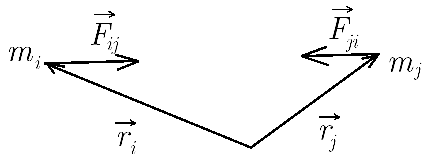

1. Момент на импулса ($\vec{L}, [\frac{\text{kg}\cdot\text{m²}}{\text{s}}]$) - физична величина, характеризираща количеството въртеливо движение
	
	**а) на материална точка**
	
	$$\vec{L} \overset{\text{def}}{=} \vec{r}\times \vec{p}$$
	
	
	
	- посока - определя се по правилото на дясната ръка
	- големина: $L = mvr\sin\phi$

2. Въртящ момент / момент на сила ($\vec{\tau}, [\text{N}\cdot \text{m}]$) - величина, характеризираща въртеливото движение, което дадена сила придава на тялото, върху което въздейства
	
	$$\vec{\tau} \overset{\text{def}}{=} \vec{r}\times  \vec{F}$$
	
	
	
	**а) рамо на силата** ($l$) - разстоянието между оста на въртене и правата, по която действа силата
	
	**б) големина**
	
	$$\tau = Fl$$
	
	- сила, която действа така, че да завърти тялото по посока, обратна на часовниковата стрелка, има положителен въртящ момент
	- сила, която действа така, че да завърти тялото по посока на часовниковата стрелка, има отрицателен въртящ момент
	
	**в) посока** - палецът на дясната ръка сочи по посока на вектора на въртящия момент, когато останалите пръсти се насочат по посока на $\vec{r}$ и се свият в посока на силата
	
	
	
	**г) ефект върху момента на импулса** - въртящият момент е промяната в момента на импулса
	
	$$\frac{d\vec{L}}{dt} = \vec{\tau}$$
	Доказателство:
	$$\frac{d\vec L}{dt} = \frac{d (m\vec r \times \vec v)}{dt} = m \frac{d\vec r}{dt} \times \vec v + m \vec r \times \frac{d \vec v}{dt} = m \vec v \times \vec v + m \vec r \times \vec a = \vec r \times m\vec a$$
	

3. Закон за запазване на момента на импулса - моментът на импулса в затворени системи остава постоянен във времето
	
	Доказателство: 
	
	Промяната на момента на импулса на едно тяло е сбора от въртящите моменти, които му действат:
	$$\frac{d \vec L_1}{dt} = \vec r_1 \times \vec F_{21} + ...  \vec r_1 \times \vec F_{n1} $$
	$$\frac{d \vec L_2}{dt} = \vec r_2 \times \vec F_{12} + ...  \vec r_2 \times \vec F_{n1} $$
	$$\frac{d \vec L_n}{dt} = \vec r_n \times \vec F_{1n} + \vec r_n \times \vec F_{2n} + ...$$
	Като съберем всички уравнения, ще имаме двойки въртящи моменти от вида
	
	$$\vec r_i \times \vec F_{ji} + \vec r_j \times \vec F_{ij} = \vec r_i \times \vec F_{ji} - \vec r_j \times \vec F_{ji} = (\vec r_i - \vec r_j) \times \vec F_{ji} = \vec 0,$$
	тъй като $\vec F_{ji}$ е колинеарна с $\vec r_i - \vec r_j$. Като съкратим всички двойки въртящи моменти,
	$$\frac{d\vec{L}}{dt}= \vec0$$
	
	**а) при отворени системи** - производната на момента на импулса е равна на сбора от всички външни въртящи моменти
	
	$$\frac{d\vec{L}}{dt}= \sum \vec{\tau}_{ext}$$
	
