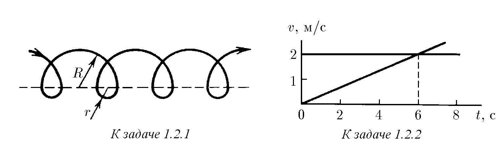
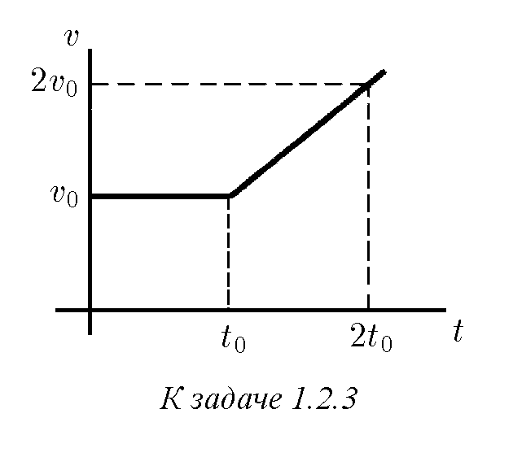
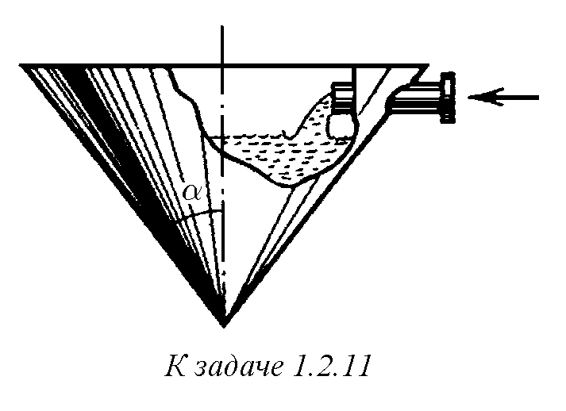

♦ 1.2.1. На фигурата е изобразена траекторията на електрон, който дрейфува покрай равнината на раздела на области с различни магнитни полета. Неговата траектория се състои от редуващи се полуокръжности с радиуси $R$ и $r$. Скоростта на електрона е постоянна по модул и е равна на $v$. Намерете средната скорост на електрона за голям интервал от време.

♦ 1.2.2. Две частици в момент от време $t=0$ са излезли от една точка. По графиките на зависимостта на скоростта от времето определете координатите и времето на новата среща на частиците.

♦ 1.2.3. Тяло в течение на време $t_0$ се движи с постоянна скорост $v_0$. След това скоростта му нараства линейно с времето така, че в момента от време $2t_0$ тя е равна на $2v_0$. Определете пътя, изминат от тялото за време $t > t_0$.

1.2.4. Начертайте графика на зависимостта на координатата от времето за праволинейно движение, което удовлетворява едновременно две условия: а) средната скорост в интервала от време от 2 до 6 s е равна на 5 m/s; б) максималната скорост в същия интервал е равна на 15 m/s.

1.2.5. Навлизайки в повреден участък на шосето, всеки автомобил в колоната намалява скоростта си от $v_1$ до $v_2$. Каква трябва да бъде дистанцията между автомобилите, за да не се сблъскат? Дължината на всеки автомобил е $l$.

♦ 1.2.6. Графиката на зависимостта на скоростта на тяло от времето има вид на полуокръжност. Максималната скорост на тялото е $v_0$, времето на движение е $t_0$. Определете пътя, изминат от тялото.

1.2.7. Автобус се движи в продължение на 20 s по права до спирка, изминавайки при това разстояние 310 m. Неговата начална скорост е 15 m/s. Докажете, че ускорението на автобуса променя посоката си.

1.2.8*. Частица, напускайки източника, прелита с постоянна скорост разстояние $L$, а след това се забавя с ускорение $a$. При каква скорост на частицата времето на движение от излитането ѝ до спирането ще бъде най-малко?

1.2.9. Мигриращи риби, натрупвайки в морето запас от мазнини, навлизат в устията на реките. В прясна вода те не се хранят, затова за тях е важно да стигнат до местата за хвърляне на хайвер във горното течение на реката с най-малки загуби на маса. Разходът на мазнини за поддържане на основната обмяна на веществата в организма на рибата за единица време е равен на $N$, а допълнителният разход $bv^2$ се изразходва за движение със скорост $v$. С каква скорост трябва да се движат рибите, за да бъдат минимални разходите на мазнини по пътя до местата за хвърляне на хайвер? (Рибите прекрасно усещат тази скорост.)

1.2.10. От полусферичен аквариум с радиус $R$, напълнен с вода, от единица площ на водата за единица време се изпарява обем течност $q$. След какво време водата ще се изпари?

♦ 1.2.11*. а. В коничен съд нивото на водата се покачва с постоянна скорост $v_0$. Как зависи от времето скоростта на постъпване на вода в съда през тръбичка със сечение $s$? В нулевия момент от време съдът е празен.

б. Струя масло, попадаща на повърхността на водата, се разтича по нея в кръгло петно с дебелина $h$. Как зависи от времето скоростта на движение на границата на петното, ако за единица време постъпва обем масло $q$? В началния момент от време радиусът на петното е равен на нула.

1.2.12. Момче надува балон. При радиус на балона 10 cm скоростта на увеличаване на радиуса е равна на 1 mm/s. Какъв обем въздух издишва момчето ежесекундно?

1.2.13. „Корабът вървеше на предела, по-нататъшно ускорение не беше предвидено в инструкциите на космофлота. След час скоростта нарасна с хиляда километра в секунда“ (Кир Буличов. Агент КФ // Химия и живот. 1984. № 12. С. 111). Намерете ускорението на кораба. Колко пъти то превъзхожда ускорението на свободното падане на Земята?

♦ 1.2.14. По графика на зависимостта на ускорението от времето установете скоростта в моментите от време 4 и 15 s, ако в момента от време 1 s скоростта е равна на 3 m/s.

1.2.15. Ускорението на ракетна количка от старта до спирането през първите 6 s е 100 m/s$^2$, след това в продължение на 7 s тя се движи без ускорение, а последните 3 s количката има отрицателно ускорение $-200$ m/s$^2$. Постройте графики на зависимостта от времето на ускорението, скоростта и координатата. Коя е най-голямата стойност, която е достигнала скоростта на количката? На кой участък от пътя е ставало спирането? Какво е пълното разстояние, което е изминала количката? Как по графика на зависимостта на ускорението от времето да проверим, дали наистина количката е спряла?

♦ 1.2.16. Графиките на зависимостта на координатата от времето, построени в различен мащаб на времето за две частици, се оказаха еднакви. Едно деление на оста на времето $t$ за графиката на първата частица отговаря на 4 s, а за графиката на втората — на 1 s. Намерете отношението на скоростите и отношението на ускоренията на частиците за точка $A$ на графиката.

♦ 1.2.17. Частта от графиката на зависимостта на координатата от времето, разположена под оста $t$, е подобна на тази част от графиката, която е над тази ос. Постройте графики на зависимостта от времето на скоростта и ускорението. Сравнете ускоренията при най-голямата и най-малката стойност на $x$.

♦ 1.2.18. По графика на зависимостта на скоростта от времето постройте графики на зависимостта от времето на координатата и ускорението, ако $x(0) = 0$.

♦ 1.2.19. Дължината на скалата на скоростомера е 15 cm; той измерва скоростта на автомобила в границите от нула до 150 km/h. Намерете скоростта на показалеца на скоростомера, ако автомобилът се движи с ускорение 2 m/s$^2$.

1.2.20*. Тяло започва движение от точка $A$ и се движи отначало равноускорено в продължение на време $t_0$, след това със същото по модул ускорение — равнозакъснително. След какво време от началото на движението тялото ще се върне в точка $A$?

1.2.21*. Времето на отпътуване на електричката по разписание е 12:00. На вашия часовник е 12:00, но покрай вас вече започва да преминава предпоследният вагон, който се движи покрай вас в течение на време $t_1$. Последният вагон преминава покрай вас в течение на $t_2$. Електричката е тръгнала навреме и се движи равноускорено. С колко време изостава вашият часовник?