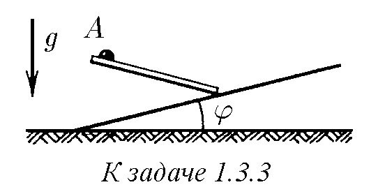
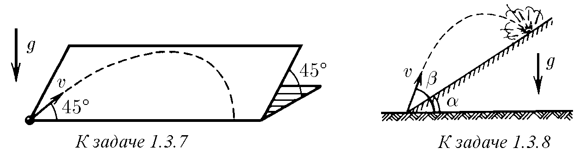
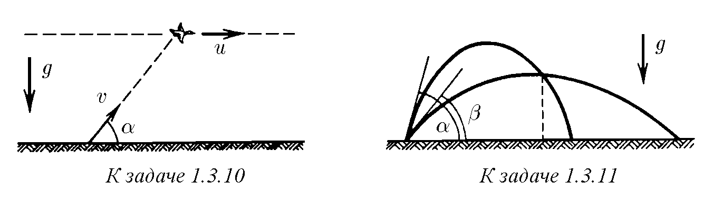
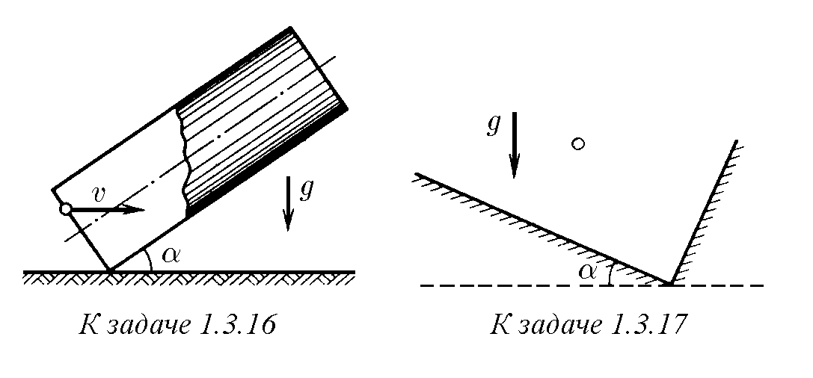
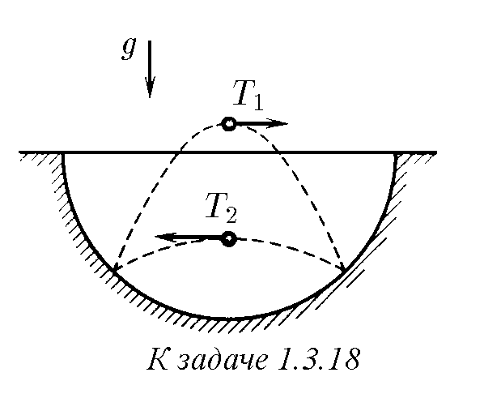
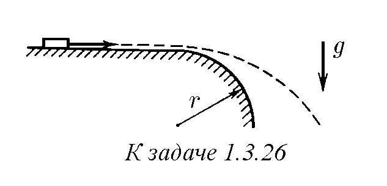

♦ 1.3.1. От една и съща точка вертикално нагоре с интервал от време $\Delta t$

са изстреляни две топчета със скорост $v$. След какво време, считано от излитането на второто топче, те ще се сблъскат?

♦ 1.3.2. а. От горната точка на окръжност по гладък улей под ъгъл $\phi$ спрямо вертикалата започва да се плъзга топче. За какво време то ще достигне окръжността, ако нейният диаметър е $D$?

♦ б. От точка $A$ по спици с различен наклон едновременно започват да се плъзгат без триене малки бусинки. Върху каква крива ще се намират бусинките в момент от време $t$?

♦ 1.3.3*. Под какъв ъгъл спрямо вертикалата трябва да бъде насочен от точка $A$ гладкият улей, така че топчето да се спусне по него върху наклонената равнина за най-малко време?

1.3.4. Свободно падащо тяло е прелетяло покрай точка $A$ със скорост $v_A$. С каква скорост то ще прелети покрай точка $B$, намираща се на $h$ под $A$?

1.3.5. Камък е хвърлен със скорост $v$ под ъгъл $\phi$ спрямо хоризонта. След какво време скоростта ще сключва ъгъл $\alpha$ спрямо хоризонта?

1.3.6. От оръдие е произведен изстрел под ъгъл $\phi$ спрямо хоризонта. Началната скорост на снаряда е $v$. Повърхността на земята е хоризонтална. Намерете: а) хоризонталната и вертикалната проекции на скоростта като функция на времето; б) зависимостта на координатите $x$ и $y$ от времето; в) уравнението на траекторията, т. е. зависимостта на $y$ от $x$; г) времето на полета, най-голямата височина и далекобойността на снаряда.

♦ 1.3.7. По гладка наклонена равнина със скорост $v$ е пуснато топче. Какво

хоризонтално разстояние ще измине то, преди да се отърколи от равнината?

Равнината е наклонена спрямо хоризонта под ъгъл $45^\circ$. Началната скорост

на топчето образува ъгъл $45^\circ$ с хоризонталния ръб на равнината.

♦ 1.3.8. От миномет се води стрелба по обекти, разположени на склона на

планина. На какво разстояние от миномета ще падат мините, ако тяхната начална скорост е $v$, ъгълът на наклона на планината е $\alpha$ и ъгълът на стрелба спрямо

хоризонта е $\beta$?

  

1.3.9. С каква скорост трябва в момента на старта на ракетата да излети снаряд

от оръдието, за да порази ракетата, стартираща вертикално с ускорение $a$?

Разстоянието от оръдието до мястото на старта на ракетата е равно на $L$, оръдието стреля под ъгъл $45^\circ$ спрямо хоризонта.

♦ 1.3.10. Патица летяла по хоризонтална права с постоянна скорост $u$.

Към нея е хвърлен камък от неопитен „ловец“, като хвърлянето е направено

без изпреварване, т. е. в момента на хвърлянето скоростта на камъка $v$ е била

насочена точно към патицата под ъгъл $\alpha$ спрямо хоризонта. На каква височина

е летяла патицата, ако камъкът все пак я е улучил?

  

♦ 1.3.11. От отвора на маркуч, прикрит с пръст, бликат две струи под ъгъл $\alpha$

и $\beta$ спрямо хоризонта с еднаква начална скорост $v$. На какво хоризонтално

разстояние от отвора ще се пресекат струите?

1.3.12*. От маркуч, лежащ на земята, блика вода под ъгъл $45^\circ$ спрямо

хоризонта с начална скорост $10$ м/с. Площта на сечението на отвора на маркуча

е $5$ см$^2$. Определете масата на струята, намираща се във въздуха.

1.3.13*. Снаряд, излетял от оръдие, е попаднал в точка с координати $x$ по

хоризонтала и $y$ по вертикала. Началната скорост на снаряда е $v$. Намерете:

а) тангенса на ъгъла, образуван от ствола на оръдието с хоризонта; б) границата на областта на възможното попадение на снаряда; в) най-малката начална

скорост на снаряда, при която той може да попадне в точка с координати $x, y$.

Указание. При решението използвайте тригонометричното тъждество

$1 / \cos^2 \phi = \text{tg}^2 \phi + 1$.

1.3.14. От едно и също място с интервал от време $\Delta t$ са хвърлени две тела

с една и съща начална скорост $v$ под ъгъл $\phi$ спрямо хоризонта. Как се движи

първото тяло спрямо второто? Защо относителната скорост зависи само от $\Delta t$?

1.3.15. По вътрешната повърхност на гладък вертикален цилиндър с радиус

$R$ под ъгъл $\alpha$ спрямо вертикалата е пуснато топче. Каква начална скорост

трябва да му бъде съобщена, за да се върне в изходната точка?

♦ 1.3.16*. В тръба с дължина $l$, наклонена под ъгъл $\alpha$ спрямо хоризонта,

влита топче с хоризонтална скорост $v$. Определете времето на престой на топчето в тръбата, ако ударите на топчето в нейните стени са еластични.

♦ 1.3.17. В правоъгълна кутия, еластично удряйки се в дъното и дясната стена,

по една и съща траектория натам и обратно скача топче. Интервалът от време

между ударите в дъното и стената е равен на $\Delta t$. Дъното на кутията образува ъгъл $\alpha$ спрямо хоризонта. Намерете скоростите на топчето непосредствено

след ударите.

  

♦ 1.3.18*. В сферична ямка скача топче, еластично удряйки се в нейните стени

в две точки, разположени на една хоризонтала. Интервалът от време между

ударите при движение на топчето отляво надясно винаги е равен на $T_1$, а при

движение отдясно наляво — $T_2 \ne T_1$. Определете радиуса на ямката.

1.3.19*. Каква минимална скорост трябва да има камък, хвърлен от момче,

за да прелети къща с височина $H$ и дължина $L$, ако хвърлянето се извършва от

височина $h$ и за хвърлянето момчето може да избере всяко място?

  

1.3.20. Определете скоростта и ускорението, които притежават точките на

земната повърхност на екватора и в Санкт Петербург поради участието на Земята в денонощното въртене. Приемете радиуса на Земята равен на $6400$ км.

Географската ширина на Санкт Петербург е $60^\circ$.

1.3.21. С каква скорост трябва да лети спътник, за да се движи по окръжност,

все време „падайки“ към Земята с ускорение $g$? Приемете радиуса на орбитата

$R = 6400$ км, а $g = 10$ м/с$^2$.

♦ 1.3.22*. Самолети летят по една права един срещу друг с еднаква скорост $v$.

Пределната далекобойност на тяхното взаимно откриване е $l$. Един самолет

след откриването на другия извършва завой, без да променя модула на скоростта, и лети успоредно на втория самолет. При какво постоянно ускорение

самолетите ще се изгубят един друг от поглед в края на завоя?

♦ 1.3.23. Малко тяло се движи с постоянна скорост $v$ по траектория, състояща

се от две плавно свързани дъги на окръжности с радиус $R$ и $R/3$. Постройте

векторите на ускорението в отбелязаните точки на траекторията.

  

1.3.24. В момента от време, когато скоростта на частицата е $10^6$ м/с, нейното ускорение е $10^4$ м/с$^2$ и е насочено под ъгъл $30^\circ$ спрямо скоростта. С

колко ще се увеличи скоростта за $10^{-2}$ с? С какъв ъгъл ще се измени направлението на скоростта? Каква е в този момент ъгловата скорост на въртене на

вектора на скоростта?

1.3.25. Малко тяло се движи по окръжност с радиус $r$ със скорост, която

линейно нараства във времето по закона $v = kt$. Намерете зависимостта на

пълното ускорение на тялото от времето.

♦ 1.3.26. Краят на гладка хоризонтална маса е

заоблен по окръжност с радиус $r$. С каква най-малка скорост трябва да бъде пуснато по масата

малко тяло, за да, достигайки заоблянето, веднага

отлети по парабола?

1.3.27*. Сферичен резервоар, стоящ на земята, има радиус $R$. При каква

най-малка скорост камък, хвърлен от земята, може да прелети над резервоара,

само докосвайки неговия връх?

1.3.28. Снаряди излитат с начална скорост $600$ м/с под ъгъл $30^\circ, 45^\circ,

60^\circ$ спрямо хоризонта. Определете радиуса на кривината на траекторията

на снарядите в техните най-високи и начални точки.

1.3.29. За икономия на място входът към един от най-високите в Япония

мостове е устроен във вид на винтова линия, обвиваща цилиндър с радиус $R$.

Пътното платно сключва ъгъл $\alpha$ с хоризонталната равнина. Какво е ускорението на автомобил, движещ се по него с постоянна по модул скорост $v$?

1.3.30*. Снаряд излита от оръдие със скорост $V$ под ъгъл $\alpha$ спрямо хоризонта. Какво време снарядът се приближава към оръдието?