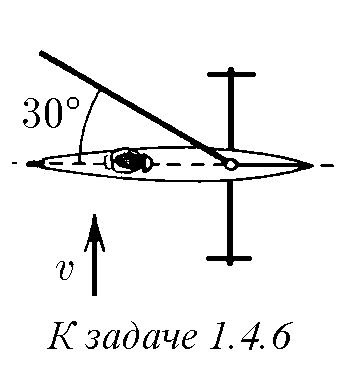
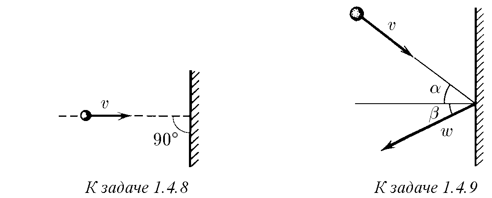
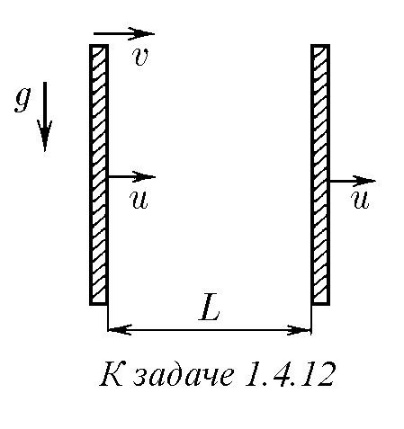

♦ 1.4.1. Началните положения и скорости на два кораба са дадени на рисунката. Корабите се движат без ускорение. Как да се намери най-малкото разстояние между тях?

♦ 1.4.2. На рисунката са изобразени скоростите на шест пуснати от стария Мазай зайци в координатна система, неподвижна спрямо Мазай. Опитайте се да нарисувате скоростите на Мазай и на останалите зайци в координатна система, неподвижна спрямо заек 1.

1.4.3. Една от частиците на праховия облак (частица A) е в покой, а всички останали се разпръскват от нея в различни посоки със скорости, пропорционални на разстоянията от тях до частица А. Каква картина на движение ще открие наблюдател, движещ се заедно с частица B?

♦ 1.4.4. От ъгъла А на квадратен сал скочило във водата и заплувало около сала куче. Нарисувайте траекторията на движение на кучето спрямо брега, ако то плува покрай страните на сала, а неговата скорост спрямо водата е 4/3 от скоростта на течението на реката.

1.4.5. а. Капките дъжд, поради съпротивлението на въздуха, падат с постоянна скорост $v$, перпендикулярна на земната повърхност. Как трябва да се разположи цилиндрична кофа, намираща се на движеща се със скорост $u$ платформа, така че капките да не попадат върху стените ѝ?

б. При скорост на вятъра $10$ м/с капките дъжд падат под ъгъл $30^\circ$ спрямо вертикалата. При каква скорост на вятъра капките ще падат под ъгъл $45^\circ$?

♦ 1.4.6∗ . Буерът представлява ветроходна шейна. Той може да се движи само по линията, по която са насочени неговите кънки. Вятърът духа със скорост $v$, перпендикулярна на посоката на движение на буера. Платното пък сключва $30^\circ$ с посоката на движение. Каква скорост не може да надхвърли буерът при този вятър?

1.4.7∗ . Каква ще бъде продължителността на полета на самолет от Новосибирск до Москва и обратно, който се осъществява по права линия, ако през целия полет вятърът духа под ъгъл $\alpha$ спрямо трасето със скорост $u$? Скоростта на самолета спрямо въздуха е $v$, дължината на трасето е $L$. При какво направление на вятъра продължителността на полета е максимална?

♦ 1.4.8. При еластичен удар на тяло в неподвижна стена неговата скорост $v$ променя само посоката си. Определете изменението след удара на скоростта на това тяло, ако стената се движи: а) със скорост $u$ насреща на тялото; б) със скорост $w < v$ в посока на движение на тялото.

♦ 1.4.9. Тяло се сблъсква със стена със скорост $v$ под ъгъл $\alpha$ към линията, перпендикулярна на стената. Определете скоростта на тялото след еластичен удар, ако стената: а) е неподвижна; б) се движи перпендикулярно на самата себе си със скорост $w$ насреща на тялото; в) се движи под ъгъл $\beta$ към линията, перпендикулярна на самата нея, със скорост $w$ насреща на тялото.

1.4.10. Вътре в сфера с радиус $R$, движеща се със скорост $u$, се намира топче с радиус $r$, което в момента, когато преминава през центъра на сферата, има скорост $v$, перпендикулярна на скоростта $u$. Масата на сферата е много по-голяма от масата на топчето. Определете с каква честота топчето се удря в стената на сферата. Ударите са абсолютно еластични.

1.4.11. Тяло се пуска над плоча на височина $h$ от нея. Плочата се движи вертикално нагоре със скорост $u$. Определете времето между два последователни удара на тялото в плочата. Ударите са абсолютно еластични.

♦ 1.4.12. Тяло влита хоризонтално със скорост $v$ в пространството между две вертикални стени, които се движат със скорост $u$. Определете скоростта на тялото след $n$-тия удар в предната стена. Разстоянието между стените е $L$. Ударите са абсолютно еластични.

1.4.13. Зъбно колело с радиус $R$ е поставено между две успоредни зъбни рейки. Рейките се движат със скорости $v_1$ и $v_2$ насреща една на друга. Каква е честотата на въртене на зъбното колело?

1.4.14∗ . Ядро, летящо със скорост $v$, се разпада на два еднакви осколъка. Определете максималния възможен ъгъл $\alpha$ между скоростта на единия от осколъците и вектора $v$, ако при разпадане на покоящо се ядро осколъците имат скорост $u < v$.

1.4.15∗ . Има сноп от еднакви ядра, движещи се със скорост $v$. Ядрата в снопа спонтанно се делят на двойки еднакви осколъци. Скоростта на осколъците, движещи се в посока на снопа, е равна на $3v$. Намерете скоростта на осколъците, движещи се в посока, перпендикулярна на снопа.

♦ 1.4.16. Два снопа частици, движещи се с еднаква по модул скорост $v$, се пресичат под ъгъл $\alpha$. Сблъсъците на частиците се случват в ограничена област. Нека преминем към координатна система, където скоростите на частиците са равни по модул и противоположни по посока. Изглежда, че сега областта на пресичане е целият обем на сноповете, и следователно броят на сблъсъците за единица време трябва да бъде по-голям. Обяснете получилото се противоречие.

  

1.4.17. Вали отвесен дъжд. Скоростта на капките е $u$. По асфалта със скорост $v$ се плъзга топка. Колко пъти за един и същ интервал от време върху нея попадат повече капки, отколкото върху същата, но неподвижна топка? Ще се промени ли отговорът, ако топката не е кръгла?

1.4.18∗ . Момче, което може да плува със скорост, два пъти по-малка от скоростта на течението на реката, иска да преплува тази река така, че да бъде възможно най-малко отнесено надолу по течението. Под какъв ъгъл спрямо брега трябва да плува? На какво разстояние ще бъде отнесено, ако ширината на реката е 200 м?