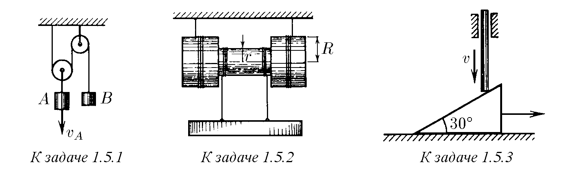
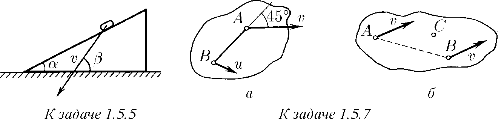
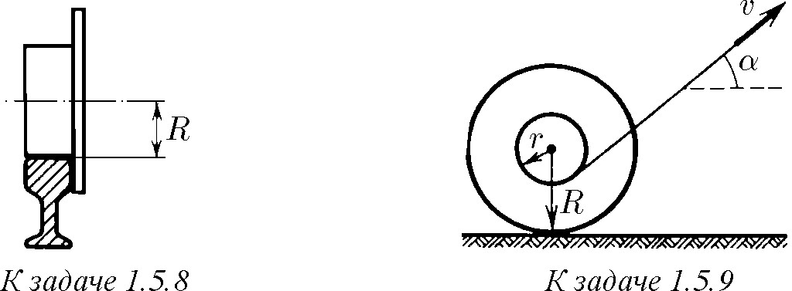
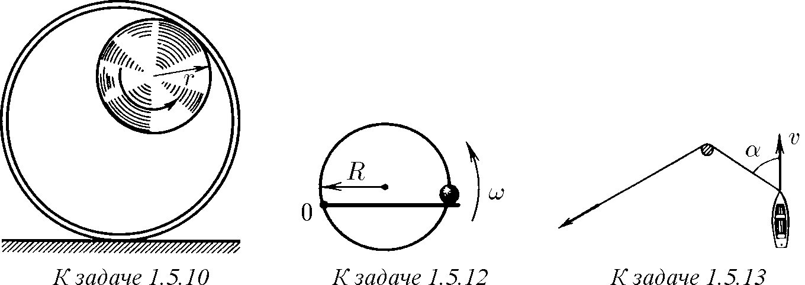
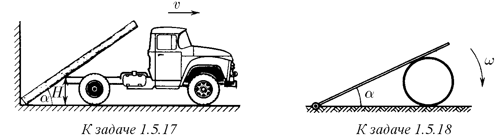
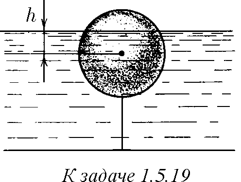

♦ 1.5.1. Скоростта на товар А е vA. Колко е скоростта на товар В?

♦ 1.5.2. Ъгловата скорост на макарата е ω, радиусът на вътрешния цилиндър е r, а радиусът на външните цилиндри е R. Какви са скоростите на оста на макарата и на товара спрямо земята?

♦ 1.5.3. Клин, който има ъгъл $30^\circ$, лежи на хоризонтална равнина. Вертикален прът, който се спуска със скорост $v$, кара клина да се плъзга по тази равнина. Колко е скоростта на клина?

  

1.5.4. Върху клин с ъгъл $\alpha$ лежи монета. С какво най-малко ускорение трябва да се движи клинът по хоризонталната равнина, за да пада монетата свободно надолу?

♦ 1.5.5$^*$. Скоростта на монета, която се плъзга от клин, е изобразена на рисунката. Чрез графично построяване намерете скоростта на клина.

1.5.6. Плоско твърдо тяло се върти около ос, перпендикулярна на неговата равнина. Координатите на началното положение на точките А и В на това тяло са $(-1, 2)$ и $(3, 1)$, а на крайното — $(-3, 1)$ и $(-2, -3)$. Чрез графично построяване намерете координатите на оста на въртене.

♦ 1.5.7. а. Скоростта на точка А на твърдо тяло е $v$ и образува ъгъл $45^\circ$ с посоката на правата АВ. Скоростта на точка В на това тяло е $u$. Определете проекцията на скоростта на точка В върху посоката АВ.

♦ б. Скоростите на точките А и В на твърдо тяло са $v$. Скоростта на точка С, намираща се в равнината на правата АВ и вектора $v$, е $u > v$. Намерете проекцията на скоростта на точка С върху ос, перпендикулярна на указаната равнина.

  

♦ 1.5.8. Постройте траекториите на точките на колело, което се търкаля без приплъзване по релса. Разгледайте случаите, когато точките се намират на разстояние от оста на колелото: $r > R$, $r = R$, $r < R$. Намерете ускорението на тези точки, ако оста на колелото се движи с постоянна скорост $v$. Намерете радиуса на кривината на траекторията на точка, намираща се в най-горно и най-долно положение на разстояние $r \neq R$ от оста на колелото.

♦ 1.5.9$^*$. Нишка, навита на оста на макара, се тегли със скорост $v$ под ъгъл $\alpha$ спрямо хоризонта. Макарата се търкаля по хоризонталната равнина без приплъзване. Намерете скоростта на оста и ъгловата скорост на въртене на макарата. При какви ъгли $\alpha$ оста се движи надясно? наляво? Нишката е толкова дълга, че ъгълът $\alpha$ не се променя при движението.

  

♦ 1.5.10. По вътрешната повърхност на закрепен цилиндър с радиус $2r$ се търкаля без приплъзване колело с радиус $r$. Намерете траекторията на точка от обода на колелото.

1.5.11. а. Луната е обърната към Земята постоянно с една и съща страна. Колко оборота ще направи тя около оста си за времето на пълен оборот около Земята?

б. С колко средно звездното денонощие е по-кратко от слънчевото? Земята обикаля Слънцето за $365,25$ слънчеви денонощия.

♦ 1.5.12. Топче може да се движи по пръстен с радиус $R$, подбутвано от спица, която се върти равномерно с ъглова скорост $\omega$ в равнината на пръстена. Оста на въртене на спицата се намира върху пръстена. Определете ускорението на топчето.

♦ 1.5.13. Въже, завързано за лодка, се тегли за свободния край по такъв начин, че то да не провисне. Лодката се движи с постоянна скорост $v$, образувайки в определен момент ъгъл $\alpha$ с отсечката въже, намираща се между стълба и лодката. С каква скорост трябва да се тегли в този момент свободният край на въжето?

  

1.5.14$^*$. Четири костенурки се намират във върховете на квадрат със страна $a$. Те започват да се движат едновременно с постоянна по модул скорост $v$. Всяка костенурка се движи в посока към своята съседка по часовниковата стрелка. Къде ще се срещнат костенурките и след какво време?

  

♦ 1.5.15. Постройте приблизителен график на зависимостта на скоростта на точка В от времето, ако скоростта $v_A$ на точка А е постоянна. Намерете формулата на тази зависимост, ако $x(0) = 0$.

♦ 1.5.16. Прът се опира с краищата си в страните на прав ъгъл. Горният край на пръта се повдига със скорост $v$. Намерете как зависи от времето скоростта на неговия долен край. За начало на отчитане на времето приемете момента, когато горният край се намира във върха на ъгъла. Дължината на пръта е $L$.

  

♦ 1.5.17. Дърво, опирайки долния си край в ъгъла между стената и земята, докосва дъното на камион на височина $H$ от земята. Намерете ъгловата скорост на дървото в зависимост от ъгъла $\alpha$ между него и хоризонталата, ако камионът се отдалечава от стената със скорост $v$.

  

♦ 1.5.18$^*$. Прът, шарнирно закрепен с единия си край на хоризонталната равнина, лежи върху цилиндър. Ъгловата скорост на пръта е $\omega$. Няма приплъзване между цилиндъра и равнината. Намерете зависимостта на ъгловата скорост на цилиндъра от ъгъла $\alpha$ между пръта и равнината.

♦ 1.5.19. Сферичен буй с радиус $R$ е завързан за дъното на водоема. Нивото на водата във водоема се покачва със скорост $u$. Колко е скоростта на преместване на границата на наводнената част на буя по неговата повърхност в момента, когато нивото на водата се оказва на $h$ по-високо от центъра на буя?

1.5.20. Бобина с магнитофонна лента се просвирва в продължение на време $t$ при скорост на протягане на лентата $v$. Началният радиус на бобината (с лентата) е $R$, а крайният (без лентата) е $r$. Колко е дебелината на лентата?