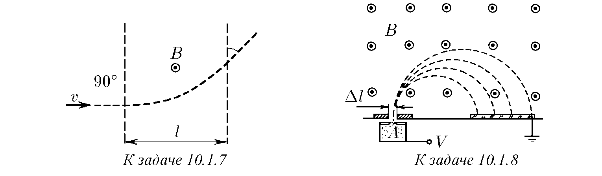
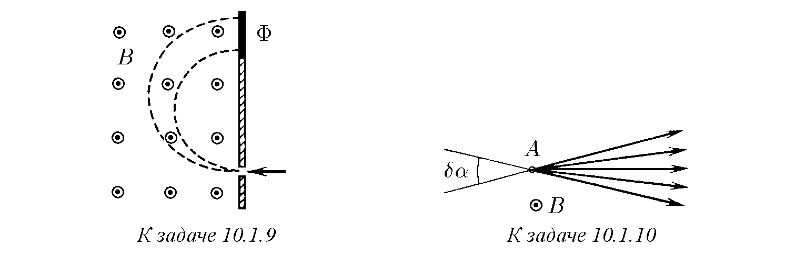
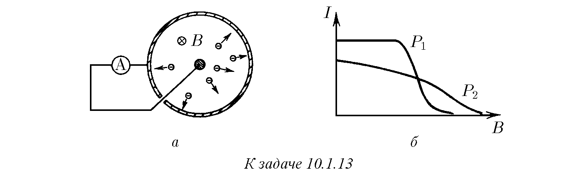
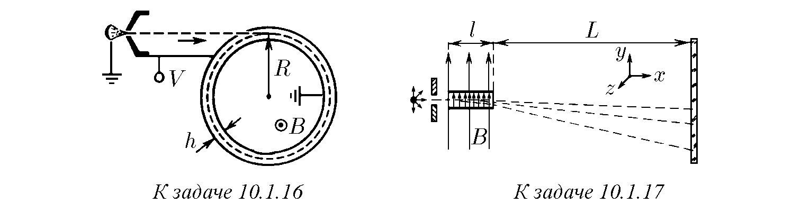
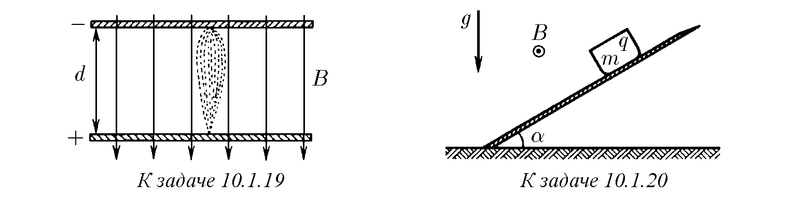
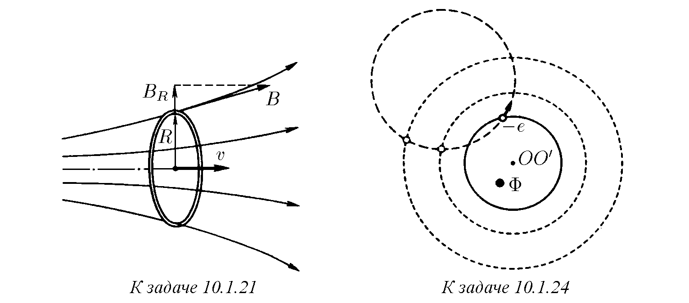
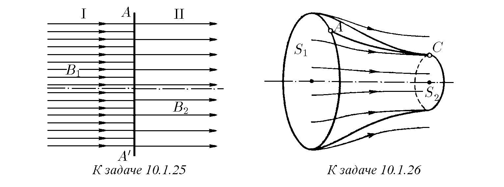
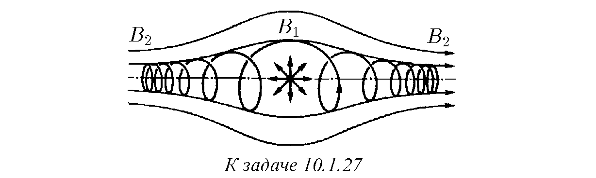
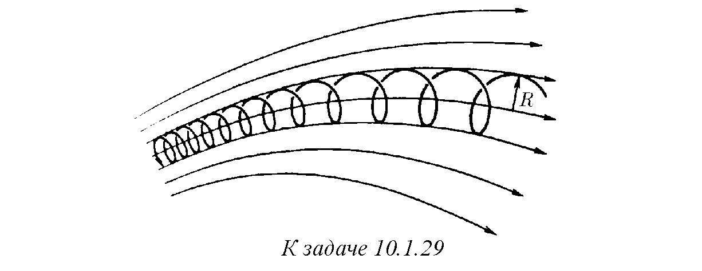

10.1.1. Протон, ускорен с напрежение 20 kV, влиза в еднородно магнитно поле с индукция 0,1 T перпендикулярно на полето. Намерете радиуса на окръжността, по която се движи протонът в магнитното поле.

10.1.2. Електрон, ускорен с напрежение 200 V, се движи в магнитното поле на Земята, чиято индукция е 70 μT. Намерете радиуса на окръжността, по която се движи електронът, ако скоростта му е перпендикулярна на магнитното поле на Земята.

10.1.3. а. Определете честотата на въртене (циклотронната честота) на частица с маса $m$ и заряд $q$ в магнитно поле с индукция $B$.
б. Определете циклотронната честота на електрон в магнитно поле с индукция 1 T.

10.1.4. Как се отнасят радиусите на траекториите на два електрона с кинетична енергия $K_1$ и $K_2$, ако еднородното магнитно поле е перпендикулярно на тяхната скорост?

10.1.5. След колко време след първата среща ще се състои среща на две заредени частици, движещи се перпендикулярно на магнитно поле с индукция $B$? Зарядът на частиците е $q$, масата — $m$. Пренебрегнете взаимодействието.

10.1.6. С помощта на камера на Уилсън, поставена в магнитно поле с индукция $B$, се наблюдава еластично разсейване на $\alpha$-частици от девтериеви ядра. Намерете началната енергия на $\alpha$-частицата, ако радиусът на кривината на началните участъци на траекториите на ядрото и $\alpha$-частицата след разсейването се е оказал равен на $R$. И двете траектории лежат в равнина, перпендикулярна на индукцията на магнитното поле.

♦ 10.1.7. Електрон влиза в област на магнитно поле с ширина $l$. Скоростта на електрона $v$ е перпендикулярна както на индукцията на полето $B$, така и на границите на областта. Под какъв ъгъл спрямо границата на областта електронът ще излезе от магнитното поле?

♦ 10.1.8. На фигурата е изобразен най-прост масспектрометър, в който индукцията на магнитното поле е 0,1 T. В йонизатора $A$ се образуват йони, които се ускоряват с напрежение 10 kV. След завъртане в магнитното поле йоните попадат върху фотопластинка и предизвикват нейното почерняване. На какво разстояние от процепа ще се намират на фотопластинката ивиците на йоните $^1H^+$, $^2H^+$, $^3H^+$, $^4He^+$? Каква трябва да бъде ширината на процепа, за да се разделят ивиците на йоните $^{16}O^+$ и $^{15}N^+$?

♦ 10.1.9. В устройство за определяне на изотопния състав йоните на калия $^{39}K^+$ и $^{41}K^+$ първо се ускоряват в електрическо поле, а след това попадат в еднородно магнитно поле с индукция $B$, перпендикулярно на посоката на тяхното движение. По време на опита, поради несъвършенство на апаратурата, ускоряващото напрежение се променя около средната си стойност с величина $\pm \Delta V$. С каква относителна грешка $\Delta V/V_0$ трябва да се поддържа постоянна стойността на ускоряващото напрежение, за да не се застъпват следите от сноповете калиеви изотопи върху фотопластинката $\Phi$?

♦ 10.1.10*. От точка $A$ със скорост $v$ излитат частици, имащи малко ъглово разсейване $\delta\alpha$, и по-нататък се движат в еднородно магнитно поле с индукция $B$ перпендикулярно на него. Определете на какво разстояние от точка $A$ ще се събере снопът и оценете на това място неговия напречен размер. Масата на частиците е $m$, зарядът — $q$.

10.1.11. В еднородно магнитно поле с индукция $B$ влиза под ъгъл $\alpha$ спрямо полето със скорост $v$ частица с маса $m$ и заряд $q$. Намерете радиуса и стъпката на винтовата линия, по която се движи частицата.

10.1.12*. По протежение на еднородно магнитно поле с индукция $B$ от една точка със скорост $v$ излитат електрони, имащи малко ъглово разсейване $\delta\alpha$. Определете на какво разстояние от мястото на излитане снопът ще има минимален напречен размер и го оценете.

♦ 10.1.13. а. Вакуумно устройство се състои от съосни цилиндър с радиус $R$ и жичка, поставени в надлъжно магнитно поле с индукция $B$. При нагряване на жичката от нейната повърхност излитат електрони с кинетична енергия $K$; при това във външната верига между цилиндъра и жичката протича ток $I$. Начертайте зависимостта на $I$ от $B$. Намерете стойностите на $B$, при които токът във вакуума е равен на нула.
б. На фигурата са изобразени две зависимости на $I$ от $B$ при различно налягане $P_1$ и $P_2$ на остатъчните газове. Кое налягане е по-голямо?

10.1.14. Два електрона се движат с еднаква по модул скорост $v$ в еднородно магнитно поле. В определен момент разстоянието между тях е $2R$, а скоростите на електроните са перпендикулярни на магнитното поле и на правата, съединяваща електроните. При каква индукция на магнитното поле разстоянието между електроните ще остане неизменно?

10.1.15. По орбита с радиус $R$ около протон се върти електрон. Как ще се промени честотата на въртене на електрона по същата орбита, ако системата бъде поставена в слабо магнитно поле с индукция $B$, насочено по оста на въртене?

♦ 10.1.16. Какво напрежение трябва да се приложи между плочите на цилиндричен кондензатор, за да „захване на орбита“ електрони, преминали през ускоряваща потенциална разлика $V$? Кондензаторът се намира в еднородно магнитно поле с индукция $B$, насочено по оста на кондензатора. Разстоянието между плочите $h$ е много по-малко от средния радиус на кондензатора $R$.

♦ 10.1.17. а. В плосък кондензатор с дължина $l$ интензитетът на електрическото поле е $E$, а индукцията на магнитното поле, насочено по направление на $E$, е $B$. На входа на кондензатора има радиоактивен източник, излъчващ електрони с различни скорости. От тях се оформя тесен сноп, който преминава през кондензатора и след това попада върху фотопластинка, разположена на разстояние $L \gg l$. Каква линия-следа ще „начертаят“ електроните върху фотопластинката, ако отклоненията им от праволинейната траектория са малки?
б. Намерете линията-следа на електроните върху фотопластинката за $B = 1$ T, $E = 5 \cdot 10^5$ V/m, $l = 5$ cm, $L = 50$ cm.
в. При голяма скорост на електрона неговата маса се променя забележимо; съгласно формулата на Лоренц $m = m_e / \sqrt{1 - \beta^2}$, където $\beta$ е отношението на скоростта на електрона към скоростта на светлината, $m_e$ — масата на покой на електрона. Решете задача 10.1.17а, като вземете предвид ефекта на промяна на масата на електрона.

10.1.18. Определете времето за ускорение на протон, влизащ в центъра на ускорителя с кинетична енергия $K$, ако ускоряващото напрежение на дуантите на циклотрона е $V$, индукцията на магнитното поле на ускорителя е $B$, а неговият радиус е $R$. Пренебрегнете времето на движение на протона между дуантите на ускорителя.

♦ 10.1.19. Плочите на плосък кондензатор с ширина на междината между тях $d$ са разположени перпендикулярно на магнитно поле с индукция $B$. До катода е разположен източник на бавни електрони, излитащи в различни посоки към плочите. При какво напрежение на кондензатора електроните ще се фокусират върху анода? От какво се определя размерът на петното?

♦ 10.1.20. Определете каква максимална скорост ще развие заредено тяло, плъзгащо се по наклонена равнина в магнитно поле с индукция $B$ и в гравитационно поле. Масата и зарядът на тялото са $m$ и $q$. Магнитното поле е успоредно на наклонената равнина и перпендикулярно на гравитационното поле. Ъгълът на наклон на равнината към хоризонта е $\alpha$. Коефициентът на триене в равнината е $\mu$.

♦ 10.1.21. Равномерно заредено пръстен с радиус $R$, чиято линейна плътност на заряда е $\rho$, се движи съосно на аксиално-симетрично магнитно поле със скорост $v$. Радиалната съставяща на индукцията на магнитното поле на разстояние $R$ от оста е $B_R$. Определете момента на силите, действащи върху пръстена.

10.1.22*. Докажете, че изменението на момента на импулса $\Delta M$ на пръстена в задача 10.1.21 е пропорционално на изменението на потока на магнитната индукция през пръстена $\Delta \Phi$: $\Delta M = (1/2\pi)Q\Delta\Phi$, където $Q$ е електрическият заряд на пръстена. За доказателството използвайте факта, че потокът на магнитната индукция през околната повърхност на цилиндъра е равен на разликата между потоците през неговите основи.

10.1.23*. Каква минимална скорост трябва да се придаде на равномерно заредено непроводящо пръстен, разположено съосно на аксиално-симетрично поле, по протежение на оста на това поле, за да се премести пръстенът от област на еднородно магнитно поле $B_1$ в област на еднородно поле $B_2$, $B_2 > B_1$? Радиусът на пръстена е $R$, зарядът — $Q$, масата — $m$.

♦ 10.1.24. а. Електрон се движи в еднородно магнитно поле по окръжност. През него се прекарва всякаква друга окръжност, чиято ос $OO'$ е насочена по магнитното поле. Покажете, че сумата $M + (1/2\pi)e\Phi$, където $\Phi$ е потокът на магнитното поле през тази окръжност, а $M$ е моментът на импулса на електрона спрямо оста $OO'$, не зависи от положението на електрона.
б. Покажете, че сумата $M + (1/2\pi)e\Phi$ не се променя в случай на движение на електрон в еднородно магнитно поле по винтова линия.

♦ 10.1.25. Областите I и II на две еднородни еднопосочни магнитни полета с индукция $B_1$ и $B_2$ имат осесиметричен тънък преход $AA'$, в който магнитното поле има голяма радиална съставяща. Електрон в област I се движи по магнитното поле на разстояние $R$ от оста на симетрия на прехода. Какъв момент на импулса спрямо оста на симетрия придобива електронът при преминаване от област I в област II? Остава ли при движението на тази частица постоянна сумата $M + (1/2\pi)e\Phi$ (виж означенията в задача 10.1.24)?

♦ 10.1.26*. Докажете, че изменението на момента на импулса на електрона при движението му от точка $A$ до точка $C$ в аксиално-симетрично магнитно поле спрямо оста на полето е равно на разликата на магнитните потоци през сеченията $S_1$ и $S_2$, умножена по $e/2\pi$.

♦ 10.1.27*. Каква част от електроните, излъчени във всички посоки от радиоактивна прашинка, разположена на оста на магнитна капан, ще остане вътре в този капан? Индукцията на магнитното поле вътре в капана е $B_1$, извън него — $B_2 > B_1$.

10.1.28*. Определете минималния радиус, който може да има сноп електрони при преминаване от поле с индукция $B_1$ в поле с индукция $B_2$. Осите на симетрия на преходното поле и на снопа съвпадат. Радиусът на снопа в поле $B_1$ е равен на $R$, скоростта на снопа в поле $B_1$ е успоредна на индукцията.

♦ 10.1.29*. В силни магнитни полета електронът се движи по винтова линия, „навита“ върху линията на магнитното поле. Докажете, че в случая, когато радиусът на винтовата линия е толкова малък, че полето вътре в нея може да се счита за еднородно, произведението на квадрата на радиуса на винтовата линия по индукцията на магнитното поле не се променя.