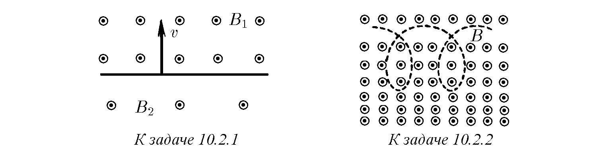
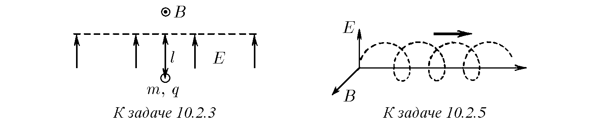
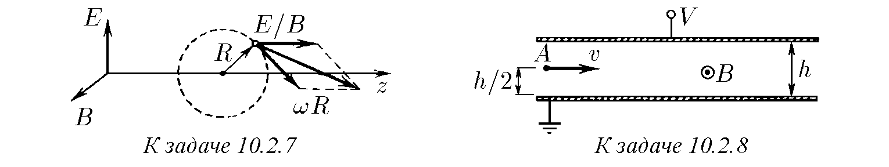
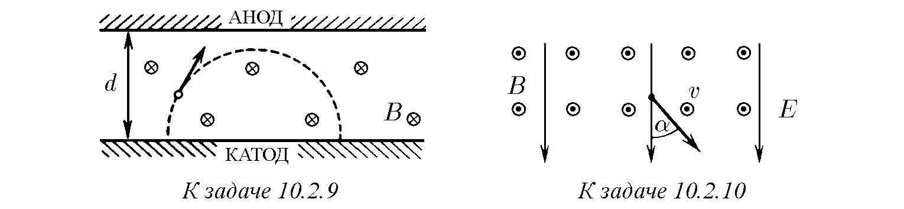

♦ 10.2.1. Пространството е разделено на две области от равнина. В едната област е създадено магнитно поле с индукция $B_1$, в другата — с индукция $B_2$, като полетата са еднородни и успоредни помежду си. От разделителната равнина перпендикулярно на нея стартира електрон със скорост $v$ в посока към областта с индукция на полето $B_1$. Опишете по-нататъшното движение на електрона. Определете средната (дрейфова) скорост на преместване на електрона по протежение на границата между магнитните полета, която е проницаема за него.

♦ 10.2.2*. Оценете скоростта на дрейф на електрон напречно на нееднородно магнитно поле, чиито компоненти на индукцията са $B_x = 0$, $B_y = 0$, $B_z = B_0(1 + \alpha x)$. Скоростта на електрона е $v$, $v \ll eB_0/(\alpha m_e)$.

♦ 10.2.3. Области на еднородни магнитно и електрическо полета са разделени от граница — равнина. Магнитното поле с индукция $B$ е успоредно на разделителната равнина. Електрическото поле с интензитет $E$ е перпендикулярно на разделителната равнина. В електрическото поле на разстояние $l$ от границата се поставя частица с маса $m$ и заряд $q$. Начертайте траекторията на тази частица. Намерете скоростта на дрейф на частицата по протежение на проницаемата за нея граница на полетата.

10.2.4. Взаимно перпендикулярни електрическо и магнитно полета се наричат кръстосани. Каква начална скорост трябва да има заредена частица в посока, перпендикулярна на двете полета, за да остане нейното движение в кръстосаните полета праволинейно? Интензитетът на електрическото поле е $E$, индукцията на магнитното поле е $B$.

♦ 10.2.5. В кръстосани електрическо и магнитно полета $E$ и $B$ частицата „дрейфува“ напречно на двете полета. На колко е равна дрейфовата скорост на частицата?

10.2.6. На колко е равна дрейфовата скорост на заредена частица, движеща се напречно на електрическо и магнитно полета, ако ъгълът между $E$ и $B$ е $\alpha$?

♦ 10.2.7. Докажете, че заредена частица в кръстосани електрическо и магнитно полета се върти с честота $\omega = qB/m$ около център, който се движи с дрейфова скорост (и следователно скоростта на частицата във всеки момент от времето е равна на векторната сума от линейната скорост на въртене около моментния център и дрейфовата скорост).

♦ 10.2.8. Плосък кондензатор е поставен в еднородно магнитно поле с индукция $B$, успоредно на плочите. От точка $A$ излитат електрони в посока, перпендикулярна на магнитното поле. Напрежението, приложено към плочите, е $V$. При какво условие електроните ще преминават през кондензатора?

♦ 10.2.9. Към плоски анод и катод, разстоянието между които е $d$, се подава високо напрежение. Системата се намира в магнитно поле с индукция $B$, успоредно на равнината на електродите. Определете при какво напрежение електроните ще достигнат анода. Намерете това напрежение, ако $B = 0,1$ T, $d = 2$ cm.

♦ 10.2.10. Електрон се движи със скорост $v$ напречно на еднородно магнитно поле с индукция $B$. Включва се електрическо поле с интензитет $E$, което е перпендикулярно на магнитното поле и е насочено под ъгъл $\alpha$ към скоростта на електрона. Определете по-нататъшното движение на електрона.

10.2.11. Намерете скоростта на дрейф на частица със заряд $q$ в перпендикулярни едно на друго магнитно поле с индукция $B$ и поле на постоянна сила $F$.

10.2.12. Намерете дрейфовата скорост на електрон и протон в гравитационното поле и магнитното поле на Земята, чиято индукция е равна на $0,7 \cdot 10^{-4}$ T. Магнитното поле е перпендикулярно на гравитационното поле.