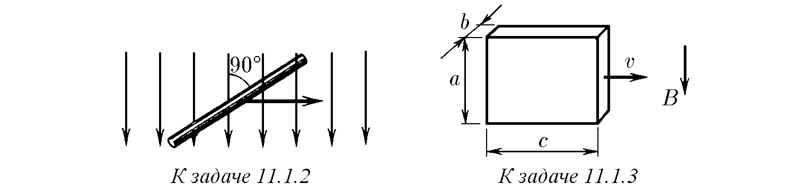
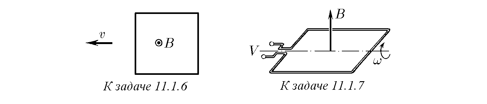
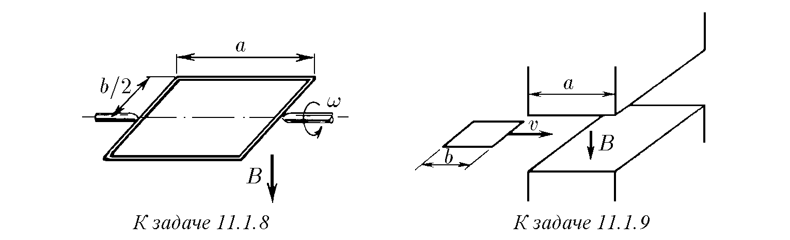
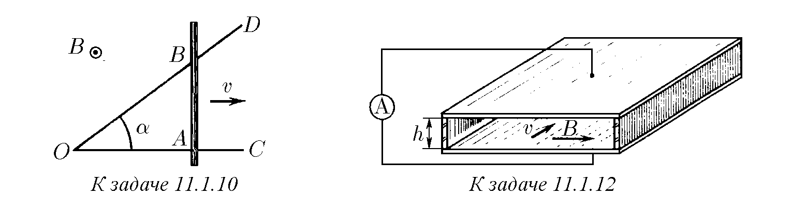
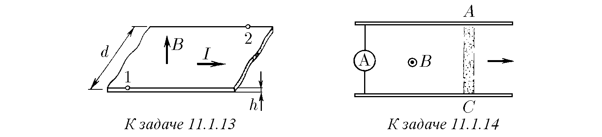
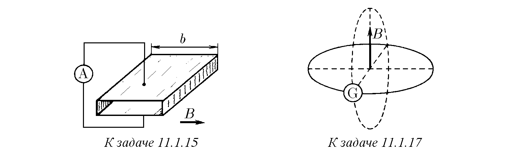
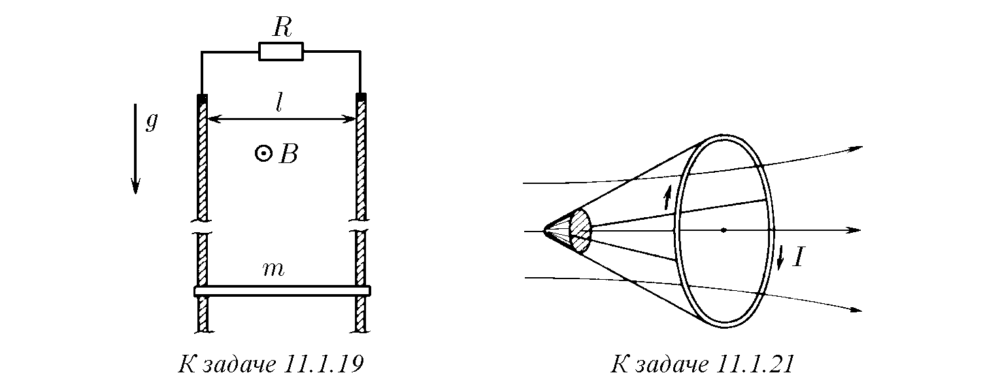
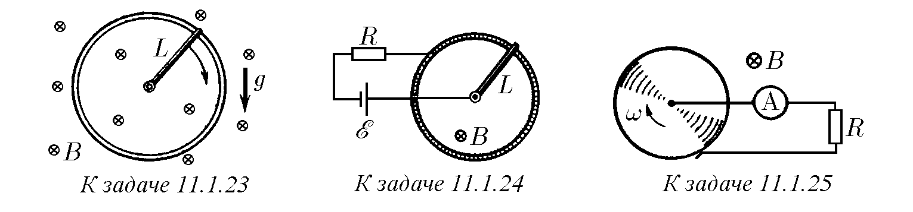
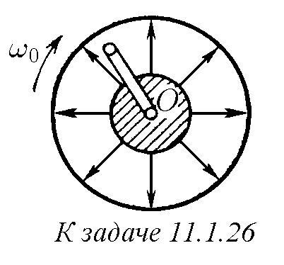

11.1.1. Между кои части на самолета възниква максимално напрежение на електрическото поле поради движението му в магнитното поле на Земята?

♦ 11.1.2. Напречно на магнитно поле с индукция 0,1 T се движи със скорост 1 m/s прав проводник с дължина 0,3 m. На колко е равно напрежението на електрическото поле между краищата на проводника?

♦ 11.1.3. Метален блок с размери $a \times b \times c$ ($b \ll a, c$) се движи със скорост $v$ в магнитно поле с индукция $B$, както е показано на фигурата. Намерете потенциалната разлика между страничните стени на блока и повърхностната плътност на зарядите върху тях.

11.1.4*. Да предположим, че атомът може да се представи като сфера с радиус $r$ с равномерно разпределен отрицателен заряд, в центъра на която се намира точково ядро с положителен заряд $Ze$. Намерете с каква скорост може да се движи такъв атом напречно на магнитно поле с индукция $B$, без да се разпадне.

11.1.5*. Отрицателни водородни йони $H^-$ влизат след ускоряването им от електрическо поле в напречно магнитно поле с индукция 40 T. Оценете при каква ускоряваща потенциална разлика тези йони все още не се разрушават от магнитното поле. Енергията на връзката на външния електрон в отрицателния водороден йон е $0,72 \text{ eV} \approx 10^{-19} \text{ J}$.

♦ 11.1.6. Магнитната индукция $B$ е перпендикулярна на равнината на квадратна телена рамка. Намерете разпределението на интензитета на електрическото поле по протежение на проводника на рамката, ако тя се движи напречно на полето с постоянна скорост $v$.

♦ 11.1.7. Индукцията на постоянно магнитно поле се измерва с помощта на квадратна рамка с размери $a \times a$, въртяща се с ъглова скорост $\omega$. Оста ѝ на въртене е перпендикулярна на посоката на магнитното поле. Амплитудата на електрическото напрежение, снемано от рамката, е $V$. Намерете индукцията на магнитното поле*).

♦ 11.1.8. Правоъгълна рамка с размери $a \times b$ е поставена в магнитно поле с индукция $B$, като в началния момент от време равнината на рамката е перпендикулярна на силовите линии на полето. Рамката се върти с ъглова скорост $\omega$.
а. Постройте графика на зависимостта на тока, течащ в рамката, от времето. Съпротивлението на рамката е $R$.
б. Как зависи от времето моментът на силите, необходим за поддържане на постоянна скорост на въртене на рамката?

♦ 11.1.9. Квадратна затворена навивка от тел, дължината на страната на която е $b$, а съпротивлението на единица дължина е $\rho$, преминава с постоянна скорост $v$ през междината на електромагнит. Магнитното поле в междината е еднородно, неговата индукция е $B$. Считайки полето извън тази междина за нула, определете енергията, превърната в топлина, за случаите, когато дължината на междината $a$ в посоката на движение на навивката е по-малка от $b$ и по-голяма от $b$, а в перпендикулярната посока — по-голяма от $b$.

♦ 11.1.10*. Метален прът $AB$, съпротивлението на единица дължина на който е $\rho$, се движи с постоянна скорост $v$, перпендикулярна на $AB$, затваряйки два идеални проводника $OC$ и $OD$, образуващи помежду си ъгъл $\alpha$. Дължината на $OC$ е $l$ и $AB \perp OC$. Цялата система се намира в еднородно постоянно магнитно поле с индукция $B$, перпендикулярно на равнината на системата. Намерете пълното количество топлина, което ще се отдели във веригата за времето на движение на пръта от точка $O$ до точка $C$.

11.1.11. В един фантастичен роман се предлага проект за електроцентрала, използваща енергията на морските течения и магнитното поле на Земята. В океана са потопени две хоризонтални метални плочи с площ $S = 1 \text{ km}^2$, разположени на разстояние $L = 100 \text{ m}$ една над друга. Морската вода, притежаваща специфично съпротивление $\rho = 0,25 \Omega \cdot \text{m}$, тече от изток на запад със скорост $v = 1 \text{ m/s}$. Магнитното поле на Земята на даденото място е еднородно, насочено от юг на север, а индукцията на това поле е $B = 10^{-4} \text{ T}$. В резултат между плочите се появява напрежение, а ако те се съединят с проводници към външен товар, в него се отделя мощност. Определете максималната мощност, която може да се получи по този начин.

♦ 11.1.12*. В магнитохидродинамичен генератор между плоски паралелни електроди, разположени на разстояние $h = 10 \text{ cm}$ един от друг, се движи нажежен газ, чиято проводимост е пропорционална на плътността. Площта на всеки електрод е $S = 1 \text{ m}^2$. Магнитното поле на генератора е паралелно на плочите и перпендикулярно на газовия поток, като индукцията на това поле е $B = 1 \text{ T}$. При влизане в генератора скоростта на газа е $v = 2000 \text{ m/s}$, а проводимостта е $\lambda = 50 \text{ S/m}$. Определете максималния ток и максималното напрежение на генератора.

♦ 11.1.13. По проводяща лента с ширина $d$ тече ток $I$. Лентата се намира в магнитно поле с индукция $B$. Посоката на полето е перпендикулярна на нейната равнина. Намерете потенциалната разлика между точки 1 и 2 на лентата, ако нейната дебелина е $h$, а обемната плътност на заряда на токоносителите в нея е $\rho$.

♦ 11.1.14. а. Ускорител на плазма (релсотрон) се състои от два паралелни масивни проводника (релси), лежащи в равнина, перпендикулярна на магнитно поле с индукция $B$. Между точките $A$ и $C$ във водород се запалва електрически разряд. Токът $I$ в разряда се поддържа постоянен. Под действие на магнитното поле областта на разряда (плазменият съсирек) се премества, ускорявайки се към краищата на релсите и откъсвайки се от тях. На колко е равна скоростта на плазмения съсирек, ако неговата маса е $m$? Разстоянието между релсите е $l$. Дължината на участъка, на който става ускорението на плазмата, е $L$.
б. Решете задачата за случая $B = 1 \text{ T}, l = 0,1 \text{ m}, L = 1 \text{ m}, I = 10 \text{ A}$; в плазмения съсирек се съдържат $10^{13}$ водородни йона.

♦ 11.1.15. В тръба с правоъгълно сечение $a \times b$ се намира газ с плътност $\rho$. Вертикалните стени на тръбата са изолатори, а хоризонталните — електроди. В единия край на тръбата се запалва разряд, след което токът $I$ се поддържа постоянен. Възникналата област на горене на разряда се втиква навътре в тръбата от магнитните сили, „изривайки“ газа пред себе си. Определете установената скорост на плазмената „тапа“, считайки, че тя през цялото време е по-голяма от скоростта на звука в газа. Магнитното поле с индукция $B$ е перпендикулярно на вертикалните стени на тръбата.

11.1.16. Тънка проводяща халка е поставена в магнитно поле $B$, перпендикулярно на равнината на халката. Радиусът на халката се увеличава с постоянна скорост $v$. Определете зависимостта на тока в халката от времето, ако в началния момент съпротивлението на халката е $R_0$, а радиусът ѝ е $r_0$. Плътността и проводимостта на материала на халката не се променят при разтягане.

♦ 11.1.17. Навивка с площ $S$ е разположена перпендикулярно на магнитно поле с индукция $B$. Тя е затворена през галванометър със съпротивление $R$. Какъв заряд ще протече през този галванометър, ако навивката се завърти паралелно на полето?

♦ 11.1.18*. Бобината на датчик за магнитно поле е изработена от меден проводник с диаметър 0,2 mm. Радиусът на бобината е 1 cm. Специфичното съпротивление е $1,7 \cdot 10^{-8} \Omega \cdot \text{m}$. Датчикът определя индукцията на магнитното поле по заряда, който протича през бобината, затворена към галванометър, когато тя се внася в магнитно поле така, че оста на бобината съвпада с посоката на полето. Определете индукцията на магнитното поле, ако през галванометъра, когато бобината е внесена в полето, е протекъл заряд $10^{-4} \text{ C}$.

♦ 11.1.19. В еднородно магнитно поле с индукция $B$ се намират две вертикални шини, разположени в равнина, перпендикулярна на силовите линии на полето. По шините, разстоянието между които е $l$, може да се плъзга проводник с маса $m$. Определете установената скорост на този проводник, ако горните краища на шините са затворени към съпротивление $R$. В какви видове енергия преминава работата на силата на тежестта?

11.1.20*. Определете в задача 11.1.19 зависимостта на скоростта на проводника от времето при нулева начална скорост в случая, когато горните краища на шините са затворени: а) към съпротивление $R$; б) към капацитет $C$.

♦ 11.1.21. В осесиметрично магнитно поле тяло може да се ускорява, като се поддържа постоянен ток $I$ в навивка, свързана с тялото и ориентирана перпендикулярно на оста на симетрия на полето. Докажете, че нарастването на кинетичната енергия на тялото заедно с навивката е пропорционално на нарастването на магнитния поток през навивката, и намерете коефициента на пропорционалност.

11.1.22*. В магнитно поле от голяма височина пада пръстен с радиус $a$ и маса $m$. Съпротивлението на пръстена е $R$. Равнината на пръстена през цялото време е хоризонтална. Намерете установената скорост на падане на пръстена, ако вертикалната съставка на индукцията на магнитното поле се променя с височината по закона $B = B_0(1+\alpha h)$.

♦ 11.1.23*. В гравитационно поле е поставен вертикално метален пръстен. Метален прът с дължина $L$ и маса $m$ е закрепен шарнирно в центъра на пръстена и го докосва с другия си край. Еднородно магнитно поле с индукция $B$ е перпендикулярно на равнината на пръстена. По какъв закон трябва да се променя токът в пръта, за да може той да се върти равномерно с ъглова скорост $\omega$, ако в началния момент прътът се е намирал в горно положение? Триенето да се пренебрегне.

♦ 11.1.24. На фигурата е изобразен модел на двигател за постоянен ток. ЕДС на батерията е $E$, индукцията на магнитното поле е $B$, съпротивлението на веригата е $R$, дължината на моста е $L$.
а. Определете установената ъглова скорост на моста и тока във веригата, ако силата на триене в подвижния контакт е $F$.
б*. Намерете зависимостта на ъгловата скорост на моста от времето, ако началната му скорост е нула, а триенето може да се пренебрегне.

♦ 11.1.25*. Проводящ диск се върти с ъглова скорост $\omega$ в еднородно магнитно поле с индукция $B$, перпендикулярно на равнината на диска. Какво ще покаже амперметърът, включен през съпротивление $R$? Намерете тока, ако $R = 1 \Omega$, радиусът на диска е $r = 0,05 \text{ m}$, $\omega = 2\pi \cdot 50 \text{ rad/s}$, $B = 1 \text{ T}$.

♦ 11.1.26*. На оста $O$ е закрепена шарнирно с едната си страна квадратна телена рамка с размери $a \times a$. Около същата ос се върти с ъглова скорост $\omega_0$ магнит, създаващ в областта, където е разположена рамката, радиално магнитно поле. Определете ъгловата скорост на рамката, ако съпротивлението на единица нейна дължина е $\rho$, моментът на силата на триене е $M$, а индукцията на магнитното поле при свободния край на рамката е $B$.

11.1.27. Защо електродвигателят може да изгори, ако роторът му бъде спрян?

11.1.28. Честотата на ротора на електродвигател за постоянен ток, включен във верига на батерия с ЕДС 24 V, при пълно съпротивление на веригата $20 \Omega$, е $600 \text{ min}^{-1}$ при ток във веригата 0,2 A. Каква ЕДС ще развие същият двигател, работещ като динамо-машина с честота $1200 \text{ min}^{-1}$?

11.1.29. Каква честота ще развие електродвигател за постоянен ток с постоянен магнит, включен във верига с ЕДС $E$ при пълно съпротивление на веригата $R$, ако, работейки като динамо-машина, той развива ЕДС $E_0$ при честота $f_0$? Моментът на силата на триене върху оста на двигателя е $M$.

11.1.30. Каква ЕДС развива динамо-машина за постоянен ток, ако при съпротивление на веригата $300 \Omega$ за въртене на ротора се изразходва мощност 50 W, а загубите от триене съставляват 4% от мощността? Каква мощност за поддържане на същата честота е необходимо да се изразходва при съпротивление на веригата $60 \Omega$?

11.1.31*. Роторите на два еднакви електродвигателя за постоянен ток са съосни и твърдо свързани помежду си. Към намотките на роторите са включени еднакви източници на ток с ЕДС $E$. При това ъгловата скорост на въртене на роторите без товар е $\omega_0$. Ако двигателите се спрат, токът в роторите ще бъде $I_0$. Единият от източниците е превключен така, че въртящите моменти на двигателите стават противоположни. Какъв момент трябва да се приложи към съединените ротори, за да се въртят те с дадена ъглова скорост $\omega$? Триенето в двигателите е пренебрежимо малко, магнитното поле на статора се създава от постоянен магнит.

11.1.32*. Единият край на проводника на трамвайна линия се намира под постоянно напрежение $V$ спрямо земята. На какво разстояние от този край на линията се намира трамвай, снабден с два еднакви двигателя, и с каква скорост се движи той, ако при последователно включване на неговите двигатели токът в линията е $I_1$, при паралелно — $I_2$, а скоростта на трамвая при такова превключване не се променя? Силата на триене е $F$, съпротивлението на единица дължина на проводника е $\rho$, съпротивлението на намотката на всеки двигател е $R$.