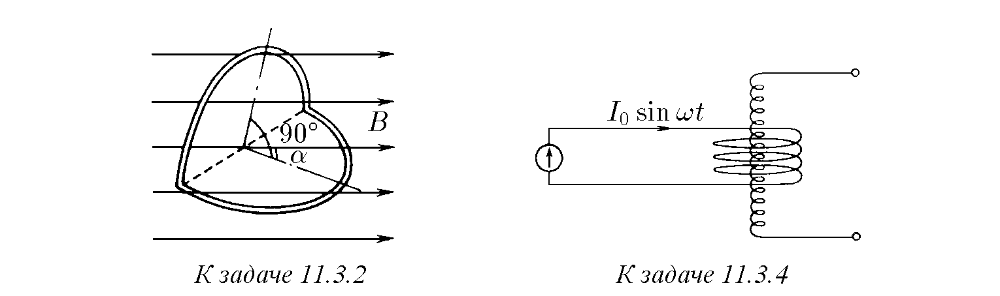
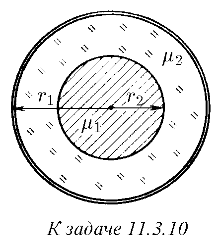
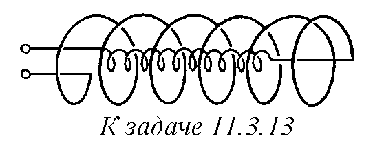
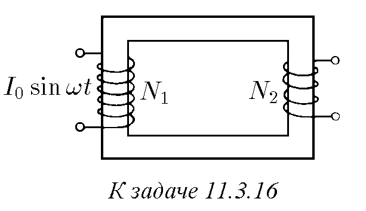
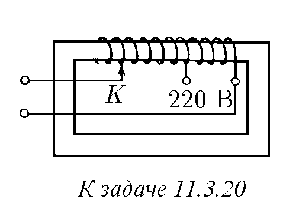
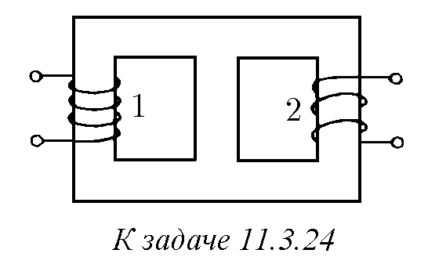

11.3.1. Вътре в дълъг соленоид с ток $I$ се намира плосък затворен контур със сечение $S$, чиято равнина е разположена под ъгъл $\alpha$ към оста на соленоида. Броят на навивките на единица дължина на соленоида е $n$. Определете магнитния поток през този контур и взаимната индуктивност на контура и соленоида.

♦ 11.3.2. Навивка с радиус $r$ е огъната по диаметъра под прав ъгъл и е поставена вътре в дълъг соленоид така, че едната от равнините се оказва разположена към оста на соленоида под ъгъл $\alpha$, а другата — под ъгъл $\pi/2 - \alpha$. Броят на навивките на единица дължина на соленоида е $n$. На колко е равна взаимната индуктивност на огънатата навивка и соленоида?

11.3.3. Вътре в дълъг соленоид, съосно на него, е разположен соленоид с радиус $r$. Броят на навивките на вътрешния соленоид е $N$. Броят на навивките на единица дължина на външния соленоид е $n$. На колко е равна взаимната индуктивност на тези соленоиди?

♦ 11.3.4*. Къс соленоид с радиус $R$ е разположен около дълъг соленоид с радиус $r$. Осите на соленоидите съвпадат. Броят на навивките на единица дължина на дългия соленоид е $n$, а броят на навивките на късия соленоид е $N$. През късия соленоид тече ток $I = I_0 \sin \omega t$. Определете напрежението в краищата на дългия соленоид.

11.3.5. а. На колко е равна индуктивността на соленоид с радиус $r$ и дължина $l \gg r$? Броят на навивките на единица дължина на соленоида е $n$.
б*. Получете формула за индуктивността на соленоид, без да пренебрегвате влиянието на масата на електрона $m_e$ върху индуктивността. Сечението на проводника на соленоида е $S$, а броят на електроните на проводимост в единица обем на проводника е $n_e$. Може ли да се пренебрегне това влияние върху индуктивността на бобините, използвани в радиотехниката?

11.3.6*. Вътрешният радиус на намотката на дълъг соленоид е $r_1 = 0,05$ m, външният радиус е $r_2 = 0,1$ m, а броят на навивките на единица дължина на соленоида е $n = 10\,000$. Определете индуктивността на единица дължина от соленоида.

11.3.7. Обемът на дълъг тънкостенен соленоид е $v = 10$ l, индуктивността е $L = 0,01$ H. Към соленоида е подадено напрежение $V = 10$ V. След колко време след подаване на напрежението индукцията на магнитното поле в соленоида ще стане равна на $B = 0,1$ T?

11.3.8. Определете индуктивността на единица дължина на двупроводна линия, състояща се от две тънки плоски шини с ширина $d = 0,1$ m, разположени на разстояние $h = 5$ mm една от друга. По шините текат равни по модул, но противоположно насочени токове.

11.3.9*. Двупроводна линия се състои от две коаксиални тънки цилиндрични обвивки с радиуси $r_1$ и $r_2$ ($r_1 < r_2$). Пространството между тях е запълнено с вещество с магнитна проницаемост $\mu$. Намерете индуктивността на линията на единица дължина. По обвивките текат равни по модул, но противоположно насочени токове.

♦ 11.3.10*. На оста на тънка проводяща цилиндрична обвивка с радиус $r_1$ е разположен проводник с радиус $r_2$, чиято магнитна проницаемост е $\mu_1$. Пространството между тях е запълнено с вещество с магнитна проницаемост $\mu_2$. Намерете индуктивността на линията на единица дължина. Токът в проводника е равномерно разпределен по сечението, равен е по модул и противоположен по посока на тока на цилиндричната обвивка.

11.3.11*. Намерете индуктивността на единица дължина на двупроводна линия. Линията се състои от два паралелни прави проводника с радиус $r$, разстоянието между чиито осови линии е $h \gg r$. По проводниците текат равни по модул, но противоположно насочени токове. Вътре в проводниците няма магнитно поле.

11.3.12. Всички размери на проводник са увеличени $k$ пъти. Колко пъти ще се промени индуктивността на проводника?

♦ 11.3.13. На колко е равна индуктивността на два дълги соленоида с радиуси $r_1$ и $r_2$, съединени така, както е показано на фигурата? Вътрешният соленоид има дължина $l_1$, а външният — $l_2$. Броят на навивките на единица дължина на вътрешния соленоид е $n_1$, а на външния — $n_2$. Разгледайте случаите, когато посоките на токовете в навивките на двата соленоида са еднакви и противоположни.

11.3.14. Верига се състои от две последователно съединени индуктивни бобини $L_1$ и $L_2$. Взаимната индуктивност на бобините е $L_{12}$. Намерете пълната индуктивност на веригата.

11.3.15*. На една сърцевина са навити две бобини. Индуктивността на всяка от бобините поотделно е $L_1$ и $L_2$. На колко е равна тяхната взаимна индуктивност? Разсейването на магнитното поле да се пренебрегне.

♦ 11.3.16*. В първичната намотка на трансформатор тече ток $I = I_0 \sin \omega t$. Магнитният поток, създаван от този ток, преминава практически изцяло през желязната сърцевина на трансформатора. Магнитната проницаемост на сърцевината е $\mu$. Определете ЕДН на индукция във вторичната отворена намотка, ако броят на навивките в първичната намотка е $N_1$, а във вторичната — $N_2$. Какво напрежение се подава на първичната намотка? Сечението на сърцевината на трансформатора е $S$. Ефективната дължина на сърцевината е $l$.

11.3.17. Токът в първичната намотка на трансформатор се увеличава равномерно. По какъв закон се мени напрежението във вторичната намотка?

11.3.18. Покажете, че в идеален трансформатор със затворена накъсо вторична намотка е в сила съотношението $I_1/I_2 = N_2/N_1$, където $I_1$ и $I_2$ са токовете, а $N_1$ и $N_2$ — броят на навивките в намотките.

11.3.19*. а. Защо е опасно закъсяването на дори една навивка от вторичната намотка на трансформатора?
б. Закъсяването на навивка от вторичната намотка понякога води до повреда на първичната намотка на трансформатора. Защо се случва това?

♦ 11.3.20. Обяснете устройството на лабораторния регулируем трансформатор, изобразен на фигурата. Как се мени напрежението на изхода на трансформатора при преместване на контакта $K$ наляво?

11.3.21. Защо натовареният трансформатор бръмчи? Каква е основната честота на звука, ако трансформаторът е включен в промишлената мрежа?

11.3.22. Защо сърцевината на трансформатора се сглобява от отделни пластини?

11.3.23. За захранване на електрически звънец се използва понижаващ трансформатор. Защо обикновено бутонът на звънеца е включен във вторичната верига, а първичната остава постоянно свързана към мрежата?

♦ 11.3.24. На желязна сърцевина са навити две бобини. Магнитният поток, създаван от всяка бобина, не излиза от сърцевината и се дели поравно в нейните разклонения. При включване на бобина 1 във верига за променлив ток с напрежение 40 V, напрежението на бобина 2 е 10 V. Какво напрежение ще има на отворените клеми на бобина 1, ако бобина 2 се включи във верига за променлив ток с напрежение 10 V?

11.3.25*. Има два еднакви идеални трансформатора с еднакъв коефициент на трансформация 1 : 3. Първичната намотка на единия от тях е съединена последователно с вторичната на втория, и свободните краища на тези намотки са включени в мрежа за променлив ток с напрежение 100 V. Вторичната намотка на първия трансформатор е съединена последователно с първичната намотка на втория. Определете амплитудата на променливото напрежение между другите краища на намотките.