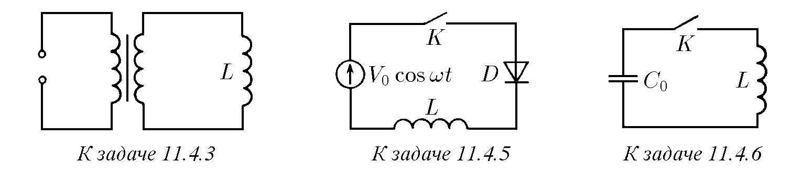
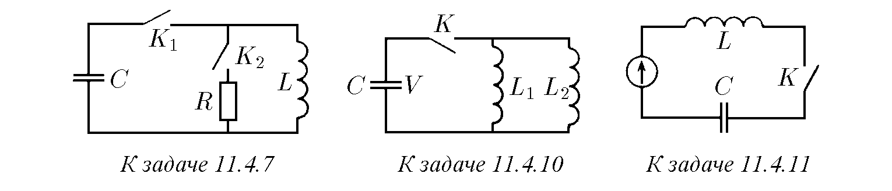
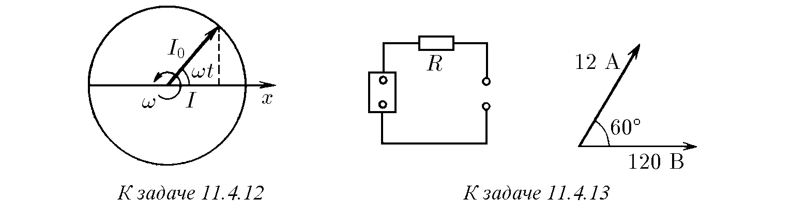
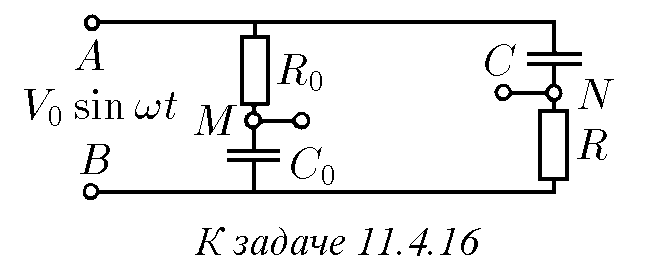
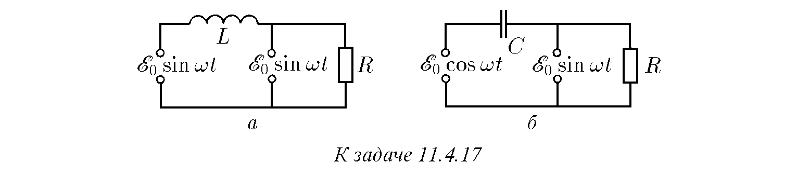
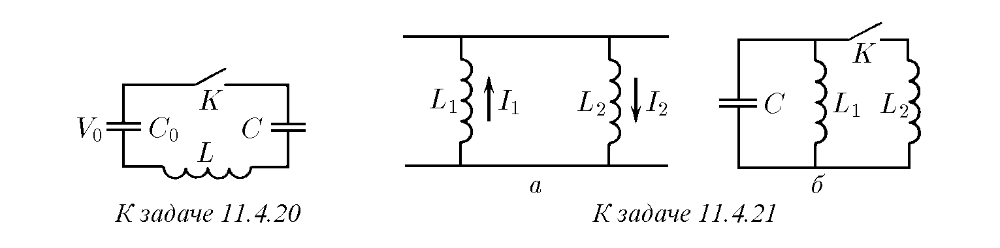

11.4.1. Батерия без вътрешно съпротивление е свързана към соленоид с индуктивност L. Определете зависимостта на тока във веригата от времето, ако ЕДС на батерията е E. Намерете работата на батерията за време τ. В какъв вид енергия се превръща тази работа?

11.4.2. Как трябва да се променя напрежението в електрическа верига, състояща се от последователно свързани бобина с индуктивност L и съпротивление R, така че токът в нея: а) да нараства линейно: I = αt? б) да се променя синусоидално: I = I₀ sin ωt?

♦ 11.4.3∗. При прехода на вещество в свръхпроводящо състояние само малка част от електроните на проводимост се движат, без да изпитват съпротивление. Токът в свръхпроводящ соленоид с индуктивност L се „пуска“, като към соленоида за време t се включва постоянно напрежение. Максималният ток в соленоида е I. Определете горната граница на количеството топлина, отделящо се в соленоида при пускането на ток в него. Преди прехода в свръхпроводящо състояние съпротивлението на соленоида е било R.

11.4.4∗. Генератор с ЕДС E = E₀ sin ωt в момента t = 0 се включва към бобина с индуктивност L. Определете зависимостта на тока във веригата от времето. Активното съпротивление на веригата може да се пренебрегне. Обяснете получения резултат.

♦ 11.4.5. В схемата, показана на фигурата, диод D и бобина с индуктивност L чрез ключ K се включват към източник на променливо напрежение V = V₀ cos ωt. В момента t = 0 ключът K се затваря. Определете силата на тока в бобината като функция на времето. Постройте графика на тази функция. Диодът и бобината да се считат за идеални. Вътрешното съпротивление на източника да се пренебрегне.

♦ 11.4.6. Верига, състояща се от зареден кондензатор с капацитет C₀ и бобина с индуктивност L, се затваря с ключ K. По какъв закон трябва да се променя във времето капацитетът на кондензатора, за да може токът във веригата да нараства правопропорционално на времето?

♦ 11.4.7. В изобразената на фигурата верига кондензатор с капацитет C е зареден до напрежение V₀. Първо се затваря ключът K₁. В момента, когато токът през бобината с индуктивност L достигне своята максимална стойност, се затваря ключът K₂ и се отваря ключът K₁. Каква е най-голямата стойност на напрежението върху съпротивлението R?

11.4.8. а. В кой момент искри прекъсвачът – при затваряне или при отваряне? Защо искренето престава, ако паралелно на прекъсвача се включи кондензатор?
б. Кондензатор с какъв капацитет трябва да се свърже паралелно на бобина с индуктивност L, така че при отваряне на ключа напрежението върху нея да не се увеличи повече от N пъти, ако честотата на напрежението във веригата е ν? Определете този капацитет в случая ν = 50 Hz, L = 0,1 H, N = 10.

11.4.9. Източник с ЕДС E и нулево вътрешно съпротивление в момента t = 0 се включва към последователно свързани бобина с индуктивност L и кондензатор с капацитет C. Намерете максималния ток във веригата и максималния заряд на кондензатора.

♦ 11.4.10. Намерете максималния ток в бобините с индуктивност L₁ и L₂ след затваряне на ключа K във веригата, изобразена на фигурата. Капацитетът на кондензатора е C, първоначалното напрежение върху него е V.

♦ 11.4.11∗. В схемата, изобразена на фигурата, в момента t = 0 се затваря ключът K. Определете тока във веригата, ако източникът дава: а) постоянно напрежение V₀; б) косинусоидално напрежение V₀ cos ωt. Определете максималния ток, ако V₀ = 100 V, L = 10⁻² H, C = 10⁻³ F, ν = ω/2π = 50 Hz.

♦ 11.4.12. а. На векторна диаграма токът I = I₀ cos ωt се определя като проекция върху оста x на вектора I₀, който се върти около точка O с ъглова скорост ω. Как са разположени на същата диаграма векторите на пада на напрежението при протичане на този ток през съпротивление R, бобина с индуктивност L и кондензатор с капацитет C? На колко са равни амплитудите на векторите на напрежението?
б. Използвайки векторна диаграма, определете пада на напрежението във верига от последователно свързани бобина с индуктивност L, съпротивление R и кондензатор с капацитет C и фазовото изместване между тока и напрежението във веригата, ако токът се променя косинусоидално: I = I₀ cos ωt.

♦ 11.4.13. Стойностите на напрежението, тока и фазовото изместване между напрежението и тока във веригата на товара са показани на векторна диаграма. Определете амплитудата на ЕДС на източника, ако R = 10 Ω.

♦ 11.4.14. Намерете установения ток във веригата, изобразена на фигурата.

♦ 11.4.15. Подберете индуктивността на дросела така, че амплитудата на напрежението на изхода на филтъра при честота 100 Hz да бъде 10 пъти по-малка от амплитудата на входа.

♦ 11.4.16∗. Дадена е фазовъртяща верига. Към клемите A и B се подава напрежение V = V₀ sin ωt. Какво напрежение се снема от клемите M и N при R₀C₀ = RC?

♦ 11.4.17. Намерете установените токове в електрическите вериги, изобразени на фигурата. Вътрешното съпротивление на източниците на напрежение е равно на нула. Определете средната мощност, отделяна във веригите, ако E₀ = 200 V, R = 100 Ω, C = 10⁻⁴ F, L = 1 H. Честотата на напрежението на източника е ν = ω/2π = 50 Hz.

11.4.18. Последователно на електрическа печка в градската мрежа е включена бобина с индуктивност. При това мощността на печката е спаднала два пъти. Намерете индуктивността на бобината, ако активното съпротивление на печката е 50 Ω.

11.4.19. Електрическа верига, състояща се от две бобини и лампа, е включена към генератор на променливо напрежение. Ако в едната бобина се вкара железно ядро, светенето на лампата се усилва, а ако ядрото се вкара във втората бобина, светенето на лампата отслабва. Съставете схема на възможна електрическа верига.

♦ 11.4.20∗. Първоначалното напрежение на кондензатор с капацитет C₀ е V₀, а кондензаторът с капацитет C не е зареден. След колко време след затваряне на ключа K ще се пробие кондензаторът с капацитет C, ако пробият му настъпва при напрежение V?

♦ 11.4.21. а. Докажете, че в две паралелно свързани бобини с индуктивности L₁ и L₂ сумата L₁I₁ + L₂I₂ не се променя. Посоката на токовете е показана на фигурата.
♦ б. Кондензатор с капацитет C, зареден до напрежение V₀, се разрежда през бобина с индуктивност L₁. Какъв максимален ток може да се получи в бобината с индуктивност L₂, ако се затвори ключът K в момента, когато токът в индуктивността L₁ е максимален?

♦ 11.4.22∗. а. В момента, когато токът в бобината с индуктивност L₁ е бил равен на I, ключът K е затворен. Какво количество топлина ще се отдели върху съпротивлението R след затварянето на ключа?
б. При затворен ключ K токът в бобината с индуктивност L₁ е I₁, а в индуктивността L₂ е I₂. Определете в какви граници ще се променя токът в бобините L₁ и L₂ след отваряне на ключа K.

11.4.23∗. Поради наличието на активно съпротивление на проводниците в трептящ кръг, състоящ се от кондензатор с капацитет 1 μF и бобина с индуктивност 1 μH, амплитудата на тока за 1 ms е намаляла два пъти. Определете съпротивлението на проводниците.

♦ 11.4.24∗. В трептящ кръг, състоящ се от последователно свързани съпротивление R, бобина с индуктивност L и кондензатор с капацитет C, протичат затихващи трептения. За известно време амплитудата на тока в кръга е намаляла от стойност I₁ до стойност I₂. Какво количество топлина се е отделило за това време върху съпротивлението?

♦ 11.4.25∗. При разпространение на синусоидални вълни в безкрайна LC-верига фазата на трептенията на напрежението във всеки възел изостава с ϕ от фазата на трептенията в предходния възел. Определете зависимостта на ϕ от ω, L, C. На колко е равна скоростта на разпространение на синусоидалната вълна по LC-веригата, ако дължината на клетката е l? На колко е равна тази скорост при малки ω?